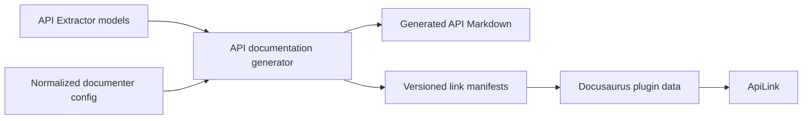

# Configuration-Aware `ApiLink` Plan

## Objective

Improve the website's `ApiLink` component so documentation authors can link to generated API documentation by specifying:

- A package name.
- A TSDoc-style API declaration reference.

For example:

```mdx
<ApiLink packageName="fluid-framework" api="TreeView.upgradeSchema" />
```

`ApiLink` should not require authors to know how `api-markdown-documenter` organizes files or generates heading IDs. The generated API documentation and the links to it must use the same normalized documenter configuration as their source of truth.

## Current Limitations

`website/src/components/shortLinks.tsx` currently infers API document IDs from Docusaurus's `GlobalDoc` collection. This works for top-level API items that have their own documents, but it does not understand the hierarchy configured in `api-markdown-documenter`.

As a result:

- Items rendered as sections require a manually maintained `headingId`.
- Members nested beneath classes, interfaces, enums, or namespaces cannot be resolved directly.
- `ApiLink` duplicates assumptions about generated filenames.
- Changes to the documenter's hierarchy or heading generation can invalidate links without changing `ApiLink`.

The documenter already has the required placement logic. It determines both the document that owns an API item and the heading ID for an item rendered as a section.

## Proposed Architecture

Generate a version-specific API link manifest while generating the API documentation. The manifest will be created from the same API model and normalized documenter configuration used to render Markdown. A small Docusaurus plugin will expose the manifests as plugin data, and `ApiLink` will perform a synchronous lookup in the manifest for the active documentation version.



This keeps API Extractor models and Node-oriented documenter code out of the browser bundle. It also makes `api-markdown-documenter` the sole authority for API document paths and anchors.

## Authoring Contract

The intended API is:

```ts
interface ApiLinkProps {
  packageName: string;
  api: string;
  children?: React.ReactNode;
}
```

Top-level declarations continue to use their ordinary names:

```mdx
<ApiLink packageName="fluid-framework" api="TreeView" />
```

Descendants use names qualified by their documented containment hierarchy:

```mdx
<ApiLink packageName="fluid-framework" api="TreeView.upgradeSchema" />
<ApiLink packageName="fluid-framework" api="SchemaStatics.optional" />
<ApiLink packageName="fluid-framework" api="NodeKind.Leaf" />
```

TSDoc-style selectors disambiguate any segment in the hierarchy. For example, `fluid-framework` exposes `Tree` as more than one API item kind:

```mdx
<ApiLink packageName="fluid-framework" api="(Tree:interface)" />
```

The selector belongs to the segment it disambiguates, so a parent kind can be selected independently of its member:

```mdx
<ApiLink packageName="example" api="(Foo:interface).bar" />
```

Function and method overloads use TSDoc's numeric index-selector syntax with API Extractor's one-based overload index:

```mdx
<ApiLink
  packageName="fluid-framework"
  api="TreeBranchAlpha.(runTransaction:2)"
/>
```

Selectors may be combined at different levels, such as `(Foo:interface).(bar:2)`. Lookup without a kind selector succeeds when a name identifies exactly one API item kind at that hierarchy level. When the terminal item has multiple overloads, omitting its index selector selects overload 1. Supplying an index selector selects that overload and produces an error when it does not exist.

The `api` property intentionally accepts the declaration-reference portion only. `packageName` remains separate because the website applies version-specific package policy, and `ApiLink` does not accept TSDoc link text or a package source inside `api`.

When `children` is omitted, `ApiLink` uses the parsed identifier path as its link text and removes selectors. For example, both `(Foo:interface).bar` and `(Foo:interface).(bar:2)` display `Foo.bar` by default.

## Implementation Plan

### 1. Expose a Focused Documenter Link API

The path and anchor logic lives in `tools/api-markdown-documenter/src/api-item-transforms/utilities/ApiItemTransformUtilities.ts`. The public `getLinkForApiItem` function already returns a Markdown AST link containing the correctly configured URL.

Add a focused public API for callers that only need the target:

```ts
interface ApiItemLinkTarget {
  documentPath: string;
  headingId?: string;
}

function getLinkTargetForApiItem(
  apiItem: ApiItem,
  config: ApiItemTransformationConfiguration,
): ApiItemLinkTarget;
```

Export the new API from `tools/api-markdown-documenter/src/index.ts`. Keep item lookup out of this API: converting an author-facing name into an `ApiItem` is website-specific policy, while converting an `ApiItem` into its configured documentation target belongs to the documenter.

Add focused documenter tests for:

- Items rendered as documents.
- Items rendered as sections.
- Namespace descendants.
- Custom document names.
- Overloaded declarations.

### 2. Extend the Existing API Documentation Build Step

Add manifest generation directly to the existing `renderApiDocumentation` flow in `website/infra/api-markdown-documenter/render-api-documentation.mjs`. Do not add a separate script, package command, or parallel build task for generating manifests.

For each documentation version, the existing build invocation should:

1. Load the API model once.
2. Create the normalized documenter configuration once.
3. Transform the model once.
4. Write the generated Markdown and the corresponding link manifest before the invocation completes.

Markdown generation and manifest generation must use the same model and normalized configuration object. The configuration must preserve:

- The model document name `package-reference`.
- Package and namespace `index` documents.
- The custom handling for document names beginning with an underscore.
- Version-specific `uriRoot` values.
- Package exclusions and minimum release-level filtering.
- The configured document hierarchy.

Keep `generate-api-documentation` as the single build entry point for both outputs. Do not duplicate model loading, filename, hierarchy, inclusion, or heading logic in a separate manifest build path.

### 3. Generate a Manifest for Each Documentation Version

After loading the API model and normalizing the transformation configuration, traverse the included API items. For every supported item:

1. Determine its unscoped package name.
2. Build its author-facing declaration-reference path from model containment, retaining each segment's API item kind.
3. Obtain its target from the documenter's public link API.
4. Record the target with the full path of API item kinds and the terminal item's one-based overload index, when applicable.

Use a manifest shape that preserves each candidate's full containment path, including the kind of every segment and the terminal overload index:

```json
{
  "fluid-framework": {
    "TreeView": [
      {
        "path": [{ "name": "TreeView", "apiType": "Interface" }],
        "documentPath": "fluid-framework/treeview-interface"
      }
    ],
    "TreeBranchAlpha.runTransaction": [
      {
        "path": [
          { "name": "TreeBranchAlpha", "apiType": "Interface" },
          {
            "name": "runTransaction",
            "apiType": "MethodSignature",
            "overloadIndex": 1
          }
        ],
        "documentPath": "fluid-framework/treebranchalpha-interface",
        "headingId": "runtransaction-methodsignature"
      },
      {
        "path": [
          { "name": "TreeBranchAlpha", "apiType": "Interface" },
          {
            "name": "runTransaction",
            "apiType": "MethodSignature",
            "overloadIndex": 2
          }
        ],
        "documentPath": "fluid-framework/treebranchalpha-interface",
        "headingId": "runtransaction_1-methodsignature"
      }
    ]
  }
}
```

Generate one manifest for each configured docs version, including local API documentation when local generation is enabled. Store the files in a dedicated generated-content directory such as `website/.generated/api-link-manifests/`.

Do not store them under `website/.docusaurus`, because Docusaurus owns and may clean that directory. The generated manifests should be disposable build output rather than manually maintained or checked-in API documentation.

Manifest generation must use the same inclusion checks as Markdown generation. It must not create targets for packages or API items excluded by package filters, release level, or documenter configuration.

### 4. Define Name and Collision Semantics

Declaration-reference paths should follow documented model containment, skipping model and entry-point nodes. Examples include `TreeView.upgradeSchema` and `SomeNamespace.SomeType`. Every recorded candidate must retain the display name and API item kind for each path segment so selectors can disambiguate parents as well as terminal items.

The generator must detect and report collisions rather than silently select a target. Relevant cases include:

- The same name used by different API item kinds.
- Multiple overloads of a function or method.
- Identically named exports from multiple package entry points.
- Two scoped packages with the same unscoped package name.

Different kinds at any hierarchy level are preserved as candidates and resolved by selectors in `api`. Each overload of a function, method, call signature, construct signature, or other parameter-list item is preserved as a separate candidate with its API Extractor `overloadIndex`.

Within a declaration-reference path, the combination of segment kinds and terminal overload index must uniquely identify a target. Items that do not support overloads omit `overloadIndex`. API Extractor models may contain canonical-reference aliases for the same logical item; candidates with the same path segment names and kinds, overload index, document path, and heading are coalesced. Duplicate candidates that resolve to different targets must fail manifest generation with a diagnostic containing the package, declaration-reference path, segment kinds, overload index, and canonical references involved.

Call signatures, construct signatures, and other items without useful author-facing names may be omitted initially, but manifest generation must not collapse distinct overloads for any included item.

### 5. Publish Manifests Through Docusaurus

Add a local Docusaurus plugin that:

1. Reads the generated version manifests in `loadContent`.
2. Publishes them with `setGlobalData` in `contentLoaded`.
3. Associates each manifest with the same version identifier returned by Docusaurus for the active docs version.

Register the plugin in `website/docusaurus.config.ts`. Add an explicit mapping from the versions in `website/config/docs-versions.mjs` to Docusaurus version identifiers rather than relying on path parsing.

Start with synchronous global plugin data. This works during static rendering and keeps `ApiLink` simple. Measure the generated data before adding code splitting. If the manifests materially affect the browser payload, a later optimization can emit one loadable data module per version.

Do not publish the manifests as fetched static assets. A runtime fetch would make `ApiLink` asynchronous and would complicate Docusaurus static rendering and broken-link validation.

### 6. Update `ApiLink`

Replace `resolveApiDocument` in `website/src/components/shortLinks.tsx` with manifest lookup for the active docs version.

Resolution should:

1. Find the active version's manifest.
2. Parse `api` as the supported TSDoc declaration-reference subset.
3. Find candidates whose hierarchy segment names match the reference.
4. Apply kind selectors to the segment on which each selector appears.
5. Apply a terminal numeric index selector when provided, or select overload 1 when the resolved terminal item has multiple overloads.
6. Return the only remaining candidate.
7. Throw an actionable error for missing or ambiguous references.

Use the stable `TSDocParser` API from `@microsoft/tsdoc` rather than implementing declaration-reference tokenization in the website. The stable parser accepts complete TSDoc comments rather than bare declaration references, so parse a minimal wrapper such as `/** {@link ${api} } */`, require a diagnostic-free parse containing exactly one `DocLinkTag`, and extract its `DocDeclarationReference` member path and selectors. Add `@microsoft/tsdoc` as a direct website dependency; do not rely on the transitive dependency provided by `api-markdown-documenter`.

After parsing, validate that the AST uses only the supported subset: identifier member segments separated by dots, approved system kind selectors, and an optional numeric index selector on the terminal segment. Reject package sources, import paths, link text, labels, symbols, other navigation forms, and selectors outside that subset. This AST validation both limits the public contract and prevents wrapper-breaking input from being interpreted as additional TSDoc content. Do not use the beta `DeclarationReference.parse()` API or private parser internals.

For example, an ambiguity error should identify the available kinds:

```text
API segment "Tree" in package "fluid-framework" is ambiguous.
Specify a selector. Available references: (Tree:interface), (Tree:variable).
```

Retain `headingId` temporarily as a compatibility escape hatch while existing MDX is migrated. When present, it may override the generated fragment. Mark it as deprecated after all ordinary call sites can be expressed with declaration references.

### 7. Migrate Existing Documentation

Convert existing `ApiLink` calls with manual `headingId` values to declaration references. For example:

```mdx
<ApiLink
  packageName="fluid-framework"
  api="TreeView"
  headingId="upgradeschema-methodsignature"
/>
```

becomes:

```mdx
<ApiLink packageName="fluid-framework" api="TreeView.upgradeSchema" />
```

Replace package-level links to API members with `ApiLink` where the manifest can identify the declaration directly. Preserve the established version policy: v2 links for APIs re-exported by `fluid-framework` should target `fluid-framework`, while v1 links retain their original package targets.

Keep this migration mechanical. Do not reformat unrelated MDX content.

## Testing Strategy

### Documenter Unit Tests

Test the public target API against multiple hierarchy configurations:

- A top-level item with its own document.
- A member rendered as a section under an ancestor document.
- A namespace descendant.
- A custom document-name callback.
- Multiple overloads with distinct anchors.

### Manifest Generator Tests

Test:

- Declaration-reference path generation.
- Package-name normalization.
- Kind-based ambiguity preservation.
- Preservation of every overload's one-based index and distinct target.
- Namespace and enum descendants.
- Package and release-level exclusions.
- Custom underscore filename handling.
- Collision diagnostics.
- Version-specific URL roots.

### `ApiLink` Unit Tests

Update `website/test/unit/shortLinks.test.ts` to cover:

- Top-level API lookup.
- Qualified member lookup.
- Namespace descendants.
- v1, v2, and local manifest selection.
- An ambiguous terminal name with and without a kind selector.
- An ambiguous parent name with and without a kind selector.
- An overloaded API with an omitted, valid, and invalid numeric index selector.
- A reference combining parent kind and terminal overload selectors.
- Malformed and unsupported declaration-reference syntax.
- Missing package, API, kind, and version diagnostics.
- Temporary `headingId` compatibility.
- Default link text and explicit children.

### Integration Validation

Run the website's content generation and strict Docusaurus build. Docusaurus's broken-link and broken-anchor checks are the primary end-to-end validation that every manifest target corresponds to generated output.

The final validation sequence should include:

1. `api-markdown-documenter` unit tests and build.
2. Website unit tests.
3. API documentation and manifest generation for all configured versions.
4. A strict Docusaurus production build.
5. A review of generated manifest size and duplicate diagnostics.
6. A comparison of the production client bundle before and after adding `@microsoft/tsdoc`.

## Rollout Order

1. Add and test the documenter's public target API.
2. Extend the existing website API documentation build to emit and test versioned manifests.
3. Add the Docusaurus manifest plugin.
4. Switch `ApiLink` to manifest lookup while retaining compatibility properties.
5. Migrate existing MDX links incrementally.
6. Run unit and strict integration validation.
7. Remove the deprecated `headingId` property after all supported documentation versions no longer require it.

## Non-Goals

- Loading API Extractor models in the browser.
- Reimplementing documenter hierarchy or heading rules in React.
- Supporting arbitrary TSDoc declaration-reference syntax in `ApiLink` initially.
- Selecting overloads by parameter types or signature text instead of API Extractor's overload index.
- Changing generated API Markdown by hand.
- Reformatting unrelated documentation during link migration.

## Success Criteria

- Documentation authors can link to top-level APIs and members without knowing generated paths or heading IDs.
- Documentation authors can link to a specific function or method overload.
- Link targets always reflect the configuration used to generate that documentation version.
- Ambiguous names require an explicit and actionable discriminator.
- Excluded APIs cannot be linked accidentally through the manifest.
- API models and documenter implementation code do not enter the browser bundle.
- Existing links can migrate incrementally without breaking v1, v2, or local documentation builds.

# Edge cases we need to consider

## Parent and overload discriminators

The earlier `ApiLink` proposal allowed users to specify `apiType` as a discriminator when the same `apiName` appeared multiple times in a package's API surface with different types.
This allowed users to, for example, differentiate between an interface `Foo` and constant `Foo` exported by a package.

But our API also allows users to link to member items of parent types.
E.g. `Foo.bar`.
In this case, say our package exports both an interface and a constant named `Foo`.
Separate `apiName` and `apiType` properties did not provide a way to specify a discriminator for the _parent_ element of the reference.

To my knowledge, our website doesn't currently have any use cases for this.
But I'm sure it's only a matter of time before we need it, so I think we should address this now.

`TSDoc` handles this by supporting optional discriminators at each level in the hierarchy.
E.g. the above case can be handled by specifying `(Foo:interface).bar` to link to the `Foo` _interface_'s `bar` property.

- See here for more details on TSDoc's link syntax: https://tsdoc.org/pages/tags/link/

Use a single `api` argument that follows the relevant subset of TSDoc declaration-reference syntax. A selector is attached to the segment it disambiguates, allowing `(Foo:interface).bar` to select a parent kind. Numeric index selectors identify API Extractor overloads in the same string, allowing `Foo.(bar:2)` or the combined `(Foo:interface).(bar:2)`.

The implementation should use `@microsoft/tsdoc`'s stable `TSDocParser` to parse this syntax into structured path segments rather than manipulating the string ad hoc. Initially support identifier segments, kind selectors, and terminal numeric index selectors. Reject package sources, import paths, navigation other than the documented containment separator, labels, symbols, and index selectors on non-terminal segments with an actionable error. This keeps the authoring contract aligned with TSDoc without claiming support for its entire declaration-reference grammar.
