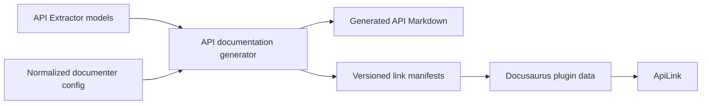

# Configuration-Aware `ApiLink` Plan

## Objective

Improve the website's `ApiLink` component so documentation authors can link to generated API documentation by specifying:

- A package name.
- A qualified API name.
- An optional API item kind when the name is ambiguous.

For example:

```mdx
<ApiLink packageName="fluid-framework" apiName="TreeView.upgradeSchema" />
```

`ApiLink` should not require authors to know how `api-markdown-documenter` organizes files or generates heading IDs. The generated API documentation and the links to it must use the same normalized documenter configuration as their source of truth.

## Current Limitations

`website/src/components/shortLinks.tsx` currently infers API document IDs from Docusaurus's `GlobalDoc` collection. This works for top-level API items that have their own documents, but it does not understand the hierarchy configured in `api-markdown-documenter`.

As a result:

- Items rendered as sections require a manually maintained `headingId`.
- Members nested beneath classes, interfaces, enums, or namespaces cannot be resolved directly.
- `ApiLink` duplicates assumptions about generated filenames.
- Changes to the documenter's hierarchy or heading generation can invalidate links without changing `ApiLink`.

The documenter already has the required placement logic. It determines both the document that owns an API item and the heading ID for an item rendered as a section.

## Proposed Architecture

Generate a version-specific API link manifest while generating the API documentation. The manifest will be created from the same API model and normalized documenter configuration used to render Markdown. A small Docusaurus plugin will expose the manifests as plugin data, and `ApiLink` will perform a synchronous lookup in the manifest for the active documentation version.



This keeps API Extractor models and Node-oriented documenter code out of the browser bundle. It also makes `api-markdown-documenter` the sole authority for API document paths and anchors.

## Authoring Contract

The intended API is:

```ts
interface ApiLinkProps {
	packageName: string;
	apiName: string;
	apiType?: ApiItemKind;
	children?: React.ReactNode;
}
```

Top-level declarations continue to use their ordinary names:

```mdx
<ApiLink packageName="fluid-framework" apiName="TreeView" />
```

Descendants use names qualified by their documented containment hierarchy:

```mdx
<ApiLink packageName="fluid-framework" apiName="TreeView.upgradeSchema" />
<ApiLink packageName="fluid-framework" apiName="SchemaStatics.optional" />
<ApiLink packageName="fluid-framework" apiName="NodeKind.Leaf" />
```

The optional `apiType` remains available when a package contains multiple API items with the same qualified name. For example, `fluid-framework` exposes `Tree` as more than one API item kind:

```mdx
<ApiLink packageName="fluid-framework" apiName="Tree" apiType="Interface" />
```

Lookup without `apiType` succeeds only when the qualified name identifies exactly one target.

## Implementation Plan

### 1. Expose a Focused Documenter Link API

The path and anchor logic lives in `tools/api-markdown-documenter/src/api-item-transforms/utilities/ApiItemTransformUtilities.ts`. The public `getLinkForApiItem` function already returns a Markdown AST link containing the correctly configured URL.

Add a focused public API for callers that only need the target:

```ts
interface ApiItemLinkTarget {
	documentPath: string;
	headingId?: string;
}

function getLinkTargetForApiItem(
	apiItem: ApiItem,
	config: ApiItemTransformationConfiguration,
): ApiItemLinkTarget;
```

Export the new API from `tools/api-markdown-documenter/src/index.ts`. Keep item lookup out of this API: converting an author-facing name into an `ApiItem` is website-specific policy, while converting an `ApiItem` into its configured documentation target belongs to the documenter.

Add focused documenter tests for:

- Items rendered as documents.
- Items rendered as sections.
- Namespace descendants.
- Custom document names.
- Overloaded declarations.

### 2. Extend the Existing API Documentation Build Step

Add manifest generation directly to the existing `renderApiDocumentation` flow in `website/infra/api-markdown-documenter/render-api-documentation.mjs`. Do not add a separate script, package command, or parallel build task for generating manifests.

For each documentation version, the existing build invocation should:

1. Load the API model once.
2. Create the normalized documenter configuration once.
3. Transform the model once.
4. Write the generated Markdown and the corresponding link manifest before the invocation completes.

Markdown generation and manifest generation must use the same model and normalized configuration object. The configuration must preserve:

- The model document name `package-reference`.
- Package and namespace `index` documents.
- The custom handling for document names beginning with an underscore.
- Version-specific `uriRoot` values.
- Package exclusions and minimum release-level filtering.
- The configured document hierarchy.

Keep `generate-api-documentation` as the single build entry point for both outputs. Do not duplicate model loading, filename, hierarchy, inclusion, or heading logic in a separate manifest build path.

### 3. Generate a Manifest for Each Documentation Version

After loading the API model and normalizing the transformation configuration, traverse the included API items. For every supported item:

1. Determine its unscoped package name.
2. Build its qualified author-facing name from model containment.
3. Obtain its target from the documenter's public link API.
4. Record the target under the item's `ApiItemKind`.

Use a manifest shape that preserves ambiguous candidates:

```json
{
  "fluid-framework": {
    "TreeView": {
      "Interface": "/docs/api/fluid-framework/treeview-interface"
    },
    "TreeView.upgradeSchema": {
      "MethodSignature": "/docs/api/fluid-framework/treeview-interface#upgradeschema-methodsignature"
    }
  }
}
```

Generate one manifest for each configured docs version, including local API documentation when local generation is enabled. Store the files in a dedicated generated-content directory such as `website/generated/api-link-manifests/`.

Do not store them under `website/.docusaurus`, because Docusaurus owns and may clean that directory. The generated manifests should be disposable build output rather than manually maintained or checked-in API documentation.

Manifest generation must use the same inclusion checks as Markdown generation. It must not create targets for packages or API items excluded by package filters, release level, or documenter configuration.

### 4. Define Name and Collision Semantics

Qualified names should follow documented model containment, skipping model and entry-point nodes. Examples include `TreeView.upgradeSchema` and `SomeNamespace.SomeType`.

The generator must detect and report collisions rather than silently select a target. Relevant cases include:

- The same name used by different API item kinds.
- Multiple overloads of a function or method.
- Identically named exports from multiple package entry points.
- Two scoped packages with the same unscoped package name.

Different kinds are preserved as candidates and resolved with `apiType`. Other unresolved collisions should fail manifest generation with a diagnostic containing the package, qualified name, kinds, and canonical references involved.

For the initial implementation, an unsuffixed overloaded function or method name should link to its first documented overload. Selecting an individual overload can be added later if a concrete authoring requirement emerges. Call signatures, construct signatures, and other items without useful author-facing names may be omitted initially.

### 5. Publish Manifests Through Docusaurus

Add a local Docusaurus plugin that:

1. Reads the generated version manifests in `loadContent`.
2. Publishes them with `setGlobalData` in `contentLoaded`.
3. Associates each manifest with the same version identifier returned by Docusaurus for the active docs version.

Register the plugin in `website/docusaurus.config.ts`. Add an explicit mapping from the versions in `website/config/docs-versions.mjs` to Docusaurus version identifiers rather than relying on path parsing.

Start with synchronous global plugin data. This works during static rendering and keeps `ApiLink` simple. Measure the generated data before adding code splitting. If the manifests materially affect the browser payload, a later optimization can emit one loadable data module per version.

Do not publish the manifests as fetched static assets. A runtime fetch would make `ApiLink` asynchronous and would complicate Docusaurus static rendering and broken-link validation.

### 6. Update `ApiLink`

Replace `resolveApiDocument` in `website/src/components/shortLinks.tsx` with manifest lookup for the active docs version.

Resolution should:

1. Find the active version's manifest.
2. Find the package and qualified API name.
3. Apply `apiType` when provided.
4. Return the only candidate when `apiType` is omitted.
5. Throw an actionable error for missing or ambiguous references.

For example, an ambiguity error should identify the available kinds:

```text
API "Tree" in package "fluid-framework" is ambiguous.
Specify apiType. Available kinds: Interface, Variable.
```

Retain `headingId` temporarily as a compatibility escape hatch while existing MDX is migrated. When present, it may override the generated fragment. Mark it as deprecated after all ordinary call sites can be expressed with qualified API names.

### 7. Migrate Existing Documentation

Convert existing `ApiLink` calls with manual `headingId` values to qualified API names. For example:

```mdx
<ApiLink
    packageName="fluid-framework"
    apiName="TreeView"
    headingId="upgradeschema-methodsignature"
/>
```

becomes:

```mdx
<ApiLink packageName="fluid-framework" apiName="TreeView.upgradeSchema" />
```

Replace package-level links to API members with `ApiLink` where the manifest can identify the declaration directly. Preserve the established version policy: v2 links for APIs re-exported by `fluid-framework` should target `fluid-framework`, while v1 links retain their original package targets.

Keep this migration mechanical. Do not reformat unrelated MDX content.

## Testing Strategy

### Documenter Unit Tests

Test the public target API against multiple hierarchy configurations:

- A top-level item with its own document.
- A member rendered as a section under an ancestor document.
- A namespace descendant.
- A custom document-name callback.
- Multiple overloads with distinct anchors.

### Manifest Generator Tests

Test:

- Qualified-name generation.
- Package-name normalization.
- Kind-based ambiguity preservation.
- Overload handling.
- Namespace and enum descendants.
- Package and release-level exclusions.
- Custom underscore filename handling.
- Collision diagnostics.
- Version-specific URL roots.

### `ApiLink` Unit Tests

Update `website/test/unit/shortLinks.test.ts` to cover:

- Top-level API lookup.
- Qualified member lookup.
- Namespace descendants.
- v1, v2, and local manifest selection.
- An ambiguous name with and without `apiType`.
- Missing package, API, kind, and version diagnostics.
- Temporary `headingId` compatibility.
- Default link text and explicit children.

### Integration Validation

Run the website's content generation and strict Docusaurus build. Docusaurus's broken-link and broken-anchor checks are the primary end-to-end validation that every manifest target corresponds to generated output.

The final validation sequence should include:

1. `api-markdown-documenter` unit tests and build.
2. Website unit tests.
3. API documentation and manifest generation for all configured versions.
4. A strict Docusaurus production build.
5. A review of generated manifest size and duplicate diagnostics.

## Rollout Order

1. Add and test the documenter's public target API.
2. Extend the existing website API documentation build to emit and test versioned manifests.
3. Add the Docusaurus manifest plugin.
4. Switch `ApiLink` to manifest lookup while retaining compatibility properties.
5. Migrate existing MDX links incrementally.
6. Run unit and strict integration validation.
7. Remove the deprecated `headingId` property after all supported documentation versions no longer require it.

## Non-Goals

- Loading API Extractor models in the browser.
- Reimplementing documenter hierarchy or heading rules in React.
- Supporting arbitrary TSDoc declaration-reference syntax in `ApiLink` initially.
- Providing individual overload selection without a demonstrated documentation need.
- Changing generated API Markdown by hand.
- Reformatting unrelated documentation during link migration.

## Success Criteria

- Documentation authors can link to top-level APIs and members without knowing generated paths or heading IDs.
- Link targets always reflect the configuration used to generate that documentation version.
- Ambiguous names require an explicit and actionable discriminator.
- Excluded APIs cannot be linked accidentally through the manifest.
- API models and documenter implementation code do not enter the browser bundle.
- Existing links can migrate incrementally without breaking v1, v2, or local documentation builds.
