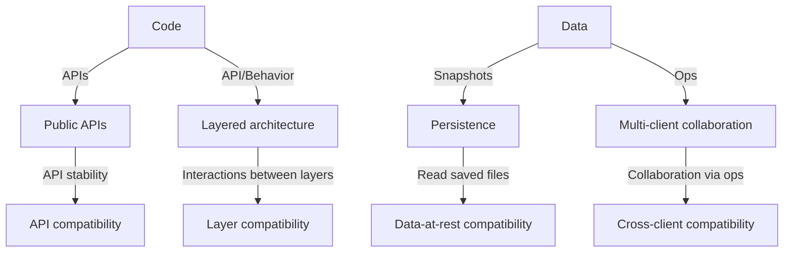
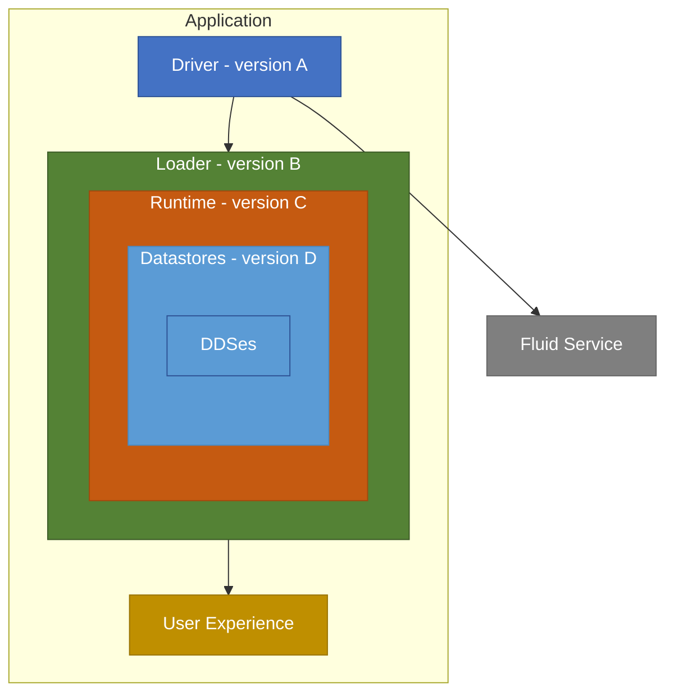
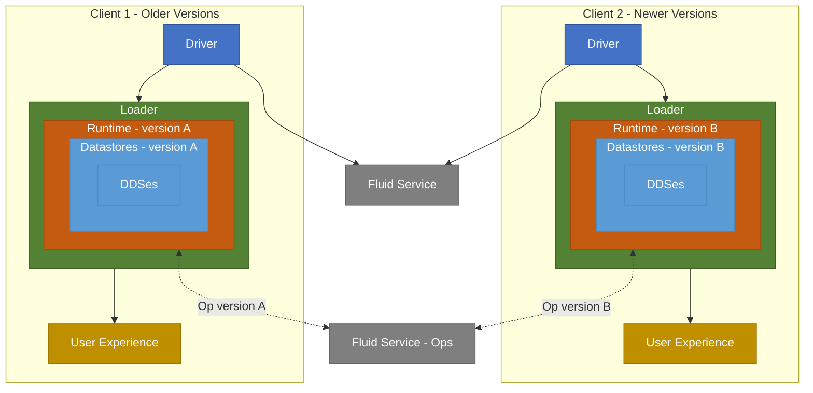

# Fluid Framework Compatibility Considerations

## Overview

Fluid Framework is a distributed system where multiple clients collaborate on shared documents in real-time. To understand why we need different types of compatibility, we must first recognize the two fundamental parts of the Fluid software:

1. **Code**: APIs (public and internal) and Behavior (or logic)
2. **Data**: Ops and Summaries (or snapshots)

The interaction between code and data, combined with Fluid's distributed architecture, creates four distinct dimensions of compatibility that must be carefully managed:

### How Code and Data Create Compatibility Dimensions

**From Code:**
- **API compatibility** arises because applications depend on public APIs that are released across versions (including alpha and beta APIs). Applications need a stable, predictable upgrade path as Fluid evolves and APIs change.
- **Layer compatibility** arises because Fluid's modular design consists of four distinct layers (Driver, Loader, Runtime, and Datastore), each of which can be versioned independently. These layers must interoperate at runtime even when they're at different versions. They interact by calling APIs (mostly internal) on other layers but the behavior of these APIs must be compatible.

**From Data:**
- **Data-at-rest compatibility** arises because documents (stored as summaries/snapshots) may be dormant for extended periods and then reopened by clients running newer versions of Fluid.
- **Cross-client compatibility** arises because multiple clients collaborating on the same document in real-time by exchanging ops may be running different versions of Fluid during rolling upgrades or version transitions.

This document defines and explains each compatibility type in detail, describing what it means, why it matters, and the scenarios it enables. Understanding these distinctions helps both Fluid Framework maintainers and application developers reason about version compatibility and upgrade strategies.

> **Note:** This document does not specify the policies around what version compatibility matrix and guarantees we provide — it focuses on defining the compatibility types themselves.

## Data-at-rest compatibility

Data-at-test compatibility implies that all Fluid data (ops and summaries under the hood) generated by a client must be readable by clients running a supported set of version. For example, if we say that FF data is readable forever by all subsequent clients, that a client running the latest Fluid version must be able to load documents created by v1.0 and so on.

### Motivation

Applications need to open documents that have been dormant for extended periods without requiring explicit data conversions or loading through intermediate versions. Such limitations create significant friction for application developers and end users who expect seamless access to their historical documents.

## API compatibility

API compatibility implies that we cannot break existing APIs within the supported set of versions. For example, if we were to say we support compatibility of public APIs across a major version, we can only break them on a major version release with reasonable documentation but we cannot break them in minor or patch versions.

### Motivation

Application developers need a clear, predictable upgrade path to newer Fluid versions. When API changes occur, documented and well-communicated breaking changes allow teams to plan and execute upgrades with confidence.

## Layer compatibility

Layer compatibility implies that a single client can have different versions for different compatibility layers we support - Driver, Loader, Runtime and Datastore. For example, Driver is v1.0, Loader is v2.0, Runtime is v3.0 and Datastore is v3.1 on the same client. The APIs at the boundaries of these layers have strict compatibility requirements at _runtime_ (distinct from API compatibility, which is about in-code dependencies), to support the full range of versions that may be calling them from another layer.

### Motivation

This compatibility concern exists to support the following scenarios:

Dynamic loading, where code executed is retrieved from the network in a way that allows the code of each layer to change independently. This differs from other types of lazily loaded code, like webpack chunks, which are still part of the same compiled package, and will always return the same code. Because the layers can be different, each layer must support interacting with other layers of a different version.
For example, an application could choose to bundle the Driver / Loader code into their application, rarely updating it, while fetching the Runtime code from a CDN that updates frequently.

Applications can import and build code building on different Fluid Layers from different repos. These repos can be released and updated at different frequencies. Without any compatibility, they would need to update all of them to an Fluid version at the same time to be interoperable. For example, the Fluid Runtime natively supports dynamically loading any registered DataStore, and that code could come from another repo, built against a different version of Fluid than the Runtime.

### Architecture diagram

This diagram shows different Fluid layers with different versions in a client:
- **Driver layer**: Fluid package version A.
- **Loader layer**: Fluid package version B.
- **Runtime layer**: Fluid package version C.
- **Datastore layer**: Fluid package version D.

### Details

Layer compatibility is described in more detail in [Fluid Layer Compatibility](./LayerCompatibility.md).

## Cross-client compatibility

Cross-client compatibility implies that clients within a supported set of versions should be able to fully collaborate with each other. For example: say we support N / N-1 for cross-client compatibility. This means that there could be clients running runtime versions N and N-1 in the same collaboration session and they should be able to successfully read incoming changes while writing their own with confidence. What makes this different from data-at-rest compatibility promise is that lower version clients can read/write changes and docs created by higher version as well.

### Motivation

During version upgrades, there is an unavoidable transition window when clients running different versions must coexist and collaborate. This compatibility ensures users can continue working together seamlessly regardless of whether their application instance has been updated yet.

### Architecture diagram

This diagram shows two clients collaborating on the same document:
- **Client 1** runs older versions of Runtime (A) and DataStore (A)
- **Client 2** runs newer versions of Runtime (B) and DataStore (B)
- Both clients communicate through the **Fluid Service**
- Cross-client compatibility ensures these different versions can successfully collaborate (read and write) on the same document.
- For example, client 1's Runtime sends version A ops to client 2's Runtime that it must understand and vice-versa. This means that client 2 (being the newer client) must not write an op in format that client 1 cannot read. Also, client 2 must not update its op read logic such that it cannot read client 1's ops.
