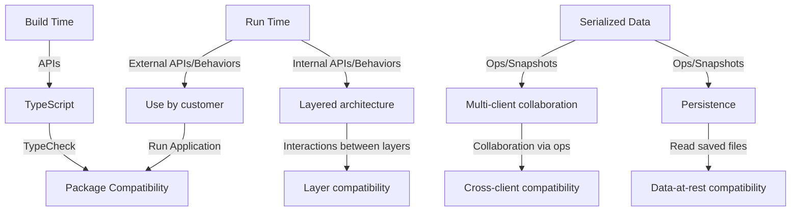
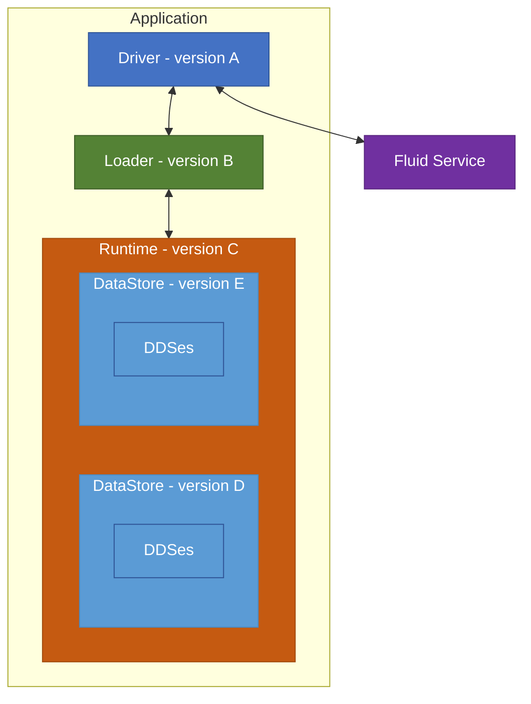
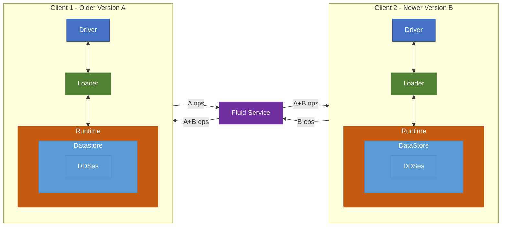

# Fluid Framework Compatibility Considerations

## Overview

Fluid Framework is a distributed system where multiple clients collaborate on shared documents in real-time. To understand why we need different types of compatibility, we must first recognize three fundamental aspects of the Fluid software:

1. **Build Time**: What happens during development and build of projects using Fluid. Includes compatibility of package dependencies and TypeScript types.
2. **Run Time**: What happens at runtime in memory. Includes compatibility of runtime behaviors and in memory data structures.
3. **Serialized Data**: Ops and Summaries (or snapshots). Includes anything which leaves the memory of the specific JavaScript context which created it.

Combined with Fluid's distributed architecture, these aspects create four distinct dimensions of compatibility that must be carefully managed:

```mermaid
flowchart TD
    BuildTime[Build Time] --APIs--> TypeScript
        TypeScript --TypeCheck--> PackageCompat[Package Compatibility]

    RunTime[Run Time] --External APIs/Behaviors--> CustomerUse[Use by customer]
        CustomerUse --Run Application--> PackageCompat
    RunTime --Internal APIs/Behaviors--> LayeredArch[Layered architecture]
        LayeredArch --Interactions between layers--> LayerCompat[Layer compatibility]

    SerializedData[Serialized Data] --Ops/Snapshots--> MultiClient[Multi-client collaboration]
        MultiClient --Collaboration via ops--> CrossClientCompat[Cross-client compatibility]
    SerializedData --Ops/Snapshots--> Persistence[Persistence]
        Persistence --Read saved files--> DataAtRestCompat[Data-at-rest compatibility]
```

### How These Aspects Create Compatibility Dimensions

- **Package compatibility** arises because applications depend on Fluid packages using version ranges which guarantee compatibility according to our [API support levels](./docs/docs/build/releases-and-apitags.mdx#api-support-levels) for both Type compatibility and runtime behavior.
- **Layer compatibility** arises because Fluid's modular design consists of four distinct layers (Driver, Loader, Runtime, and Datastore), each of which can be versioned independently. These layers must interoperate at runtime even when they're at different versions. They interact by calling APIs (mostly internal) on other layers and the signatures and behavior of these APIs must be compatible.
- **Cross-client compatibility** arises because multiple clients collaborating on the same document in real-time by exchanging ops may be running different versions of Fluid during rolling upgrades or version transitions.
- **Data-at-rest compatibility** arises because documents (stored as summaries/snapshots, which can include training ops) may be opened by any currently in use version (older or newer than the one which saved it), or any potential future version, which could much newer than the version which saved it.

This document defines and explains each compatibility type in detail, describing what it means, why it matters, and the scenarios it enables. Understanding these distinctions helps both Fluid Framework maintainers and application developers reason about version compatibility and upgrade strategies.

> **Note:** This document does not specify the policies around what version compatibility matrix and guarantees we provide — it focuses on defining the compatibility types themselves.

## Package compatibility

Package compatibility implies that we cannot break existing APIs within the supported set of versions. For example, if we were to say we support compatibility of public APIs where the major version matches, we can only break them when releasing a major version (with reasonable documentation) but we cannot break them in minor or patch releases.
See [API support levels](./docs/docs/build/releases-and-apitags.mdx#api-support-levels) for the actual guarantees we make.

### Motivation

This allows users of our packages to use [dependency ranges](https://github.com/npm/node-semver) like "^2.100.0" providing predictable upgrade path to newer Fluid versions, ensuring bug fixes are easy to integrate, and it's clear when breaking changes need to be checked for.

## Layer compatibility

Layer compatibility implies that a single client can have different versions for different compatibility layers we support - Driver, Loader, Runtime and Datastore. For example, Driver v1.0, Loader v2.0, Runtime v3.0 and both Datastore v3.1 and v3.2 are used on the same client. Multiple Datastore versions can coexist within a single Runtime because each datastore type may come from a separately-versioned package loaded through the runtime's code-loading registry. The APIs at the boundaries of these layers have strict compatibility requirements at _runtime_ (distinct from package and type compatibility, which are about build-time dependencies), to support the full range of versions that may be calling them from another layer.

The APIs between these layers are often internal, and their implementations involve downcasting, so special mechanisms beyond simple type checking are needed to ensure their compatibility.

### Motivation

See [Fluid Framework Layer Compatibility](./LayerCompatibility.md) for motivation and other details about layer compatibility.

### Architecture diagram

```mermaid
graph TD
    subgraph Application
        Driver[Driver - version A]
        Loader[Loader - version B]
        subgraph Runtime[Runtime - version C]
            subgraph DataStore[DataStore - version D]
                DDSes[DDSes]
            end
            subgraph DataStore2[DataStore - version E]
                DDSes2[DDSes]
            end
        end
    end
    FFS[Fluid Service]

    Driver <--> Loader
    Driver <--> FFS
    Loader <--> Runtime

    style Driver fill:#4472c4,stroke:#2f5496,color:#fff
    style Loader fill:#548235,stroke:#3d5c28,color:#fff
    style Runtime fill:#c55a11,stroke:#a04a0e,color:#fff
    style DataStore fill:#5b9bd5,stroke:#4a8bc4,color:#fff
    style DataStore2 fill:#5b9bd5,stroke:#4a8bc4,color:#fff
    style DDSes fill:#5b9bd5,stroke:#2f5496,color:#fff,stroke-width:1px
    style DDSes2 fill:#5b9bd5,stroke:#2f5496,color:#fff,stroke-width:1px
    style FFS fill:#7030a0,stroke:#5a2680,color:#fff
```

Arrows depict data flow between components.

This diagram shows different Fluid layers with different versions in a client:

- **Driver layer**: Fluid package version A.
- **Loader layer**: Fluid package version B.
- **Runtime layer**: Fluid package version C.
- **Datastore layer**: Fluid package version D and E.

## Cross-client compatibility

Cross-client compatibility guarantees that clients within a supported set of versions
should be able to fully collaborate with each other. For example: Fluid supports
cross-client compatibility within at least an 18-month window enforced through designated
compatibility checkpoints (see the
[Cross-Client Compatibility Policy](./CrossClientCompatibility.md#cross-client-compatibility-policy)
for details). This means that clients running versions of Fluid within this window
can participate in the same collaboration session and successfully read incoming
changes while writing their own with confidence. What makes this different from the
data-at-rest compatibility promise is that lower-version clients can read content
written by a higher-version collaborator, not just the other way around.

### Motivation

See [Fluid Framework Cross-Client Compatibility](./CrossClientCompatibility.md) for motivation and other details about cross-client compatibility.

### Architecture diagram

```mermaid
graph LR
    subgraph Client2[Client 2 - Newer Version B]
        Driver2[Driver]
        Loader2[Loader]
        subgraph Runtime2[Runtime]
            subgraph DataStore2[DataStore]
                DDSes2[DDSes]
            end
        end
    end

    subgraph Client1[Client 1 - Older Version A]
        Driver1[Driver]
        Loader1[Loader]
        subgraph Runtime1[Runtime]
            subgraph DataStore1[Datastore]
                DDSes1[DDSes]
            end
        end
    end

    FFS[Fluid Service]

    Driver1 <--> Loader1
    Loader1 <--> Runtime1

    Driver2 <--> Loader2
    Loader2 <--> Runtime2

    Client1 --A ops--> FFS
    Client2 --B ops--> FFS
    FFS --A+B ops--> Client1
    FFS --A+B ops--> Client2

    style Driver1 fill:#4472c4,stroke:#2f5496,color:#fff
    style Loader1 fill:#548235,stroke:#3d5c28,color:#fff
    style Runtime1 fill:#c55a11,stroke:#a04a0e,color:#fff
    style DataStore1 fill:#5b9bd5,stroke:#4a8bc4,color:#fff
    style DDSes1 fill:#5b9bd5,stroke:#4a8bc4,color:#fff,stroke-width:1px

    style Driver2 fill:#4472c4,stroke:#2f5496,color:#fff
    style Loader2 fill:#548235,stroke:#3d5c28,color:#fff
    style Runtime2 fill:#c55a11,stroke:#a04a0e,color:#fff
    style DataStore2 fill:#5b9bd5,stroke:#4a8bc4,color:#fff
    style DDSes2 fill:#5b9bd5,stroke:#4a8bc4,color:#fff,stroke-width:1px

    style FFS fill:#7030a0,stroke:#5a2680,color:#fff
```

This diagram shows two clients collaborating on the same document:

- **Client 1** runs Fluid package version A (older version)
- **Client 2** runs Fluid package version B (newer version)
- Both clients communicate through the **Fluid Service**
- Cross-client compatibility ensures these different versions can successfully collaborate (read and write) on the same document.
- For example, client 1 sends version A ops to client 2 that it must understand and vice-versa. This means that client 2 (being the newer client) must not write an op in format that client 1 cannot read. Also, client 2 must not update its op read logic such that it cannot read client 1's ops.

### Interaction with Layer Compatibility

Note that each client here may have a different set of versions on each layer. Cross-client compatibility actually applies between like layers. So the version of each layer must satisfy layer-compat requirements with the other layers on that client, _and_ cross-client compat requirements with the other clients that may join the collaboration session.

## Observing Client Version Distribution

Understanding which Fluid versions are active across your user base is important for managing all types of compatibility. For cross-client compatibility, it tells you when clients have reached [saturation](./CrossClientCompatibility.md#terminology) on a given version so you can safely update your compatibility configuration. For layer compatibility, it helps you verify that the combination of layer versions deployed across your clients remains within the supported compatibility window.

Fluid Framework attaches version information to telemetry events automatically. Each layer includes its package version on the telemetry events it emits (e.g., `runtimeVersion` from the container runtime, `loaderVersion` from the loader, `dataStoreVersion` from the datastore, `driverVersion` from the driver). By collecting and aggregating these properties, you can build a picture of which Fluid Framework versions are in use across your clients.

For more information on telemetry, see [Logging and telemetry](https://fluidframework.com/docs/testing/telemetry).

## Data-at-rest compatibility

Data-at-rest compatibility implies that all Fluid data (ops and summaries under the hood) generated by a client must be readable by a client running another supported version. For example, if we say that FF data is readable forever by all subsequent clients, that a client running the latest Fluid version must be able to load documents created by v1.0 and so on.

### Motivation

Applications need to open documents that have been dormant for extended periods without requiring explicit data conversions or loading through intermediate versions. Such limitations create significant friction for application developers and end users who expect seamless access to their historical documents.
