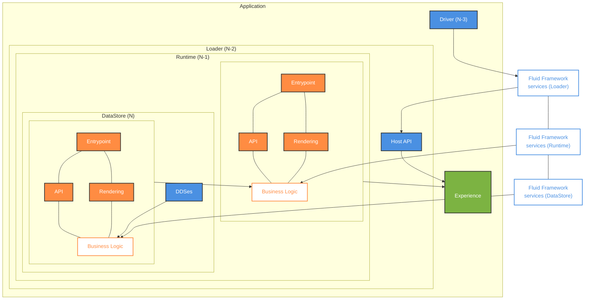

# Fluid Framework Layer Compatibility

## Overview

Fluid Framework uses a **compatibility layer system** to enable different versions of Fluid packages to work together seamlessly. This system is critical for production deployments where clients may be running different versions of the framework due to dynamic loading, where code executed is retrieved from the network in a way that allows the code of each layer to change independently. This differs from other types of lazily loaded code, like webpack chunks, which are still part of the same compiled package, and will always return the same code. Because the layers can be different, each layer must support interacting with other layers of a different version.

The compatibility system consists of **four distinct layers**:

1. **Driver Layer** - Storage and ordering service connectivity
2. **Loader Layer** - Core container management
3. **Runtime Layer** - Container runtime operations
4. **DataStore Layer** - Data store and DDS management

Each layer validates compatibility with adjacent layers using a combination of **generation numbers** (time-based versioning) and **feature flags** (capability-based versioning). This allows Fluid to:

- Support gradual package upgrades without breaking existing clients
- Maintain a compatibility window
- Detect and report incompatibilities before they cause runtime errors
- Enable testing of version combinations to ensure robustness

## The Four Layers

### 1. Driver Layer

**Purpose:** Provides connectivity to storage and ordering services.

**Key Packages:**

- `@fluidframework/local-driver` - Local development driver
- `@fluidframework/odsp-driver` - OneDrive / SharePoint driver
- `@fluidframework/routerlicious-driver` - Routerlicious (r11s) / AFR driver

**Responsibilities:**

- Retrieve snapshots from storage
- Stream operations from ordering service
- Implement service-specific protocols
- Handle authentication and authorization

**Validated By:** Loader layer validates Driver compatibility

**Compatibility State Files:**

- [localLayerCompatState.ts](./packages/drivers/local-driver/src/localLayerCompatState.ts)
- [odspLayerCompatState.ts](./packages/drivers/odsp-driver/src/odspLayerCompatState.ts)
- [r11sLayerCompatState.ts](./packages/drivers/routerlicious-driver/src/r11sLayerCompatState.ts)

### 2. Loader Layer

**Purpose:** The minimal kernel of the Fluid runtime, providing access to storage and consensus.

**Key Package:**

- `@fluidframework/container-loader`

**Responsibilities:**

- Manage container lifecycle (loading, connecting, closing, disposal)
- Handle connectivity state and reconnection logic
- Track audience (connected clients)
- Provide error handling and telemetry
- Coordinate between Driver and Runtime layers

**Validates:** Driver and Runtime layers
**Validated By:** Runtime layer

**Compatibility State File:**

- [loaderLayerCompatState.ts](./packages/loader/container-loader/src/loaderLayerCompatState.ts)

The Loader is the **central coordination layer** that sits between the Driver (below) and Runtime (above), ensuring both are compatible with its version.

### 3. Runtime Layer

**Purpose:** Manages container runtime operations and orchestrates data stores.

**Key Package:**

- `@fluidframework/container-runtime`

**Responsibilities:**

- Process and submit operations
- Manage summarization
- Garbage collection
- Data store lifecycle management
- Batching and compression
- Handle pending ops and resubmission

**Validates:** Loader and DataStore layers
**Validated By:** Loader and DataStore layers

**Compatibility State File:**

- [runtimeLayerCompatState.ts](./packages/runtime/container-runtime/src/runtimeLayerCompatState.ts)

The Runtime layer has **bidirectional validation** with both Loader and DataStore layers, as it acts as a coordinator between them.

### 4. DataStore Layer

**Purpose:** Provides runtime for individual data stores and their distributed data structures (DDSes).

**Key Package:**

- `@fluidframework/datastore`

**Responsibilities:**

- Manage DDS lifecycle and operations
- Handle Fluid handles for object references
- Data store runtime context
- Local and remote DDS operations

**Validates:** Runtime layer
**Validated By:** Runtime layer

**Compatibility State File:**

- [dataStoreLayerCompatState.ts](./packages/runtime/datastore/src/dataStoreLayerCompatState.ts)

## Layer Boundaries and Validation

The compatibility system enforces validation at specific **layer boundaries**:

### Loader ↔ Driver Boundary

- **Validator:** Loader validates Driver
- **When:** During container creation (before connection established)
- **Why:** Ensures the Driver can provide storage/ordering service capabilities the Loader needs

### Loader ↔ Runtime Boundary

- **Validator:** Both directions
    - Loader validates Runtime during container load
    - Runtime validates Loader during initialization
- **When:** During container loading/initialization
- **Why:** Ensures the Runtime can work with the Loader's container context and vice versa
- **Note:** Runtime uses stricter validation by default for Loader (can be disabled via config)

### Runtime ↔ DataStore Boundary

- **Validator:** Both directions
    - Runtime validates DataStore during data store creation/realization
    - DataStore validates Runtime during initialization
- **When:**
    - Create flow: During data store attach
    - Load flow: During data store realization
- **Why:** Ensures DataStores can communicate with Runtime and use its features

## Architecture Diagram


- Driver layer is package version N-3.
- Loader layer is package version N-2.
- Runtime layer is package version N-1.
- DataStore layer is package version N.

## Compatibility Mechanics

### Generation Numbers

Each layer maintains a **generation number** that increments on a regular cadence (typically monthly). Generation numbers enable time-based compatibility:

- Each layer specifies a `minSupportedGeneration` for adjacent layers
- If an adjacent layer's generation is below the minimum, validation fails
- This creates a sliding compatibility window (e.g., 6 months = 6 generations)

**Example:**

```typescript
// Runtime requires DataStore to be at least generation 1
const dataStoreSupportRequirementsForRuntime = {
	minSupportedGeneration: 1,
	requiredFeatures: [],
};
```

### Features

Layers can declare **supported features** and **required features**:

- **Supported Features:** Features or capabilities a layer provides
- **Required Features:** Features or capabilities a layer needs from an adjacent layer

Validation checks that all required features are in the supported features set.

**Example:**

```typescript
// Runtime supports these features for DataStore
const runtimeCompatDetailsForDataStore = {
	supportedFeatures: new Set<string>([
		"encodeHandlesInContainerRuntime",
		"notifiesReadOnlyState",
	]),
};
```

### Package Versions

Each layer includes its package version in compatibility details. While not used for validation logic, package versions are included in error telemetry to help diagnose incompatibility issues.

### Validation Logic

The core validation function is `checkLayerCompatibility` in [layerCompat.ts](./packages/common/client-utils/src/layerCompat.ts):

```typescript
export function checkLayerCompatibility(
	compatSupportRequirementsLayer1: ILayerCompatSupportRequirements,
	compatDetailsLayer2: ILayerCompatDetails | undefined,
): LayerCompatCheckResult;
```

**Validation Steps:**

1. Check generation compatibility: `layer2.generation >= layer1.minSupportedGeneration`
2. Check feature compatibility: All features in `layer1.requiredFeatures` must be in `layer2.supportedFeatures`
3. Return result indicating compatibility or specific incompatibility reasons

### Error Handling

When incompatibility is detected, an error of type `FluidErrorTypes.layerIncompatibilityError` which implements the `ILayerIncompatibilityError` interface is thrown.
In all layer validations except at the Runtime ↔ DataStore boundary, the error causes the container to close and prevents data corruption from incompatible operations.
In case of the Runtime ↔ DataStore boundary, the data store creation / load will fail to prevent corruption of the data store from incompatible operations. If the data store is created / loaded during container create / load, then that may fail as well.

### Bypass Configuration

For testing or migration scenarios, layer validation can be bypassed using the configuration flag:

```typescript
// In config provider
configProvider.set("Fluid.Container.AllowIncompatibleLayers", true);
```

This will log a warning event but allow incompatible layers to work together. **Use with caution** - this should only be used in controlled scenarios.

## Key Implementation Details

### Adding a New Feature

To add a new feature that requires compatibility validation:

1. **Define the feature string** in the appropriate package (e.g., `runtime-definitions`)

    ```typescript
    export const myNewFeature = "myNewFeature";
    ```

2. **Add to supported features** in the layer providing the feature. Add a comment about which generation the feature is added.

    ```typescript
    // In runtimeLayerCompatState.ts
    supportedFeatures: new Set<string>([
    	encodeHandlesInContainerRuntime,
    	notifiesReadOnlyState,
    	myNewFeature, // Added in generation 10
    ]);
    ```

3. **Add logic to conditionally use feature** in the layer that needs the feature. Basically, if the other layer supports the feature, use it, else don't.

4. **Add to required features** in the layer requiring the feature after it has been in supported features for longer than the supported compatibility window for that layer boundary. If this is done sooner than that, it will incorrectly fail compatibility across that layer. A simple approach is to note the `generation` number when the feature was added (via comment added in the step 2), then move it to required when the difference between current generation and the generation where features is added is greater than the supported compatibility window (in months).
For example, say the supported compatibility window across the Runtime ↔ DataStore boundary is 6 months. The feature can be made required in generation 17+.

    ```typescript
    // In dataStoreLayerCompatState.ts
    requiredFeatures: [myNewFeature]; // Required in generation 17
    ```

### Bumping Generation Numbers

Generation numbers are updated on a regular cadence (monthly) coordinated across the codebase. This happens automatically during minor / major releases if the following criteria is met:
- At least a month has passed since the last update to the generation.
- Between two subsequent releases, the generation should not be incremented by more than the minimum compat window between 2 layers across all layers boundaries. For example, say compat window between Loader / Runtime is 12 months but between Runtime / Datastore it is only 3 months. Then between 2 subsequent releases, generation should not increment by more than 2. If that happens, it doesn't give customers enough time to upgrade their packages and saturate a release before upgrading to the next one. Layer compatibility will break as soon they upgrade.

### Testing Compatibility

The test suite in [layerCompat.spec.ts](./packages/test/test-end-to-end-tests/src/test/layerCompat.spec.ts) validates all layer combinations:

- Tests both create and load flows
- Tests generation incompatibility
- Tests feature incompatibility
- Tests bypass configuration

The `test-version-utils` package provides infrastructure for testing compatibility across different version combinations in CI/CD.

## References

### Core Type Definitions

- [layerCompat.ts](./packages/common/client-utils/src/layerCompat.ts) - Core types, validation logic, and the `FluidLayer` type definition

### Layer Compatibility State

- [loaderLayerCompatState.ts](./packages/loader/container-loader/src/loaderLayerCompatState.ts) - Loader compat details
- [runtimeLayerCompatState.ts](./packages/runtime/container-runtime/src/runtimeLayerCompatState.ts) - Runtime compat details
- [dataStoreLayerCompatState.ts](./packages/runtime/datastore/src/dataStoreLayerCompatState.ts) - DataStore compat details
- **Driver compat details** - In each driver package's `*LayerCompatState.ts` file

### Testing and Documentation

- [layerCompat.spec.ts](./packages/test/test-end-to-end-tests/src/test/layerCompat.spec.ts) - Compatibility test suite
- [layerCompatError.ts](./packages/utils/telemetry-utils/src/layerCompatError.ts) - Error handling and telemetry
