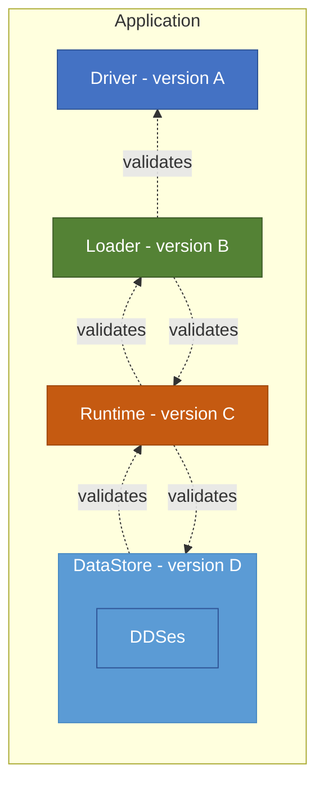

# Fluid Framework Layer Compatibility

**Suggested pre-read:** The [Fluid Framework Compatibility Considerations](./FluidCompatibilityConsiderations.md) document provides an overview of Fluid's four compatibility dimensions: API compatibility, Layer compatibility, Cross-client compatibility, and Data-at-rest compatibility. This document focuses specifically on Layer compatibility — how different versions of Fluid's architectural layers interoperate within a single client.

## Overview

Fluid Framework uses a **compatibility layer system** to enable different versions of Fluid packages to work together seamlessly within a single client. This system addresses two key scenarios:

1. **Dynamic loading**: Applications may retrieve layer code from the network independently, allowing each layer to update on its own schedule. Unlike webpack chunks that are part of the same compiled package, dynamically loaded layers can run different versions simultaneously. For example, a host application like Teams may compile the Driver and Loader layers and update infrequently, while dynamically loading a container that compiles the Runtime layer and updates more frequently.

2. **Multi-repo development**: Applications often import and build from multiple repositories that release on different cadences. Without layer compatibility, all repositories would need to coordinate updates to the same Fluid version simultaneously. For example, a container may compile the Runtime layer while importing components from a separate repository that compile Datastores—each updating independently.

The compatibility system consists of **four distinct layers**:

1. **Driver Layer** - Storage and ordering service connectivity
2. **Loader Layer** - Core container management
3. **Runtime Layer** - Container runtime operations
4. **DataStore Layer** - Data store and DDS management

## Layer Boundaries and Validation

The compatibility system enforces validation at specific **layer boundaries** using a combination of **generation numbers** (time-based versioning) and **feature flags** (capability-based versioning). This allows Fluid to:

- Support gradual package upgrades without breaking existing clients
- Maintain a predictable compatibility window
- Detect and report incompatibilities before they cause runtime errors
- Enable testing of version combinations to ensure robustness

The diagram in [Fluid compatibility considerations doc](./FluidCompatibilityConsiderations.md#architecture-diagram) shows a client with different versions of the Fluid layers.
The diagram below focuses on the interactions between adjacent layers, illustrating how each layer validates compatibility with its adjacent layer.

### Loader ↔ Driver Boundary

- **Validator:** Loader validates Driver
- **When:** During container creation (before connection established)
> Note: Driver doesn't validate Loader because there are no interacts from Driver to Loader. So, there isn't a need to maintain compatibility in that direction.

### Loader ↔ Runtime Boundary

- **Validator:** Both directions
    - Loader validates Runtime during Runtime instantiation
    - Runtime validates Loader during initialization
- **When:** During container loading/initialization

### Runtime ↔ DataStore Boundary

- **Validator:** Both directions
    - Runtime validates DataStore during data store creation/realization
    - DataStore validates Runtime during initialization
- **When:**
    - Create flow: During data store attach
    - Load flow: During data store realization

### Error Handling

When incompatibility is detected, an error of type `FluidErrorTypes.layerIncompatibilityError` which implements the `ILayerIncompatibilityError` interface is thrown.
In all layer validations except at the Runtime ↔ DataStore boundary, the error causes the container to close. This prevents any potential data corruption that could occur from incompatible operations.
In case of the Runtime ↔ DataStore boundary, the data store creation / load will fail to prevent corruption of the data store from incompatible operations. The container may also close, e.g. if the data store is created / loaded during container create / load.

## Layer Compatibility Policy

Layer compatibility policy describes specific **support windows** between layers to ensure reliable interoperability while allowing independent upgrades. These windows define how far apart (in months) two adjacent layers can be before they become incompatible.

### Support Window by Layer Boundary

| Layer Boundary | Support Window | What This Means |
| -------------- | -------------- | --------------- |
| **Driver ↔ Loader** | 12 months | Driver and Loader remain compatible when up to 12 months apart |
| **Loader ↔ Runtime** | 12 months | Loader and Runtime remain compatible when up to 12 months apart |
| **Runtime ↔ DataStore** | 3 months | Runtime and DataStore remain compatible when up to 3 months apart |

### What This Means for An Application

These support windows determine how much version drift is acceptable between layers in your application. Applications should use this to plan their upgrade strategy and ensure layers remain compatible. They should coordinate updates across repositories and deployment boundaries to stay within the support windows.

### Implementation Details

These support windows are enforced through the compatibility validation system described in earlier sections. The specific policy values are defined in `LayerCompatibilityPolicyWindowMonths` in
[layerCompat.ts](./packages/common/client-utils/src/layerCompat.ts).

## The Four Layers

### 1. Driver Layer

**Purpose:** Provides connectivity to storage and ordering services.

**Key Packages:**

- `@fluidframework/local-driver` - Local development driver
- `@fluidframework/odsp-driver` - OneDrive / SharePoint driver
- `@fluidframework/routerlicious-driver` - Routerlicious (r11s) / AFR driver

**Responsibilities:**

- Retrieve snapshots from storage
- Stream ops from ordering service
- Implement service-specific protocols

**Validated By:** Loader layer

### 2. Loader Layer

**Purpose:** The minimal kernel of the Fluid runtime, able to load a Fluid container along with the code needed to interact with it.

**Key Package:**

- `@fluidframework/container-loader`

**Responsibilities:**

- Manage container lifecycle (loading, connecting, closing, disposal)
- Handle connectivity state and reconnection logic
- Track audience (connected clients)
- Provide error handling and telemetry
- Coordinate between Driver and Runtime layers

**Validates:** Driver and Runtime layers
**Validated By:** Runtime layer

### 3. Runtime Layer

**Purpose:** Orchestrates the container's data stores, manages the op stream and summarization for the container.

**Key Package:**

- `@fluidframework/container-runtime`

**Responsibilities:**

- Process and submit ops
- Manage container wide summarization and garbage collection
- Data store lifecycle management
- Batching and compression of the op stream
- Handle pending ops and resubmission

**Validates:** Loader and DataStore layers
**Validated By:** Loader and DataStore layers

### 4. DataStore Layer

**Purpose:** Orchestrates the data store's distributed data structures (DDSes), managing the op stream and summarization for the data store.

**Key Package:**

- `@fluidframework/datastore`

**Responsibilities:**

- Process and submit DDS ops
- Manage DDS summarization and garbage collection
- DDS lifecycle management

**Validates:** Runtime layer
**Validated By:** Runtime layer

## Developer Guide

The developer guide that focuses on mechanics and internals for layer compatibility is described [here](./LayerCompatibilityDevGuide.md).
