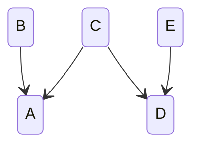

# fluid-build

## why we use it, how it works and how to improve it

Tyler Butler
tylerbu@microsoft.com

July 30 2024

---

# tylerbu presentations

This presentation contains **opinion**.
It employs **hyperbole**
for both **humor**
and **effect**.

---

# Brief build system theory

### (We'll come back to this.)

1. Scripts (npm, make, just)
2. Task-based (lage, lerna)
3. Artifact-based (Bazel, Pants)

---

1. Scripts
2. Task-based **<-- fluid-build is here**
3. Artifact-based

---

# Incremental builds

Support for incremental builds can be done with all build systems, but it's easier with task and artifect-based systems

An incremental build system is one that enables a part of the build to be executed once, and then only execute again if "something changed."

The challenge is in the "something changed" part. A build system with perfect incremental behavior will have perfect knowledge of when "something changed."

---

# Gall's law

**A complex system that works is invariably found to have evolved from a simple system that worked.** A complex system designed from scratch never works and cannot be patched up to make it work. You have to start over with a working simple system.

---

# A little bit of history

When Fluid was getting started, packages looked like this:

```json
"scripts": {
  "full": "concurrently npm:build npm:copy",
  "build": "npm run compile && concurrently npm:api npm:docs npm:lint",
  "api": "api-extractor",
  "compile": "tsc",
  "copy": "copyfiles",
  "docs": "build-docs",
  "lint": "eslint",
}
```

That's pretty simple yet powerful; you build a "task graph" and efficiently order everything.

---

# But Fluid is more than one project...

Early versions of fluid-build would read the tasks and decompose them into a graph, using the `&&` and `concurrently` to denote the task relationships.

Essentially, we "invented" a tiny, underspecified domain-specific language to define tasks and cross-package relationships.

---

# The secret sauce

But fluid-build also did something really cool...

It read _all_ the projects scripts and the dependencies in `package.json`, and would put _those_ tasks into the graph, so now we had a task scheduler that worked across a group of packages!

---

And for an embarassingly long time, because I was dumb and naïve, I thought that all that magic was enabled by `&&` and `concurrently`.

---

# Of course that wasn't true.

The code had a hardcoded understanding of the relationship between the tasks of different packages.

For example, it knew that `lint` didn't require dependent builds, so it would schedule it accordingly. There were a lot of these, and as the repo grew we started to see a bunch of new tasks and `package.json` uses.

---

# As the repo grew more complex

We added explicit task relationships in the code, which is how _all_ tasks are defined in a lot of similar systems like nx and lage. So now we have the best of both worlds - you can add tasks to individual packages that use `&&` and `concurrently`, and as long as they're called from one of the main build scripts.

But there was still one thing missing - root level tasks, like policy-check, syncpack, etc. So as a parting gift to the team Curtis built that before he left.

---

# Brief build system theory

---

Task decomposition
script tasks vs. non-script tasks
Task relationships in the config file
Task relationships in individual project overrides
Caching and incremental builds
	tsc special cases

Types of build systems
Scripts -> task-based -> artifact-based (bazel)

These are not only general categories of build systems; they're also the typical progression of the needs from a build system as the project grows

Scripts work fine when you have a single project, or even a handful of projects

## Tasks

Here's what a task definition looks like:

```js
"lint": {
	dependsOn: [
		"check:format",
		"eslint",
		"good-fences",
		"depcruise",
		"check:exports",
		"check:release-tags",
	],
	script: false,
},

```

Tasks in the root config are defaults. If a package doesn't define a script/task matching the task, then it's just skipped. This lets packages opt in to tasks over time.

Tasks can also be defined at the package level in the fluidBuild.tasks node in package.json. This enables two scenarios:

1. Completely overriding the definition for a task with a package-specific definition.
2. Adding additional subtasks to an existing task definition using the `...` entry in the task dependencies.

An example of #2 is:

```js
"lint": {
	dependsOn: [
		"...",
		"package-specific-task",
	],
	script: false,
},
```

This will configure the lint task to depend on all the defaults defined in the root, and also the package-specific-task that is unique to this package.

### The script property

The script property on tasks tells fluid-build if the command in the script should be executed or if the task definition should be used instead. This enables you to define the task graph with a combination of

```json
"scripts": {
	"build": "npm run compile && concurrently npm:api npm:docs npm:lint",
	"api": "api-extractor",
	"compile": "tsc",
	"docs": "build-docs",
	"lint": "eslint",
}
```

That is similar to:

```json
"scripts": {
	"build": "fluid-build --task build",
	"api": "api-extractor",
	"compile": "tsc",
	"docs": "build-docs",
	"lint": "eslint",
}
```

With a task definition like this:

```js
"lint": {
	dependsOn: [
		"...",
		"package-specific-task",
	],
	script: false,
},
```

---


