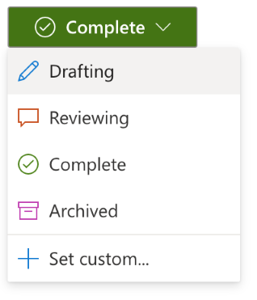

# Badge component

**Badge** is a Fluid component that allows users to create an in-line badge within a document to represent the status
of the overall document or a section of it.

## Custom Status

Badge includes four preset statuses: Drafting, Reviewing, Complete, and Archived.

You can also set a custom status with any text or color.

## History

The history of the Badge is also shown on hover, so users can see how the status has evolved over time.

## Data model

Badge uses the following distributed data structures:

- SharedDirectory - root
- SharedMap - stores the status options for the Badge
- SharedCell - represents the Badge's current state
- SharedObjectSequence - stores the history of status changes
