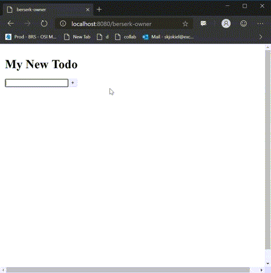

# Todo

**Todo** is a more advanced Component that covers more complicated scenarios. The Todo app uses React as it's view rendering platform.

## Getting Started

If you want to run this component follow the following steps:

1. Run `npm install` from the `FluidFramework` root directory
2. Navigate to this directory
3. Run `npm run start`

## Todo Components

There are two components that make up the Todo application:

### [Todo](./src/Todo/index.tsx)

A Todo is the top level component and contains three core concepts:

1. Title
2. Ability to create new Todo Items
3. Collection of Todo Items

### [TodoItem](./src/TodoItem/index.tsx)

A Todo Item is a singular todo entry. Because each Todo Item is its own component each Todo Item can be independently opened.

Todo Items can contain one inner component. These can currently be another Todo Item or a Clicker.

## Other Components

There are two other components that live in the todo repo but are there to extend functionality of `TodoItem`

### [TextBox](./src/TextBox/index.tsx)

A Collaborative TextArea based off the React CollaborativeTextArea. This should be replaced by just pulling in the `@fluid-example/collaborative-textarea` component.

### [TextList](./src/TextList/index.tsx)

Used the `SharedString` to manage a list of text items.
