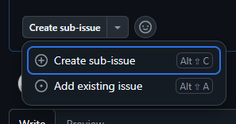

## Introduction

This article is intended to guide you on the best practices regarding API deprecation.
This includes both the **process of deprecating an API** as well as **cleaning up already deprecated APIs.**

## Deprecating an API

The following are guidelines when you are considering deprecating an API.

### Principles behind deprecating an API

When deprecating APIs, we must clearly communicate why the API is deprecated, what solution will replace it, and why these changes will ultimately benefit the user.
As you are adding new functionality, or extending an existing one, strive towards API that is simple and consistent.
When thinking of simplicity ask yourself if the change adds further interdependencies between API calls or need to contextually understand one API call to reason about another.

You should discuss the plan to deprecate and remove an API **before** committing the change.
This should be done in the corresponding GitHub issues/PRs.
If an API is marked as deprecated without a clear plan, then it can become difficult to cleanup in the future.
Additionally, there are many cases where the additional discussion and planning will determine that the API should not have been deprecated in the first place.

Search both the FluidFramework and partner repositories to understand impact and identify partners to inform/consult.
See [partner info](https://eng.ms/docs/experiences-devices/opg/office-shared/fluid-framework/fluid-framework-internal/fluid-framework/docs/dev/partnerinfo/partner-info) (Microsoft internal).
(Fluid Framework team member can perform search for non-Msft contributors.)

### Compatibility and Versioning

Whenever you make a change to an API, you need to consider the implications for packages which consumed that API.
This will often lead to additional phases, such as creating a pre-release.
For further guidelines, it is highly recommended to refer to this [guide](./Compatibility-and-Versioning.md) about compatibility and versioning to understand how to properly stage your changes in this scenario.

### Communication

When you deprecate a public or beta (including legacy) API:

1. You should create a GitHub issue to track the cleanup of the API.
1. You _must_ introduce a [changeset](./Breaking-vs-Non-Breaking-Changes/Changesets.md) calling attention to the change (see also [changeset FAQ](./Breaking-vs-Non-Breaking-Changes/Changesets-FAQ.md)). If an issue was filed, you may keep changeset light and reference the issue.
   Otherwise, add details to the changeset.

#### Creating a GitHub Issue

For public client API, issue should be created as sub-issue of next major breaking changes issue, currently [Client 4.0 Breaking Changes](https://github.com/microsoft/FluidFramework/issues/27453).
For beta (including legacy) client APIs, find parent issue using table in [Beta Break Process](./Breaking-vs-Non-Breaking-Changes/Beta-Break-Process.md).



Use the "**Deprecated API**" template and fill in each of the categories listed in the template.
Additionally, remember to assign the issue to whoever will own the cleanup of the API.
If unsure, assign it to yourself.

The complexity and scope of an API will often determine the approach you may take when creating the corresponding GitHub issue.
When an API is relatively simple and isolate, you may take a more **tactical** approach where the plan is clearly defined out.
However, when handling a complex API with a larger scope, you may need a **strategic** approach, where more planning and discussion is required.

#### Examples

- [Tactical approach for a simple API](https://github.com/microsoft/FluidFramework/issues/8438)
- [Strategic approach for a complex API](https://github.com/microsoft/FluidFramework/issues/7613)

For reference, you can query all open GitHub issues related to API deprecation using the [`api deprecation` label](https://github.com/microsoft/FluidFramework/labels/api%20deprecation).

### Marking an API as deprecated in the codebase

The following is an example an API marked as deprecated.
In this scenario, `exampleString` is made obsolete by `exampleObject.getString()`.
This is communicated clearly in the comment.
We also communicate when it was deprecated and when we expect to remove it.
Additionally, we point to a GitHub issue in order to provide further explanation.

```typescript
/**
 * @deprecated 1.0.0. This API will be removed in 2.0.0.
 * Use {@link exampleObject.getString} instead.
 * See {@link https://github.com/microsoft/FluidFramework/issues/ABCD} for context.
 */
public exampleString: string = "example";
```

For more details related to the `@deprecated` TSDoc tag, see the [`@deprecated` tag guidance](../Guidelines/Documentation-Guidelines/Documenting-TypeScript/TSDoc-Guidelines.md#deprecated).

#### Removing local codebase uses

Most in-codebase uses of deprecation should be removed before or with the deprecation.
Remaining uses should be limited to test cases kept to verify functionality until ultimate removal.
In cases where an API is deprecated to become internal-only, this can require more effort and may not be worth the cost.

#### Updating examples and documentation

When alternate pattern is available, update examples at <https://github.com/microsoft/FluidExamples> and <https://github.com/microsoft/FluidHelloWorld> and documentation under the [`website/docs`](../../../website/docs) directory.
Otherwise, plan to update examples and documentation when changes are released.

## Cleaning up a deprecated API

To cleanup a deprecated API, your starting point should be the GitHub issue mentioned above.
You should try to clarify any questions or concerns in the issue comments.
Additionally, you should attempt to outline your solution in the GitHub issue and gather any necessary feedback **before** creating a PR.

As most affected code will have already been updated during deprecation or shortly after, the changes to remove the API should generally be relatively small.

### Beta / Legacy staging

For beta and legacy API removals have special considerations due to accelerated time frame that impact will happen.

1. Create branch under test/breaks/client/#.#0/ (use target version in place of #.#0) in microsoft/FluidFramework (fork is not preferred).
   This enables a test build to be produced and integration testing with partner repositories.
1. Create PR to main and reference the tracking issue
1. Reference to PR can be added to issue using the gear icon in Development section
1. (optional) Get approvals from reviewers (expect FF API CR will be needed)
1. Hold the PR (DO NOT MERGE) until legacy / beta break window is open (packages at target #.#0 version)

### Communication

When removing an API, be sure to create a [changeset](./Breaking-vs-Non-Breaking-Changes/Changesets.md) with noting the removed API.
Refer to the issue or release notes that contains the details of the API change.
