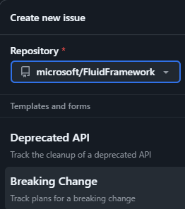

# Beta \| Legacy Breaks for FF Client

Beta and Legacy+Beta APIs are both used in production by partners and not settled/finalized.
They are supported under an agreement that allows them to be carefully changed ahead of major version bumps.
**New deprecations** should follow [API Deprecation](../API-Deprecation.md) leveraging the table below to schedule removal.

## To Create Issue for an **Existing** Deprecation

_ONLY_ if the API deprecation does not have an issue per [API Deprecation](../API-Deprecation.md) (preferred), use these steps to track without duplicating a lot of information.

1. Search partner repositories yourself or have Fluid Framework team member do so. See [partner info](https://eng.ms/docs/experiences-devices/opg/office-shared/fluid-framework/fluid-framework-internal/fluid-framework/docs/dev/partnerinfo/partner-info) (Microsoft internal).

1. Go to applicable issue from table:

    | Version | Conditions                                                                                                 | Tracking Issue                                                                                                                |
    | ------- | ---------------------------------------------------------------------------------------------------------- | ----------------------------------------------------------------------------------------------------------------------------- |
    | 3.0     | **unused** deprecations merging before 2.112 branch                                                        | [Client 3.0 Beta \| Legacy Breaking Changes · Issue #26500](https://github.com/microsoft/FluidFramework/issues/26500)         |
    | 3.10    | - used deprecations merged before 2.112 branch OR  - **unused** deprecations merging before 3.02 branch | [Client 3.10 Beta \| Legacy Breaking Changes · Issue #27471](https://github.com/microsoft/FluidFramework/issues/27471)        |
    | 3.20    | otherwise (used deprecations merging before 3.02 branch)                                                   | [Client 3.20 Beta \| Legacy Breaking Changes · Issue #\<not yet filed\>](https://github.com/microsoft/FluidFramework/issues/) |

    When in doubt if a `@beta` (including `@beta+@legacy`) API or pattern is in use, assume that it is in use and allow three months (12 weeks) before breaking.

1. Add sub-issue

    

1. Use `Breaking Change` template

    Note: you should only be here if the deprecation has already been published.

    

    1. Use information in the existing release notes (or pending changeset of deprecation) to fill out the issue. Focus on conveying the change to customers.
    1. Set Assignee to whomever is expected to complete the work (ideally also a good contact for any questions)
    1. `Create` the issue.

1. Ideally associate a PR that does the removal. See [API Deprecation](../API-Deprecation.md) "Beta / Legacy staging" for steps.
