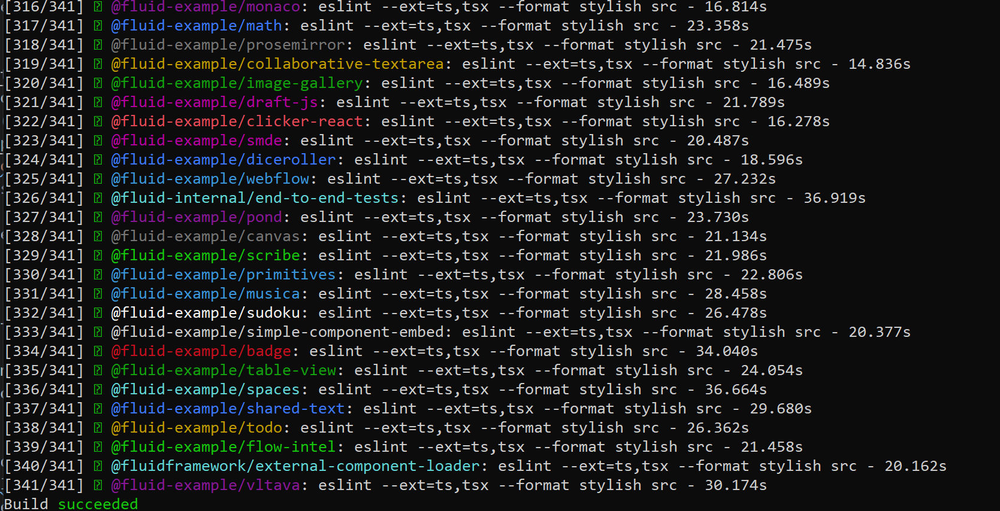

## Requirements

The only pre-requisites for building and running Fluid Framework code from the repo are:

- [Node.js](https://nodejs.org/en/download/) (version 18 or higher is required)
    - We recommend using nvm (for [Windows](https://github.com/coreybutler/nvm-windows) or
      [MacOS/Linux](https://github.com/nvm-sh/nvm)) to install Node.js, in case you find yourself needing to install different
      versions of Node.js side-by-side.
- [Git LFS](https://git-lfs.github.com/) (included by default with most Git installations, for extra test collateral)
- [pnpm](https://pnpm.io/) (installed automatically once using `corepack enable`.)

Optional:

- [Docker](https://www.docker.com/get-started) (only required for running the `routerlicious` server docker image locally, not needed for just running client Fluid object packages)

## Building Client Code

With these dependencies installed, simply navigate to the FluidFramework directory and run the following two commands:

```bash
pnpm install
pnpm build:fast
```

This will automatically install all dependency packages, and then build & compile the entire FluidFramework codebase.

When it has successfully finished, your output will look similar to this



The first time you run these commands, they will take some time as it is downloading all of the dependencies and setting up symlinks for the local packages to be able to use them. Any subsequent runs should be much faster.

`pnpm install` will only re-download packages that were not present locally or ones that were updated

`pnpm build:fast` will only re-compile code that has been edited, and any code that is dependent on the edited code. It will skip the tasks for any unedited code.

## Running Client Code

### Running a Specific Fluid Object Example

1. Start the Fluid object package using package name or path. For `Clicker` example using package name:

```bash
pnpm -r --filter @fluid-example/clicker start
```

1. Open you browser and navigate to the <http://localhost:8080> to see two renders of `Clicker` side-by-side. The two represent two different clients rendering `Clicker` using a local in-memory server.

You can think of the user on the left as User A and the right as User B. When one user clicks, the clicker increments for both users since it is a synced Fluid object. This allows you to quickly test cross-client behavior locally without needing a second device.

You will also have noticed that something got added to the URL and it looks similar to "<http://localhost:8080/second-hand-shop>". The bit after "<http://localhost:8080/>" is a random string used to represent different sessions.

That's why, if you refresh the page using the same URL, you will see that the `Clicker` count is persistent since it reloads the same session.

To load a new session, simply change the string or remove it all together. You will see that on the new page, `Clicker` once again starts from 0.

1. To open another Fluid object simultaneously, just navigate to its directory in a separate terminal window and run `pnpm start` again. It will now load the second Fluid object in <http://localhost:8081> since 8080 is already in use.

### Editing Fluid Objects

You can dynamically edit Fluid objects while they are running! Simply run the object as described above, using `pnpm start` and edit away!

#### Single-Package Changes

As long as the changes are local to the Fluid object package itself, the script running the object will automatically recompile when you save your changes and refresh with your updates.

It's usually a good idea to update the string at the end of your "<http://localhost:8080/>" URL after this as the older session storage may be corrupted from your older code. Starting a new session by changing the string will give you a clean environment.

#### Cross-Package Changes

If you are editing code across multiple packages, you will need to run `pnpm build:fast` again to have your Fluid object pick these changes up.

`Clicker`, for example, has dependencies on the `@fluidframework/aqueduct` package. If we modified code in `aqueduct` and we needed `Clicker` to pick these up, simply re-run `pnpm build:fast` from the repo root.

If this is not the first build, it will only re-build `@fluidframework/aqueduct` and any packages that depend on it (including `Clicker`). All other packages will be ignored as there is no change there.

For a minimal build, specify the final package required as argument to 'build:fast'. Example: `pnpm build:fast @fluid-example/clicker`. This will build changes in packages `Clicker` depends on.
