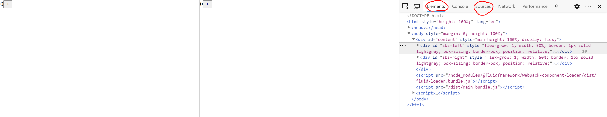
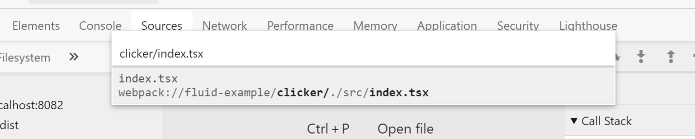
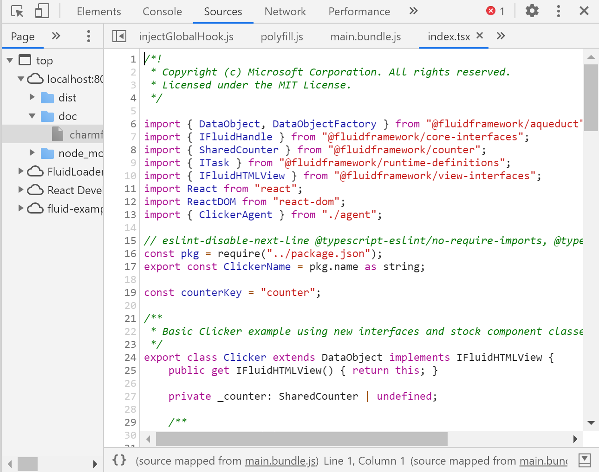
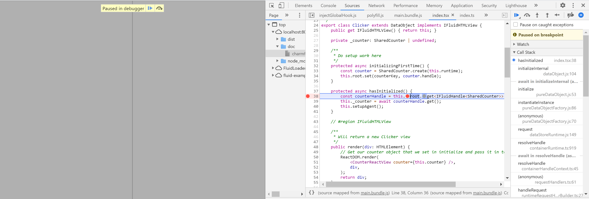
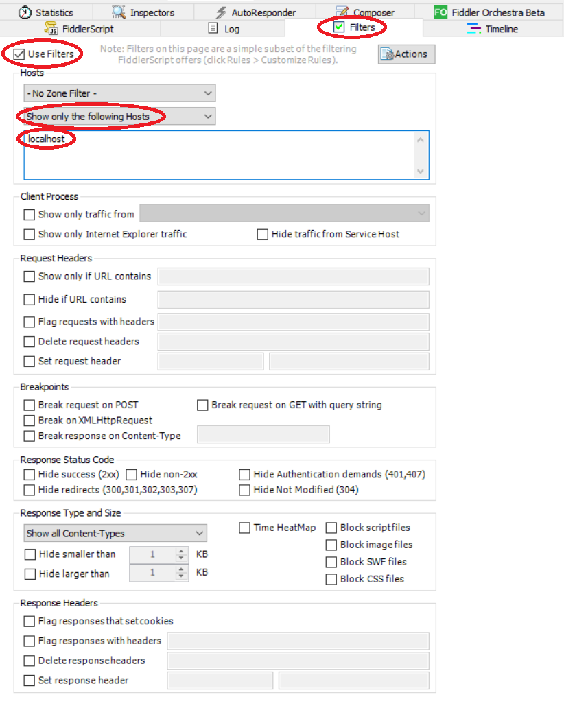

# Debugging

The goal of this page is to get you started with debugging your Fluid Framework code.

## Debugging using DevTools

This section is for debugging client Fluid object code packages.
We will be using Chromium Edge in these steps, but the steps are the same for Chrome.
To do so,

1. Run the Fluid object you are looking to test using these [steps](./Client.md). If you are looking to test a dependency package, e.g., `@fluidframeworks/aqueduct`, you can also view its code when running a Fluid object package that depends on it, e.g., `@fluidframeworks/clicker`. To debug and test a dependency package in isolation, see this [section](./Testing.md) on testing.

2. After opening the Fluid object in the browser using `npm run start`, right click on the browser page and click on `Inspect` to open the DevTools. You should see something similar to this, in the case of `Clicker`
   

3. From here, you can navigate through your visual HTML elements in `Elements` and all of your source code in `Sources`.

4. To set up breakpoints in your code, navigate to `Sources` and press `Ctrl+P` or `Cmd+P` to open the search bar. Here, just type in name of the file you want to debug. Let's do `clicker/index.tsx`.
   
   We can see that the search tool is really exhaustive and does most of the file path completion for us as we type. Just be careful to pick your `.tsx` & `.ts` files, and not the `.js` compiled versions, as the line-numbers and syntax on the `.js` files will not match your source code.

5. Clicking on this, we can now see our `Clicker` source code and set any breakpoints.
   

6. Now, simply refresh your page and you will see that the breakpoints will start being hit.
   

You can also similarly search for any dependency packages that `Clicker` requires and be able to set up breakpoints there as well.
From here, just step through your code using the debug tools and investigate the variable states to search for issues.

For more information on using the debug console, please see the [Chrome DevTools JavaScript documentation](https://developers.google.com/web/tools/chrome-devtools/javascript/).

## Debugging using Fiddler

If you are more interested in monitoring network traffic to see what is happening as Fluid operations are transmitted through websockets, Fiddler is a good tool for this.

1. Install [Fiddler](http://fiddler2.com)
2. On the right panel select `Filters`



1. Select `Use Filters`
2. Select `Show only the following Hosts` from the second dropdown
3. Add `localhost` to the input
4. Now, run your client Fluid object package using these [steps](./Client.md). Once this opens up on `localhost:8080`, you should start seeing its network traffic.
5. Similarly, if you connect it to a local server instance using these [steps](./Server.md), you will start seeing network traffic to it on `localhost:3000`.

For more information on using Fiddler, please see the [Fiddler traffic inspection documentation](https://docs.telerik.com/fiddler/Observe-Traffic/Tasks/ExamineWebTraffic).

## Debugging Tests in VSCode

### Running an individual test file

Running the full end-to-end test suite is an extremely time-consuming process, so it's useful to be able to run only one file or only the failing test.
To run a file, change the associated mocha command to target the individual file rather than all the generated test files.
For instance, if I only wanted to run the `mapEndToEndTests.spec.ts` in the end to end test suite, I could modify the mocha command in the package.json:

```diff
- "test:realsvc:run": "mocha dist/test --config src/test/.mocharc.js"`
+ "test:realsvc:run": "mocha dist/test/mapEndToEndTests.spec.js --config src/test/.mocharc.js"
```

> **Note:** The file extension is `.js` rather than `.ts`.

### Running an individual test

Furthermore, if I wanted to run an individual test inside the `mapEndToEndTests.spec.ts` file, I can add an `--fgrep` argument to the mocha command.
For instance, I can change the command in the package.json from

```diff
- "test:realsvc:run": "mocha dist/test/mapEndToEndTests.spec.js --config src/test/.mocharc.js"
+ "test:realsvc:run": "mocha dist/test/mapEndToEndTests.spec.js --config src/test/.mocharc.js --fgrep 'should set key value in three containers correctly'"
```

### Debugging the test with a JavaScript Debug Terminal

The easiest way to get a debugger working is to use a JavaScript debug terminal in VSCode.
You can hover over any command in a `package.json` and click `Debug Script` to run the script in a debug terminal.
This will automatically attach to any JavaScript process that is started as a part of your tests.
You can place breakpoints in your TypeScript files and shouldn't have to step through JavaScript files.
_Note that if you're stepping through a compat test (denoted by a DescribeFullCompat block or something similar), you may end up stepping through a JavaScript file if you're debugging a previous version._

You can also manually open a debug terminal by hitting the dropdown by the "plus" icon in the top right corner of your integrated terminal.
There should be an option to create a `JavaScript Debug Terminal`.
From there, you'll be presented with a normal shell that you can run commands in.
Any JavaScript process that spawns will be automatically attached to and should stop at any breakpoints that are hit.
Using the example above, you could kick off the tests like so:

```bash
cd packages/test/test-end-to-end-tests
npm run test:realsvc:local
```

The debug terminal would automatically attach and hit your breakpoints that are set.

### Debugging by hitting F5

The repo root has multiple launch configurations in `.vscode/launch.json` to facilitate debugging the currently open file by hitting F5 on the file you're currently viewing.
You can select the `Debug Current Mocha Test` debug configuration after hitting the `Run and Debug` command in the left sidebar and then selecting `Debug Current Mocha Test` from the dropdown next to the "Play" button.
To further filter and only run a specified test, you can open the `.vscode/launch.json`, find the `Debug Current Mocha Test` task, and uncomment the fgrep command line argument:

```json
            "args": [
                // "--fgrep",               // Uncomment to filter by test case name
                // "<test case name>",
                "--no-timeouts",
                "--exit",
            ],
```

_Note the `--no-timeouts` flag.
If you do something that will cause a test to hang forever (like changing the driver to tinylicious without actually running the tinylicious server) it'll seem like the debugger isn't working_

### Break on failing assertions

When debugging your tests, you may want to break on all the failing asserts so you can inspect what is going wrong.
To do this in VS Code, you can turn on "Caught Exceptions" and "Uncaught Exceptions" breakpoints and swap out the default nodejs assertion library with the [Chai assertion library](https://www.npmjs.com/package/chai).
This can be done simply by installing Chai in the desired package using `pnpm install chai` and then replacing the nodejs assertion library with the Chai assertion library in the test file you want to debug:

```typescript
// import { strict as assert } from "assert"
import { assert } from "chai";
```
