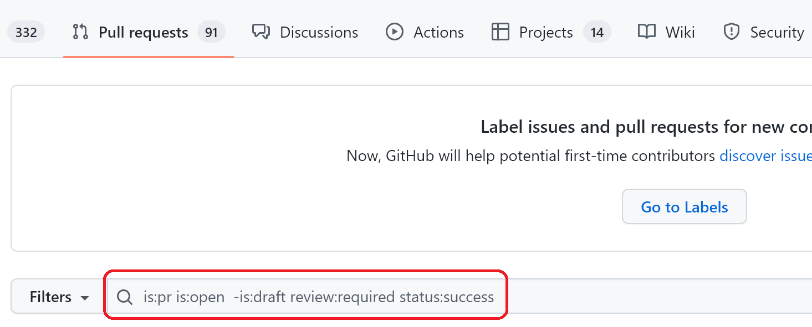

# PR Guidelines

Before working on a **code submission**, check out the [issues list](https://github.com/microsoft/FluidFramework/issues).
Issues labeled `help wanted` are good issues to submit a PR for.
If you are contributing significant changes, please discuss with the code owner of that area first before starting to work on the issue.

## Legal

You will need to complete a [Contributor License Agreement (CLA)](./CLA.md) to submit changes.
This agreement testifies that you are granting us permission to use the submitted change according to the terms of the project's license, and that the work being submitted is under appropriate copyright.
Upon submitting a pull request, you will automatically be given instructions on how to sign the CLA.

## Guidelines

The following are some general practices to follow when submitting PRs (Pull Requests) to the Fluid Framework repo to contribute changes.

The most important thing is to clearly and concisely communicate with potential collaborators on the PR (typically people who might choose to review it) to avoid wasting effort and causing confusion.
Below are some patterns for achieving this in common cases (one author/owner with a self-contained PR).
Feel free to deviate from this (ex: seek early design review, pair-programming as review, etc.) as long as your workflow adjustments are clear to the people involved.
Use mechanisms such as a clear status in the PR description/title and setting PRs to "draft" until they are ready for final review so new reviewers who don't know your adjusted workflow don't assume you're using the regular review process.

When submitting your change, consider making it a draft PR initially.
This can allow you to work through the below requirements at your own pace (including fixing CI failures) before attracting reviewers.
Additionally, whenever additional code review would not be helpful (ex: when you know you will need to make major changes, or already have enough review feedback), consider marking the PR as draft: a non-draft PR is considered a request for Review.

When creating a non-draft PR it should:

1. Have a title and description that explains what the change does.
2. Refer to the issue number the change relates to if there is one.
   a. Use "close" or "fixes" keywords in description followed by the issue number to [auto close the issue when the PR is merged](https://docs.github.com/en/issues/tracking-your-work-with-issues/linking-a-pull-request-to-an-issue#linking-a-pull-request-to-an-issue-using-a-keyword).
3. Be clear about what feedback is desired from reviewers.
4. Pass the CI pipelines.
5. Be able to merge cleanly into main.

From there the process proceeds as follows:

1. Get a reviewer: In general, this can be done passively by waiting. Once it's passing on CI and has a good description, someone will likely look at it. In some cases, particularly in specialized areas of the codebase, it can make sense to reach out to a relevant expert in the area for review. We do not currently have a standard process for how or when to do this.
2. Do the review: Each PR should be reviewed to confirm that it is something we want in Fluid Framework and that it does it in a good way. If it makes sense to have different people review these aspects (or other aspects of the change), communicate this to the reviewers. Likewise, reviewers should be clear about what aspect of a PR they reviewing. A review should have one of the following outcomes:
    1. Approval: If everything covered in the review was acceptable, the reviewer should let the author know they approve. If the reviewer covered all aspects of the PR that need review, or confirmed that others have already approved of all aspect they did not cover, then this is done on the `Files  changed` tab's `Review Changes` popup by selecting `Approved`. If there are still more aspects of the PR that need review (ex: it looks like a good idea, but you didn't review the implementation), post a comment in the conversation view indicating what portion you reviewed and that you approve. Note that this can also be combined with comments (see below).
    2. Comments: When the reviewer has some feedback, but wants to leave the decision of whether to act on it or not up to the author, they should post comments to the PR, either as single comments or a batch as a Review by selecting "Comment" when submitting. If a reviewer looks through a PR and it looks good but they do not think they are a suitable approver, they should include this as a comment as well. Github offers some [general guidance](https://docs.github.com/en/pull-requests/collaborating-with-pull-requests/reviewing-changes-in-pull-requests/commenting-on-a-pull-request) here: of particular note is the section about `suggestions` in comments: use those to make applying small suggested changes much easier.
    3. Requesting Changes: When the reviewer wants to request changes be made, it can be done by clearly stating this in comments (see above) and not approving the PR. It can also be done with more tool based enforcement using `Review Changes` / `Request changes`: if using this process, the reviewer must follow up on the PR in a timely manner and check if the request has been met and clear the request from the PR if it has.
3. Respond to the review: the owner should read all comments from the review, and take following actions for each:
    1. Respond to the comment. If it's a suggestion, this can take the form of making the suggested change, or explaining why you are not making it. If it's just a note to you that does not suggest any change, you can respond with another comment, use the emoji reaction tool, or simply resolve it. If it's a question, answer it (or find an additional reviewer who can). External contributors should feel free to ask the reviewer(s) or other internal contributors for assistance in addressing feedback.
    2. If a comment has been addressed, and no one else is expected to want to look at the comment again, resolve it. Who should do this depends on the comment, but it often falls to whoever created the comment originally after they confirm their original concerns have been fully addressed.
4. Get at least one official team reviewer to approve. This can be the original PR author, the reviewer, or someone else.
5. Prior to merging the PR (especially for PRs that are more than a day old) to main after it has been approved,
    - Make sure all comments have been addressed, and ideally resolved. It is ok for some comments to not be resolved if the person who would resolve them is a reviewer, and you are confident they will not want any further changes based on the discussion.
    - Merge in the latest main to your branch and update the PR
        - Make sure that main merges cleanly without any conflicts
        - Make sure it passes all CI pipelines
    - Do one last quick self review of the change to make sure it is in the state that you want to merge (e.g. no extra files or changes that were accidentally included)
6. Always squash and merge. Also update the squash commit description to be a one-liner summary; usually the PR title is sufficient. The squash and merge prevents unnecessary commits from polluting the merge history and keeps it easy to read and track changes.

## Submitting Pull Requests

This assumes that you have already created a branch on your own fork with the changes you wish to submit.
Please follow the [Editing the Repo steps](./Repo-Basics.md#editing-the-repo) if you have not done this yet.

1. Navigate to the [Pull Requests](https://github.com/microsoft/FluidFramework/pulls) tab in the official GitHub repo. Here, click "New Pull Request" and you will see this.


Here, you will need to click on "compare across forks" to start seeing the branches on your fork.
Select your fork in "Head repository" and your branch in "compare" for the source:


1. Now you can simply click "Create Pull Request" to start the review process. Alternatively, you can also create a "Draft Pull Request" if the branch is still a work-in-progress.

## Reviewing Pull Requests

Reviewing pull requests is another great way to contribute.
The following filter is a useful tool for actively seeking out pull requests which have passed verification and need review:

```text
is:pr is:open  -is:draft review:required status:success
```



## Pull Request Reviewer Guidelines

### General Review Guidelines

- We recommend reviewers consider the following questions (typically in that order) as they review a PR:
    - What is the aim of the PR? Is this the right thing to be aiming for? (Those questions should typically be answered by the PR description)
    - Should this PR be split up into several PRs?
    - What is the impact of the PR on the API surface?
    - Is adequate documentation provided/updated (either with doc comments or standalone documents)?
    - Is the test coverage sufficient for the added functionality/API changes? (Correctness, performance, backward/forward compatibility...)
    - Are the code changes adequate for the goal of the PR?

- We strongly encourage reviewers to request changes that improve their ease/ability to review a PR. These commonly include:
    - Requesting a more detailed PR description.
    - Requesting the PR to be split up into several PRs, such as when a PR moves and changes code at the same time or introduces a new system at the same time as making other complex changes.
    - Requesting more documentation.

- If multiple reviewers are collaboratively reviewing a PR:
    - Have a designated primary reviewer that is responsible for the whole review, and responsible for pressing the "Approve" button.
      The primary reviewer may choose not to review (or not to review as thoroughly) areas that other reviewers have already reviewed,
      but it is the primary reviewer's responsibility to assess how well other reviewers would have been able to review those areas.
    - Secondary reviewers should communicate which areas they intend to review and/or have reviewed by leaving comments on the PR discussion page.
      They should NOT press the "Approve" button.

### External Contributions Review Guidelines

Reviewing PRs from external contributors largely calls for the same care and consideration as with PRs from internal contributors.
We recommend the following minor adjustments:

- Be mindful that the external contributor may not have the required knowledge/context/time/motivation to address some of the feedback.
  Reviewers can offer to assist the external contributor in addressing PR feedback.
- Different contributors may be operating according to different sets of tradeoffs (e.g., whether to favor adding functionality earlier at the expense of more complete documentation or testing?).
  This is the case to some extent with all contributors (internal and external) but has the potential to be so to a greater extent when it comes to external contributors.
