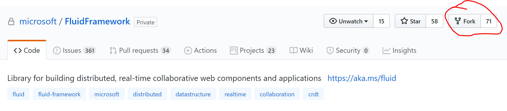
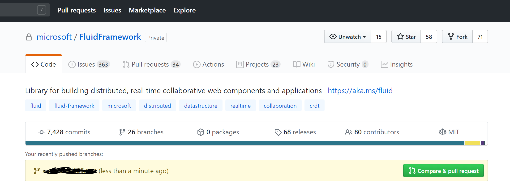
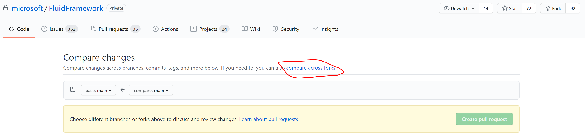
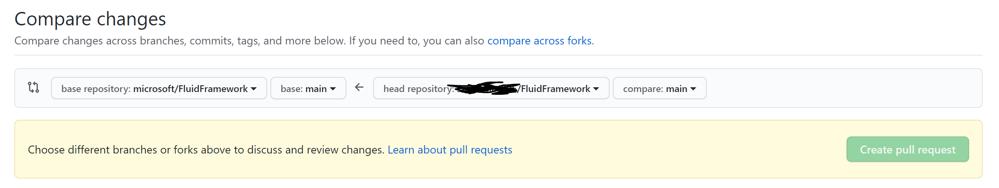

# Repo Basics

We have tried to make it as easy as possible to set up your local clone of the Fluid Framework so that you can hit the ground running.
Let's get started!

## Where is the Repo?

The official Fluid Framework code repository is on [GitHub](https://github.com/microsoft/fluidframework).

If you are not familiar with git or GitHub, please take a look at this [introduction](https://guides.github.com/introduction/git-handbook/) to familiarize yourself with fundamental git concepts such as cloning, branching, forking, etc.

In the next few steps, we will look at how to create a fork of the official repository and set up a local git clone.

## Forking the Repo

We are now going to create a fork of the Fluid Framework repository.
This will be your fork, or copy, of the Fluid Framework and you will have the complete permissions to modify the repository on your fork.
If you're interested in opening PR's for the Fluid Framework, we suggest that you make the changes in your fork.

We will establish upstream hooks later on to allow you to pull updates from the official repo, and submit pull requests to add changes to the official repo.

Please go to the [repo](https://github.com/microsoft/FluidFramework) and click "Fork".
Then choose your personal account.



Awesome!
Now you should be on a page with a URL that looks like "<https://github.com/{YOUR-USER-NAME}/FluidFramework>".
This is your own fork of the most current version of the repo, hot off the press!

Let's get it onto your local machine now!

## Cloning the Repo

Over the following steps, we will clone the repo and add upstream remote connections to the official repo so that you can fetch updates from it in your own main branch.

The remote you fork from is most often referred to as `upstream`, and we will use that name in this example.
But you can name it `microsoft`, `ms`, etc. as you wish.

<br/>

1. With your own fork available now, you can clone it using the command line tool of your choice

```bash
git clone https://github.com/{YOUR-USER-NAME}/FluidFramework.git
```

1. Now, you can add the `upstream` remote to the official version of the repo.

```bash
git remote add upstream https://github.com/microsoft/FluidFramework
```

1. With that added, fetch new updates from the official repo

```bash
git fetch upstream
```

1. Next, set your fork's `main` branch to track the official repo's `main` so that your fork's main branch is up to date with FluidFramework/main when you pull.

```bash
git branch main --set-upstream-to upstream/main
```

You can also optionally set a different branch to track the official repo, if you'd like to keep your personal `main` separate.
But you will need to remember to merge with that branch prior to submitting any changes to the official repo.

1. Pull the contents of `upstream/main` to your local `main`, since it was previously tracking your forked copy of the repo

```bash
git pull
```

1. Optional for those with write access to the main repo - Prevent yourself from ever pushing a branch to `upstream` by setting the `upstream` remote to an invalid URL. All developer branches should instead be merged into the official repo using the Pull Request process.

```bash
git remote set-url --push upstream no_push
```

<br/>

And now, you should have your repo all set up!
We can quickly run

```bash
git remote -v
```

to verify that everything is setup correctly.
It should look something like this.

```bash
upstream       https://github.com/microsoft/FluidFramework (fetch)
upstream       no_push (push)
origin  https://github.com/{YOUR-USER-NAME}/FluidFramework.git (fetch)
origin  https://github.com/{YOUR-USER-NAME}/FluidFramework.git (push)
```

## Editing the Repo

With your local version of the code now setup, let's walk through how to start making changes.

1. Get the latest commits from the official repo using our `upstream` remote

```bash
git checkout main
git pull
```

1. Create and checkout a new local branch to start making changes on

```bash
git checkout -b {YOUR-LOCAL-BRANCH}
```

1. At this point, you can add any changes using the `git add` and `git commit` commands.

When you are ready to push to your fork, use the following

```bash
git push origin head -u
```

This is only needed the first time you push your branch.
Any subsequent pushes only need a `git push`

1. With the branch now available on your remote fork, we can go to the official repo [website](https://github.com/microsoft/FluidFramework) and you should see a prompt requesting you to make a Pull Request



Go ahead and click "Compare and Pull Request".

This will automatically select the official repository's `main` branch as the target for the merge and display your changes.

Alternatively, you can also navigate to [Pull Requests](https://github.com/microsoft/FluidFramework/pulls).
Here, click "New Pull Request" and you will see this.



Here, you will need to click on "compare across forks" to start seeing the branches on your fork.
Select your fork in "Head repository" and your branch in "compare" for the source:



1. Now you can simply click "Create Pull Request" to start the review process. Alternatively, you can also create a "Draft Pull Request" if the branch is still a work-in-progress.

### Legal

You will need to complete a [Contributor License Agreement (CLA)](./CLA.md) to submit changes.
This agreement testifies that you are granting us permission to use the submitted change according to the terms of the project's license, and that the work being submitted is under appropriate copyright.
Upon submitting a pull request, you will automatically be given instructions on how to sign the CLA.
