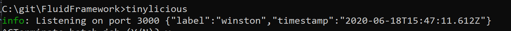
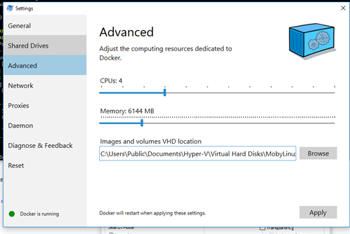

# Server

## Development Servers

There are two implementations of the Fluid Service we use for development, and they are closely related: Routerlicious (aka r11s) is the official reference implementation which can be deployed via Docker, and Tinylicious is a compact incarnation of the same code for running locally, only handling requests from the local machine.

## Requirements

The only pre-requisite for building and running Tinylicious is:

- [Node.js](https://nodejs.org/en/download/) (version 18 or higher is required)
    - We recommend using nvm (for [Windows](https://github.com/coreybutler/nvm-windows) or
      [MacOS/Linux](https://github.com/nvm-sh/nvm)) to install Node.js, in case you find yourself needing to install different
      versions of Node.js side-by-side.

In order to install, build and run Routerlicious locally, you additionally need:

- Python etc, following [these instructions](https://github.com/nodejs/node-gyp#installation)
- [Docker Desktop](https://www.docker.com/get-started)

Tinylicious should work "out of the box" with only Node.

## Using a Local Tinylicious Server

## Installing & Running a Local Tinylicious Server

1. Navigate to the `./server/tinylicious` directory and install the package globally.

```bash
npm i -g
```

1. If the build succeeds, start the `tinylicious` server

```bash
tinylicious
```

You should see the following output that says that the server is running on port 3000 

1. Now, we can run Fluid objects against this server. We will use `Clicker` as an example. Navigate to the `Clicker` directory and start the Fluid object using the `start:tinylicious` command

```bash
cd .\examples\data-objects\clicker
npm run start:tinylicious
```

This command is running the following script for reference

```bash
webpack-dev-server --config webpack.config.js --package package.json --env.mode tinylicious
```

1. Now navigate to <http://localhost:8080> to see `Clicker` running on `tinylicious`

NOTE: `tinylicious` stores persisted data on your filesystem at `/var/lib/tinylicious`.
On Windows, this will be `C:/var/lib/tinylicious`.
If you want to clear everything and start fresh, then shut down `tinylicious` and delete that folder.
The next time you start `tinylicious` everything should be as new.

## Building & Running a Local Tinylicious Server

1. Navigate to the `./server/tinylicious` directory and build it.

```bash
npm i
npm run build
```

1. If the build succeeds, start the `tinylicious` server

```bash
npm start
```

1. Now, we can run Fluid objects against this server. We will use `Clicker` as an example. Navigate to the `Clicker` directory and start the Fluid object using the `start:tinylicious` command

```bash
cd .\examples\data-objects\clicker
npm run start:tinylicious
```

This command is running the following script for reference

```bash
webpack-dev-server --config webpack.config.js --package package.json --env.mode tinylicious
```

1. Now navigate to <http://localhost:8080> to see `Clicker` running on `tinylicious`

NOTE: `tinylicious` stores persisted data on your filesystem at `/var/lib/tinylicious`.
On Windows, this will be `C:/var/lib/tinylicious`.
If you want to clear everything and start fresh, then shut down `tinylicious` and delete that folder.
The next time you start `tinylicious` everything should be as new.

## Running a Routerlicious Server

This includes the server backend (the Fluid ordering service, etc.).
This will download and build the image that is deployed, and run it locally.

1. Go to Docker settings and allocate at least 4 cores and 4GB Memory.



1. Navigate to the repo root. And run `npm run start:docker` (No need to build)

2. If this succeeds, you can open your browser (preferably Chrome or new Microsoft Edge for ease of debugging) and navigate to <http://localhost:3000> and test a Fluid object against it

## Using a Local Routerlicious Server For Testing

1. Start the docker `routerlicious` server (see instructions above)

2. Navigate to the Fluid object directory (i.e. `Clicker`) from the root and run the following

```bash
cd .\examples\data-objects\clicker
npm run start:docker
```

1. Navigate to <http://localhost:8080> and the Fluid object should be running against the local Docker `routerlicious` server

## Using a Deployed Routerlicious Server For Testing

1. Navigate to the Fluid object directory (i.e. `Clicker`) from the root and run the following

```bash
cd .\examples\data-objects\clicker
npm run start:r11s
```

1. Navigate to <http://localhost:8080> and the Fluid object should be running against the deployed `routerlicious` server
