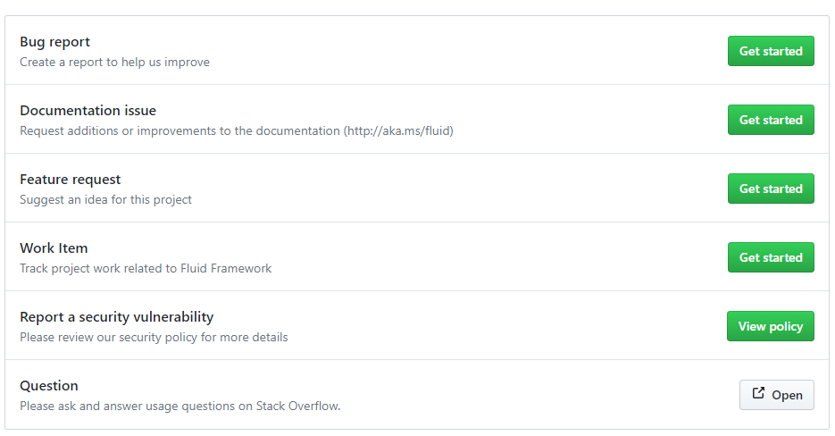
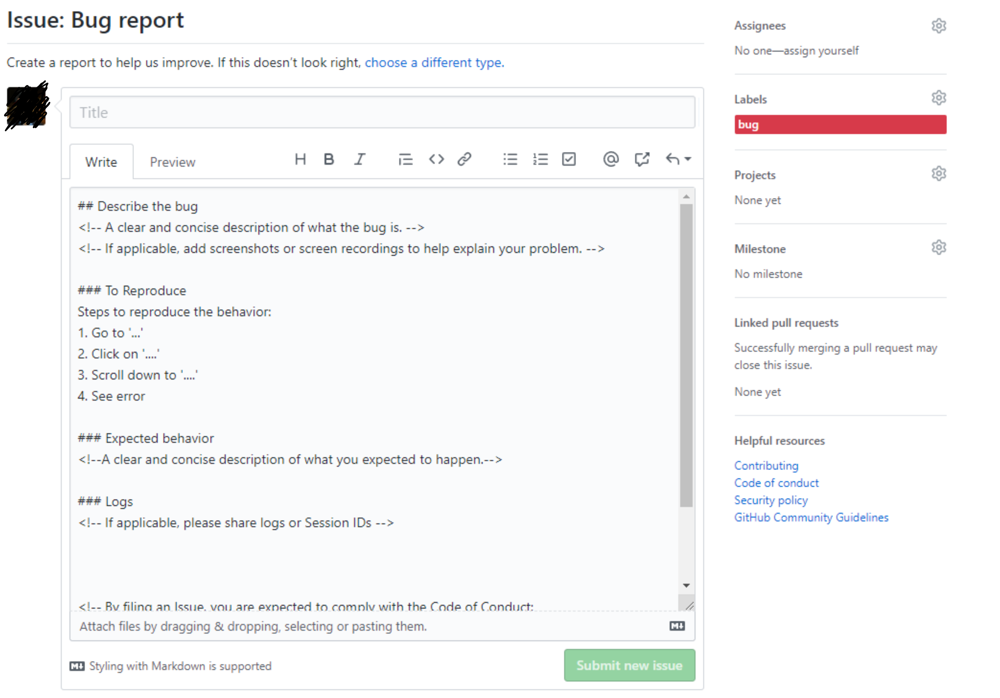

The Fluid Framework project tracks issues and feature requests using the [Github issue tracker](https://github.com/microsoft/FluidFramework/issues) for the `Fluid Framework` repository.

## Before Submitting an Issue

First, please do a search in [open issues](https://github.com/microsoft/FluidFramework/issues) to see if the issue or feature request has already been filed. Use this [query](https://github.com/Microsoft/fluidframework/issues?q=is%3Aissue+is%3Aopen+sort%3Areactions-%2B1-desc) to search for the most popular feature requests.

If you find your issue already exists, make relevant comments and add your reaction. Use a reaction in place of a "+1" comment.

👍 - upvote

👎 - downvote

If your issue is a question then please ask the question on Stack Overflow with the `FluidFramework` tag.

If you cannot find an existing issue that describes your bug or feature, submit an issue using the guidelines below.

## Writing Good Bug Reports and Feature Requests

Code is not the only way to contribute to the repo! We would love to hear your ideas and feedback as well. Logging detailed issues is a great way to introduce ideas to the Fluid Framework community. Issues can be a great place for discussion among the community; there may be other Fluid Framework users looking for a similar solution.

Issues are also a place to log bugs, both for code and for the documentation itself. The Fluid Framework is young and we expect that developers will find rough edges or outright bugs. Logging detailed repro steps with screenshots and descriptions ensure that it is easy for developers to recreate the issue and address it. The Fluid Framework team will be monitoring the GitHub issues list to address issues as they come up.

File a single issue per problem and feature request.

- Do not enumerate multiple bugs or feature requests in the same issue.
- Do not add your issue as a comment to an existing issue unless it's for the identical input. Many issues look similar, but have different causes.
  The more information you provide, the more likely someone will successfully reproduce the issue and find a fix.

If applicable, please include the following with each issue:

- Reproducible steps (1... 2... 3...) and what you expected versus what you actually saw.
- Images, animations, or a link to a video. Note that images and animations illustrate repro-steps but do not replace them.
- A code snippet that demonstrates the issue or a link to a code repository we can easily pull down onto our machine to recreate the issue.

> **Note:** Because we need to copy and paste the code snippet, including a code snippet as a media file (i.e. .gif) is not sufficient.

- Errors in the Dev Tools Console (Help | Toggle Developer Tools)
- Version of Fluid Framework

## How to Log Issues

Before logging an issue of any type, please search the GitHub issues list to see if it already exists or not. If the issue exists, please add new information in the form of a comment to the existing issue instead of creating a new issue.

To create a new issue,

1. Open the [New Issue](https://github.com/microsoft/FluidFramework/issues/new/choose) page and pick the type of issue you are going to be creating.

- **Bug report** - For reporting a defect in the Fluid Framework codebase. Use this to report an issue that is causing the code to
    - throw an unhandled error
    - not work as described
    - have a regression from the prior version, without any deprecation notice
- **Documentation issue** - For reporting mistakes in the wiki or the Fluid Framework official [documentation](https://www.fluidframework.com/). These can be typos, broken links, missing images, or unclear/missing instructions.
- **Feature request** - For introducing a novel concept to Fluid Framework. This should include a possible plan for implementation.
- **Work item** - For logging general work items to track work in Fluid Framework
- **Report a security vulnerability** - For reporting any security leaks. These should not be logged on GitHub and will redirect you to our [security policy](https://github.com/microsoft/FluidFramework/security/policy)
- **Question** - To ask and answer questions on [StackOverflow](https://stackoverflow.com/questions/tagged/fluidframework) related to FluidFrameworks

1. Once you select a format, you will see a new issue draft that is pre-filled using a template for the type of issue that you picked. For example, on creating a bug report, we see

- **Description** - Use this space to add detail to your issue. Each issue type has a template pre-populated to help you fill in the necessary information.

- **Assignees** - This is who will address this issue. Prior to writing any code, we advise developers to file an issue that their Pull Request will eventually reference (linked issue). This allows the community to know that this issue is actively being worked on and who is working on it. If you are reporting an issue, feel free to leave this blank. The development team will add an assignee when the issue is actively being worked on.

- **Labels** - These allow issues affecting a specific area or of a certain type to be easily grouped together. Please refrain from creating new labels and use the existing ones to allow issues to be effectively managed.

- **Projects** - If this issue is part of a longer term project involving multiple issues, please link to the [project](https://github.com/microsoft/FluidFramework/projects) here.

- **Milestones** - Add any timelines this issue should be closed by. Can usually just be left unmarked and will be set by the development team.

- **Linked pull requests** - Any code submissions that affect or close this issue should be referenced here.

1. Click on submit new issue once all needed fields have been filled out to post it and add it to the [Issues](https://github.com/microsoft/FluidFramework/issues) list to be picked up by a developer.

## Using Labels

All new issues will automatically be assigned the label of "triage". This means that the issue has not yet been reviewed, and is still waiting to be validated and assigned to a developer or milestone.

### Status Labels

Issues are often blocked from moving forward because they need some action performed upon them. These needs are signified by the following labels

1. `needs: more information` - These issues are not actionable without addition information from the issue author. If author does not respond in 5 days, these issues will be closed

### Resolution Labels

In the case that the issue is determined to be not valid or unactionable, one of 5 labels will be assigned to it:

1. `resolution: by design` - The change being suggested is contrary to the design decisions already made by the framework
2. `resolution: duplicate` - The change/bug reported is a duplicate of an already open issue
3. `resolution: not an issue` - This issue is not an issue but rather a question, comment, or complaint or is otherwise unactionable
4. `resolution: won't fix` - This issue is not something we plan to address or is outside the scope of this repo
5. `resolution: can't repro` - We are not able to reproduce this issue

After one of these labels is added, the issue will automatically close after 3 days (1 day for `not an issue`). If you feel that this resolution is incorrect (such as the issue is not actually a duplicate), simply comment on the issue to reset the timer and alert the issue owner.

## Contributing Fixes

If you are interested in fixing issues and contributing directly to the code base, please see the document [Contributing to Fluid Framework](../Contributing.md).
