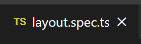
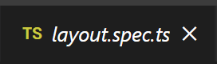
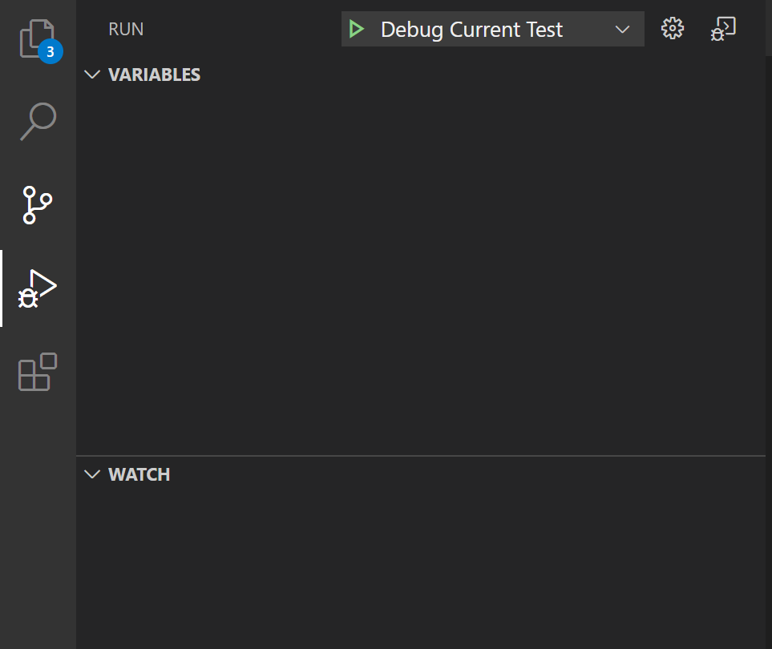
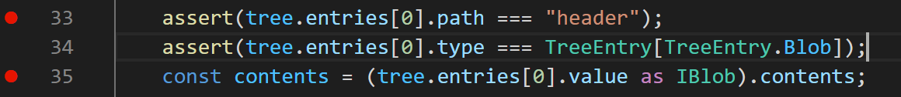

This page is intended to introduce you to the testing framework that the FluidFrameworks codebase uses.
These tests run as part of the CI processes, and all tests need to pass with a 100%, non-flaky success rate for the PR to be eligible to merge.

Anytime code is updated, any affected tests should be updated, and any new code should include with it tests for the new logic.

We use two main frameworks for testing our code:

- [Mocha](https://jestjs.io/) - Used for all unit tests and end-to-end code. These tests primarily use assertions and mocks to functionally test logical code.
- [Jest](https://jestjs.io/) - Used for snapshot testing. These tests will generate mock renders of different visual pages and store snapshots of them. Any future updates will be compared against these snapshots to ensure no visual changes. If visual changes are intended, the snapshots should also be re-generated and sent in with the code.

The following steps assume that you have already set up your build system and installed the requirements using the [Client](./Client.md) and [Server](./Server.md) setup steps.

## Getting Test Data

Some of the collateral test data is located in the [FluidFrameworkTestData](https://github.com/microsoft/FluidFrameworkTestData) sub-module.

You'll need to fetch that collateral data into your local machine to successfully run all the tests.
To do so, run the following from the repo root:

```bash
git submodule init
git submodule update
```

## Running Tests

### Running All Tests

To run all the available tests that will be used in the CI build, run the following from the project root

```bash
npm run test
```

> **Note:** This will take some time to finish as it is running all of the tests for each package in the repo.

### Running All Tests with Coverage

To see code coverage data on all tests, run the following

```bash
npm run test:coverage
```

### Running Tests for a Specific Package

To run only the tests for one package, simply navigate to that package's directory and run the test command there.
For example, to run `Clicker`'s tests

```bash
cd examples\data-objects\clicker
npm run test
```

### Running Singular Mocha Unit Tests using VS Code

Alternatively, you can also use the VS code UI to run Mocha tests.
These steps will not work for snapshot testing.

1. Make sure you have installed all of your packages and fully built the codebase using the [Client](./Client.md) setup steps

2. Navigate to the test file that you want to run on VS Code. Make sure that you double click the file tab after it is open to guarantee that it is pinned.

It should look like this:



Not like this:



1. Now, navigate to the Test tool on the left pane:
   

2. From the drop-down menu at the top, select `Debug Current Test` and click on the Play button

3. This will start running the test and you should be able to see the results in the `Debug Console` on the built-in `Terminal`.

4. (Optional but recommended) You can also set breakpoints in-line in your code, both within the test file and any code it uses. Simply click on the area to the left of the line beginning and you will see the breakpoint show up as a red dot. On running the test, the code should now pause processing anytime it reaches these breakpoints.
   

## In this section

- [Bundle Size Test](./Testing/Bundle-Size-Test.md)
