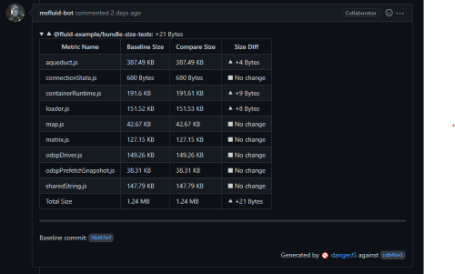

For client packages, the PR validation pipeline will run bundle size analysis to make sure the change doesn't grow developer's webpack bundle size inadvertently. If there are any changes to the bundle size for the measured scenarios, it will post a message to the PR with the comparison.

Some increase in bundle size can be reasonable depending on the change. It's up to the PR authors and reviewers to assess and agree on whether the increase is acceptable.

## Run the bundle analysis locally

After [building the client packages](../Client.md#building-client-code) locally, run `npm run bundle-analysis:collect` at the root of the repo. The bundle size result can be found in `artifacts/bundleAnalysis/@fluid-example/bundle-size-tests` at the repo root.

- `report.html` can be opened in a browser to examine module composition to see what has grown in size.
- `report.json` are the bundle stats, and used to compare the before and after to detect improvement or regressions.

You can either generate your own baseline numbers, or you can look for the bundle analysis artifacts for the baseline commit in the [Build - Client bundle size artifacts](https://dev.azure.com/fluidframework/public/_build?definitionId=48) pipeline.

## Advance Details

See [README.md for bundle-size-tools](https://github.com/microsoft/FluidFramework/tree/main/tools/bundle-size-tools) for more detail of how the bundle stats are generated.
