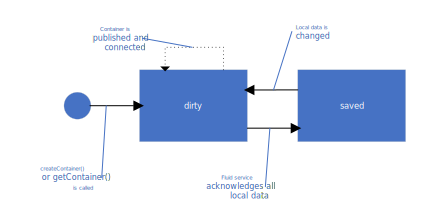
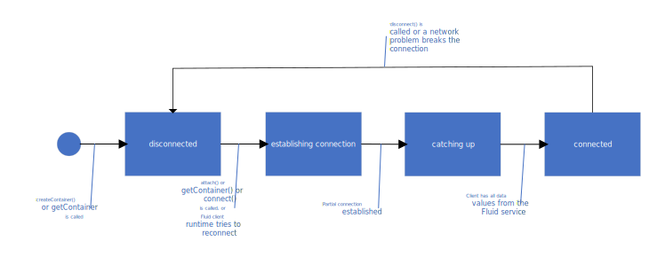
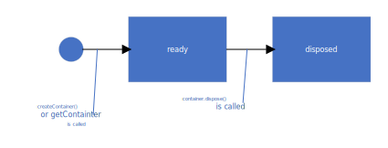

This article provides a detailed description of the lifecycle states of the containers and container events. It assumes that you are familiar with [Containers](./containers.md).



In this article the term "creating client" refers to the client on which a container is created. 
When it is important to emphasize that a client is *not* the creating client, it is called a "subsequent client". 
It is helpful to remember that "client" does not refer to a device or anything that persists between sessions with your application. 
When a user closes your application, the client no longer exists: a new session is a new client. 
So, when the creating client is closed, there is no longer any creating client. 
The device is a subsequent client in all future sessions.



There are four types of states that a container can be in. Every container is in exactly one state of each of these types. Details and diagrams are below.

- **Publication status**: 

    - unpublished
    - publishing (to the Fluid service)
    - published
    - deleted (from the service)

- **Synchronization status**: 

    - dirty (on a given client)
    - saved

- **Connection status**: 

    - disconnected (from the Fluid service)
    - establishing connection (to the service)
    - catching up (with data from other clients)
    - connected

- **Local readiness status**: 

    - ready
    - disposed (on the client)

### Publication status states

Publication status refers to whether or not the container has been *initially* saved to the Fluid service, and whether it is still persisted there. 
Think of it as a mainly *service-relative* state because it is primarily about the container's state in the Fluid service and secondarily about its state on the creating client. The following diagram shows the possible publication states and the events that cause a state transition. Details are below the diagram.

<!-- TO MODIFY THIS DIAGRAM, SEE INSTRUCTIONS AT THE BOTTOM OF THIS FILE. -->


#### Unpublished

When a [container is created](./containers.md#creating-a-container), it is in **unpublished** state and exists only on the creating client. 

Users, or your code, can start editing the data in the container right away, but the data is not shareable with other clients until the [container is published](./containers.md#publishing-a-container).
Use the unpublished state to create initial data to populate your shared objects if needed.
This is often useful in scenarios where you want to make sure that all connected clients have a coherent initial state.
For example, if collaboration involves tables, your code can set a minimum table size.

#### Publishing

A container transitions to **publishing** state when `container.attach` method is called on the creating client. For details, see [Publishing a container](./containers.md#publishing-a-container). It is normally in this state only very briefly and then automatically transitions to **published** state when publication is complete.



In the Fluid APIs, the terms "attach", "attaching", "attached" and "detached" mean publish, publishing, published, and unpublished, respectively.



#### Published to the service

When publishing completes, the container is **published**, so it exists in the Fluid service as well as the creating client. 
Subsequent clients can [connect to the container](./containers.md#connecting-to-a-container), synchronize with its latest data values, and edit them.

A container can never transition back to an unpublished state, but it can transition to a deleted state. 

#### Deleted from the service

A container transitions to **deleted** state when it is deleted. 
Any connected clients become disconnected (although they may have been already disconnected before the deletion; see [Deleting a container from the service](#deleting-a-container-from-the-service)), but the container is not disposed on the clients. 
Clients could continue to edit the container's data, but the data isn't shared anymore. Each client's changes are known only to it. 

##### Deleting a container from the service

Deleting a container is a service-specific feature, so you should refer to the documentation associated with the specific Fluid service you are using for instructions on how to do it. 
To prevent clients from being suddenly cut off from data sharing, the service may put restrictions on when a container can be deleted. 
For example, it may allow deletion only if all clients have been disconnected from the container for a specified period of time. 

Once it is deleted, the container cannot move back to the **published** state again.
It is possible for a client to create a new container using the same schema as a deleted container. 
If a record of the final data values of the deleted container are available to the creating client, they can be used to initialize the new container. 
But the new container has a different ID from the deleted one and subsequent clients will have to connect to it using the new ID.

#### Handling publication status

Your code can test for the publication status with the [container.AttachState]() property which has an [AttachState]() value. 
This can be useful if your application will publish the container in some code paths on the creating client, but not others. 
For example, on the creating computer, you don't want to call `container.attach` if it has already been called. In simple cases, you can know at coding time if that has happened, but when the creating client in complex code flows and calls of `container.attach` appear in more than one branch, you may need to test for this possibility. The following is a simple example.

```typescript
// Code that runs only on a creating client.
if (container.attachState !== AttachState.Attached) {
    await container.attach();
}
```

How you handle the **publishing** (`AttachState.Attaching`) state depends on the situation. This state implies that `container.attach` has already been called, so to prevent a recall treat publishing (`Attaching`) the same as published (`Attached`). The following is an example.

```typescript
// Code that runs only on a creating client.
if ((container.attachState !== AttachState.Attached) 
    || 
    (container.attachState !== AttachState.Attaching)) {
    await container.attach();
}
```

On the other hand, in scenarios where you want to block users from editing shared data when the container is unpublished, you also want to block them when the container is in **publishing** (`AttachState.Attaching`) state, since at that point the container is not fully published. So in those scenario, treat publishing (`Attaching`) the same as unpublished (`Detached`). The following is an example.

```typescript
// Code that runs only on a creating client.
if ((container.attachState === AttachState.Detached) 
    || 
    (container.attachState === AttachState.Attaching)) {
    // Disable editing.
}
```

### Synchronization status states

Synchronization status refers to whether the container's data on the client is saved to the Fluid service. It is a *client-relative state*: the container may have a different synchronization state on different clients. The following diagram shows the possible Synchronization states and the events that cause a state transition. Details are below the diagram.

<!-- TO MODIFY THIS DIAGRAM, SEE INSTRUCTIONS AT THE BOTTOM OF THIS FILE. -->




The dotted arrow represents a boolean guard condition. It means that the container cannot transition out of the **dirty** state unless the container is published and connected.



- **dirty**: A container is in **dirty** state on a client in two situations:

    - It is unpublished. 
    - Changes have been made to the data on the client but not yet sent to the Fluid service, or sent but not yet acknowledged by the service.

- **saved**: A container is in **saved** state on a client when the container has been published and the service has acknowledged all data changes made on the client. 

When a new change is made to the data in a given client, the container moves to **dirty** state *in that client*. When all pending changes are acknowledged, it transitions to the **saved** state. 

Note that a container in the **saved** state is not necessarily perfectly synchronized with the service. 
There may be changes made on other clients that have been saved to the service but have not yet been relayed to this client. 
Situations like this would normally last only fractions of a second. 
But if the client is disconnected while in **saved** state, it remains **saved**, but unsynchronized, until it reconnects. See [Connection status states](#connection-status-states) for more about connection.

Users can work with the container's data regardless of whether it is in **dirty** or **saved** state. 
But there are scenarios in which your code must be aware of the container's state. For this reason, the `FluidContainer` object has a boolean `isDirty` property to specify its state. 
The `container` object also supports *dirty* and *saved* events, so you can handle the transitions between states.
The container emits the *saved* event to notify the caller that all the local changes have been acknowledged by the service.

```typescript {linenos=inline}
container.on("saved", () => {
    // All pending edits have been saved.
});
```

The container emits the *dirty* event to notify the caller that there are local changes that have not been acknowledged by the service yet.

```typescript {linenos=inline}
container.on("dirty", () => {
    // The container has pending changes that need to be acknowledged by the service.
});
```

You should always check the `isDirty` flag before [disposing](#disposed) the container or [disconnecting](#disconnected) from the service.
If you dispose or disconnect the container while `isDirty === true`, you may lose operations that have not yet been sent to (or sent, but not acknowledged by) the service.
For example, suppose you have a function to disconnect a container in response to a period of user inactivity. 
The following shows how to ensure that the disconnection doesn't happen until the container is **saved**.

```typescript
function disconnectFromFluidService {
    if (container.isDirty) {
        container.once("saved", () => {
            container.disconnect();
        });
    }
}
```

When a user is highly active, the container on a client may shift between **dirty** and **saved** states rapidly and repeatedly.
You usually do not want a handler to run every time the event is triggered, so take care to have your handler attached only in constrained circumstances. 
In the example above, using `container.once` ensures that the handler is removed after it runs once. When the container reconnects, the *saved* event will not have the handler attached to it.

See [Connection status states](#connection-status-states) for more about connection and disconnection.

See [Disposed](#disposed) for more about disposing the container object. 

### Connection status states

Connection status refers to whether the container is connected to the Fluid service. It is a *client-relative state*: the container may have a different connection state on different clients. The following diagram shows the possible Connection states and the events that cause a state transition. Details are below the diagram.

<!-- TO MODIFY THIS DIAGRAM, SEE INSTRUCTIONS AT THE BOTTOM OF THIS FILE. -->


#### Disconnected

A container is **disconnected** if it is not in any of the other three Connection states. A container is, or becomes, disconnected in any of the following circumstances:

- On the creating client, it has been created but not yet published.
- A network problem breaks the web socket connection between the client and the Fluid service. When this happens, the Fluid runtime on the client automatically tries to reconnect. If it cannot, connection can only be reestablished by calling `container.connect`.
- Your code calls the `container.disconnect` method.



Disconnection does not automatically block users from editing the shared data objects. 
Changes they make are stored locally and will be sent to the Fluid service when connection is reestablished. 
But these changes are *not* being synchronized with other clients while the current client is disconnected, and your application's user may not be aware of that. 
So, you usually want to block editing if a disconnection continues for some time. 
For more information, see [Managing connection and disconnection](#managing-connection-and-disconnection).



#### Establishing connection

In this state, the client is attempting to connect to the Fluid service, but has not yet received an acknowledgement. 
A container moves into the **establishing connection** state in any of the following circumstances:

- On the creating client, your code calls the `container.attach` method. For more information, see [Publishing a container](./containers.md#publishing-a-container). This method publishes the container *and* connects the client to the service.
- Your code calls the client's `getContainer` method on a client that has not previously been connected. For more information, see [Connecting to a container](./containers.md#connecting-to-a-container).
- The Fluid client runtime tries to reconnect following a disconnection caused by a network problem.
- Your code calls the `container.connect` method on a client that had become disconnected. 

This process is normally very brief. When it completes, the container automatically transitions to the **catching up** state while changes made on other clients are relayed to the current client. 

#### Catching up

In this state, a partial connection has been established and the client is receiving changes made in other clients from the Fluid service. 

Changes made locally are not uploaded to the service until catching up is complete, so the container is not considered fully connected.

This state is normally very brief and the Fluid client then automatically moves to the **connected** state. 

#### Connected

A container is **connected** when there is an open, two-way web socket connection between the client and the Fluid service. 
In the **connected** state, changes to the container's data on the client are sent to the service which relays them to all other connected clients. 

The container transitions to this state automatically when it is fully caught up with data from the Fluid service. 

#### Managing connection and disconnection

There are scenarios in which you need to control the connection status of the container. To assist, the `container` object has the following APIs:

- A [container.connectionState]() property of type `ConnectionState`. There are four possible values for the property:

    - `Disconnected` 
    - `EstablishingConnection`: Your code should treat this state the same as it treats the disconnected state. See [Examples](#examples).
    - `CatchingUp`: In most scenarios, your code should treat this state the same as it treats the connected state. See [Examples](#examples). An exception would be when it is important that users see the very latest changes from other clients before they are allowed to make their own edits. In that case, your code should treat **catching up** like it treats the **disconnected** state.
    - `Connected` 
    
- A *disconnected* event, that fires if a network problem causes a disconnection or if the `container.disconnect` method is called.
- A *connected* event, that fires if the Fluid client runtime is able to reconnect (and any needed catching up is complete) or if the `container.connect` method is called.

##### Examples

Your code can disable the editing UI in your application when the container is disconnected, and then reenable it when a connection is restored, as shown in the following example:

```typescript
container.on("disconnected", () => {
    // Prevent user edits to disable data loss.
});

container.on("connected", () => {
    // Enable editing if disabled.
});
```

Your code can reduce unnecessary network traffic by disconnecting when a user is idle. The following example assumes that there is a `user` object that emits *idle* and *active* events. 

```typescript
user.on("idle", () => {
    // Disconnect the container when the user is idle.
    container.disconnect();
});

user.on("active", () => {
    // Connect the container when the user is active again.
    container.connect();
});
```

### Local Readiness state

Local Readiness is a *client-relative state*: the container may have a different Local Readiness state on different clients. The following diagram shows the possible Local Readiness states and the events that cause a state transition. Details are below the diagram.

<!-- TO MODIFY THIS DIAGRAM, SEE INSTRUCTIONS AT THE BOTTOM OF THIS FILE. -->


#### Ready

In this state, changes to the shared data objects can be made locally. They are shared with the Fluid service when, and only when, the container is in **published** and **connected** status. 

A container is automatically in **ready** state as soon as it is created and it remains in this state unless it is disposed. 
A disposed `FluidContainer` remains disposed forever, but a new **ready** `FluidContainer` can be created by passing its ID to a call of `client.getContainer`.

#### Disposed

In scenarios where a container is no longer needed on the current client, you can dispose it with a call of `container.dispose()`. Disposing removes any server connections, so the Connection status becomes **disconnected**.
There is a *disposed* event on the container object that you can handle to add custom clean up logic, such as removing registered events.
The following shows the basic syntax:

```typescript
container.on("disposed", () => {
    // Handle event cleanup to prevent memory leaks.
});
```

It is a good practice to make sure all pending changes are saved prior to calling `dispose`.
The following shows how to ensure that the disposal doesn't happen until the container is **saved**.

```typescript
function disposeWhenSafe {
    if (container.isDirty) {
        container.once("saved", () => {
            container.dispose();
        });
    }
}
```

After it is disposed, some properties of the `container` object can be read, but the data objects in the container can no longer be changed either locally of from data relayed by the Fluid service.
But it would be possible for your code to create a new local container object for the same container by calling `client.getContainer` passing the same container ID. This new object would be in the **ready** state.

<!-- 
     HOW TO MODIFY THE DIAGRAMS IN THIS ARTICLE

     These instructions help you produce diagrams that are the right size at a good resolution.

     1. The source Visio *.vsdx files and the output *.svg files are in the ./image subfolder.
     2. Open the Visio file and change it as needed.
     3. "Save as" the Visio file but select SVG as the file type.
     4. Ensure that the destination folder is the ./images subfolder and complete the "Save As" process.
-->