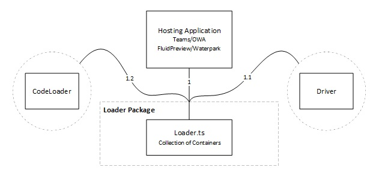
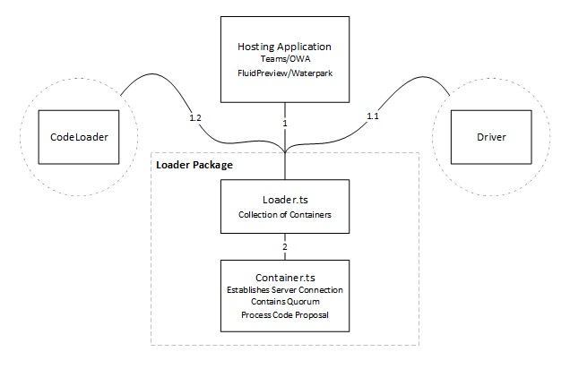
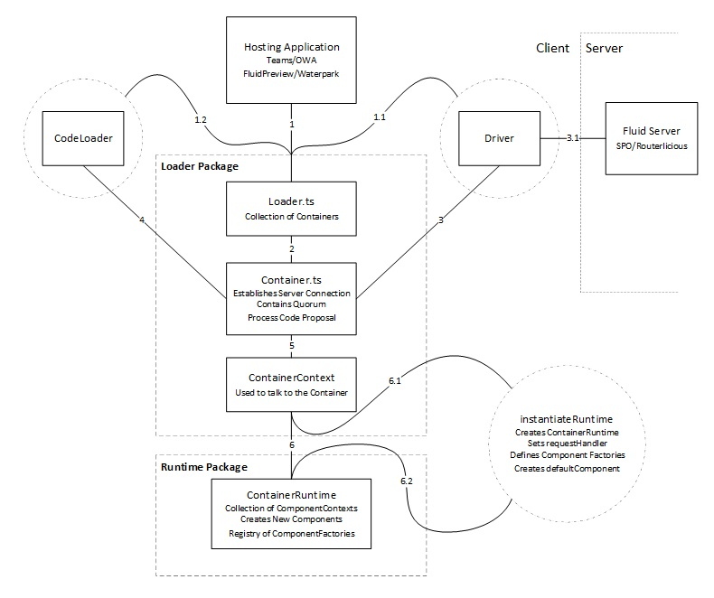
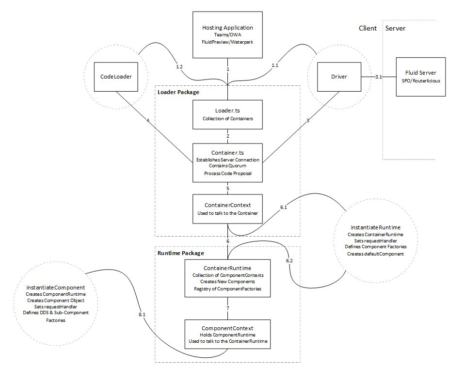
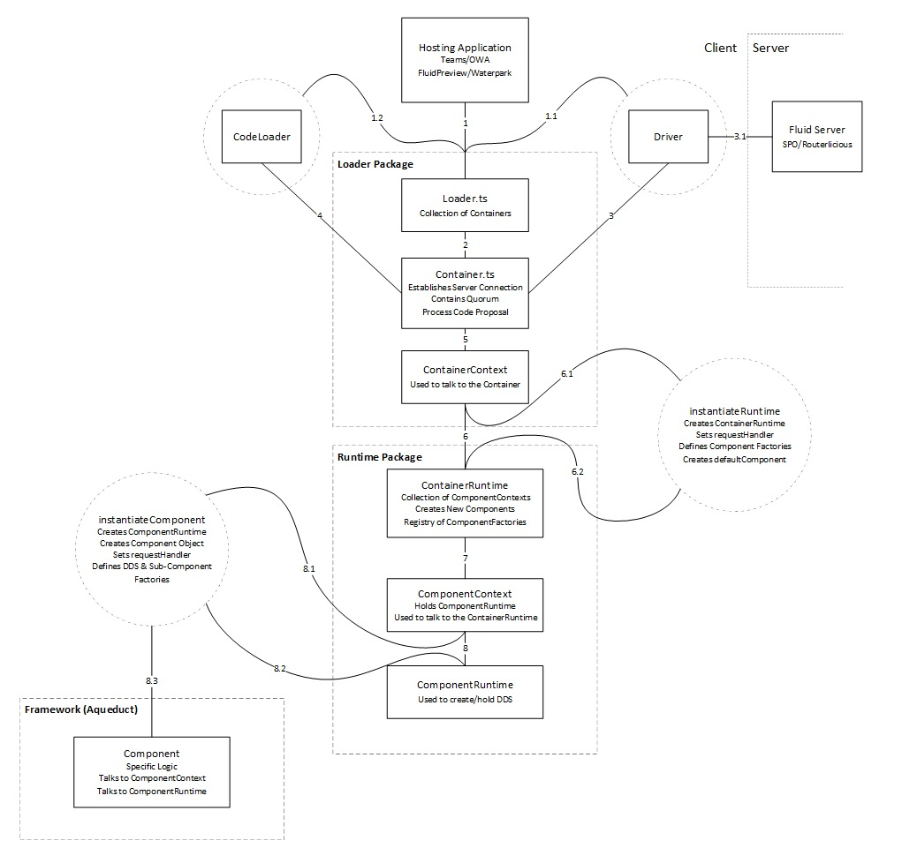
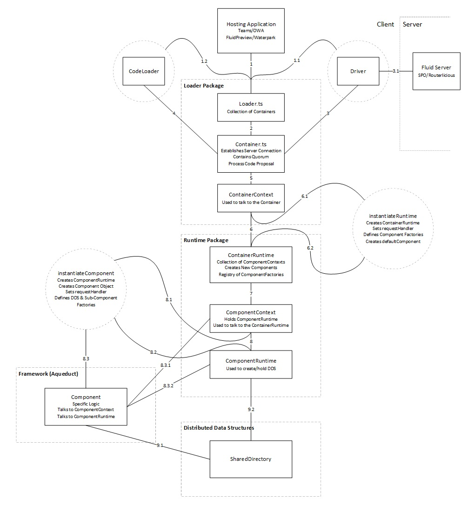

This doc provides an in-depth outline of how Container and DataStore loading works. It also provides an overview of how
Fluid packages are partitioned. While the system is not overly complex, looking at it as a whole can be overwhelming,
and difficult to rationalize. As we go through the doc we will build a clear picture of the entirety of the system.

If you want to look at the entire system in one picture see [Appendix 1](#appendix-1) at the bottom of the doc.

The complete loading flow in Fluid can follow multiple paths, and this can create complexities when attempting to explain
the flow in a single document. For simplicity, this document follows the *Create from Existing* flow with minor notes about
how the *Create New* flow differs.

It should also be noted that this doc contains intentional simplifications. So, while this document attempts to provide
a detailed representation of the loading flow there may be areas where it does not 100% reflect the truth. Hopefully,
these simplifications are negligible and help provide clarity. But if you find any of the simplifications particularly
misleading please point them out.

If you see a bolded number - Ex. **(2)** - it represents a line in the diagram. This number will be in the next diagram
as well as the finished diagram in [Appendix 1](#appendix-1).

Finally, as you read through this doc you will find yourself having lots of questions. This is good, and intentional!
Keep reading as it's likely explained later.

## Pre-requisites

This document assumes knowledge or familiarity with the following concepts:

- What the op stream is
- What a Fluid Container is

## Loading flow

The Hosting Application (or just Host) is usually a webpage that loads a Fluid container.
This has also been referred to as a "Fluid Enlightened Canvas" and the list of potential Hosts currently consists of:

- The Fluid preview app
- Microsoft Teams
- Outlook (desktop and web)
- Whiteboard

And a handful more.

To load any Fluid container, the Hosting Application needs the Fluid Loader Package.
This is a small package whose only responsibility is to load Fluid containers.
The Fluid Loader has no knowledge of the insides of the container it wants to lead, like the `ContainerRuntime`
or `DataStore` specific code.

The `Loader` object has a `resolve(...)` **(1)** method that can load a `Container` when provided the following:

- `url` to Operation Stream (op stream)
- `Driver` **(1.1)** - used for talking to the Fluid Server
- `CodeLoader` **(1.2)** - used for resolving the `ContainerRuntime` code

All these need to be provided by the Host when it wants to use the Loader package, but only the `CodeLoader` will
normally be written by the authors/owners of the Host.
The `Driver` will come from a package written by the Fluid Framework team themselves.
Some examples are the routerlicious driver, the tinylicious driver, the ODSP driver, and the local driver.

In the case of resolving a `Container` that has not been loaded locally, the `Loader` will create a new `Container`
object **(2)**.

The `Container` will use the provided `url` and `Driver` to connect, and start processing, the op stream **(3)**.

::: tip

The Operation Stream (op stream) is how Fluid stores state.
State, including connected clients, the code to load, as well as distributed data structure modifications, are stored
as a series of operations that when played in order produce the current state.
I don't go into further details about it here.

:::

Connecting and processing the op stream includes:

- Getting the latest Summary of the container being loaded
- Establishing the Websocket connection to the op stream
- Retrieving any ops which are more recent than the latest Summary from the REST endpoint

The Fluid Core (`Loader` + (Container) `Runtime`) is agnostic to how the Fluid Server is implemented.
It instead uses a `Driver` model to allow for different servers to optimize for their own infrastructure.

The `Driver` is responsible for taking the requests above **(3)** and transforming them to requests that the Fluid Server
understands **(3.1)**.

The `Container` object itself does not actually do much.
Once it has established a connection via the `Driver`, its other responsibility is to listen specifically for one event
emitted from the `Quorum`.
This is the `"code"` proposal, for the code that contains the `ContainerRuntime`.

::: tip

The `Quorum` is a special key/value distributed data structure that requires all current members to agree on the value
before the it is accepted.
I don't go into further details about it here.

The `ContainerRuntime` is code written by the author of the Container, with all the logic that drives the functionality
of the Container.

:::

There are a few different ways that the `Container` will get this `"code"` value:

1. In the *Create New* flow this `"code"` value needs to be proposed by the Hosting Application.
   Once the value is accepted by everyone connected (in this case only you, the current client) the `Container` will
   get the event and have the value.
1. In the *Create from Existing* flow there are two scenarios.
    1. In the *load from Summary flow* the `"code"` value is written into the Summary itself.
    1. In the *load from op stream* flow (no Summary) the `"code"` value will be played as an op.

In any case, once the `Container` has the `"code"` value it needs someone to resolve the proposed code, i.e. get it
from wherever it lives and provide it to the `Container`.
The Loader Package itself does not know how to do this, so it passes that responsibility to the `CodeLoader` it received
from the Hosting Application.
The `Container` thus ends up asking the `CodeLoader` for the `"code"`.  **(4)**

The `CodeLoader` needs to get the code and return a pointer to it to the `Container`.
In the browser, this pointer is usually an entry point to a webpacked bundle that exists on the `window` object.
The `CodeLoader` can dynamically pull this code from some source (CDN) or in some cases the code already exists on the
webpage.
In Node.js, it's a pointer to a package.

TODO: is the `CodeLoader` the one that downloads the package and just provides a path to it to the `Container`?

At this point the `Container` has a pointer to the `ContainerRuntime` code, which it passes along as it creates a new
`ContainerContext` **(5)** , and through the context executes the `instantiateRuntime()` method provided by the
`ContainerRuntime` **(6.1)**.

The important thing to note here is that up until this point the Hosting Application and Fluid know nothing of the Fluid
`ContainerRuntime` or the `DataStore` code.
That code is provided after the `Container` is established and stored in the op stream.
**This is powerful because it allows the Hosting Applications to load Containers without knowing the underlying code.**
This is how Teams and Outlook can easily load the Fluid preview app `Container` and `DataStore`s.

The implementer of `instantiateRuntime()` is what we refer to as a "Container Developer".
As you can see, the term is slightly overloaded since they are not actually writing the `Container` object, but the
`ContainerRuntime`, along with a factory to create it.
That factory should be an implementation of `IContainerFactory` and thus have the `instantiateRuntime()` function.
The `Container` specifically looks for an exported `fluidExport` property within the code loaded by the `CodeLoader`,
which it expects to implement `IContainerFactory`.

The `instantiateRuntime()` function can do any number of things but has become primarily responsible for **(6.2)**:

1. Creating the `ContainerRuntime` object.
2. Setting the `request` handler on the `ContainerRuntime`.
    - The `request` handlers are used to route requests through the `Container` (more on this later).
    - The primary use is to get DataStores.
3. Providing a `DataStoreRegistry` of DataStore Factories to the `ContainerRuntime`.
    - The `DataStoreRegistry` is basically a map from names(types) of `DataStore`s to the factories that can create them.
      It defines which `DataStore`s can be created in the `Container`
4. Creating the default `DataStore`.

Containers can exist without `DataStore`s but they are not very functional.
The paradigm we've created is for the Container Developer (`instantiateRuntime()` implementer) to create a default
`DataStore`.
The default `DataStore` is simply the first `DataStore` in the `Container`.
It is created the same as every other `DataStore`, with the only difference being that it is created in the
`instantiateRuntime()` call as opposed to being created by another `DataStore` (more on this later).

Having a default `DataStore` allows the Hosting Application to make a `request` against the `Container` asking for the
default `DataStore` without knowing what the default `DataStore` is (also more on this later).

**NOTE**: the `request` handler is still supported but is in the process of being superseded by a different mechanism,
the `entryPoint`.
It will eventually be removed and the `entryPoint` will become the way for the Hosting Application to interact with the
Container.
That's where the `ContainerRuntime` will expose its default `DataStore`, or whatever object it wants to expose to provide
the Hosting Application an API to interact with it.

A `DataStore` is created by calling `createDetachedRootDataStore()` on the `ContainerRuntime` **(6.2)** (TODO: doesn't diagram).
The `ContainerRuntime` uses its `DataStoreRegistry` to find an entry that corresponds to the parameters in the call,
creates a `DataStoreContext` **(7)**, and a `DataStoreRuntime`  **(8.2)**,.

TODO: update diagram with new names (`DataStore` vs `Component`).
I removed **(8.1)** for now but can get the exact call that matches it.

In the `createDetachedRootDataStore()` call **(8.1)** (TODO: doesn't match diagram) the following is performed:

1. `DataStoreContext` object is created.
1. `DataStoreRuntime` object is created **(8.2)**.
1. Sets the `request` handler on the `DataStoreRuntime` **(8.2)**.
    - Requests that are sent to the `DataStoreRuntime` are proxied to the `DataStore` object (more on this later).
1. Provides a registry of Distributed Data Structures (DDS) / Sub-Component factories to the `DataStoreRuntime` **(8.2)**.
    - This can be used to create new DDSs.
    - This can be used to create new `DataStore`s that are not defined in the `ContainerRegistry`.
1. Create the `DataStore` object **(8.3)**.

**NOTE**: the `request` handler is still supported but is in the process of being superseded by a different mechanism,
the `entryPoint`.
It will eventually be removed and the `entryPoint` will become the way for the `ContainerRuntime` to interact with the
`DataStore`.
That's where the `DataStore` will expose the default object it wants to expose to provide the `ContainerRuntime` an API
to interact with it.

You might notice a lot of similarities between the `ContainerRuntime` creation flow and the `DataStoreRuntime`
creation flow.

**NOTE**: from here onward the discrepancies with the current state of affairs are more pronounced, tread with caution.

The `DataStore`, and the `instantiateComponent`, are what a "Component Developer" writes and contain all the business
specific logic.
In most cases the `instantiateComponent` call will provide the `DataStore` with references to the `DataStoreContext`
**(8.3.1)**, and the `DataStoreRuntime` **(8.3.2)** it created.

The `DataStore` should use the `DataStoreContext` to talk upwards to the `ContainerRuntime` **(8.3.1)**, and should use
the `DataStoreRuntime` to manage Fluid state of itself; mainly creating DDSs **(8.3.2)**.

The `DataStore` will use the DDS objects directly **(9.1)** and will persist/`attach` them using the `DataStoreRuntime`
**(9.2)**.
When storing a DDS `handle` on another already attached DDS, the `DataStoreRuntime` will automatically `attach` the new
DDS.

::: tip

`attach` sends an op on the op stream that persists the DDS and notifies all users it is live for editing.
More on this in [Anatomy of a Distributed Data Structure](./dds-anatomy)

:::

At this point you might have noticed that the `DataStoreRuntime` does not actually know anything about the `DataStore`
object itself.
In the `ContainerRuntime` all `DataStoreRuntimes` are treated equally without hierarchy.
But then how do `DataStore`s interact with each other?

`DataStore`s can create and hold references to other `DataStore`s in the `ContainerRuntime`.
The same way `instantiateRuntime()` created the default `DataStore`, the default `DataStore` can use `createComponent()`
on its `DataStoreContext` **(8.3.1)** to create a second `DataStore`.

Calling `createComponent` causes the `ContainerRuntime` to look at its `DataStoreRegistry`, create a second
`DataStoreContext` **(7)**, which will call a new `instantiateComponent()` **(8.1)**, which will create a second
`DataStoreRuntime` **(8.2)**, and second `DataStore` object **(8.3)**.

Great! Now we've loaded our entire `Container` plus our two `DataStore`s.
But we don't actually have anything rendered on the page.
All these objects just exist in memory.

## Requesting and Routing

**NOTE**: the whole `request` pattern described here is being superseded by an `entryPoint` pattern.
Documentation still in flight.

### Loading the Default DataStore

In the most basic case of rendering the default `DataStore` the Hosting Application will make a `request` against the
`Container` object.
This `request` will look something like `container.request({ url: "/" });` where the `"/"` denotes the default data store.

We've talked briefly about setting `request` handlers, and that it is done in the `instantiateRuntime` and
`instantiateComponent` section.
Now we have a request on the `Container` object.
But the `Container` doesn't know how to handle this `request`, so it forwards the `request` to the `ContainerContext` **(5)**.
The `ContainerContext` doesn't know how to handle it either so it forwards the `request` to the `ContainerRuntime` **(6)**.

In our `instantiateRuntime` we set a specific `request` handler on the `ContainerRuntime` that says if someone asks for
`"/"` we will return the default `DataStore` we've created.
So the `ContainerRuntime` finds the `DataStoreContext` related to the default `DataStore` and forwards the `request`
there **(7)**.
The `DataStoreContext` doesn't know how to handle the request so it forwards the request to the `DataStoreRuntime` **(8)**.

Now, in our `instantiateComponent` for the default `DataStore` we set a specific `request` handler that said if anyone
asks for this `DataStoreRuntime`, to forward the request to the `DataStore` object itself.
So the `DataStoreRuntime` forwards the request to the `DataStore` **(8.3.2)**.
Finally, in the `DataStore` we've set a `request` handler that if anyone should send it a `request` it will return itself.

So by requesting `"/"`, the Hosting Application has retrieved the default `DataStore` object.

The Hosting Application can now use Fluid's [feature detection mechanism](./components.md#feature-detection-and-delegation)
to check if the `DataStore` it got back supports a view by checking `dataStore.IComponentHTMLView` and calling
`render(...)` if `IComponentHTMLView` returns an object.

That was a lot to unpack in a lot of text, and don't worry if it feels overwhelming.
The overall principle of the request pattern is that requests are delegated through the system to the place where they
are meant to go.

### Loading a DataStore from a DataStore

This flow works the same as the default `DataStore` above except that the loading `DataStore` has to be explicit about
the id of the loaded `DataStore`.

In the scenario below we have DataStore1 attempting to get DataStore2.

Instead of calling the `Container`, DataStore1 will call its `DataStoreContext`
`context.request({ url: "/dataStore-2-unique-id" });` **(8.3.1)**.
You can see we are not just requesting `"/"` but the direct id of DataStore2 `"/dataStore-2-unique-id`.
The `ContainerRuntime` handler that we set will use the id to look up the `DataStoreContext` of DataStore2 and forward
the request there **(7)**.
The `DataStoreContext` will forward to the `DataStoreRuntime` **(8)** of DataStore2, which will forward to the `DataStore`
object of DataStore2 **(8.3.2)**.
The `DataStore` object will return itself and now DataStore1 has a reference to DataStore2.

## Appendix 1

