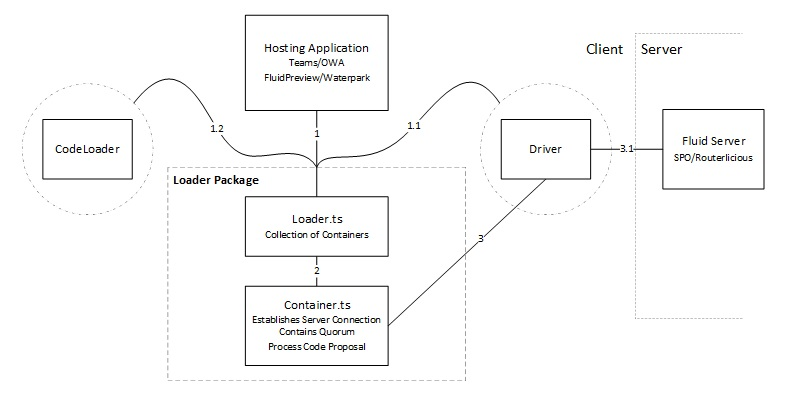
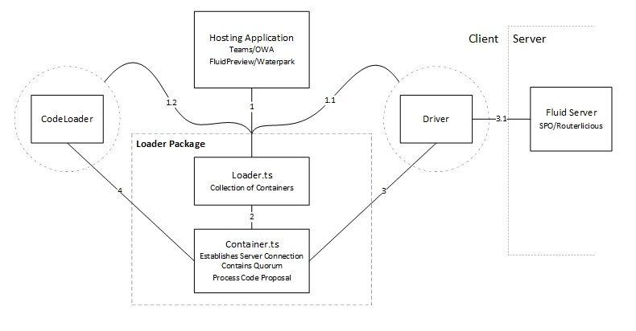
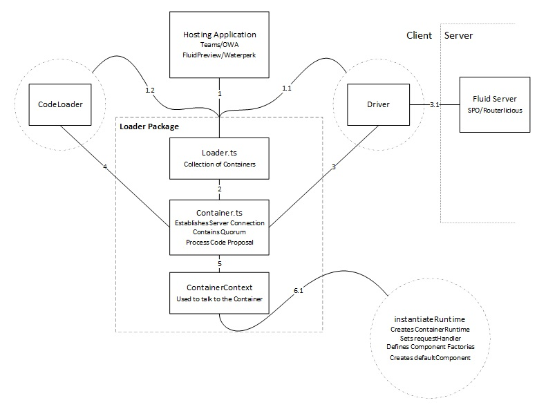
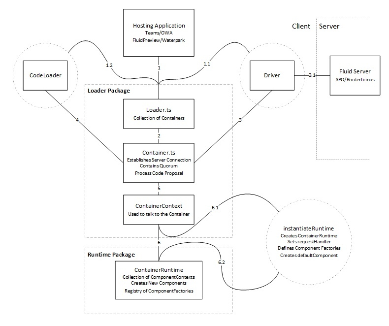
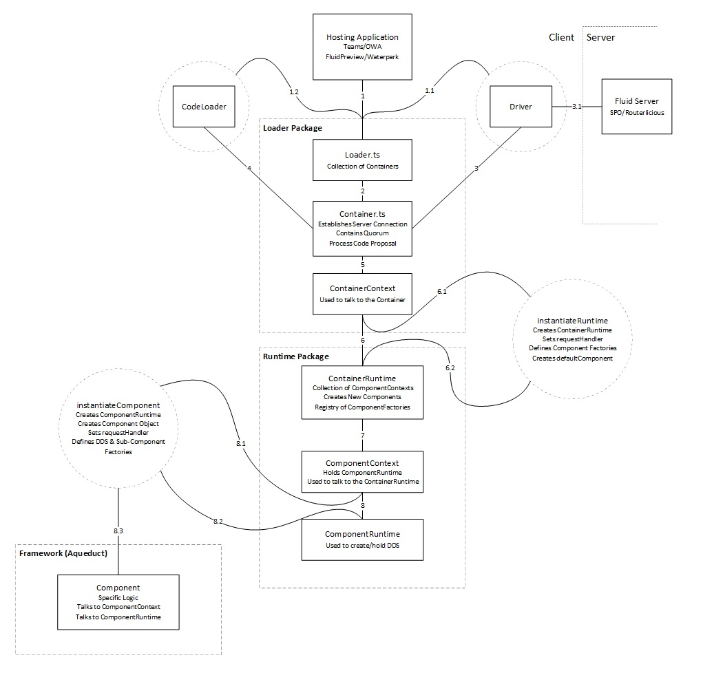
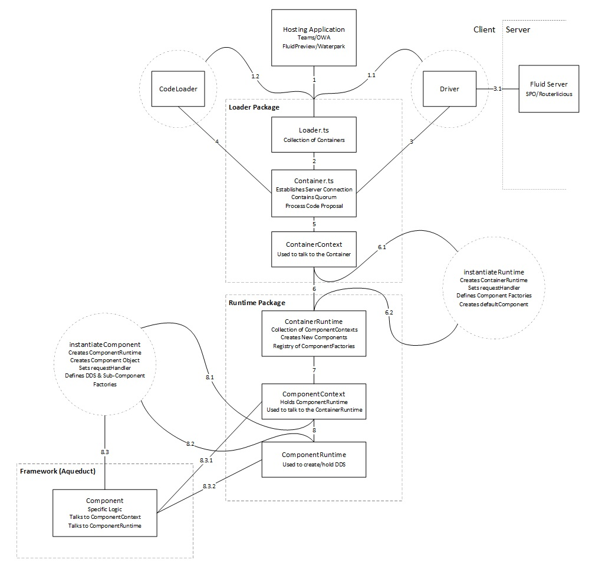
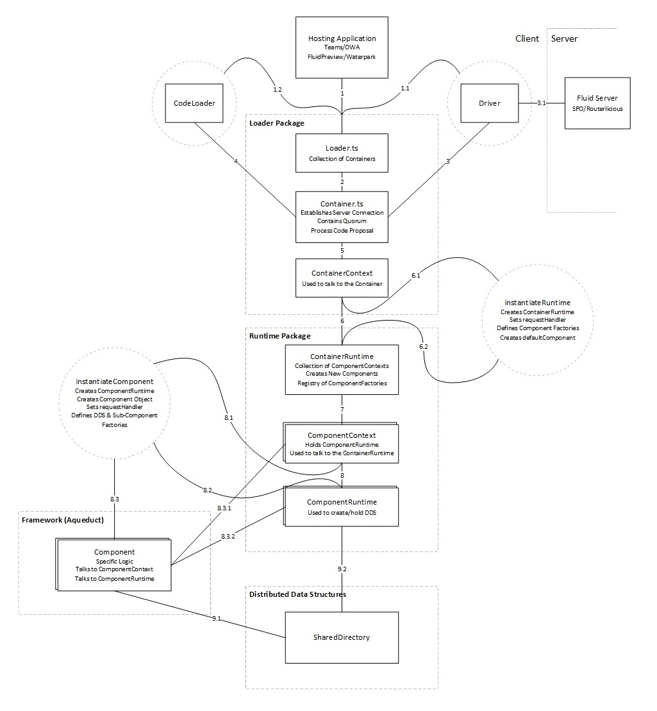

This doc provides an in-depth outline of how Container and Component loading works. It also provides an overview of how
Fluid packages are partitioned. While the system is not overly complex, looking at it as a whole can be overwhelming,
and difficult to rationalize. As we go through the doc we will build a clear picture of the entirety of the system.

If you want to look at the entire system in one picture see [Appendix 1](#appendix-1) at the bottom of the doc.

The complete loading flow in Fluid can follow multiple paths, and this can create complexities when attempting to explain
the flow in a single document. For simplicity, this document follows the *Create from Existing* flow with minor notes about
how the *Create New* flow differs.

It should also be noted that this doc contains intentional simplifications. So, while this document attempts to provide
a detailed representation of the loading flow there may be areas where it does not 100% reflect the truth. Hopefully,
these simplifications are negligible and help provide clarity. But if you find any of the simplifications particularly
misleading please point them out.

If you see a bolded number – Ex. **(2)** – it represents a line in the diagram. This number will be in the next diagram
as well as the finished diagram in [Appendix 1](#appendix-1).

Finally, as you read through this doc you will find yourself having lots of questions. This is good, and intentional!
Keep reading as it's likely explained later.

## Loading flow

The Hosting Application is a webpage that loads a Fluid Container. This has also been referred to as a "Fluid
Enlightened Canvas" and currently consists of: the Fluid preview app, Teams, Outlook, and a handful more. To load any
Fluid Container, the Hosting Application needs the Fluid Loader Package. This is a small package whose only
responsibility is to load Fluid Containers. The Fluid Loader has no knowledge of the `ContainerRuntime` or `Component`
specific code.

The `Loader` object has a method `resolve(...)` **(1)** that can load a `Container` when provided the following:

- `url` to Operation Stream (op stream)
- `Driver` **(1.1)** - used for talking to the Fluid Server
- `CodeLoader` **(1.2)** - used for resolving the `ContainerRuntime` code

In the case of resolving a `Container` that has not been loaded locally, the `Loader` will create a new `Container`
object **(2)**.

The `Container` will use the provided `url` and `Driver` to connect, and start processing, the op stream **(3)**.

::: tip

The Operation Stream (op stream) is how Fluid stores state. State, including connected clients, the code to load, as
well as distributed data structure modifications, are stored as a series of operations that when played in order produce
the current state. I don't go into further details about it here.

:::

Connecting and processing the op stream includes:

- Getting the Summary
- Establishing the Websocket connection
- Retrieving any missing ops from the REST endpoint

The `Driver` is responsible for taking the requests above **(3)** and transforming them to requests that the Fluid Server
understands **(3.1)**.

The Fluid Core (`Loader` + `Runtime`) is agnostic to how the Fluid Server is implemented. It instead uses
a `Driver` model to allow for different servers to optimize for their own infrastructure.

The `Container` object itself does not actually do much. Once it has established a connection via the `Driver` its other
responsibility is to listen specifically for one event emitted from the `Quorum`. This is the `"code"` proposal.

::: tip

The `Quorum` is a special key/value distributed data structure that requires all current members to agree on the value
before the it is accepted. I don't go into further details about it here.

:::

There are a few different ways that the `Container` will get this `"code"` value:

1. In the *Create New* flow this `"code"` value needs to be proposed by the Hosting Application. Once the value is
   accepted by everyone connected (only you, the current client, in this case) the `Container` will get the event and
   have the value.
2. In the *Create from Existing* flow there are two scenarios.
    1. In the _load from Summary flow_ the `"code"` value is written into the Summary itself.
    2. In the _load from op stream_ flow (no Summary) the `"code"` value will be played as an op.

In any case, once the `Container` has the `"code"` value it asks the `CodeLoader` to resolve the proposed code **(4)**. Since
the Loader Package does not know anything about the `ContainerRuntime`, or Components, it needs someone to tell it
where that code lives. This is the responsibility of the `CodeLoader`. The `CodeLoader` can dynamically pull this code
from some source (CDN) or in some cases the code already exists on the page. Either way the `CodeLoader` needs to
include the code on the page and return a pointer to that code to the `Container`. In the Browser, this pointer
is an entry point to a webpacked bundle that is usually on the `window` object. In Node.js, it's a pointer to a package.

At this point the `Container` has a pointer to the `ContainerRuntime` code and it uses that code to create a new
`ContainerContext` **(5)** and executes the `instantiateRuntime` **(6.1)** on the webpack bundle with the `ContainerContext`.

The important thing to note here is that up until this point the Hosting Application and Fluid know nothing of the Fluid
`ContainerRuntime` or the `Component` code. That code is provided after the `Container` is established and stored in the
op stream. **This is powerful because it allows the Hosting Applications to load Containers and Components without
knowing the underlying code.** This is how Teams and Outlook can easily load the Fluid preview app `Container` and
`Components`.

The implementer of `instantiateRuntime` is what we refer to as a "Container Developer". As you can see, the term is slightly
overloaded since they are not actually writing the `Container` object, but simply implementing a function. This function
lives on the `IContainerFactory` interface and the `Container` specifically looks for an exported
`fluidExport` variable within the webpack bundle to find the Container Factory.

The `instantiateRuntime` function can perform any number of functions but has become primarily responsible for **(6.2)**:

1. Creating the `ContainerRuntime` object
2. Setting the `request` handler on the `ContainerRuntime`
    - The `request` handlers are used to route requests through the `Container` (more on this later)
    - The primary use is to get Components
3. Providing a `ComponentRegistry` of Component Factories to the `ContainerRuntime`
    - The `ComponentRegistry` is a `Map<string, () => Promise(IComponentFactory)>`
    - Defines what Components can be created in the `Container`
4. Creating the default `Component`

Containers can exist without Components but they are not very functional. The paradigm we've created is for the
Container Developer (`instantiateRuntime` implementer) to create a default `Component`. The default `Component` is simply
the first `Component` in the `Container`. Having a default `Component` allows the Hosting Application to make a `request`
against the `Container` asking for the default `Component` without knowing what the default `Component` is (more on
this later).

The default `Component` is created the same as every other `Component`. The only difference is that it is the first
`Component` and created in the `instantiateRuntime` call as opposed to being created by another `Component` (also more on
this later).

A `Component` is created by calling `createComponent("packageName")` on the `ContainerRuntime` **(6.2)**. The
`ContainerRuntime` uses its `ComponentRegistry` to look for the entry of `"packageName"`. When it's found it creates a
`ComponentContext` **(7)** and executes the corresponding `instantiateComponent` with the `ComponentContext` **(8.1)**.

You might notice a lot of similarities between the `ContainerRuntime` creation flow and the `ComponentRuntime`
creation flow.

In the `instantiateComponent` call **(8.1)** the following is performed:

1. `ComponentRuntime` object is created **(8.2)**
2. Sets the `request` handler on the `ComponentRuntime` **(8.2)**
    - Requests that are sent to the `ComponentRuntime` are proxied to the `Component` object (more on this later)
3. Provides a registry of Distributed Data Structures (DDS) / Sub-Component factories to the `ComponentRuntime` **(8.2)**
    - This can be used to create new DDSs
    - This can be used to create new Components that are not defined in the `ContainerRegistry`
4. Create the `Component` object **(8.3)**

The `Component`, and the `instantiateComponent`, are what a "Component Developer" writes and contain all the business
specific logic. In most cases the `instantiateComponent` call will provide the `Component` with references to the
`ComponentContext` **(8.3.1)**, and the `ComponentRuntime` **(8.3.2)** it created.

The `Component` should use the `ComponentContext` to talk upwards to the `ContainerRuntime` **(8.3.1)**, and should use
the `ComponentRuntime` to manage Fluid state of itself; mainly creating DDSs **(8.3.2)**.

The `Component` will use the DDS objects directly **(9.1)** and will persist/`attach` them using the
`ComponentRuntime` **(9.2)**. When storing a DDS `handle` on another already attached DDS, the `ComponentRuntime`
will automatically `attach` the new DDS.

::: tip

`attach` sends an op on the op stream that persists the DDS and notifies all users it is live for editing. More on this in
[Anatomy of a Distributed Data Structure](./dds-anatomy)

:::

At this point you might have noticed that the `ComponentRuntime` does not actually know anything about the `Component`
object itself. In the `ContainerRuntime` all `ComponentRuntimes` are treated equally without hierarchy. But then how do Components
interact with each other?

Components can create and hold references to other Components in the `ContainerRuntime`. The same way
`instantiateRuntime` created the default `Component`, the default `Component` can use `createComponent` on its
`ComponentContext` **(8.3.1)** to create a second `Component`.

Calling `createComponent` causes the `ContainerRuntime` to look at the `ComponentRegistry`, create a second
`ComponentContext` **(7)**, which will call a new `instantiateComponent` **(8.1)**, which will create a second
`ComponentRuntime` **(8.2)**, and second `Component` object **(8.3)**.

Great! Now we've loaded our entire `Container` plus our two Components. But we don't actually have anything rendered on
the page. All these objects just exist in memory.

## Requesting and Routing

### Loading the Default Component

In the most basic case of rendering the default `Component` the Hosting Application will make a `request` against the
`Container` object. This `request` will look something like `container.request({ url: "/" });` where the `"/"` denotes the
default component.

We've talked briefly about setting `request` handlers, and that it is done in the `instantiateRuntime` and
`instantiateComponent` section. Now we have a request on the `Container` object. But the `Container` doesn't know how to
handle this `request`, so it forwards the `request` to the `ContainerContext` **(5)**. The `ContainerContext` doesn't
know how to handle it either so it forwards the `request` to the `ContainerRuntime` **(6)**.

In our `instantiateRuntime` we set a specific `request` handler on the `ContainerRuntime` that says if someone asks for
`"/"` we will return the default `Component` we've created. So the `ContainerRuntime` finds the `ComponentContext`
relating the default `Component` and forwards the `request` there **(7)**. The `ComponentContext` doesn't know how to
handle the request so it forwards the request to the `ComponentRuntime` **(8)**.

Now in our `instantiateComponent` for the default `Component` we set a specific `request` handler that said if anyone asks
for this `ComponentRuntime` to forward the request to the `Component` object itself. So the `ComponentRuntime` forwards the
request to the `Component` **(8.3.2)**. Finally, in the `Component` we've set a `request` handler that if anyone should send
it a `request` it will return itself.

So by requesting `"/"`, the Hosting Application has retrieved the default `Component` object.

The Hosting Application can now use Fluid's [feature detection
mechanism](./components.md#feature-detection-and-delegation) to check if the `Component` it got supports a view by checking
`component.IComponentHTMLView` and calling `render(...)` if `IComponentHTMLView` returns an object.

That was a lot to unpack in a lot of text, and don't worry if it feels overwhelming. The overall principal of the
request pattern is that requests are delegated through the system to the place where they are meant to go.

### Loading a Component from a Component

This flow works the same as the default `Component` above except that the loading `Component` has to be explicit about
the id of the loaded `Component`.

In the scenario below we have Component1 attempting to get Component2.

Instead of calling the `Container`, Component1 will call its `ComponentContext`
`context.request({ url: "/component-2-unique-id" });` **(8.3.1)**. You can see we are not just requesting `"/"` but the
direct id of Component2 `"/component-2-unique-id`. The `ContainerRuntime` handler that we set will use the id to look
up the `ComponentContext` of Component2 and forward the request there **(7)**. The
`ComponentContext` will forward to the `ComponentRuntime` **(8)** of Component2, which will forward to the `Component`
object of Component2 **(8.3.2)**. The `Component` object will return itself and now Component1 has a reference to Component2.

## Appendix 1

