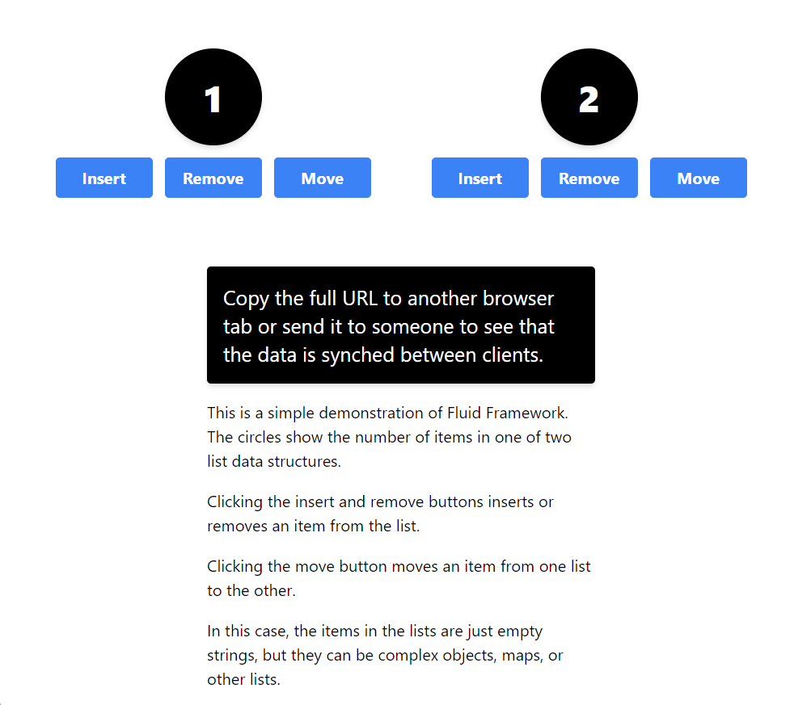

In this walkthrough, you'll learn about using the Fluid Framework by examining the SharedTree demo application at [Simple Fluid demo](https://github.com/microsoft/FluidDemos/simple). To get started, go through the [Quick Start]() guide.



The demo app uses Fluid Framework 2.0, which is in preview. For a walkthrough that uses version 1.0, see [Tutorial: DiceRoller application]()

This tutorial assumes that you are familiar with the [Fluid Framework Overview]() and that you have completed the [Quick Start](). You should also be familiar with the basics of [React](https://react.dev/), [creating React projects](https://react.dev/learn/start-a-new-react-project), and [React Hooks](https://react.dev/learn/state-a-components-memory#meet-your-first-hook).



The Fluid Framework synchronizes the data across clients so everyone sees the same result. This article walks through the code in the demo app to show how it implements the following steps:

1. [Creating a schema for the shared data](#creating-a-schema-for-the-shared-data)
2. [Creating a Fluid container](#creating-a-fluid-container)
3. [Setting up the application](#setting-up-the-application)
4. [Creating the view](#creating-the-view)

## Creating a schema for the shared data

The first step in any Fluid Framework 2.0 application is to create a schema for the app's data. In the SharedTree demo, the schema is created in the [schema.ts](https://github.com/microsoft/simple/blob/main/src/schema.ts) file.

The code begins by creating a `SchemaBuilder` object.

```typescript
const sf = new SchemaFactory('d302b84c-75f6-4ecd-9663-524f467013e3');
```

Then it creates the type for the arrays by extending the type of the object that is returned by `sf.array()`. This code has two purposes:

-   It converts the type returned by `sf.array()` to a real TypeScript type that can be use in contexts other than `SchemaFactory`, such as in the app's React-based view.
-   It enables us create simplified wrappers around the methods of the [array node APIs]()..

```typescript
export class Array extends sf.array('Array', sf.string) {
    // Moves the first item in the source array to the start of this array
    public move(source: Array) {
        if (source.length > 0) this.moveToStart(0, source);
    }

    // Remove the first item in the array if the array is not empty
    public remove() {
        if (this.length > 0) this.removeAt(0);
    }

    // Add an item to the beginning of the array
    public insert() {
        this.insertAtStart('');
    }
}
```

Next it creates the type for the top node of the tree. Note that this type is required to have exactly two arrays of strings and no other properties.

```typescript
export class App extends sf.object('App', {
    left: Array,
    right: Array,
}) {}
```

Next a tree configuration object is created. This object will be used when the app's `SharedTree` object is created. Note that the second parameter of the constructor specifies that on application startup, the tree will have two empty arrays.

```typescript
export const treeConfiguration = new TreeConfiguration(
    App,
    () =>
        new App({
            left: [],
            right: [],
        })
);
```

## Creating a Fluid container

Application setup begins in the [fluid.ts](https://github.com/microsoft/simple/blob/main/src/infra/fluid.ts) file. The first task is to create a Fluid client object that is responsible for creating and loading the containers that will hold the Fluid data objects and for facilitating communication between the client and the Fluid service. Note that the `clientProps` object contains configuration information for running the app in a development environment.

```typescript
import { clientProps } from './clientProps';

const client = new AzureClient(clientProps);
```

The next task is to define the method that will load the container and its data. If this `loadFluidData` method is called on the first client to run the app, it will create the container, but the container will not be published and it will not have an ID. Otherwise, it will return the existing container. (For an understanding of publication status, see [Container states and events]().)

The creation section of the method calls `createContainer` and passes in a schema defining which shared objects will be available on the new `container`. After a new container is created, default data can be set on the shared objects before the container is published to the Fluid service.

```typescript
export const loadFluidData = async (
      containerId: string,
      containerSchema: ContainerSchema
  ): Promise<{
      services: AzureContainerServices;
      container: IFluidContainer;
  }> => {
    let container: IFluidContainer;
    let services: AzureContainerServices;

  if (containerId.length === 0) {
      ({ container, services } = await client.createContainer(containerSchema));
  } else {
      ({ container, services } = await client.getContainer(
          containerId,
          containerSchema
      ));
  }
  return { services, container };
};
```

The last task in fluid.ts is to define the container schema.

```typescript
export const containerSchema: ContainerSchema = {
    initialObjects: {
        appData: ISharedTree,
    },
};
```

## Setting up the application

Application set up is implemented in the `main` method of the [index.tsx](https://github.com/microsoft/simple/blob/main/src/index.tsx) file. Some of the code in that same method is concerned with setting up the React view for the app. In this section, we skip over those parts of the code.

After some React-related code, the first thing the `main` method does is attempt to get the container ID and then initialize the container with `loadFluidData()` method and the `containerSchema` that are described above in [Creating a Fluid container](#creating-a-fluid-container). Note the following about this code:

-   When this code runs in the very first client to run the application, the `containerId` is an empty string. In that scenario, `loadFluidData()` will create and return a `container` that is unpublished and has no ID. It is published later in the `main` method.
-   When the code runs in a subsequent client, the container is already published and it's ID is in the global `location.hash`.

```typescript
import { loadFluidData, containerSchema } from './infra/fluid';
    ...

let containerId = location.hash.substring(1);

const { container } = await loadFluidData(containerId, containerSchema);
```

The next task in `main` is to create a `SharedTree` object named `appData` by applying the schema that is created in schema.ts to the tree. This is done by passing the tree configuration object to the `ITree.schematize()` method. See [Creating a schema for the shared data](#creating-a-schema-for-the-shared-data).

```typescript
import { ITree } from '@fluid-experimental/tree2';
import { treeConfiguration } from './schema';
    ...

const appData = (container.initialObjects.appData as ITree).schematize(
    treeConfiguration
);
```

Next, the `main` method initializes some developer tools.

```typescript
import { initializeDevtools } from '@fluid-experimental/devtools';
import { devtoolsLogger } from './infra/clientProps';
    ...

initializeDevtools({
    logger: devtoolsLogger,
    initialContainers: [
        {
            container,
            containerKey: 'My Container',
        },
    ],
});
```

After some code that renders the view, which is described below in [Creating the view](#creating-the-view), the final task in `main` is to ensure that the container is published. If the code is running on the first client to run the application, then `loadFluidData()` returned an unpublished container that has no ID. The `container.attach()` method publishes it and returns its ID. (See [Publishing]().)

```typescript
if (containerId.length == 0) {
    containerId = await container.attach();

    location.hash = containerId;
}
```

## Creating the view

The basic setup of the React view is also in the `main` method of the index.tsx file. It begins with the following boilerplate React code that creates the root of the view. Detailed discussion of React is out-of-scope for this tutorial.

```typescript
import { createRoot } from 'react-dom/client';
    ...

const app = document.createElement('div');
app.id = 'app';
document.body.appendChild(app);
const root = createRoot(app);
```

Later in the `main` method, the view is rendered. Note the following about this code:

-   `ReactApp` is the top-level React component.
-   The `data` property of the `ReactApp` component is the `SharedTree` object that is created in the index.tsx file. It will be used by methods in the component to add, remove, and move items from the tree.
-   This code is *before* the code that publishes the Fluid container, as described near the end of the section [Setting up the application](#setting-up-the-application), for performance reasons. Users can start manipulating the data in the `SharedTree` as soon as view has rendered, without waiting for the container to be published. When the publishing has finished, changes in the data made in the client are synchronized with the Fluid service.

```typescript
import { ReactApp } from './react_app';
    ...

root.render(<ReactApp data={appData} />);
```

### Creating the components

The `<ReactApp>` component and its descendant components are defined in the react_app.tsx file. Much of this is standard React code that implements the view shown in the following screen shot. This section focuses on the Fluid-related code in the file.



The file starts with the following import statements. Note that:

-   `TreeView` is a helper class that represents the current state of the data in the tree.
-   `App` and `ArrayOfStrings` are the TypeScript data types that are [created in the schema.ts file](#creating-a-schema-for-the-shared-data). They are used to strongly type the React app component and its child arrays.
-   [IFluidContainer]() is the data type for the `<ReactApp>` component's `container` property.
-   `Tree` is a utility class that provides a method for assigning handlers to change events in the `SharedTree`. For more information, see [Tree utility APIs]().

```typescript
import { TreeView, Tree } from '@fluid-experimental/tree2';
import { App, Array } from './schema';
```

This is followed by the declaration of the `<ReactApp>` component and its props and their data types.

```typescript
export function ReactApp(props: { data: TreeView<App> }): JSX.Element { ... }
```

The first task within the `<ReactApp>` component is to ensure that the view changes whenever the shared tree is changed on any client. Whenever the the React view rerenders, the `data` property of the component is repopulated with the latest data in the tree. Since React rerenders the view whenever the React app's state changes, the app needs to force a change in the state whenever the `SharedTree` object changes. This is accomplished with a custom effect. Note the following about this code:

-   `invalidations` is a React state object whose sole purpose is to change whenever the `SharedTree` changes.
-   When the React view first renders, the [Tree.on]() method runs and registers a handler that itself runs whenever the shared tree object `appRoot` is changed on any client.
-   The `Tree.on` method returns a method that removes the handler from the event. This `unsubscribe` method runs when the component unmounts, which happens when the app is closed on the client.
-   The `afterChange` handler calls the `setInvalidations()` method which changes the `invalidations` state object to a random number because all that matters is that it changes, not what it changes to.
-   Since `setInvalidations()` causes a change in React state, the React view automatically rerenders.

```typescript
const [invalidations, setInvalidations] = useState(0);

const app = props.data.root;

useEffect(() => {
    const unsubscribe = Tree.on(app, 'afterChange', () => {
        setInvalidations(invalidations + Math.random());
    });
    return unsubscribe;
}, []);
```

The final task in the `<ReactApp>` is to layout its children. Note the following about this code:

-   Each of the two array nodes in the shared tree is assigned to its own `<ArrayGroup>` component as the `target` property.
-   Each of the array node objects is also assigned to the other `<ArrayGroup>` component as the `destination` property. This is needed because the Fluid API that moves items from one array node to another must be called on the destination node.

```typescript
return (
    <div className="flex flex-col gap-3 items-center justify-center content-center m-6">
        <div className="flex flex-row gap-3 justify-center flex-wrap w-full h-full">
            <ArrayGroup target={app.left} destination={app.right} />
            <ArrayGroup target={app.right} destination={app.left} />
        </div>
        <Explanation />
    </div>
);
```

The other Fluid task for the react_app.tsx file, is to link the buttons in the view to the `Array` types wrappers around the [array node APIs](). (See [Creating a schema for the shared data](#creating-a-schema-for-the-shared-data).) Note the following about this code:

-   The `<InsertButton>` component calls the `insert()` method of the array node on which it is called to insert an empty string to the beginning of the array.
-   The `<RemoveButton>` component calls the `remove()` method of the array node on which it is called to remove the first item in the array.
-   The `target` property of the three components is passed to the component as the `target` property of its parent`<ArrayGroup>` component.
-   The `destination` property of the `<MoveButton>` component is passed to the component as the `destination` property of its parent`<ArrayGroup>` component. The move APIs of array nodes must be called on the destination node.

```typescript
export function InsertButton(props: { target: Array; }): JSX.Element {
    const handleClick = () => {
        // Add an item to the beginning of the array
        props.target.insert();
    };

    return <Button handleClick={handleClick}>Insert</Button>;
}

export function RemoveButton(props: { target: Array; }): JSX.Element {
    const handleClick = () => {
        // Remove the first item in the array if the array is not empty
        props.target.remove();
    };

    return <Button handleClick={handleClick}>Remove</Button>;
}

export function MoveButton(props: { target: Array; destination: Array; }): JSX.Element {
    const handleClick = () => {
        // Moves the first item in the array to the start of the destination array
        props.destination.move(props.target);
    };

    return <Button handleClick={handleClick}>Move</Button>;
}
```

## Run the app

The [full code for this application is available](https://github.com/microsoft/simple) for you to try out. Try opening it in multiple browser windows to see the changes reflected between clients.
