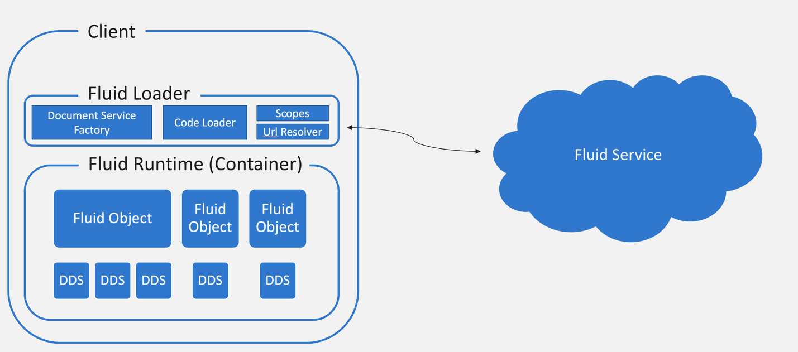
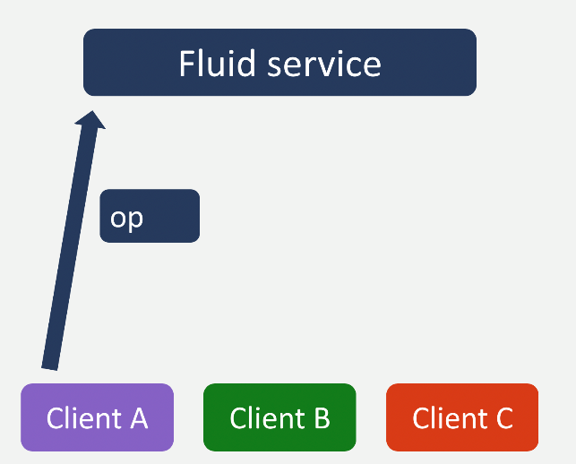
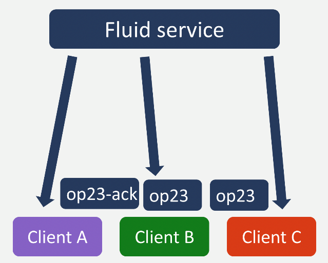
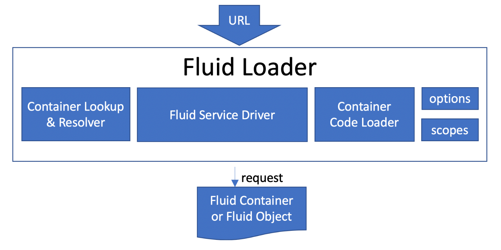
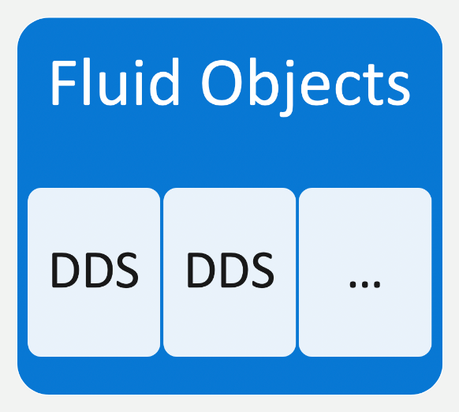

# Architecture

Fluid Framework can be broken into three broad parts: The Fluid Loader, Fluid Containers, and the Fluid Service. While
each deserves a deep dive, we'll use this space to explain the areas at a high level, identify the important lower
level concepts, and discuss some of our key design decisions.

## Summary

The Fluid Loader connects to the Fluid Service to load a Fluid Container. If you are an app developer and you want to
include Fluid Containers on your page, you'll use the Fluid Loader to load Containers. If you want to create a
collaborative experience using the Fluid Framework, you'll create a Fluid Container.

A Fluid Container includes state and app logic. It has at least one Fluid Object, which encapsulates app logic. Fluid
Objects can have state, which is managed by Distributed Data Structures (DDSes).

DDSes are used to distribute state to clients. Instead of centralizing merge logic in the
server, the server passes changes (aka operations or ops) to clients and the clients perform the merge.

## Design decisions

### Keep the server simple

In existing production-quality collaborative algorithms, like Operational Transformations (OT), significant latency is
introduced during server-side processing of merge logic.

We dramatically reduce latency by moving merge logic to the client. The more logic we push to the client, the fewer
milliseconds the request spends in the datacenter.

### Move logic to the client

Because merge logic is performed on the client, other app logic that's connected to the distributed data should also be performed on the client.

All clients must load the same merge logic and app logic so that clients can compute an eventually consistent state.

### Mimic (and embrace) the Web

The Fluid Framework creates a distributed app model by distributing state and logic to the client. Because the web is
already a system for accessing app logic and app state, we mimicked existing web protocols when possible in our model.

## System overview

Most developers will use the Fluid Framework to load Fluid content or create Fluid content. In our own words, developers
are either loading Fluid Containers using the Fluid Loader or developers are creating Fluid Containers to load.

Based on our two design principles of "Keep the Server Simple" and "Move Logic to the Client", most of this document
will focus on the Fluid Loader and the Fluid Container. But first, let's address the Fluid Service.

**Fluid Service**

The Fluid Service is primarily a total order broadcast: it takes in changes (called "operations" or "ops") from each client, gives the op a
monotonically increasing number, and sends the ordered op back to each client. Distributed Data Structures use these ops
to reconstruct state on each client. The Fluid Service doesn't parse any of these ops; in fact, the service knows
nothing about the contents of any Fluid Container.

From the client perspective, this op flow is accessed through a **DeltaConnection** object.

The service also stores old operations, accessible to clients through a **DeltaStorageService** object, and stores summaries of the Fluid
Objects. It's worth discussing summaries at length, but for now we can consider that merging 1,000,000 changes could
take some time, so we summarize the state of the objects and store it on the service for faster loading.

**Fluid Loader**

The Fluid Loader loads Fluid Containers (and their child Fluid Objects) by connecting to the Fluid Service and fetching Fluid Container code. In this
way, the Fluid Loader 'mimics the web.' The Fluid Loader resolves a URL using Container Resolver, connects to the Fluid
Service using the Fluid Service Driver, and loads the container's app code using the Code Loader.

**Container Lookup & Resolver** identifies, by a URL, which service a container is bound to and where in that service it is
located. The Fluid Service Driver consumes this information.

The **Fluid Service Driver** connects to the Fluid service, requests space on the server for new Fluid Containers, and
creates the three objects, **DeltaConnection**, **DeltaStorageService**, and **DocumentStorageService**, that the Fluid
Container uses to communicate with the server and maintain an eventually consistent state.

The **Container Code Loader** fetches Container Code. Because all clients run the same code, clients use the Code Loader
to fetch Container Code. The Loader evaluates this code to create Fluid Containers.

**Fluid Containers**

The bulk of the code in the Fluid Framework repository is for Fluid Containers. We use the term Fluid Container for two
connected concepts: the runtime object, and the constructor for that runtime object (Container Code).

The Fluid Container is the result of the principle "Move Logic to the Client." The Container includes the merge logic
used to replicate data across connected clients, but can also include additional app logic. The merge logic is
incapsulated in our lowest level objects, **Distributed Data Structures (DDS)**. App logic operating over this data is
stored in **Fluid Objects**.

