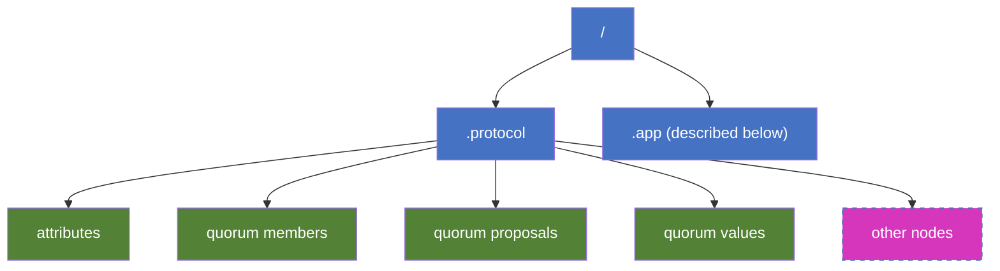
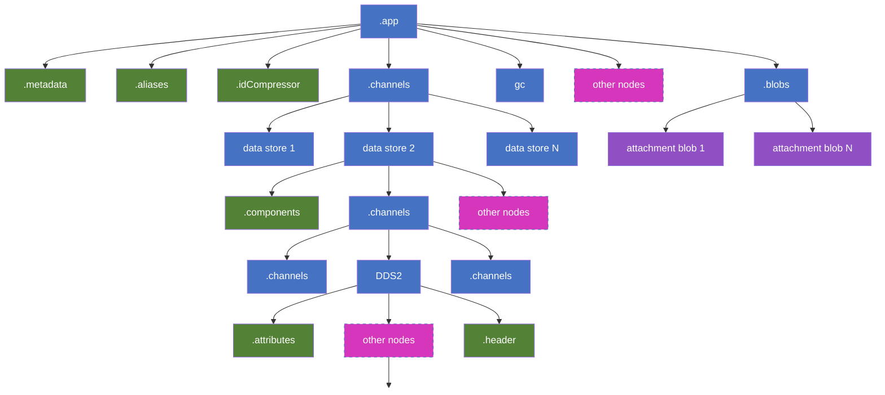
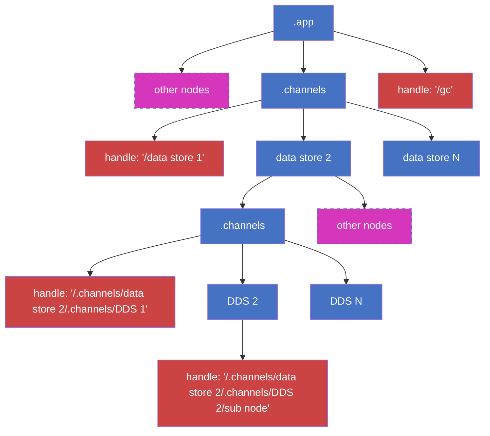

<!-- IMPORTANT: Don't manually edit the auto-generated content below. Instead, edit the source file (look at the path
     argument) and then run "npm run build:md-magic" from the docs folder. That will update all autogenerated
     content, so you should commit the resulting changes. -->

<!-- AUTO-GENERATED-CONTENT:START (INCLUDE:path=../../../packages/runtime/container-runtime/src/summary/README.md&start=14&end=80) -->

<!-- prettier-ignore-start -->
<!-- NOTE: This section is automatically generated by embedding the referenced file contents. Do not update these generated contents directly. -->

## Introduction

This document provides a conceptual overview of summarization. It describes what summaries are, how / when they are generated, and what they look like. The goal is for this to be an entry point into summarization for users and developers alike.

### Summary vs snapshot

The terms summary and snapshot are sometimes used interchangeably. Both represent the state of a container at a point in time. They differ in some respects which are described in [this FAQ](https://fluidframework.com/docs/faq/#summarization).

## Why do we need summaries?

A 'summary' captures the state of a container at a point in time so that future clients can start from this point. Without it, a client would have to apply every operation in the op log, even if those operations (hereafter ops) no longer affected the current state (e.g. op 1 inserts 'h' and op 2 deletes 'h'). For large op logs, this would be very expensive for clients to both download from the service and to process them.
Instead, when a client opens a collaborative document, it downloads the latest snapshot of the container, and simply process new operations from that point forward.

## Who generates summaries?

Summaries can be generated by any client connected in "write" mode. They are generated by a separate non-interactive client called the summarizer client. Using a separate client is an optimization - this client doesn't have to take local changes into account which can make the summary process more complicated.
A summarizer client is like any other client connected to the document except that users cannot interact with this client, and it only works on the state it receives from other clients. It has a brand-new container with its own connection to services.
All the clients connected to the document participate in a process called "summary client election" to elect a "parent summarizer" client. Typically, it's the oldest "write" client connected to the document. The parent summarizer client spawns a "summarizer" client which is responsible for summarization.

Note: If the summarizer client closes, the "summary client election" process will choose a new one, if there are eligible clients.

## When are summaries generated?

The summarizer client periodically generates summary based on heuristics calculated based on configurations such as the number of user or system operations received, the amount of time a client has been idle (hasn't received any ops), the maximum time since last summary, maximum number of ops since last summary, etc. The heuristic configurations are defined by an `ISummaryConfigurationHeuristics` interface defined in [containerRuntime.ts in the container-runtime package][container-runtime].

The summarizer client uses a default set of configurations defined by `DefaultSummaryConfiguration` in [containerRuntime.ts in the container-runtime package][container-runtime]. These can be overridden by providing a new set of configurations as part of container runtime options during creation.

## How are summaries generated?

When summarization process is triggered, every object in the container's object tree that has data to be summarized is asked to generate its summary, starting at the container runtime which is at the root. There are various objects that participate in the summary process and generate its summary such as data stores, DDSes, garbage collector, blob manager, id compressor, etc. Note that the user data is in the DDSes.

### Summary Lifecycle

The lifecycle of a summary starts when a "parent summarizer" client is elected.

-   The parent summarizer spawns a non-interactive summarizer client.
-   The summarizer client periodically starts a summary as per heuristics. A summary happens at a particular sequence number called the "summary sequence number" or reference sequence number for the summary.
-   The container runtime (hereafter runtime) generates a summary tree (described in the ["What does a summary look like?"](#what-does-a-summary-look-like) section below).
-   The runtime uploads the summary tree to the Fluid storage service which returns a handle (unique id) to the summary if the upload is successful. Otherwise, it returns a failure. The runtime also includes the handle of the last successful summary. If this information is incorrect, the service will reject this summary. This is done to ensure that [incremental summaries](#incremental-summaries) are correct.
-   The runtime submits a "summarize" op to the Fluid ordering service containing the uploaded summary handle and the summary sequence number.
-   The ordering service stamps it with a sequence number (like any other op) and broadcasts the summarize op. This creates a record in the op log that a summary was submitted and it lets other clients know about it. Non-summarizer clients don't do anything with the summary op. The summarizer client that submitted it processes it and waits for a summary ack / nack. Future summarizer clients also process them and validates that a corresponding summary ack / nack is received.
-   The ordering service then responds to the summarize op:
    -   If the summary is accepted, it sends a "summary ack" with the summary sequence number and a summary handle.
    -   If the summary is rejected, it sends a "summary nack" with the details of the summary op.
-   The runtime processes the summary ack or nack completes the summary process as success or failure accordingly.
    -   If the summary is successful, the handle in the ack becomes the last successful summary's handle which is used when upload summaries as described earlier.
    -   If the summary failed, the summarizer client closes and the summary election process starts to elect a new one.
-   The runtime has a timeout called "maxAckWaitTime" and if the summary op, ack or nack is not received within this time, it will fail this summary.

### Incremental summaries

Summaries are incremental, i.e., if an object (or node) did not change since the last summary, it doesn't have to re-summarize its entire contents. Fluid supports the concept of a summary handle defined in [summary.ts in the protocol-definitions package][summary-protocol]. A handle is a path to a subtree in a snapshot and it allows objects to reference a subtree in the previous snapshot, which is essentially an instruction to storage to find that subtree and populate into new summary.

So, say that a data store or DDS did not change since the last summary, it doesn't have to go through the whole summary process described above. It can instead return an ISummaryHandle with path to its subtree in the last successful summary. The same applies to other types of content like a single content blob within an object's summary tree.

For incremental summary, objects diff their content against the last summary to determine whether to send a summary handle. So, it's crucial that the last summary information be correct or else the summary will be incorrect. So, during upload, the last summary's handle is also sent and the service will validate that it's correct.

### Resiliency

The summarization process is designed to be resilient - A document will eventually summarize and make progress even if there are intermittent failures or disruptions. Some examples of steps taken to achieve this:

-   Last summary - Usually, if the "parent summarizer" client disconnects or shuts down, the "summarizer" client also shuts down and the summarizer election process begins. However, if there a certain number of un-summarized ops, the summarizer client will perform a "last summary" even if the parent shuts down. This is done to make progress in scenarios where new summarizer clients are closed quickly because the parent summarizer keeps disconnecting repeatedly.
-   Retries - The summarizer has a retry mechanism which can identify certain types of intermittent failures either in the client or in the server. It will retry the summary attempt for these failures a certain number of times. This helps in cases where there are intermittent failures such as throttling errors from the server which goes away after waiting for a while.

## What does a summary look like?

<!-- prettier-ignore-end -->

<!-- AUTO-GENERATED-CONTENT:END -->

<!-- IMPORTANT: Don't manually edit the auto-generated content below. Instead, edit the source file (look at the path
     argument) and then run "npm run build:md-magic" from the docs folder. That will update all autogenerated
     content, so you should commit the resulting changes. -->

<!-- AUTO-GENERATED-CONTENT:START (INCLUDE:path=../../../packages/runtime/container-runtime/src/summary/summaryFormats.md&start=18&end=223) -->

<!-- prettier-ignore-start -->
<!-- NOTE: This section is automatically generated by embedding the referenced file contents. Do not update these generated contents directly. -->

The following sections describe the fundamental structure of a summary / snapshot tree as produced by the runtime, explains the various node types within the tree along with their respective data, and shows the distinctions between a summary tree and a snapshot tree.

### Summary Format

Summary is uploaded to storage and is the container's state at a point in time. A summary is represented by an `ISummaryTree` which is defined in [summary.ts in the protocol-definitions package][summary-protocol] and has the following basic structure (some optional properties are removed for simplicity):

```typescript
export interface ISummaryTree {
	type: SummaryType.Tree;
	tree: { [path: string]: SummaryObject };
}
export type SummaryType =
	| SummaryType.Attachment
	| SummaryType.Blob
	| SummaryType.Handle
	| SummaryType.Tree;
export type SummaryObject = ISummaryTree | ISummaryBlob | ISummaryHandle | ISummaryAttachment;
```

Each tree node in a summary tree is represented by the `ISummaryTree` interface above and contains the following:

-   `type` - `SummaryType.Tree`
-   `tree` - A list of children of the tree node. Each child node has the following format:

    `<tree name>`: `<SummaryObject>` where `tree name` is the name given to the child node and `SummaryObject` is one of the following:

    -   `ISummaryTree` - A subtree which has the same structure as this node. For example, container runtime will have subtrees for its data store which in turn will have subtrees for its DDSes.

    -   `ISummaryBlob` - A blob that has some content for this node. For example, a DDS's node has a ".attributes" blob for its attributes such as type, snapshot versions, etc. It may have additional blobs for the actual user content in the DDS.

        ```typescript
        export interface ISummaryBlob {
        	type: SummaryType.Blob;
        	content: string | Uint8Array;
        }
        ```

    -   `ISummaryAttachment` - This is used for attachment blobs that are uploaded to and downloaded from storage directly. The contents of these blobs are not part of the summary. Storage returns an ID after the attachment has been uploaded and this ID is included in the summary attachment. For example, a DDS can upload some of its large content directly to storage and include its ID in the summary.

        ```typescript
        export interface ISummaryAttachment {
        	type: SummaryType.Attachment;
        	id: string;
        }
        ```

    -   `ISummaryHandle` - A summary handle is used for incremental summaries. If a node hasn't changed since the last successful summary, instead of sending it's entire contents, it can send a "handle" which is a path to its summary tree object in the last summary. For example, if a data store or DDS did not change since the last summary, the runtime will use a handle for the entire data store instead of re-sending the entire subtree. The same concept applies for a summary blob or a summary attachment and the "handleType" should be set according to the type of the node. An example of "handle" that a DDS sends would be something like: "/_dataStoreId_/_ddsId_".

        ```typescript
        export interface ISummaryHandle {
            type: SummaryType.Handle;
            handleType: SummaryTypeNoHandle;
            handle: string;
        }
        export type SummaryTypeNoHandle =
            | SummaryType.Tree
            | SummaryType.Blob
            | SummaryType.Attachment;
        ```

### Snapshot Format

Snapshot is downloaded from the storage (typically on document load) and is the container's state at a point in time. A snapshot is represented by an `ISnapshotTree` which is defined in [storage.ts in the protocol-definitions package][storage-protocol] and has the following basic structure (some optional properties are removed for simplicity):

```typescript
export interface ISnapshotTree {
	blobs: { [path: string]: string };
	trees: { [path: string]: ISnapshotTree };
}
```

Each node in a snapshot tree is represented by the above interface and contains the following:

-   `blobs` - A list of blobs that have the contents for the node. For example, a DDS's node has a ".attributes" blob for its attributes such as type, snapshot versions, etc. It may have additional blobs for the actual user content in the DDS. Each blob in the list has the following format:

    `<blob name>`: `<unique blob id>` where `blob name` is the name given to the blob by the node and `unique blob id` is the id that uniquely represents the blob's content in storage.

    When a node needs the content of a blob, it fetches it from storage by calling `readBlob` and providing the `unique blob id`.

    > Note: Summary attachments (described in summary format) are also part of this list.

-   `trees` - A list of subtrees of the node. For example, container runtime will have subtrees for its data store which in turn will have subtrees for its DDSes. Each subtree in the list has the following format:

    `<tree name>`: `<snapshot tree>` where `tree name` is the name given to the subtree by the node and `snapshot tree` is its content in `ISnapshotTree` format.

### Summary / Snapshot Tree Visualization

This section shows what a typical summary or snapshot tree in a container looks like. Some key things to note:

-   The diagrams in this section show some examples of existing blobs / trees that are added at each node and doesn't show an exhaustive list.
-   The blue boxes represent summary tree nodes.
-   The green boxes represent summary blobs.
-   The purple boxes represent summary attachments.
-   The pink boxes represent other nodes - either existing nodes that are not shown or new nodes that may be added in the future. A node can be a tree, blob or attachment.

A typical tree uploaded to or downloaded from storage looks like the following:



`Protocol tree` - This is the tree named `.protocol` and contains protocol level information for the container. These are used by the container to initialize.

`App tree` - This is the tree named `.app` and contains the container's state and data. The subtree under .app is what is generated by the container runtime.

#### Protocol tree

The contents of the protocol tree are:

-   `attributes blob` - Attributes such as the sequence number the summary was taken at.
-   `quorum members blob` - The members in the quorum at the time summary was taken.
-   `quorum proposals blob` - The quorum proposals at the time summary was taken.
-   `quorum values blob` - The quorum values at the time summary was taken.
-   Other blobs and trees may be added at this level as needed.

#### App tree

This is what the ".app" tree looks like which is generated by the container runtime during summary upload. The same is passed to container runtime during snapshot download:



-   `Container`: The root represents the container or container runtime node. Its contents are described below:

    -   `.metadata blob` - The container level metadata such as creation time, create version, etc.
    -   `.aliases blob` - The list of aliases for data stores and the corresponding internal id.
    -   `.idCompressor blob` - The data for the ID compressor.
    -   `.blobs tree` - The snapshot for the attachment blobs added by the blob manager. The individual attachment blobs are present as summary attachments (`ISummaryAttachment`).
    -   `gc tree` - The snapshot for garbage collection added by the garbage collector.
    -   `.channels tree` - The subtrees for all the data stores.
    -   There may be other blobs and trees added at this level as needed.

-   `Data store`: Data store snapshot trees are under ".channels" subtree of container runtime's tree. Its contents are described below:

    -   `.component blob` - The attributes for a data store such as the package name, snapshot version, etc.
    -   `.channels tree` - The subtrees for all its DDSs.
    -   There may be other blobs and trees added at this level as needed.

-   `DDS`: DDS snapshot trees are under ".channels" subtree of its parent data store's tree. Its contents are described below:
    -   `.attributes blob` - The attributes for a DDS such as the type, snapshot version, etc.
    -   `.header blob` - Added by some DDSs and may contains its data. Note that all DDSs may not add this.
    -   A DDS may add other blobs and / or trees to represent its data. Basically, a DDS can write its data in any form

#### Summary tree distinction - Incremental summaries

In the visualization above, a summary tree differs from a snapshot tree in the following way:
A summary tree supports incremental summaries via summary handles. Any node in the tree that has not changed since the previous successful summary can send a summary handle (`ISummaryHandle`) instead of sending its entire contents in a full summary. The following diagram shows this with an example where certain parts of the summary tree use a summary handle. It is a zoomed in version of the same app tree as above where nodes where summary handles are marked in red:



<!-- prettier-ignore-end -->

<!-- AUTO-GENERATED-CONTENT:END -->

[container-runtime]: https://github.com/microsoft/FluidFramework/blob/main/packages/runtime/container-runtime/src/containerRuntime.ts
[summary-protocol]: https://github.com/microsoft/FluidFramework/blob/main/common/lib/protocol-definitions/src/summary.ts
[storage-protocol]: https://github.com/microsoft/FluidFramework/blob/main/common/lib/protocol-definitions/src/storage.ts
