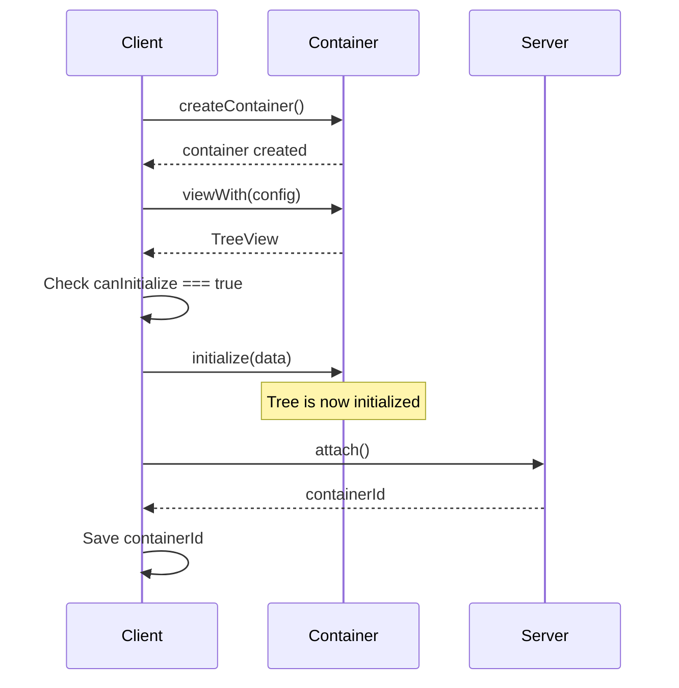
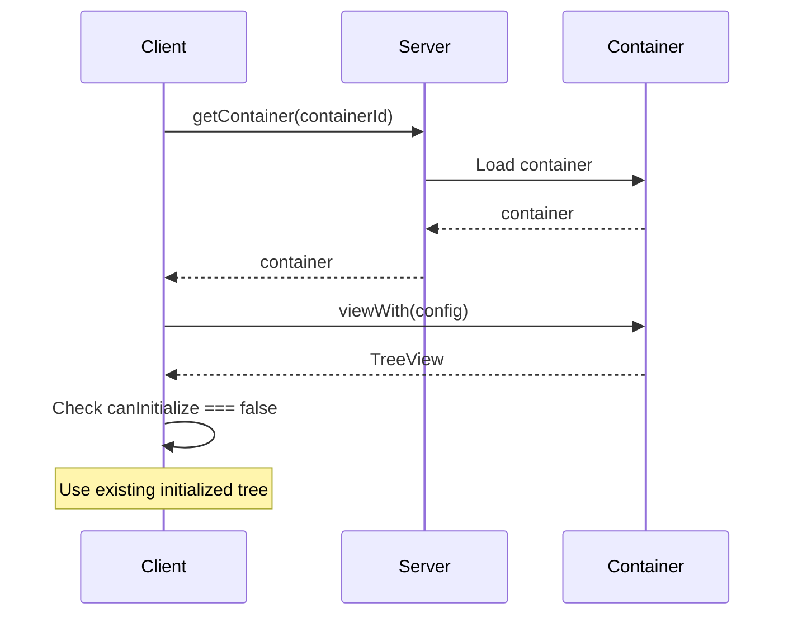

# Recommended Init Flow

This guide describes the recommended initialization flow for SharedTree to avoid common pitfalls when creating or loading collaborative sessions.

## Overview

When working with SharedTree, the most critical rule is to **never initialize after [connecting to the container](../../build/containers.mdx#connecting-to-a-container)**.

Connecting a new container before initializing it creates a dangerous race condition.
Other clients can connect to the container and see an uninitialized tree.
They will think they need to initialize it themselves, so they'll send their own initialization operations.
When the original client's initialization operation finally gets processed, all other clients' initialization attempts will be rejected and thrown away, potentially causing data loss and inconsistent state.

The solution: initialize **before** connecting when creating a new container. Use `compatibility.canInitialize` to validate assumptions and catch bugs early.

## Path 1: Creating a New Container

When creating a new container:

1. Create the container
2. Create a TreeView with `viewWith()`
3. **Check that `canInitialize` is `true`**, if not, something is wrong
4. Initialize the tree with initial data
5. Call `attach()` to connect the container and get its ID
6. Save the container ID for future sessions



### Why This Works

By initializing **before** connecting (calling `attach()`), this pattern ensures:

- The tree is fully initialized before other clients can connect
- No race condition where multiple clients try to initialize simultaneously
- The first client to create the container is the only one that initializes

The explicit check for `canInitialize === true` serves as an assertion. If `canInitialize` is `false`, something went wrong during container creation. This check catches bugs early and makes debugging easier.

## Path 2: Loading an Existing Container

When loading an existing container:

1. Load the container using its ID
2. Create a TreeView with `viewWith()`
3. **Check that `canInitialize` is `false`**, if not, something is wrong
4. Use the existing tree (already initialized by whoever created it)



### Why This Works

The explicit check for `canInitialize === false` serves as an assertion. If `canInitialize` is `true`, the tree wasn't properly initialized before. This check catches bugs early and makes debugging easier.

## Complete Code Example

```typescript
export class CollaborationFluidClient {
	public async init(): Promise<TreeView<typeof AppData>> {
		// Specify the container ID in the page URL, e.g. "www.app.com/#1bf51ce6-7614-4871-9965-d02a4e8c4ad4"
		// If no ID is present in the URL (e.g. "www.app.com"), then create a new container with a new ID
    	const containerId = window.location.hash.substring(1);

		if (containerId.length === 0) {
			// Path 1: Creating a new container
			const container = await this.createFluidContainer();
			const view: TreeView = container.initialObjects.appData.viewWith(AppDataTreeConfiguration);

			if (!view.compatibility.canInitialize) {
				throw new Error("The tree must be safe to initialize upon creation of the Fluid container");
			}

			view.initialize(new AppData([]));
			const fluidContainerId = await container.attach();
			window.location.hash = fluidContainerId;
			return view;
		} else {
			// Path 2: Loading an existing container
			const container = await this.loadFluidContainer(containerId);
			const view: TreeView= container.initialObjects.appData.viewWith(AppDataTreeConfiguration);

			if (view.compatibility.canInitialize) {
				throw new Error("The tree should already be initialized if the Fluid container exists");
			}

			if (view.compatibility.canUpgrade) {
				// See [Schema Evolution](./schema-evolution/index.mdx) for instructions on how to handle schema changes in production applications.
			}

			return view;
		}
	}

	private async createFluidContainer(): Promise<IFluidContainer<typeof AppSchema>> {
		const client = this.initClient();
		const { container } = await client.createContainer(AppSchema, FluidCompatibilityMode);
		return container;
	}

	private async loadFluidContainer(containerId: string): Promise<IFluidContainer<typeof AppSchema>> {
		const client = this.initClient();
		const { container } = await client.getContainer(containerId, AppSchema, FluidCompatibilityMode);
		return container;
	}

	private initClient(): TinyliciousClient {
		return new TinyliciousClient({ connection: { port: 7070 } });
	}
}
```

## Key Takeaways

- Use `compatibility.canInitialize` to validate assumptions about container state
- Always initialize **before** connecting (calling `attach()`) on new containers
- Treat `canInitialize` as an assertion to catch bugs early
- The two paths are completely separate:
  - Creation path: create → view → initialize → connect → save ID
  - Loading path: load → view → use existing data

## See Also

- [SharedTree Quick Start](../../start/tree-start.mdx)
- [Containers](../../build/containers.mdx)
- [Schema Evolution](./schema-evolution/index.mdx)
