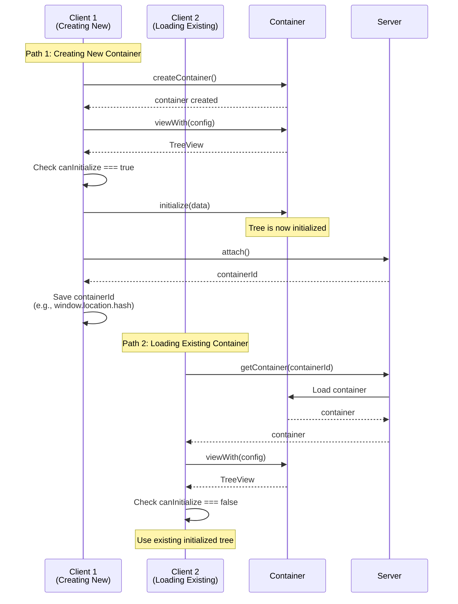

# Recommended Init Flow

This guide describes the recommended initialization flow for SharedTree to avoid common pitfalls when creating or loading collaborative sessions.

## Overview

When working with SharedTree, the most critical rule is to **never initialize after [connecting to the container](../../build/containers.mdx#connecting-to-a-container)**.

Connecting a new container before initializing it creates a dangerous race condition.
Other clients can connect to the container and see an uninitialized tree.
They will think they need to initialize it themselves, so they'll send their own initialization operations.
When the original client's initialization operation finally gets processed, all other clients' initialization attempts will be rejected and thrown away, potentially causing data loss and inconsistent state.

The solution: initialize **before** attaching when creating a new container. Use `compatibility.canInitialize` to validate assumptions and catch bugs early.

## Initialization Flow



When creating a new container:

1. Create the container
2. Create a TreeView with `viewWith()`
3. **Check that `canInitialize` is `true`** - if not, something is wrong
4. Initialize the tree with initial data
5. Attach the container to get its ID
6. Save the container ID for future sessions

When loading an existing container:

1. Load the container using its ID
2. Create a TreeView with `viewWith()`
3. **Check that `canInitialize` is `false`** - if not, something is wrong
4. Use the existing tree (already initialized by whoever created it)

## Complete Example

This example shows a robust pattern for handling both new and existing containers:

```typescript
export class CollaborationFluidClient {
  public async init(): Promise<TreeView<typeof FluidGraphicCollectionData>> {
    const containerId = window.location.hash.substring(1);

    if (containerId.length === 0) {
			// Path 1: Creating a new container
      const container = await this.createFluidContainer();
			const view: TreeView<typeof FluidGraphicCollectionData> =
				container.initialObjects.appData.viewWith(GraphicCollectionTreeConfiguration);

      if (!view.compatibility.canInitialize) {
				throw new Error("The tree must be safe to initialize upon creation of the Fluid container");
      }

      view.initialize(new FluidGraphicCollectionData([]));
      const fluidContainerId = await container.attach();
      window.location.hash = fluidContainerId;
      return view;
    } else {
			// Path 2: Loading an existing container
      const container = await this.loadFluidContainer(containerId);
			const view: TreeView<typeof FluidGraphicCollectionData> =
				container.initialObjects.appData.viewWith(GraphicCollectionTreeConfiguration);

      if (view.compatibility.canInitialize) {
        throw new Error("The tree should already be initialized if the Fluid container exists");
      }

      return view;
    }
  }

  private async createFluidContainer(): Promise<IFluidContainer<typeof FluidContainerSchema>> {
    const client = this.initClient();
    const { container } = await client.createContainer(FluidContainerSchema, FluidCompatibilityMode);
    return container;
  }

  private async loadFluidContainer(containerId: string): Promise<IFluidContainer<typeof FluidContainerSchema>> {
    const client = this.initClient();
    const { container } = await client.getContainer(containerId, FluidContainerSchema, FluidCompatibilityMode);
    return container;
  }

  private initClient(): TinyliciousClient {
    return new TinyliciousClient({ connection: { port: 7070 } });
  }
```

## Why This Pattern Works

### Validates Assumptions

The explicit checks for `canInitialize` serve as assertions:

- **New container**: If `canInitialize` is `false`, something went wrong during container creation
- **Existing container**: If `canInitialize` is `true`, the tree wasn't properly initialized before

These checks catch bugs early and make debugging easier.

### Prevents Race Conditions

By initializing **before** calling `attach()`, this pattern ensures:

- The tree is fully initialized before other clients can connect
- No race condition where multiple clients try to initialize simultaneously
- The first client to create the container is the only one that initializes

### Clear Separation of Concerns

The two paths are completely separate:

- Creation path: create → view → initialize → attach → save ID
- Loading path: load → view → use existing data

## Key Takeaways

- Use `compatibility.canInitialize` to validate assumptions about container state
- Always initialize **before** calling `attach()` on new containers
- Treat `canInitialize` as an assertion to catch bugs early

## See Also

- [SharedTree Quick Start](../../start/tree-start.mdx)
- [Containers](../../build/containers.mdx)
