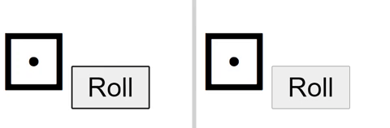

# Hello World Component Walk Through - The Dice Roller

Our Hello World example consists of building a collaborative **Dice Roller**.



TODO: ADD something about no view framework and this uses none. but we also have react.
The Fluid Frameworkis agnostic to any view framework.

## Setup to Follow Along

This code walk through mirrors the `yo fluid` generator beginner scaffolding. If
you want to follow along simply perform the following steps.

1. Install [Yeoman](https://yeoman.io/) and the fluid generator.

```bash
npm i -g yo generator-fluid
```

2. Run the following cmd where you want to create your new project.

```bash
yo fluid HelloWorld --view-none --beginner
```

3. Navigate to the newly created directory and open the code with your favorite IDE.

```bash
cd helloworld
code .
```

## Directory Structure

The generator creates the following folder structure. All of our logic
lives in the `./src/component.ts` file and this is the file we will spend
the remainder of the doc understanding.

```text
.
├── src
|   ├── component.ts               // Fluid Component source code
|   └── index.ts                   // Export file
├── tests
|   └── helloworld.test.ts         // Fluid Component test
├── .gitignore                     // Ignore dist and node_modules
├── jest-puppeteer.config.js       // jest-puppeteer configuration
├── jest.config.js                 // Jest configuration
├── package.json                   // Package manifest
├── README.md                      // Description of your component's functionality
├── tsconfig.json                  // TypeScript configuration
└── webpack.config.js              // Webpack configuration
```

## Component Code Deep Dive

Below is the entirety of our newly created HelloWorld component. We will go through it section by section.

<<< @/tutorials/dice-roller.ts

### Imports

```typescript
import {
    PrimedComponent,
    PrimedComponentFactory,
} from "@fluidframework/aqueduct";
import { IComponentHTMLView } from "@fluidframework/view-interfaces";
```

`PrimedComponent` is the base class we will extend to build our Fluid component. It provides component lifecycle methods
 and a `root` `SharedDirectory`.

`PrimedComponentFactory` is a helper class that will let the Fluid Framework create instances of our `HelloWorld` component.

`IComponentHTMLView` is an interface that denotes that our Fluid component exposes a `render(div: HTMLElement)` function
and can render a view.

### `diceValueKey`

```typescript
const diceValueKey = "diceValue";
```

This is a variable we will use as the key for storing our dice value later.

### `class` Setup

```typescript
export class HelloWorld extends PrimedComponent implements IComponentHTMLView {
```

Our `HelloWorld` class extends the `PrimedComponent` which denotes that it is a Fluid component. It also implements our
`IComponentHTMLView` interface which denotes that it can render a view.

### `get` Properties

```typescript
public static get ComponentName() {
    return "helloworld";
}

public get IComponentHTMLView() { return this; }
```

`ComponentName` returns a unique name of our component. This `string` can be anything.

`IComponentHTMLView` and returning `this` is required because our class implements the `IComponentHTMLView` interface.
To learn more about Fluid `IComponent` interfaces check out
[Fluid component interfaces](./component-interfaces.md);

### `factory` setup

```typescript
/**
 * The factory defines how to create an instance of the component as well as the
 * dependencies of the component.
 */
public static readonly factory = new PrimedComponentFactory(
    HelloWorld.ComponentName,
    HelloWorld,
    [], // Additional Distributed Data Structure Types
    {}, // Providers (Advanced)
);
```

The `factory` allows the Fluid Framework to know how to create an instance of our `HelloWorld` Fluid component. The
`PrimedComponentFactory` helps create our factory object. We provide it with
the name of our component `HelloWorld.ComponentName` and a pointer to the class `HelloWorld` so it can create
new instances.

The third parameter `[]` is where we would add additional Distributed Data Structure types. In this example we will just
use the `root` `SharedDirectory`.

### Component Setup

```typescript
/**
 * componentInitializingFirstTime is called only once, it is executed only by the first client to open the
 * component and all work will resolve before the view is presented to any user.
 *
 * This method is used to perform component setup, which can include setting an initial schema or initial values.
 */
protected async componentInitializingFirstTime() {
    this.root.set(diceValueKey, 1);
}
```

The `componentInitializingFirstTime` function is an override lifecycle method that is called the first time the
component instance is ever created. This is our opportunity to perform setup work that will only ever be run
once.

In our example we are using our `this.root` `SharedDirectory` to set a new key (`diceValueKey` from above) with the
initial value of `1`. This is the key we will be using to store the value of the die.

::: tip

Using the value of `1` is arbitrary. If we wanted our dice to always start with the value
of 4 we could set the initial value to `4`.

:::

### `render`

```typescript
/**
 * Render the dice.
 */
public render(div: HTMLElement) {
    const getDiceChar = (): string => {
        return String.fromCodePoint(0x267F + this.root.get(diceValueKey));
    };
    const diceSpan = document.createElement("span");
    diceSpan.classList.add("diceSpan");
    diceSpan.style.fontSize = "50px";
    diceSpan.textContent = getDiceChar();
    div.appendChild(diceSpan);

    const rollButton = document.createElement("button");
    rollButton.classList.add("rollButton");
    rollButton.textContent = "Roll";
    rollButton.onclick = () => {
        const rollValue = Math.floor(Math.random() * 6) + 1;
        this.root.set(diceValueKey, rollValue);
    };
    div.appendChild(rollButton);

    // When the value of the dice changes we will re-render the
    // value in the dice span
    this.root.on("valueChanged", () => {
        diceSpan.textContent = getDiceChar();
    });
}
```

The `render(...)` function is responsible for all of our view logic. While it may seem pretty it's really
simple and we will break it down below.

The caller of this function is required to provide a `div` that we can use as the basis to
render our view. In the basic setup, and testing case, the webpage knows how to find your component and calls render on it.

```typescript
const getDiceChar = (): string => {
    return String.fromCodePoint(0x267F + this.root.get(diceValueKey));
};
```

`getDiceChar` is a function that gets the stored dice value from the `this.root` `SharedDirectory`, converts it to the
corresponding Unicode die face, and returns it.

::: note Unicode Die Faces

⚀ - 0x2680  
⚁ - 0x2681  
⚂ - 0x2682  
⚃ - 0x2683  
⚄ - 0x2684  
⚅ - 0x2685  

:::

```typescript
const diceSpan = document.createElement("span");
diceSpan.classList.add("diceSpan");
diceSpan.style.fontSize = "50px";
diceSpan.textContent = getDiceChar();
div.appendChild(diceSpan);
```

This code creates a new HTML `span` called `diceSpan` that will display our Unicode die face. It sets the initial
content `diceSpan.textContent = getDiceChar();` then attaches
it to the `div` provided by the caller.

```typescript
const rollButton = document.createElement("button");
rollButton.classList.add("rollButton");
rollButton.textContent = "Roll";
rollButton.onclick = () => {
    const rollValue = Math.floor(Math.random() * 6) + 1;
    this.root.set(diceValueKey, rollValue);
};
div.appendChild(rollButton);
```

This code creates a new HTML `button` called `rollButton`. We determine what to do when the button is pressed by setting
a function to the `rollButton.onclick`.

The function that will execute when the button is clicked **does not** update the `diceSpan` from above. Instead it
generates a new number between 1-6 then stores that number on our `this.root` `SharedDirectory` under the `diceValueKey`.
We then attach the new `button` to the `div` provided by the caller.

```typescript
// When the value of the dice changes we will re-render the
// value in the dice span
this.root.on("valueChanged", () => {
    diceSpan.textContent = getDiceChar();
});
```

Finally, we need to update our displayed die whenever the value changes. This is true for both local changes as well as
remote changes from other clients. We do this by setting an event listener on the `this.root` `SharedDirectory`.
Whenever a change is made to the root it will emit a `"valueChanged"` event. This event notifies that there is a new
value and we can use it to change our die character. To do this we set a callback function that says
whenever the root changes get the die character `getDiceChar()` and set the response to the text of our `diceSpan`.


It displays a die and a button to roll it. You can try it below.

---

**Try the Dice roller [Doesn't work yet]**

<style>
  iframe#diceroller {
    height: 95px;
    width: 200px;
  }
</style>

<iframe id="diceroller" src="/fluid/diceroller.html"></iframe>

---
