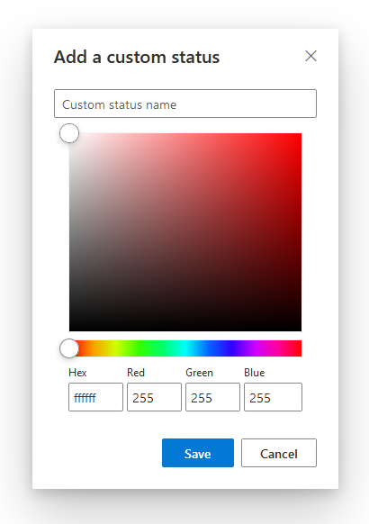
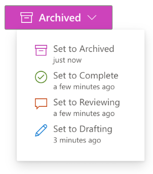

# Badge component

**Badge** is a Fluid component that allows users to create an in-line badge within a document to represent the status
of the overall document or a section of it.

<iframe id="badge" src="/fluid/badge.html"></iframe>

## Features

### Custom status

Badge includes four preset statuses: Drafting, Reviewing, Complete, and Archived.

You can also set a custom status with any text or color.

### History

The history of the Badge is also shown on hover, so users can see how the status has evolved over time.

### Data model

Badge uses the following distributed data structures:

- SharedDirectory - root
- SharedMap - stores the status options for the Badge
- SharedCell - represents the Badge's current state
- SharedObjectSequence - stores the history of status changes

## Set up your dev environment

If you haven't already, [set up your Fluid Framework development
environment](../guide/README.md#set-up-your-development-environment).

### Clone the tutorial repository

::: danger TODO
Double-check URL to repo.
:::

First, clone the Badge repository here:
   <https://dev.azure.com/FluidDeveloperProgram/Developer%20Preview/_git/fluid-badge>.

Since the Git repository is authenticated, it is easiest to visit the link above and click the "Clone" button in the
top-right corner of the UI. Follow the resulting instructions to clone the repo.

Once you've cloned the repo, you'll need to set up access to the [private Fluid NPM feed](../guide/package-feed.md). On
Windows, you can run the `npm run auth` command to automate this process.

Now that you have access to the private feed, run `npm install` in the root of the repository to install dependencies.

Finally, you can open the folder in Visual Studio Code.

## Run the sample

After you've cloned the sample repo and installed dependencies using `npm install`, you can then use `npm start` to start
a local dev environment for testing and debugging. Visit <http://localhost:8080/> in a browser to load the Fluid
development server, which will load two instances of the component side by side.

!!!include(../includes/browsers.md)!!!
