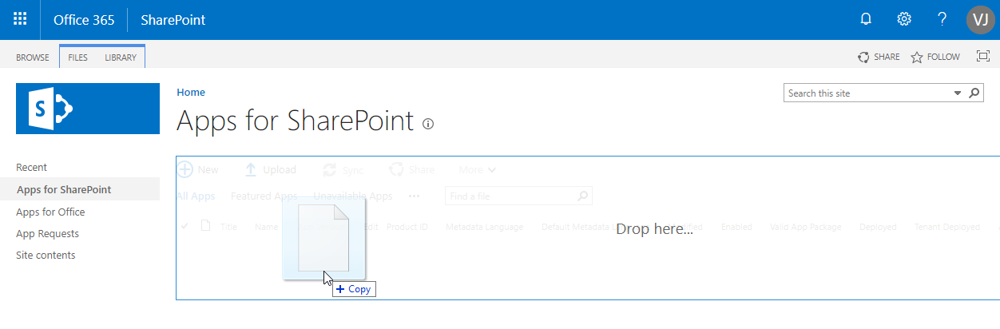
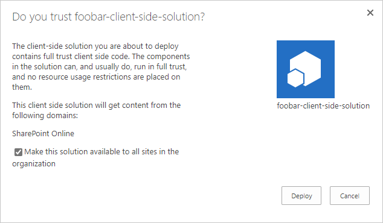

# Uploading components for use in the Fluid Preview App

You can package your components for use in the Fluid Preview App. All of the [Fluid tutorials](../examples/README.md)
include npm tasks to package your component.

## Package your component

To package your component, use the following command: `npm run sppkg`

This command will do a production build using webpack and generate a `.sppkg` file at
`sharepoint/solution/{sppkg-package-name}.sppkg`

## Upload the component package

Next, you need to deploy the package that was generated to the app catalog.

1. Go to your site's app catalog.
1. Upload or drag and drop your component `.sppkg` to the app catalog.

   <!--  -->

   This deploys the client-side solution package. Because Fluid components are full trust client-side solutions,
   SharePoint displays a dialog and asks you to trust the client-side solution to deploy.

   <!--  -->

   ::: danger IMPORTANT

   You **must** check the "Make this solution available to all sites in the organization" checkbox to ensure the component
   is made available to the Fluid Preview App.

   :::
1. Select **Deploy**.

Notice that you can see if there's any exceptions or issues in the package by looking the *App Package Error Message*
column in the app catalog.

[More
information.](https://docs.microsoft.com/en-us/sharepoint/dev/spfx/web-parts/get-started/serve-your-web-part-in-a-sharepoint-page#deploy-the-helloworld-package-to-app-catalog)

# Generating new component IDs

Each component is assigned a unique ID by the SPFx toolchain. This is useful because it allows you to upload new
versions of your component. However, when using one of [the Fluid tutorials](../examples/README.md) as a base for a
component, you will need to generate a new component ID.

To do this, run this command: `npm run setup`

* At the first prompt, select **n**.
* At the second prompt, select **a**.

Commit any resulting changes to source control.
