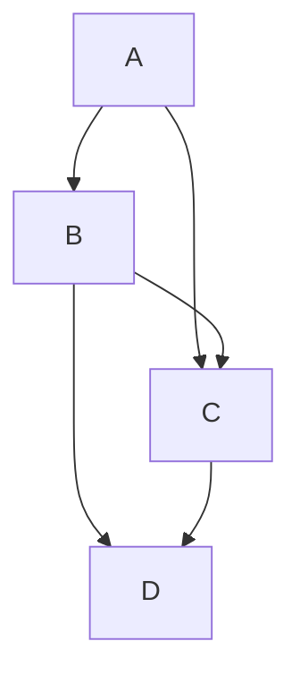

# New Website features

## MDX

Supports MDX format! This lets me include <b>React Components</b>!
TODO: add a Fluent UI styled component here.

### Import contents from other documents

I can import content from other documents! For example, here is the contents of the `browsers.mdx` file:

import Browsers from "@site/src/pages/browsers.mdx";

> <Browsers components={props.components} />

## Mermaid

Built-in [Mermaid](https://mermaid.js.org/) diagram support!!

