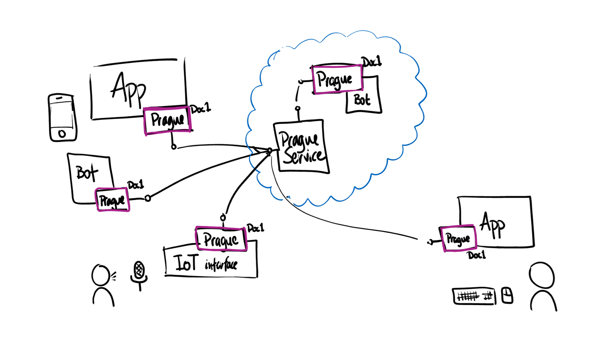

# What is Fluid?

> [!NOTE]
> The content in this section comes from this [source document][1]. If you have feedback or questions about this content
> please comment in the source document.

[1]: https://microsoft.sharepoint.com/:w:/t/Prague/ESoVbMxYtoJKp1CqUUsycjYBuURKe1x3Bwgp4_2yCzrH3A?e=KeWZQd

It is easiest to understand Fluid by looking at the problems that it helps you address. Namely, that it is challenging,
with the tools available today, to build collaborative experiences on the Web. Wait, what? Isn't the whole web
"collaborative?" What do I mean by a "collaborative experience?"

The canonical example is working on a document or a presentation together, but I find it more helpful to consider
smaller use-cases. For example, most real-time chat apps today, like Slack or Facebook Messenger, show the user a little
animation when another person is typing a message. This small indicator makes the chat feel more *live*, and it's an
example of a collaborative experience, albeit a small one.

I'm sure you can think of other examples. Increasingly these collaborative experiences are "table stakes" for building
Web-based products today. However, despite their importance, collaborative experiences are notoriously difficult to
build. Want good performance? Well, that's even tougher. Sure, it might be easy enough to show a "Tyler is typing
indicator" since it has some simplifying constraints like the fact that the indicator is "read-only;" each client can
only write to the main chat stream and its own "typing" indicator.

But many practical scenarios, such as the canonical "working on a deck together" scenario, involve more complex data
that is being updated by multiple clients, which increases complexity dramatically. Maintaining performance in such
situations is difficult, but critical both for the user experience and for limiting the effect of merge conflicts.

If you have multiple clients manipulating the same data, sooner or later you're going to run into merge conflicts.
They're almost always difficult to deal with, but they get even more challenging when the latency between clients
increases. Higher latency makes it more likely that clients are going to make conflicting changes; this is another
reason why maintaining performance is critical. The best merge conflict is no merge conflict!

The way our industry-standard tools work today, if you want to build a collaborative experience -- or more likely -- add
some collaborative interactivity to an existing experience, you'll have to build out quite a bit of infrastructure. For
example, you will likely need to use Web Sockets to keep clients updated quickly, you'll design a messaging protocol,
you'll probably need a distributed cache, etc. Real-time is real hard! ™

And you'll do this *every time you need to build a collaborative experience,* because the tools we use today are built for
a "one user at a time" world. Today you have to build your collaborative experiences on top of foundations that aren't
themselves collaborative.

The Web is no longer a one user at a time world -- if it ever was -- and in order to build experiences that feel *right*
for the collaborative Web, we need tools that understand the collaborative world in which we live. It must become easier
to build and maintain these experiences to push the Web forward.

*Enter Fluid, stage left.* Fluid makes building collaborative experiences on the web easier while simultaneously
addressing the reasons many collaborative experiences are poor - performance and the complexity of working with
distributed state. It also provides operational level history and automatic data persistence -- but we'll get to those in
a second.

## Fluid Data: Ops all the way down

Fluid data is different than data you might be familiar with. In Fluid, when data is changed, the change is modeled as
an *operation* (often shortened to op) on the existing data (if you've used Operational Transform, this concept may sound
familiar).

Operations describe *changes* to a data structure. By chaining a series of operations together we can represent changes
to a data structure over time (history), and this operation is also what we communicate to other clients to share those
changes. When clients receive operations, they apply those operations to their local data.

However, just sending operations is not enough -- we need to be sure that each client applies the operations in the right
order.

## Total Order Broadcast & Eventual Consistency

Fluid is, at its core, a data model for *distributed state*. Building collaborative experiences boils down to managing
distributed state, and Fluid provides powerful developer-friendly abstractions for managing this state in the form of
distributed data structures. Each of these data structures is *eventually consistent* -- this means that, assuming no new
changes to the data structures, all clients reach an identical state in a finite amount of time.

Fluid guarantees eventual consistency via total order broadcast. That is, when a Distributed Data Structure (DDS) is
changed locally by a client, that change is first sent to the Fluid server, which does three things:

1. Applies a sequence number to the operation
2. Broadcasts the operation to all other connected clients; this is the "broadcast" part of TOB
3. Stores the operation's data (see data persistence)

This means that each client receives every operation from the server and in the same order. The clients can then apply
the operations to their local state -- which means that each client will *eventually* be consistent with the client that
originated the change.

The quality of eventual consistency improves performance because local changes can be made optimistically, knowing that
the Fluid runtime will merge the change in the appropriate way *eventually*.

Fluid is also efficient when communicating with the server. When you change a data structure, Fluid doesn't send the
whole data structure to the server. Rather, it sends *operations*. For example, consider the SharedSequence data
structure. When a client inserts, appends, or deletes items in the sequence, Fluid sends the server the *operation* that
was performed and the data that was inserted/appended/etc. When the Fluid server broadcasts the operation to all the
other connected clients, it again sends only the operation itself, not the full data structure. This efficiency in
bytes-over-wire helps both performance and bandwidth.

But what about when a new client connects? How does the new client get the current state of the data structures? When a
new client connects, the server will send it all necessary ops (recall that the server persists the operations; this is
why) to bring it to a consistent state with all other clients. This is managed by the Fluid runtime.

As the number of operations increases, replaying all ops when loading a Fluid data structure is inefficient. Fluid
provides a specialized operation, called a Summary op, to address this. As the name implies, a Summary op is an
operation that *summarizes* all previous operations. Thus, a Summary op represents the state of Fluid data structures at
a particular sequence number. When a client plays back a Summary op, the local Fluid data structures will be consistent
with the rest of the clients.

Summary ops, like all Fluid operations, are created by the client, but they are not created automatically by the Fluid
runtime. It is an app's responsibility to create Summary ops at appropriate times based on their use of the Fluid data
structures.

## The Fluid runtime and distributed data structures

Each client runs an instance of the Fluid runtime, illustrated in the diagram below by the purple boxes.

The Fluid runtime is responsible for managing communication between the client and Fluid server and for applying
incoming operations. The runtime communicates with the Fluid server using Web Sockets, but you do not need to make any
network calls yourself in order to use Fluid. The runtime takes care of that for you.

## Programming model for distributed data structures

* Make changes to local DDS instances
* Also react to changes made by the runtime by wiring up event listeners

***...more coming soon...***
