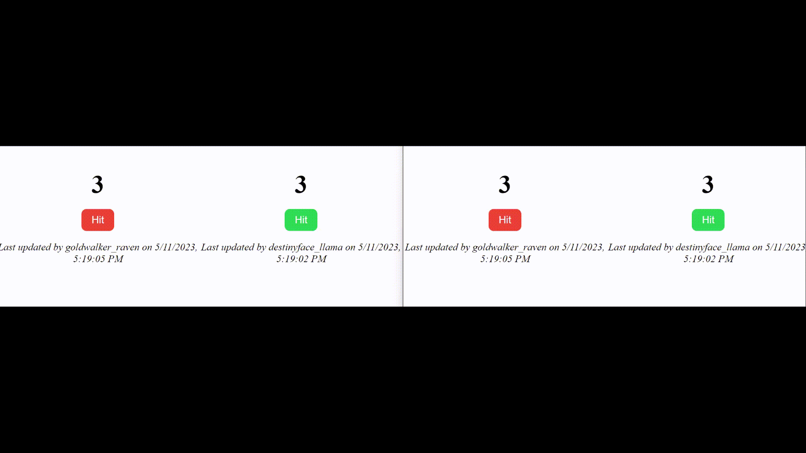

# @fluid-example/attributable-map

Note:

1. This is an experimental demo for the experimental DDS [AttributableMap](../../../experimental/dds/attributable-map/README.md)
2. The current behavior displays a potential bug where there is a slight delay in showing the attribution. It is probable that this bug is caused by a lack of synchronization between the `setCore` and `setAttribution` functions. We are addressing the bug right now.

**Hit Counter** is a simple demonstration that showcases how to use the `mixinAttributor` and the experimental DDS `AttributableMap`.
The user can click on the button to increment the count value by one. Upon updating the count value, the corresponding attribution key will also be updated.
The attributor then retrieves the attribution information and stores it, allowing all co-authors to automatically view the latest timestamp at which any author pressed the hit button.
The attribution information, which consists of the user name and the timestamp of the most recent edit, is displayed at the bottom. Please refer to [Attributor](../../../packages/framework/attributor/README.md) and [AttributableMap](../../../experimental/dds/attributable-map/README.md) for more details

When the app loads it will update the URL. Copy that new URL into a second browser and note that if you click the button in one browser, the counter value and attribution information in other browsers are synchronized as well.

<!-- AUTO-GENERATED-CONTENT:START (EXAMPLE_APP_README_HEADER:usesTinylicious=TRUE) -->

<!-- prettier-ignore-start -->
<!-- NOTE: This section is automatically generated using @fluid-tools/markdown-magic. Do not update these generated contents directly. -->

## Getting Started

You can run this example using the following steps:

1. Enable [corepack](https://nodejs.org/docs/latest-v16.x/api/corepack.html) by running `corepack enable`.
1. Run `pnpm install` and `pnpm run build:fast --nolint` from the `FluidFramework` root directory.
    - For an even faster build, you can add the package name to the build command, like this:
      `pnpm run build:fast --nolint @fluid-example/attributable-map`
1. In a separate terminal, start a Tinylicious server by following the instructions in [Tinylicious](https://github.com/microsoft/FluidFramework/tree/main/server/routerlicious/packages/tinylicious).
1. Run `pnpm start` from this directory and open <http://localhost:8080> in a web browser to see the app running.

<!-- prettier-ignore-end -->

<!-- AUTO-GENERATED-CONTENT:END -->

## Data model

The project uses the following distributed data structures:

-   SharedDirectory - root
-   AttributableMap - HitCounter

<!-- AUTO-GENERATED-CONTENT:START (README_FOOTER) -->

<!-- prettier-ignore-start -->
<!-- NOTE: This section is automatically generated using @fluid-tools/markdown-magic. Do not update these generated contents directly. -->

## Contribution Guidelines

There are many ways to [contribute](https://github.com/microsoft/FluidFramework/blob/main/CONTRIBUTING.md) to Fluid.

-   Participate in Q&A in our [GitHub Discussions](https://github.com/microsoft/FluidFramework/discussions).
-   [Submit bugs](https://github.com/microsoft/FluidFramework/issues) and help us verify fixes as they are checked in.
-   Review the [source code changes](https://github.com/microsoft/FluidFramework/pulls).
-   [Contribute bug fixes](https://github.com/microsoft/FluidFramework/blob/main/CONTRIBUTING.md).

Detailed instructions for working in the repo can be found in the [Wiki](https://github.com/microsoft/FluidFramework/wiki).

This project has adopted the [Microsoft Open Source Code of Conduct](https://opensource.microsoft.com/codeofconduct/).
For more information see the [Code of Conduct FAQ](https://opensource.microsoft.com/codeofconduct/faq/) or contact [opencode@microsoft.com](mailto:opencode@microsoft.com) with any additional questions or comments.

This project may contain Microsoft trademarks or logos for Microsoft projects, products, or services.
Use of these trademarks or logos must follow Microsoft’s [Trademark & Brand Guidelines](https://www.microsoft.com/trademarks).
Use of Microsoft trademarks or logos in modified versions of this project must not cause confusion or imply Microsoft sponsorship.

## Help

Not finding what you're looking for in this README? Check out [fluidframework.com](https://fluidframework.com/docs/).

Still not finding what you're looking for? Please [file an issue](https://github.com/microsoft/FluidFramework/wiki/Submitting-Bugs-and-Feature-Requests).

Thank you!

## Trademark

This project may contain Microsoft trademarks or logos for Microsoft projects, products, or services.

Use of these trademarks or logos must follow Microsoft's [Trademark & Brand Guidelines](https://www.microsoft.com/en-us/legal/intellectualproperty/trademarks/usage/general).

Use of Microsoft trademarks or logos in modified versions of this project must not cause confusion or imply Microsoft sponsorship.

<!-- prettier-ignore-end -->

<!-- AUTO-GENERATED-CONTENT:END -->
