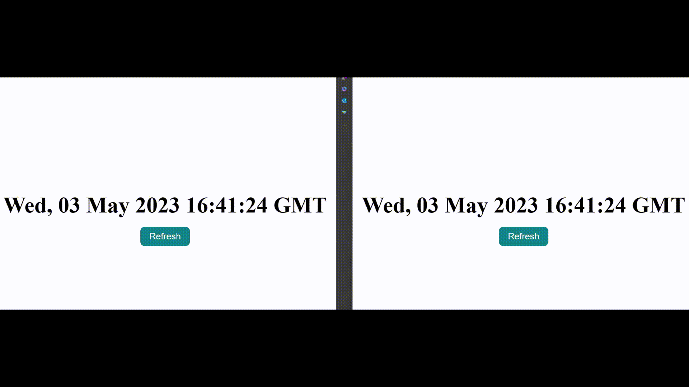

# @fluid-example/attributable-map

**Timestamp Watcher** is a basic example that has a timestamp display screen and a button. The timestamp information is stored in Fluid so that each co-authors will automatically see the most recent timestamp at which any author pressed the button. In addition, the attribution key will be displayed by the side, it consists of the type of attribution and related sequence number/id. Please refer to [Attributor](../../../packages/framework/attributor/README.md) and [AttributableMap](../../../experimental/dds/attributable-map/README.md) for more details

When the app loads it will update the URL. Copy that new URL into a second browser and note that if you click the button in one browser, the time value and attribution key in other browsers updates as well.

<!-- AUTO-GENERATED-CONTENT:START (README_EXAMPLE_GETTING_STARTED_SECTION:usesTinylicious=TRUE) -->

<!-- prettier-ignore-start -->
<!-- NOTE: This section is automatically generated using @fluid-tools/markdown-magic. Do not update these generated contents directly. -->

## Getting Started

You can run this example using the following steps:

1. Enable [corepack](https://nodejs.org/docs/latest-v16.x/api/corepack.html) by running `corepack enable`.
1. Run `pnpm install` and `pnpm run build:fast --nolint` from the `FluidFramework` root directory.
    - For an even faster build, you can add the package name to the build command, like this:
      `pnpm run build:fast --nolint @fluid-example/app-integration-external-views`
1. In a separate terminal, start a Tinylicious server by following the instructions in [Tinylicious](https://github.com/microsoft/FluidFramework/tree/main/server/tinylicious).
1. Run `pnpm start` from this directory and open <http://localhost:8080> in a web browser to see the app running.

<!-- prettier-ignore-end -->

<!-- AUTO-GENERATED-CONTENT:END -->

## Data model

TimestampWatcher uses the following distributed data structures:

-   SharedDirectory - root
-   AttributableMap - TimestampWatcher
