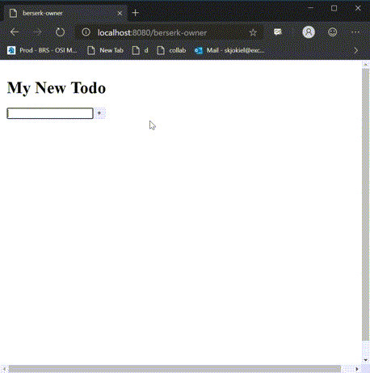

# @fluid-example/todo

**Todo** is a more advanced example that covers more complicated scenarios. The Todo app uses React as its view rendering platform.

<!-- AUTO-GENERATED-CONTENT:START (README_EXAMPLE_GETTING_STARTED_SECTION:usesTinylicious=FALSE) -->

<!-- prettier-ignore-start -->
<!-- NOTE: This section is automatically generated using @fluid-tools/markdown-magic. Do not update these generated contents directly. -->

## Getting Started

You can run this example using the following steps:

1. Enable [corepack](https://nodejs.org/docs/latest-v16.x/api/corepack.html) by running `corepack enable`.
1. Run `pnpm install` and `pnpm run build:fast --nolint` from the `FluidFramework` root directory.
    - For an even faster build, you can add the package name to the build command, like this:
      `pnpm run build:fast --nolint @fluid-example/todo`
1. Run `pnpm start` from this directory and open <http://localhost:8080> in a web browser to see the app running.

<!-- prettier-ignore-end -->

<!-- AUTO-GENERATED-CONTENT:END -->

## Todo Fluid objects

There are two Fluid objects that make up the Todo application:

### [Todo](./src/Todo/Todo.ts)

A Todo is the top level Fluid object. It can create, delete, and provides access to TodoItems. It also has an editable title (using a SharedString).

### [TodoItem](./src/TodoItem/TodoItem.ts)

A Todo Item is a singular todo entry. It has editable text as well as editable detail text (also using a SharedString). It also stores a boolean for the checkbox.

## The views

### [TodoView](./src/Todo/TodoView.tsx)

The default view is a TodoView mapping to a Todo. It uses the CollaborativeInput control from the `@fluid-experimental/react-inputs` package to display its title, and TodoItemViews to display the data from its TodoItems. It also provides a text field and button for creating new TodoItems, and buttons for each TodoItem to delete or open directly.

### [TodoItemView](./src/TodoItem/TodoItemView.tsx)

The TodoItemView uses the CollaborativeInput as well as a CollaborativeTextArea to display its string contents, and uses a plain HTML checkbox for the checked state.

## The container code

The container code includes a request handler that provides views to the data stored within. For a default (empty) request, it provides a TodoView in response. The container code's request handler can also provide back a TodoItemView directly when a direct link is used.
