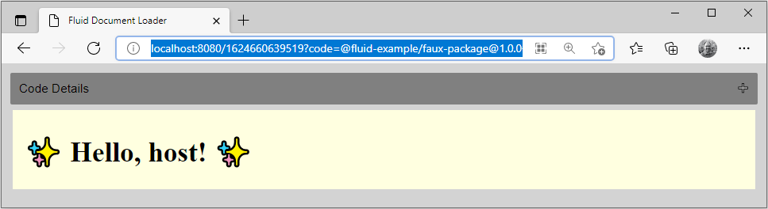
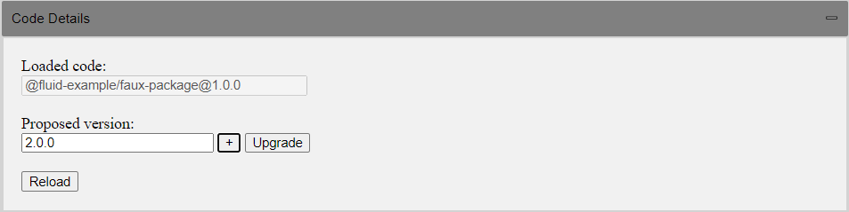
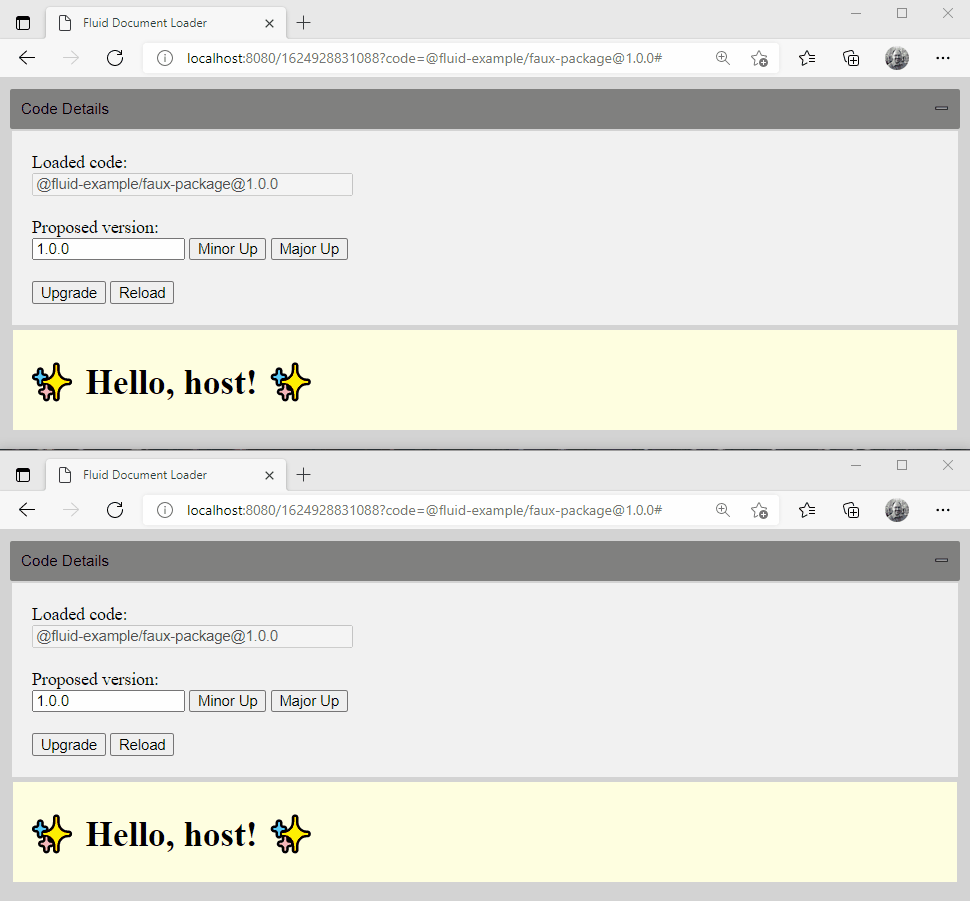

# @fluid-internal/hosts-sample

This example demonstrates how to host Fluid components in a web application.
The Fluid loader is needed to load a Fluid document. The example walks through all the steps to
create, initialize, and then make use of the loader in under 200 lines of code.
And does so in a literate programming-like style to provide more detail on each line of the code.

<!-- AUTO-GENERATED-CONTENT:START (GET_STARTED:tinylicious=true) -->
<!-- The getting started instructions are automatically generated.
To update them, edit docs/md-magic.config.js, then run 'npm run build:md-magic' -->

## Getting Started

You can run this example using the following steps:

1. Run `npm install` and `npm run build:fast -- --nolint` from the `FluidFramework` root directory.
    - For an even faster build, you can add the package name to the build command, like this:
      `npm run build:fast -- --nolint @fluid-internal/hosts-sample`
1. In a separate terminal, start a Tinylicious server by following the instructions in [Tinylicious](../../../server/tinylicious).
1. Run `npm run start` from this directory (examples/hosts/hosts-sample) and open <http://localhost:8080> in a web browser to see the app running.

<!-- AUTO-GENERATED-CONTENT:END -->

## Using Example
Upon navigating to the example application home URL with no parameters, it will create a new document with an auto-generated ID and load it using the default package name and version. When loaded correctly a placeholder component will be rendered in the content `div` element.



The application URL has the following format:
```
http://localhost:8080/[#document-id]
```
, where `document-id` is an alphanumerical string representing the unique Fluid document ID.

The application also provides the code details panel allowing to load different code versions and propose code upgrades.



Consider the following code upgrade scenario (see the image below):

1. User A creates the initial document using the version 1.0.0.
1. User A and User B load the document using a newer code version 2.0.0.
1. User A proposes the document code upgrade to the version 2.0.0.
1. The code upgrade proposal is propagated by the Fluid runtime to all participants in the current collab window.



Refer to the implementation details [below](#code-upgrade).

## Implementation Details

### Files

#### index.html

This is a scaffolded HTML page defining the application layout.

#### app.ts

This is the main file that starts running the web app. It fetches the container for the Fluid object the app is using and proceeds to render the object on the browser at <http://localhost:8080>, and uses the locally running Tinylicious server instance.

#### codeDetailsLoader.ts

This file contains an in-memory code loader emulating a Fluid package store.

#### codeDetailsView.ts

Contains methods and utilities to setup the user experience for showning active code details and making code upgrade proposals.

#### fauxComponent.ts

Contains a placeholder data object used to render an HTML element when it is mounted by the host.

#### utils.ts

Contains a collection of helper functions for the application.

### Dependencies

The sample code requires the following Fluid packages as dependencies:

-   `@fluidframework/container-loader` contains the actual loader itself.
-   `@fluidframework/core-interfaces` is a set of TypeScript interface definitions that provide bindings between the loader and the container loaded by the loader.
-   `@fluidframework/routerlicious-driver` is needed to instantiate a Fluid driver used to connect to the Tinylicious server.

### Creating Loader

Creating a loader is a simple process

```typescript
import { Loader } from "@fluidframework/container-loader";

const loader = new Loader({
    urlResolver,
    documentServicesFactory,
    codeLoader,
});
```

The loader takes an options argument allowing it to customize its behavior, such as:

-   `urlResolver` is used by the loader for resolving external URLs into Fluid URLs such that the container
    specified by the external URL can be loaded.
-   `documentServiceFactory` takes the Fluid URL provided by the resolved URL and constructs all the necessary services for communication with the backend.
-   `codeLoader` handles loading the necessary code for running a container once it is loaded.

Each of these options will be described in more detail in the sections that follow.

### Creating Fluid Document

Once the loader has been created creating a new Fluid document is simple

```typescript
const container = await loader.createDetachedContainer(codeDetails);
await container.attach(request);
```

In the first line, we create an in-memory container without creating it on the actual storage. `codeDetails`
is the code package to run for the container. It provides benefits like freaky fast container creation so that the
user can start editing the container immediately and we don't have to propose code through the quorum.

In the second line, we call attach on the container to create it on the storage. This is async and can
be done in the background while the user is editing the container. It takes in a `request` which is a `createNewRequest`
which can be resolved by the resolver. This resolved URL might not contain the endpoints because the container is not yet
created. The resolver can also provide this API on its instance to create the `createNewRequest`.

### Loading Fluid Document

Loading a Fluid document is a one-line call

```typescript
const response = await loader.request({ URL });
```

Internally the loader is then using the host interface to resolve the URL, creating a driver to connect to the
resolved URL, and then connecting to the document. The path part of the URL is then provided to the document and
used to route the request to an object. In many ways, you can view the Fluid document like a traditional web
server that is returning a web page. But in the Fluid case, a live collaborative object is returned.

Like a web server, a status code is returned to indicate the success of the request. For consistency, we match HTTP
status codes.

```typescript
if (response.status !== 200) {
    return;
}
```

A MIME type is also provided with the request to distinguish the type of object. The most common thing you'll receive
is a Fluid object. Fluid objects implement the `attach` interface which allows them to participate in the web
model. But a document could also return different MIME types like static images, videos, etc.

The host can then switch on the MIME type and act accordingly. In the case of the Fluid object, we check if is a viewable
and provide it a `div` for it to render.

```typescript
switch (response.mimeType) {
    case "fluid/object":
        // Check if the object is a view
        const fluidObject = response.value as IFluidObject;
        const view = fluidObject.IFluidHTMLView;
        if (!view) {
            return;
        }

        view.render(div, { display: "block" });
        break;
}
```

### Host Integration

Certain tasks require the host's help to complete. These are defined via the host interfaces.

As a library, the loader does not have full context on the identity of the user. This is defined by the session the user
has established with the web server that served the web page being viewed. As such the Fluid loader defers
certain tasks to the host page when identity or access control is involved.

#### URL Resolver

The primary of these is resolving a URL to its Fluid specific endpoint and access tokens. Sites hosting Fluid
documents are free to define any URL scheme they want to represent a document. But they must then be able to map
from this URL to a Fluid based URL of the form:

`fluid-protocol://service.domain/documentId/path`

And also provided the required access tokens with this. In the above the protocol part of the URL defines which Fluid
driver to use to to talk to the server. The domain gives the location of the service. Document ID is the identifier for
the Fluid document. And finally the path is a string handed down to the document itself and allows it to select which
Fluid object to render and parameters for it.

Deferring to the host for this resolution allows it to perform access control checks on the user's identity and only
return the resolved Fluid URL with access tokens if these pass.

In this sample we aren't doing any user authentication and are running client side only with the API tokens hard
coded into the sample. This is NOT a security best practice and is only intended to be used to simplify the loader
sample. To make this clear we call our URL resolver the `InsecureUrlResolver`. In a production environment the
tenant secret should be protected on the service as you would a database password, SSL private key, etc. The
URL resolver would make an authenticated API call against a server API to receive the resulting information.

That warning out of the way let's dig in to the `IUrlResolver`.

The `IUrlResolver` interface defines a method, `resolve`, which takes in an `IRequest` object and resolves it to an
`IResolvedUrl`. An `IRequest` is simply the URL for the document. And the `IResolvedUrl` is the Fluid based URL
along with associated access tokens.

In our example the URL format is of the form `http://localhost:8080/<documentId>/<path>`. To implement the resolve
method we then parse a URL of this form into the associated `fluid://` schema based URL.

To do so we first start by parsing the full URL and extracing the document ID out of the URL

```typescript
const parsedUrl = new URL(request.url);
const documentId = parsedUrl.pathname.substr(1).split("/")[0];
```

Once those are available we can construct the full Fluid URL as

```typescript
const documentUrl =
    `fluid://${new URL(this.ordererUrl).host}` +
    `/${encodeURIComponent(this.tenantId)}` +
    parsedUrl.pathname;
```

We can then construct the final `IFluidResolvedUrl` by generating all the endpoints needed by the driver. As well as
crafting a JWT token locally (this is the insecure part) which can be used to connect to these endpoints.

```typescript
const deltaStorageUrl = `${this.ordererUrl}/deltas/${encodeURIComponent(this.tenantId)}/${encodeURIComponent(documentId)}`;

const storageUrl = `${this.storageUrl}/repos/${encodeURIComponent(
    this.tenantId
)}`;

const response: IFluidResolvedUrl = {
    endpoints: {
        deltaStorageUrl,
        ordererUrl: this.ordererUrl,
        storageUrl,
    },
    tokens: { jwt: this.auth(this.tenantId, documentId) },
    type: "fluid",
    url: documentUrl,
};

return response;
```

It also defines an API, `getAbsoluteUrl` which takes 2 arguments, `resolvedUrl` and `relativeUrl`. It creates a URL for
the created container with any data store path given in the relative URL.

#### Drivers

Similar to how the loader delegates certain tasks to the host it also defers how to establish a connection to a Fluid
service to a set of driver code. This allows the loader to be agnostic to the wire protocol a Fluid service may
define so long as code is provided that correctly implements the loader's driver interface.

In this example the Routerlicious driver is used to communicate with a Tinylicious server. Other drivers also exist to
talk to OneDrive/SharePoint.

Creating the driver is simple

```typescript
import { RouterliciousDocumentServiceFactory } from "@fluidframework/routerlicious-driver";

const documentServicesFactory = new RouterliciousDocumentServiceFactory();
```

The driver factory is then passed to the loader. Internally the loader then binds the data returned from the
host resolver to the associated driver.

Although not fully utilized yet the protocol part of the Fluid URL is used to determine which driver to make use of -
i.e. `fluid-routerlicious://` would indicate the routerlicious driver/protocol should be used, while the `fluid-spo://`
would indicate the SharePoint driver is required.

#### Code Loader

At its core, a Fluid document is a code plus data package. The operation stream defines the code to run in addition
to containing the operations to run against the underlying data types. This is very similar to a traditional web
model where HTML is combined with script tags.

Because the loader is designed to work in both the browser and `Node.js` environment, both of which have different code loading
mechanisms, the loader takes in an interface that provides the ability to dynamically load a code package. This also
would allow a host to implement allow-listing, or other access controls, of which code to load.

The loader's entry point `load` method takes in a source code details parameter. Today this is an npm package.
But similar to npm package references is expected to grow into git repos, tarballs, CDN links, etc.

The load method is expected to return a runtime factory that defines the entry point function the loader expects the code
package to export. Once the runtime factory instance is returned the container then invokes the `instantiateRuntime`
call to load the code package.

#### Fluid Object

The Fluid object model supports a delegation and feature detection mechanism.
A feature detection pattern can be used to determine what capabilities are exposed by an object. The `IFluidObject`
interface serves as a Fluid-specific form of “any” that clients can cast objects to in order to probe for implemented
object interfaces. For example, if you need to determine the capabilities that an object exposes, you first
cast the object as an `IFluidObject`, and then access the property on the `IFluidObject` that matches the interface you
are testing for. The above checks if the object implements `IFluidHTMLView`, and uses it to get the instance
that implements the rendering capability.

### Code Upgrade

The code upgrade proposal is a mechanism used by the Fluid loader to ensure that only compatible clients can collaborate in each document.
The code details object is provided by the host at the document creation time and written as a JSON payload associated with the document.
The object contains attributes, such as a version range of code package, that are compatible with this document schema.
Interpretation of these details is controlled by the host. Upgrades are also controlled by the host and can happen at any point in time.
An upgrade could result in non-compatible clients in a collaboration session being rejected and reloaded with new code.

To support code upgrade scenarios, the container instance provides the following API:
- Query a container to determine current loaded code details, via the `codeDetails` property.
- Propose code details via the `proposeCodeDetails` method.
- Observe new code proposals via the `codeDetailsProposed` event.

In addition to that, the application may opt to supply a customized code loader designed to:
- Compare code details.
- Tell the runtime to close the container if the container’s code is outside of the policy.

## Next Steps

And that's all that's needed to create or load Fluid documents. It's intended to be lightweight and easy to get
set up as a host. And once done, you gain full access to the power of the Fluid platform.

For an example demonstrating configuration and usage of the Fluid loader inside the Node.js environment, refer to the [node-host](../node-host/README.md) example.
