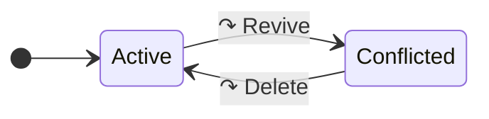
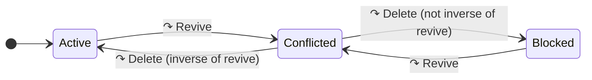

# Reattach

This file documents the workings of `Reattach` marks.

We distinguish two flavors of `Reattach` marks: "intentional" and "revert-only".

## Intentional Reattach

An intentional `Reattach` represents a desire to bring about a specific state.
This state is different for `Revive` and `ReturnTo` marks:

-   `Revive` mark: the nodes should exist no matter how they were deleted.
-   `ReturnTo` mark: the nodes, if they exist, should be located here no matter how they were moved.

Example:

-   Starting state: [A, B, C]
-   (Seq# 1) User1: delete B
-   (Seq# 2) User2: delete ABC
-   (Seq# 3) User2: intentional revive ABC
-   End state: [A, B, C]

The rebase state-machine for an intentional `Revive` is as follows:

The active `Revive` becomes conflicted when rebased over another `Revive`.
The conflicted `Revive` becomes active when rebased over a delete.

## Revert-Only Reattach

A revert-only `Reattach` represents a desire to revert a specific prior change.
The mark will only take effect insofar as that prior change as taken effect and has not be undone.

Example:

-   Starting state: [A, B, C]
-   (Seq# 1) User1: delete B
-   (Seq# 2) User2: delete ABC
-   (Seq# 3) User2: revert-only revive ABC
-   End state: [A, C]

The rebase state-machine for an revert-only `Revive` is as follows:

The key difference with the intentional `Revive` is that when a conflicted revert-only `Revive` is rebased over a delete,
the `Revive` only becomes active again if the delete was the inverse of the `Revive` that conflicted the revert-only `Revive`.
If it isn't, then the revert-only `Revive` becomes blocked and can only be unblocked by the nodes being revived again.
