# Fluid DDS Storage: Virtualization and Incrementality

> Note: Many terms link to the [Glossary](#glossary) at the end of this document the first time that they are introduced. Items in a blockquote (such as the text you are reading right now) provide helpful context but are not strictly necessary to understand a topic.

## Overview

This document discusses options for providing a Fluid DDS with efficient, large-scale storage that organizes data in a tree structure. Its primary goal is to allow a DDS a practical way to store documents that can grow very large (potentially much larger than client memory). The SharedTree DDS (currently in development) is an example of a DDS that has this requirement. This necessitates both an architecture and an API that differ significantly from what are currently available to a DDS. Ideally, these would be introduced at the container level and provided as a service that any DDS can use rather than being exclusive to a single DDS (like SharedTree).

## Virtualization and Incrementality

Existing Fluid DDSes generally assume that their documents will fit entirely in a client's memory. This document does not make this assumption and introduces additional techniques for reading and writing data to storage, namely, the ability to page in [virtualized](#glossary) portions of the document and upload portions of the document [incrementally](#glossary). In this way, only some subset of the document that the client wishes to inspect and which fits in its memory need be available at any point in time. This subset might change as the client inspects different parts of the tree; old data which it no longer cares about is paged out as it pages in new data. Likewise, a client can update the document one piece at a time by uploading to storage only the part of the document that it has in memory.

> As presented above, the amount of the document that a client can view at once is limited by a client machine's memory. An optimization might expand that size to the amount of _disk_ space available to a client by using an on-disk cache (e.g. indexDB). But even this doesn't fundamentally change the approach for virtualization because a document might fit neither in a client's memory _nor_ its disk, either because the document is impressively huge or the disk is already close to full.

Allowing for partial downloads of the tree has implications on the layout and structure of the stored data, which this document will explore.

> The downloaded region of the tree is always strictly within a client's [partial checkout](#glossary). A partial checkout is a client's "working space" restricted to some particular region of the tree. It is sanctioned by the server; the server knows that the client is restricted to activity in that area. The server can therefore enforce that the client downloads content in that area exclusively, and the server can filter the ops that it delivers to that client to be only the ones relevant to that area. This can provide the server a way to enforce permission boundaries for different parts of the tree as well as provide improved efficiency for clients since they will receive fewer ops. The implementation of partial checkouts itself is outside the scope of this document, but this document will provide the fundamental building blocks for such an implementation.

## Blobs and Chunks

In order to allow virtualization and incremental writes, the DDS splits the tree into contiguous regions of nodes called [chunks](#glossary). Chunks are stored in [blobs](#glossary) which are uploaded to the storage service. The Fluid runtime provides two kinds of blobs: summary blobs and attachment blobs. This document doesn't prefer one or the other, so long as a blob can be downloaded lazily and on demand.

> The size of each chunk is not _necessarily_ related to the size of a blob; multiple chunks could go into a blob. Different parts of the application may use different sizes of chunks for performance reasons: typically in memory data-structures will want smaller chunk sizes than persisted ones. For the storage layer, the entire contents of each blob can be thought of as a chunk to simplify the reasoning even if the actual encoding is a collection of chunks that are adjacent in the tree.

The responsibility of dividing the tree into chunks is given to a [chunking algorithm](#glossary). A chunking algorithm might split a tree into something like the following:

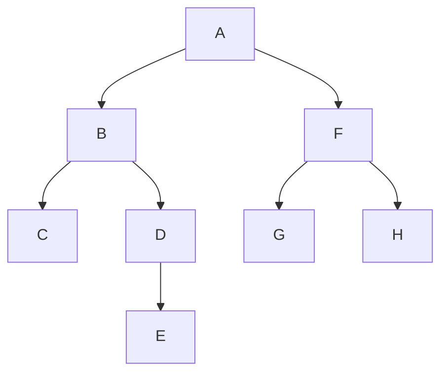

---

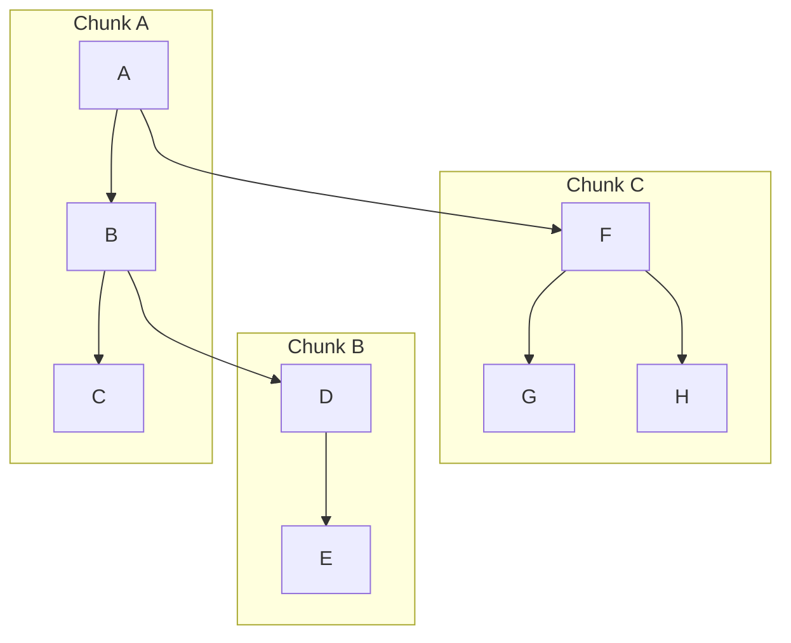

> For most practical applications, chunks will contain many more nodes than in the illustration above.

The implementation details of a chunking algorithm are outside the scope of this document. Many implementations are possible, and different applications might wish to choose one or another. All chunking algorithms have the constraints that:

-   All nodes in a chunk are contiguous
-   No two chunks intersect/overlap
-   Every node in the tree belongs to a chunk

> Chunking algorithms might be deterministic, meaning that they always chunk the same tree in the same way for all clients, or they might be tunable by a specific client's parameters. Which approach makes the most sense depends on whether clients store chunks in memory or only long-term storage, and whether or not the chunking is performed by a single client or split up across multiple clients.

## The Chunk Data Structure

Chunks contain references to the chunks below them in the tree. In the diagram below, Chunk A has a reference to Chunk B, and Chunk B has a reference to Chunk C:

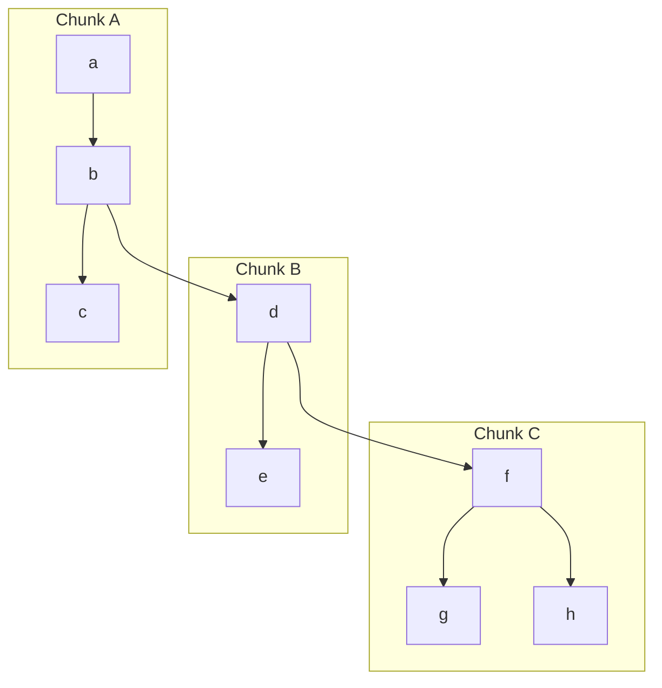

Node _b_ has two children, _c_ and _d_, but _c_ is inlined and part of the same chunk as _b_ (Chunk A) whereas _d_ is in a different chunk (Chunk B) and is stored by reference. Walking from _b_ to _c_ is a synchronous operation because _c_ is already in memory; walking from _b_ to _d_ is an asynchronous operation that may require downloading Chunk B first. This is the pattern of virtualization for walking down the tree; chunks are loaded lazily on demand.

The chunks themselves implicitly form another tree:

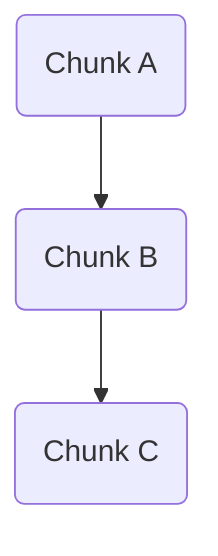

The following sections will examine some of the general properties of this "chunk tree."

### Immutability

Except where stated otherwise, this document assumes that blobs are immutable and [content-addressable](#glossary). This means that once a blob has been created it can never be updated/changed. Instead a new blob must be created, even if most of its contents remain the same. The replacement blob will always have a different key than the original blob, because the key is derived from a hash of the blob's contents, which are different. Any content that needs to reference the new blob instead of the old one must also be updated with the new key.

Suppose, in the diagram above, that Chunk A, B and C are each stored in Blob A, B and C, respectively. A client changes the value of _h_ which changes a value in Blob C. This means that Blob C must be replaced by a new blob, Blob C', which is identical to Blob C but contains a different value for _h_. Blob C' also has a different key than Blob C, and that means that the reference to Blob C in Blob B is now incorrect. Blob B must be updated to point to Blob C', a.k.a. the "new Blob C". Therefore, Blob B must also be replaced with a Blob B'. Finally, Blob A, which has a reference to Blob B, must change for the same reason. This chain reaction ends at Blob A because Blob A is at the top of the tree (the "root blob") and has no parent. Even though only Chunk C changed, all three chunks had to be replaced. In general, the entire [spine](#glossary) of the tree above any edited node must be replaced for each edit.

### Copy-On-Write History

The need for "spine replacement" has a useful side effect: it makes it very simple to keep track of [revisions](#glossary) of the tree over time, i.e. the tree's [history](#glossary). Consider a tree made up of five chunks:

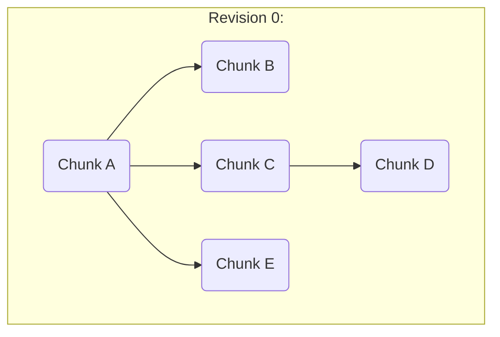

First, a client makes an edit to a node in Chunk B, so Chunk B and Chunk A (the spine) are replaced with Chunk B' and Chunk A'. This produces the next revision of the tree, revision 1:

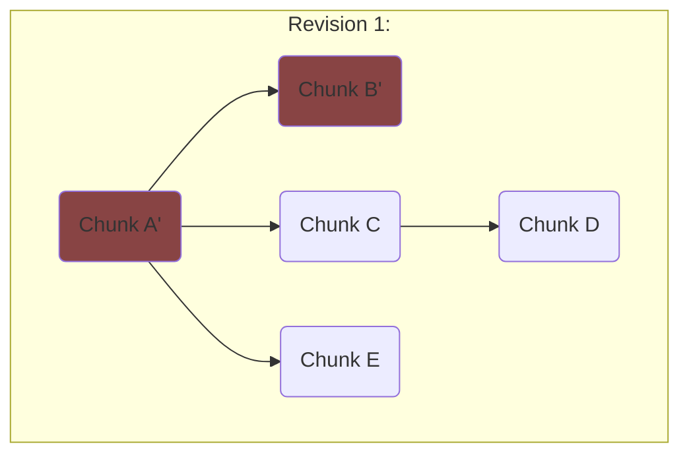

Next, the client [edits](#glossary) Chunk D, resulting in the replacement of A', C, and D to form revision 2:

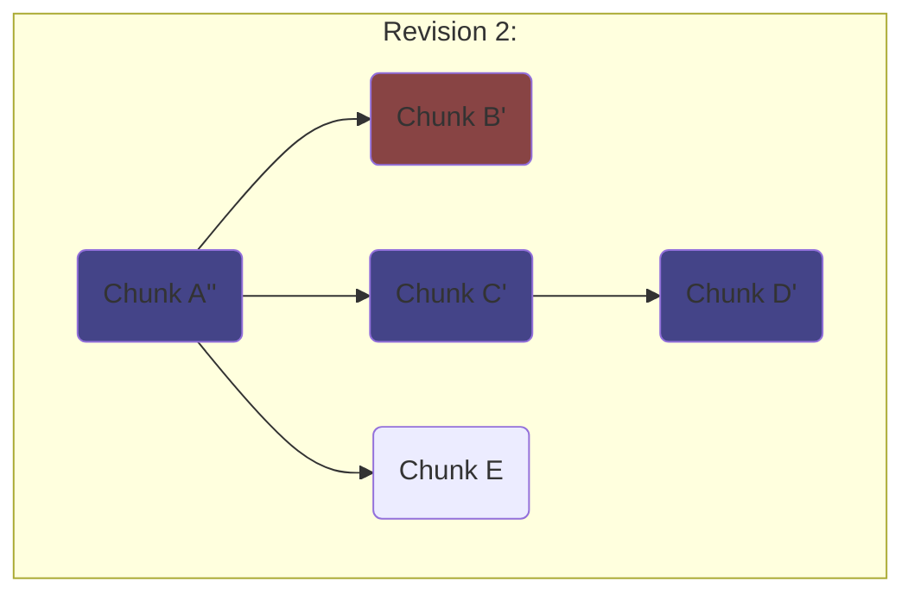

Consider Chunk A and Chunk A', the predecessors to A''. They still exist in storage even though they are outdated and have been superseded by A'' in the latest revision of the tree (Revision 2). They are immutable and still retain the same contents that they did in prior revisions (their children are Chunk B/C/E and Chunk B'/C/E, respectively). Likewise, Chunk B, the predecessor to B', still exists (and the same for chunks C and D). In fact, _all_ chunks from all revisions remain accessible and untouched from their original state. This means that one can walk down from the root chunk of any revision and retrieve the entire contents of the tree as it had been at that revision. And conveniently, every revision produces exactly one new root chunk because a spine was cloned for each and the root chunk always belongs to any possible spine. This means that every revision is "captured" by a unique root chunk, and preserving the history of the tree can be accomplished by keeping references those root chunks. Storing the entire history of the tree is as simple as keeping a log of keys to those root chunks:

| Revision | Root Chunk Key |
| -------- | -------------- |
| 0        | A              |
| 1        | A'             |
| 2        | A''            |
| ...      | ...            |

This forms a [copy-on-write](#glossary) data structure. Each revision of the tree shares unchanged blobs with the previous revision and incurs no cost for creating a new revision except for that of reproducing the blobs that have changed (the spine). Walking down the tree of chunks from a given root always yields a stable view of the state of the tree at that revision, i.e. a chunk tree will never change as a client walks around it. This is a useful property for providing [snapshot isolation](#glossary) because the tree reader does not have to worry about edits from other clients or its own concurrent edits affecting its view.

### Server-side Blob Retention

It is a requirement that blobs be sufficiently long-lived on the server so that a client can download them when required. If a document is retaining its history (using the above approach) then all blobs containing all chunks for all revisions must be available indefinitely. For documents that do not retain their history, blobs should live at least long enough for all clients to be able to fully reconstruct the current state of any revision it might need access to; i.e. all blobs transitively referenced by summaries back to the the newest one from before the session timeout threshold (30 days ago).

> A client that goes offline for an extended period of time is a good example of when it's useful to keep old blobs available even when they are from revisions that are well-behind the most up-to-date revision. If, for example, blobs are retained for 30 days after they are no longer referenced by the current summary, then a client that disconnects from the server can keep working while offline, so long as it reconnects within 30 days. This is because at the time it reconnects, it (or other clients) may need access to the revision from before the client's disconnection in order to rebase the ops that were created while offline.

Both summary blobs and attachment blobs have lifetimes determined by their presence in the summary tree. If a summary ceases to include either a (summary) "blob" or an "attachment" then the blob will eventually be forgotten. This API may be at odds with the storage techniques described in this document. For documents retaining history, the list of blobs to retain grows unboundedly, increasing the summary size indefinitely. And even for documents that don't retain history, it may be awkward to maintain a list of all "live" blobs; for large documents the number of blobs could scale so large that even the list of references to those blobs needs to be incrementally updated and submitted.

One possible alternative would be to provide a mode in which the server assumes each blob should be retained indefinitely until the DDS explicitly requests that it be deleted. This gives the DDS complete control over the lifetime of blobs; the DDS tells the server to create blobs and it tells the server when to delete blobs. This degree of freedom allows a DDS to manage its blobs in the most efficient way possible, providing clear lifetime guarantees for blobs that the DDS needs to retain and reducing the amount of storage space that might be otherwise wasted on blobs that the DDS no longer needs.

A similar approach that balances lifetime management between the DDS and the runtime would be for the DDS to inform the runtime when a new summary no longer uses a particular blob. The runtime would wait for the preceding summary to be old enough (the summary containing the delete reaches the session timeout threshold, currently 30 days), then it would perform the delete if no future summaries recreated/reused that blob.

### Write Amplification

The drawback to replacing the spine for every edit is the intense [write amplification](https://en.wikipedia.org/wiki/Write_amplification). For every write to the tree, every chunk of the spine above the edited node is replaced, incurring multiple blob uploads for what began as a single update to a single value. To make matters even worse, each of these uploads must wait to begin until it knows the key of the blob below. Assuming that a blob's key is determined by the server and is not known until the upload completes, all uploads in the spine must occur one-by-one and are completely unparallelizable.

> The uploads could happen in parallel if a client were able to predict the keys for each new blob ahead of time by running the same hashing algorithm as the server does on the contents of the blob. If the client then sent the key to the server as well as the contents, the key could be used as a checksum to verify the integrity of the upload as well as ensure that the correct hashing algorithm was used.

Paying this cost for every edit is a burden for a client desiring high write throughput. The next section, "[Amortizing Writes](#amortizing-writes)" will explore how to spread this cost out over multiple edits.

> Later, we'll look at how the length of the spine can be minimized, bounding the cumulative size of the uploads. Some different approaches are explored in [Appendix A](#appendix-a-chunk-data-structure-implementations).

## Amortizing Writes

Writes to the chunk data structure are expensive. Even in the best case (a small tree, in which only one chunk has to be updated for each write operation) this scheme is still doing _a blob upload for every single write_. This is unacceptable for a DDS which requires high write throughput. There are different ways to mitigate this cost; one is proposed below.

### Write-Ahead Log and Intermittent Flushing

Write frequency can be reduced by only uploading modified chunks every so often, rather than after every edit. This amortizes the cost of uploading chunks across many writes. Each "[flush](#glossary)" of the chunks to storage uploads the union of all the spines that have changed since the last flush:

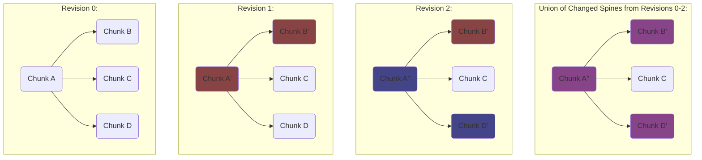

To keep track of the state of revisions between flushes, a client keeps edits in a log in memory. As long as the log of edits doesn't grow too large, it's inexpensive for a client to compute the current state by applying all the edits in the log that were sequenced after the last flushed state. For example:

| Revision | 0   | 1   | 2   | 3   | 4   | 5   | 6   | 7   | 8   | 9   | 10  | 11  | 12  | 13  | 14  | 15  | 16  | 17  | 18  | 19  | 20  |
| -------- | --- | --- | --- | --- | --- | --- | --- | --- | --- | --- | --- | --- | --- | --- | --- | --- | --- | --- | --- | --- | --- |
| Edits    |     | A   | B   | C   | D   | E   | F   | G   | H   | I   | J   | K   | L   | M   | N   | O   | P   | Q   | R   | S   | T   |
| Flush    |     |     |     |     |     | \*  |     |     |     |     | \*  |     |     |     |     | \*  |     |     |     |     | \*  |

In the table above, a flush happens every five edits. A client that joins a session after edit 7 has been sequenced would first download the chunks that were flushed at revision 5, which include the state resulting from edits A - E. Then it would apply edits F and G to catch up to the current state of the document.

> In practice, flushes can happen much less frequently than every five edits. A client can choose a frequency that gives ideal performance for its usage patterns. The flushes can be done in the background so a client is not blocked on a flush as it continues to receive local or incoming edits.

> This is quite similar to the existing summarization model in the Fluid Framework. A DDS has a log of operations which represent edits to its data, and every so often a client using that DDS uploads a summary which represents the cumulative state after applying all operations up to that point. A client only needs to know the latest summary and the list of operations that happened after that summary in order to know the current state of the DDS. Ideally the DDS would leverage summarization directly, writing its chunk data structure as the contents of the summary. There are a few limitations that currently prevent this from being possible:
>
> -   Summary trees currently do not support virtualization. A client cannot have a partial checkout of the tree; it must download all chunks when it connects. However, summary virtualization is a feature in development and once completed could allow a DDS to download only the chunks that it wants, provided it is able to conform its chunk data structure to the shape of the summary tree.
> -   Summary trees allow incrementality, but the API to do so is not yet exposed. Summary trees can contain references to blobs in a previous summary, called blob handles. This allows handles to represent data that has not been changed and does not need to be reuploaded. However, handles cannot currently be constructed by a DDS without sniffing implementation details of the runtime. There is also an ongoing development effort to automatically divide summaries into blobs and upload them in pieces, however, this doesn't give the DDS fine-grained control over how/where the summary is divided into chunks.
> -   The frequency of summaries cannot be controlled by a DDS. Ideally, a DDS has control over how often it flushes its chunks in order to optimize for best performance. Summaries currently happen across an entire Fluid container all at once, so even if an API were exposed to allow a DDS to provide hints for summary frequency, a DDS would still risk fighting over policy with other DDSes in the container.
> -   There is only ever one summary client at a time that is responsible for uploading summaries. However, with a document that is too large to fit in a single client's memory all at once, the flush might exceed the summarization timeout as that client pages parts of the tree in and out in order to generate the summary.

> It is interesting to compare this to filesystem implementations. Modern copy on write file systems (for example [ZFS](https://en.wikipedia.org/wiki/ZFS)) often use this same approach: updates are accumulated in memory ("transaction groups" for ZFS), and periodically flushed to disk if they grow too large or too old, just like Fluid summaries. Also edits (ops) are recorded as they come in into a write ahead log ("Intent Log" in ZFS) with lower latency to minimize data loss from crashes/disconnects/power-loss.

There are many different options for how the log might be stored. Here are two:

1. The log can be stored in memory in a data structure that supports efficient appending of new values and efficient eviction of old values. New incoming edits are appended to the log. When a flush occurs, all edits from before the flush are evicted from the log. The log can be serialized to and loaded from the Fluid summary by a normal summary client.
2. The log can be split up according to the part of the tree that each edit applies to, and then stored directly in the chunks themselves. Each chunk is then self-describing; it contains both its last flushed state and also all the edits needed to catch it up to its current state. This is only feasible if the immutability constraint of blobs is relaxed. Blobs need not be fully mutable, but they must be at least "append-only" so that the edits can be progressively tacked on to them with minimal network/storage cost. When a chunk becomes full of edits and cannot append any more, a flush of those edits occurs, incurring a spine update.

After a flush completes, all clients are notified of the flush and the new chunk root resulting from that flush. They can then update their in-memory copies of the tree, update caches, etc. The flushing itself can be performed by an elected client (e.g. the oldest client, or the result of some other heuristic decided via the Fluid quorum APIs, etc.) which performs a flush periodically, notifying all clients when each flush completes via a special "flush op" that contains the new chunk root. Because flushes happen in the background and take time to complete, care must be taken to ensure that flushes are synchronized correctly in the case where the elected client changes during an ongoing flush. It's possible for two flushes to start concurrently, in which case the second one to finish will be conflicted; if it were to complete, it would incorrectly overwrite data in the first flush. By tagging each flush op with some metadata about when the flush began, clients can know whether it is correct to adopt the state in the flush op (which is the case when _no other flush ops were sequenced in the interim_).

> More precisely, a flush op is valid if and only if there are no other flush ops sequenced between the latest [sequence number](#glossary) delivered to the client at the start of the flush, and the sequence number of the flush op itself. (Conceptually this is the [reference sequence number](#glossary) of the flush, but it is not to be confused with the reference sequence number of the flush _op_ because the flush begins some time before the flush op is sent). For example, a conflicted scenario might resolve like this:
>
> 1. Client A, the elected flushing client, begins a flush. At that time, the latest sequence number delivered to Client A is 10.
> 2. Client B is elected to be the new flushing client
> 3. Client B begins a flush. At that time, the latest sequence number delivered to Client B is 10.
> 4. Both Client A and Client B receive the next five ops, their latest known sequence numbers are now both `15`.
> 5. Client A's flush finishes uploading, so Client A submits a flush op that contains a handle to the new chunk root and the reference sequence number `10` (_not_ `15`).
> 6. The server sequences Client A's flush op with sequence number `16`.
> 7. Client B's flush finishes uploading, so Client B submits a flush op that contains a handle to the new chunk root and the reference sequence number `10`.
> 8. The server sequences Client B's flush op with sequence number `17`.
> 9. Client A receives the op with sequence number `16` which is its flush op. It acknowledges the new chunk state, updating its caches and evicting edits from its log that are now unnecessary.
> 10. Client B receives the op with sequence number `16` which is Client A's flush op. Like Client A, it acknowledges the new chunk state. However, Client B also now knows that the flush it attempted earlier is conflicted, because the flush op from Client A was sequenced before it. It decides to begin a new flush based off of the new state.
> 11. Both Client A and Client B receive the op with sequence number `17`, which is Client B's flush op. They both recognize that the flush is conflicted, because the reference sequence number it included is `10`, but there has been another flush op (Client A's, at `16`) sequenced between `10` and the current sequence number `17`. This makes it evident that Client B's flush started before it knew about the most recent flush op from Client A, so both Client A and Client B ignore the op.

## Random Reads

Given only the root chunk of a tree, reading a leaf of that tree requires walking down to the leaf and downloading all chunks along the way (once again, the spine).

However, a client wanting to read a particular node might not have any interest in reading the nodes above it. It knows the [path](#glossary) from the root node to a target node in the tree and wants to read only the node at the end of that path. This is called a [random read](#glossary): a read that has no necessary relationship to any read before it. For a practical example of a random read, consider an application that allows saving "bookmarks" or "links" to content somewhere in the tree which can be easily dereferenced later to access that content. Or, note that the first read of a partial checkout can be a random read if it doesn't care about its ancestry. Random reads also give applications more architectural freedom as unrelated components can use paths to query different parts of the tree without having to pass around the root of the tree or the root of a subtree to all components. However, such a read still requires downloading the whole spine of chunks above the target node in order to find it. These downloads cannot be done in parallel; each chunk must finish downloading in order to find the keys of the chunks below it. A client could easily implement a "random" read function itself that simply walks down the tree. However, providing a random read API as a built-in function will allow it to take advantage of the optimizations detailed in [Appendix A](#appendix-a-chunk-data-structure-implementations) which reduce the cost of a random read, especially in deep trees.

## Non-Random Access

An application might read all the data in a given subtree, or it might read some small data out of each subtree in a sequence (like the names of files in a directory).
It is also likely to edit in non-random ways, for example do many consecutive edits in one area of the tree.
Optimizing these cases is important, and mostly comes down to putting data that is accessed together close together in the tree (i.e. in the same blob or in nearby blobs)
This allows for more effective amortizing of writes, reduced memory use and bandwidth, and faster read times.
See [Appendix A](#appendix-a-chunk-data-structure-implementations) for more information.

## Tree Shapes

As shown so far, the performance of both reads and flushes depends on the length of the spine of each node being read or edited. Even for trees of the same size, that length of those spines varies for differently shaped trees. For example, a tree that is wide and shallow doesn't need to flush very many chunks when a leaf node is edited:

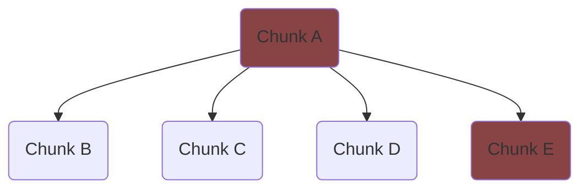

A write in E will reupload only two chunks: Chunk A and Chunk E.

> Leaf nodes in the tree are both the farthest nodes from the root as well as the location where applications typically store most of their data. They are the nodes most commonly edited.

But deeper, narrower trees are more problematic:

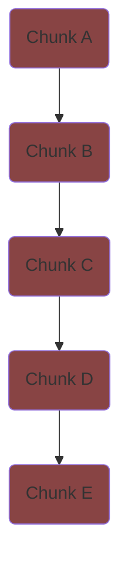

This tree might have the same number of nodes and chunks as the tree above, but it takes many more reuploads (five) to edit a leaf simply because the logical tree has a deeper shape.

There's also the problem in the other direction; trees which have extremely long sequences of children under the same parent (and are therefore very wide). Consider this logical tree with one million nodes under a single parent:

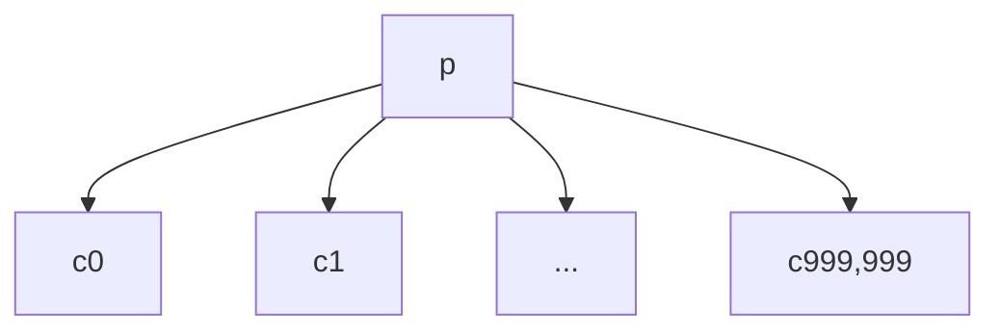

In order to divide this tree into chunks, ranges of children are grouped together (in this case there are 100 nodes in each chunk):

```mermaid
graph TD;
    subgraph Chunk P
        p
    end
    subgraph Chunk 9,999
        p-->c999,900
        p-->c999,901
        p-->cx9[...]
        p-->c999,999
    end
    subgraph ...
        p-->cxx[...]
    end
    subgraph Chunk 1
        p-->c100
        p-->c101
        p-->cx1[...]
        p-->c199
    end
    subgraph Chunk 0
        p-->c0
        p-->c1
        p-->cx0[...]
        p-->c99
    end
```

Although the layout of these chunks is theoretically valid, there are now 10,000 chunks underneath Chunk P. It may be the case that Chunk P doesn't have enough space to hold all the keys of those 10,000 children. A chunking algorithm isn't able to satisfy the requirements for the chunk size without doing something special for this case. There are many different ways to solve this. One is to arrange the child chunks underneath the parent chunk in a data structure (which is also divided into chunks) that provides efficient access to a child chunk given the index of a child node. [Appendix A](#appendix-a-chunk-data-structure-implementations) details such a structure, the ["Sequence Tree"](#sequence-tree).

Clearly, the tree's shape alone can have a significant effect on both read and write performance. The maximum length of the spine of chunks for a node is the depth of the node divided by the smallest height of a chunk (which is a constant). In the worst case (leaf nodes), this means a spine of length `D` where `D` is the depth of the tree (all chunks might have a depth of just one node). In terms of the number of nodes in the tree, `N`, it's also `N`, because nothing can be assumed about the shape of the tree (in the worst case it is the "[deepest tree](#glossary)" where the depth equals the number of nodes). So flushing even just a single spine requires `O(N)` uploads for `N` nodes in the tree.

### Optimizing Tree Shapes

So the worst case performance of both reads and writes, in terms of blob downloads and blob uploads, respectively, is `O(N)`. Given a decent chunking algorithm and trees that aren't pathologically shaped, most trees will do far better than incur an upload or download per node per operation, but the asymptotics are nonetheless unenticing. However, if the chunks in the tree can be re-organized into a different hierarchy, then the worst case can be much improved. It's possible to organize the chunks in such a way that both reads and writes can be bounded to `O(log(N))` for any shape of tree. This can be accomplished by implementing a more intelligent chunk data structure. See [Appendix A](#appendix-a-chunk-data-structure-implementations) for an analysis of some different implementations of the chunk data structure.

## Generalization

One open question regarding this architecture is if it should be part of a specialized DDS, or if it should be part of the Fluid Framework as a container-level service available to all DDSes. Ideally, any DDS would be able to leverage the virtualized and incremental scalability described in this document. Such a service would provide:

-   A tree-like storage service that is accessible at any time and provides virtualized download of nodes in the tree. It would also expose a user-friendly mutation interface that handles incremental updates of the store as the client modifies the tree.
-   A way to configure the chunking strategy for the stored tree. Different DDSes might want regions of data to be downloaded together or separately depending on their data model and access patterns. Note that this requires using either a Simple Chunk Tree or a SPICE Tree (as described [Appendix A](#appendix-a-chunk-data-structure-implementations)) in order to give the necessary flexibility for custom chunking.
-   A canonical (but optional) way to store and query the history of a DDS as a series of revisions. This would be virtualized for efficient access.

This could be implemented by sharing a single storage tree among all DDSes where each DDS owns a specific subtree. If all Fluid DDSes were to adopt this service as their primary means of storing data, then this would provide some powerful benefits at the container level:

-   All DDSes would scale with large data sets, and therefore the entire container would scale with large data sets
-   The service could track the revisions of the container itself, rather than just the revisions of each DDS individually. This could provide snapshot isolation at the container level, meaning that any transaction could view a consistent tree of state for its lifetime regardless of the activity of the other DDSes in the container.
-   This would be a big step towards offering container-level history

Such a service would reshape the summarization API as well. Rather than producing a summary tree every so often, a DDS would be asked to flush any sequenced data that has not yet been committed to storage every so often. Or, perhaps the DDS could use the storage writing APIs at any point in time; each mutation would contribute to a buffer of storage instructions that would be flushed intermittently behind the scenes.

## Appendix A: Chunk Data Structure Implementations

Below are detailed some examples of chunk data structures. These structures hold the chunks of the [logical tree](#glossary) (the tree of data). This appendix will go some different high-level designs for chunk data structures and note the tradeoffs between them.

### Simple Chunk Tree

The simplest chunk data structure is just a tree whose nodes are the chunks of the logical tree. This is the data structure we've been implicitly analyzing so far. It has the poor `O(N)` performance for both reads and writes, but it is simple. To demonstrate, consider the logical tree below. It has been annotated with the edges from parent to child nodes so that the path to each node is visible:

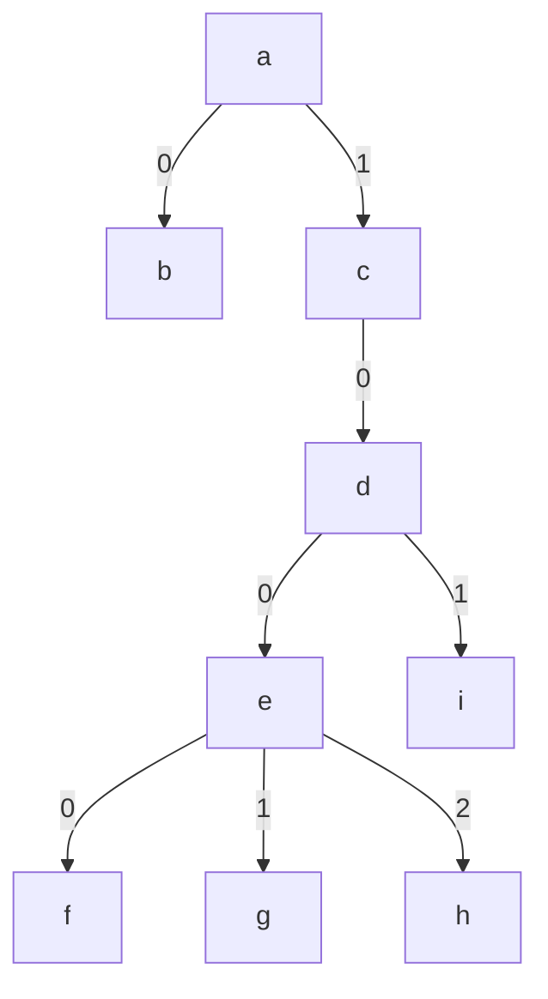

> The path to node _h_ is "1/0/0/2"

It is chunked by a chunking algorithm:

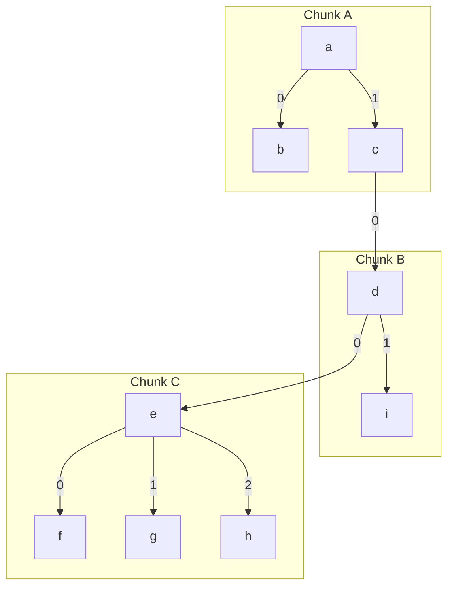

And this implicitly forms a tree of chunks:

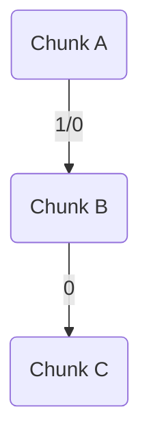

Note how the edges in the logical tree concatenate to form the edges in the chunk tree; these are necessary to look up nodes by their paths. For example, the path "1/0/0/2" has a prefix "1/0" which matches the edge from the root chunk A to Chunk B; the next part of the path ("0") is used to find Chunk C, and the rest ("2") points to node _h_ within Chunk C. This data structure is simple but suffers from the problems with read and write amplification discussed above. A deep logical tree might form a very deep chunk tree. The next two data structures provide strategies to mitigate that problem.

---

Advantages:

-   The tree structure is simple to implement and reason about since it is directly derived from the logical tree.
-   Chunks boundaries can be chosen arbitrarily with few restrictions. This means the tree can be optimized such that contents which belong together semantically can be guaranteed to be downloaded and uploaded together, minimizing network traffic as a client walks around the tree.
-   The schema of the logical tree can be used to give hints for chunk boundaries. When a schema is knowledgeable about where the virtualization boundaries of the tree are, it can provide a better read API. Descending into child nodes within the same chunk is a synchronous operation, and only when crossing over a chunk boundary is it an asynchronous operation.

Drawbacks:

-   Poor performance for deep trees
-   Poor performance for large sequences of nodes under a single parent without using a specialized data structure (see "Sequence Tree" below)

### Sequence Tree

The Sequence Tree is used specifically in the aforementioned problematic case where many, many child chunks are under a single parent chunk. It is in the [B-tree](https://en.wikipedia.org/wiki/B-tree) family; it organizes the child chunks as leaves in a balanced tree to guarantee that each chunk in the sequence is at most `log(C)` chunks away from the parent chunk, where `C` is the number of children. It is also optimized for range operations; it can insert, delete, and move a large range of children atomically without resorting to doing an individual insert/delete/move for each node in the range. It can scale to be arbitrarily large and can accommodate any number of children, which a parent chunk in general cannot do because they have a finite amount of space in which to store their children's keys. The Sequence Tree has been successfully prototyped although its implementation details are outside the scope of this document.

A Simple Chunk Tree could, for example, leverage a Sequence Tree whenever it encounters a node with a number of children that exceeds the threshold of possible children under a single parent. This would give a Simple Chunk Tree ideal performance for this scenario, although it does not help the Simple Chunk Tree's poor handling of deep trees.

### Path-Based B-Tree

The Path-Based B-Tree is an alternative way to store the entire tree, i.e. it replaces the Simple Chunk Tree (and removes the need for the Sequence Tree as well). It puts all the nodes in a key-value data structure optimized for sorted keys, like a B-tree or similar, using the path of each node as its key. Consider the same logical tree as above:


Note that its paths are sortable. For example, they can be sorted lexically to order the nodes as `a`, `b`, `c`, `d`, `e`, `f`, `g`, `h`, `i` which produces an in-order traversal of the tree.

| Node | Path      |
| ---- | --------- |
| a    | "\_"      |
| b    | "0"       |
| c    | "1"       |
| d    | "1/0"     |
| e    | "1/0/0"   |
| f    | "1/0/0/0" |
| g    | "1/0/0/1" |
| h    | "1/0/0/2" |
| i    | "1/0/1"   |

> Other sorts are possible too, but this one allows for some helpful optimizations in the B-tree itself (see Potential Optimizations below).

Sortability is the only requirement for keys of a B-tree, thus the path for each node and the data stored at each node can then be used as keys and values, respectively, in a B-tree. After inserting these into a B-tree with a branching factor of three, for example, the tree might look like:

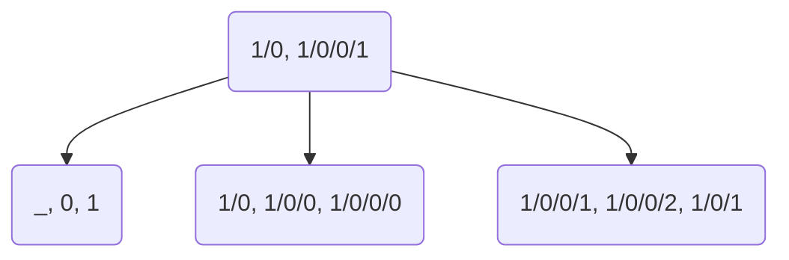

The branching factor of the B-tree is ideally as large as possible while still keeping each interior node within the maximum chunk size. Each interior node of the B-tree can then be stored in a single chunk, as can each leaf node:

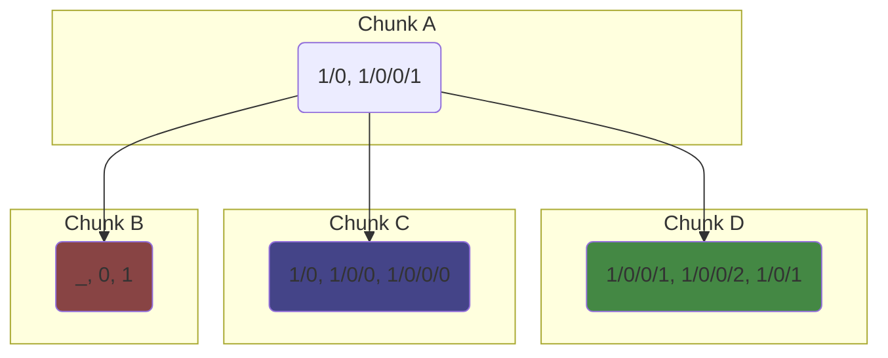

> These diagrams only show the keys for each node, but the value/content of each node can be stored either inline alongside the keys, or out of line in separate blobs, depending on the size and consistency of the data. As nodes are added or deleted the tree rebalances automatically just like any B-tree.

Every so many consecutive nodes in sorted order comprise a leaf chunk, and interior nodes are stored in chunks as well:

| Chunk | Nodes         |
| ----- | ------------- |
| A     | Interior Node |
| B     | [a, b, c]     |
| C     | [d, e, f]     |
| D     | [g, h, i]     |

With this approach, the unbalanced logical tree has been organized into a tree of chunks that guarantee at most `O(log(N))` uploads/downloads per write/read, because B-trees by definition remain balanced. Even in this small example, the advantage over the [Simple Chunk Tree](#simple-chunk-tree) is clear; the spine to a leaf chunk in the Path-Based B-Tree is only two chunks long, whereas in the Simple Chunk Tree it is three. These differences become more dramatic as the tree gets deeper.

> The path-based B-tree in this example has more total chunks than the simple chunk tree (four vs. three) and therefore requires more storage. However, that overhead also scales logarithmically and becomes fairly negligible for trees with large branching factors.

---

Advantages:

-   The lookup of any node by path requires at most `O(log(n))` chunk downloads.
-   Editing a node requires at most `log(n)` chunk uploads.
-   The scheme is conceptually simple and it's straightforward to break the tree into chunks. There is no structural/shape analysis of the tree required to figure out the chunk boundaries, i.e. it doesn't need a special chunking algorithm at all; the "chunking algorithm" is just the B-tree algorithm.
-   A suboptimal implementation could use an off-the-shelf B-tree library for quick prototyping. However, a production implementation would very likely want optimizations which necessitate a custom B-Tree implementation (see Potential Optimizations below).

Drawbacks:

-   The chunking process is inflexible. Traversing trees of certain shapes will require jumping around to different parts of the B-tree even when traversing nodes that are adjacent in the logical tree. There is no sort order or chunk size that can guarantee good locality for all regions of a tree of arbitrary shape. Accessing any node in the tree is an asynchronous operation because any part of the logical tree might belong to a chunk that has not yet been downloaded.
-   The implementation is significantly more complicated than the Simple Chunk Tree.

Potential Optimizations:

-   Path keys in the B-Tree are always sub-paths of the keys in the B-Tree node above them. Eliminating this redundant shared prefix from all paths greatly reduces the storage needed for the keys, especially for very deep trees (which will have very long paths for leaf nodes). It also makes move operations more efficient since B-tree nodes that do not contain the part of the path that got updated by the move don't need to change.
-   Deduplicate/intern sections of paths within a B-Tree node that are repeated to save additional storage. This can be done with a prefix tree on each B-tree node.

### SPICE Tree

The Spatially Partitioned, Ideally Chunked Entity tree allows the logical tree to be chunked arbitrarily by a chunking algorithm. It then organizes those chunks within multiple trees of varying detail that give the same asymptotics for reads and writes as the path-based B-tree (`O(log(N))`). More specifically, the SPICE tree takes a large tree of nodes and breaks it into chunks; then, it takes the resulting tree of chunks and breaks _it_ into chunks, and repeats this process until there is only one chunk. Consider a tree of nodes:

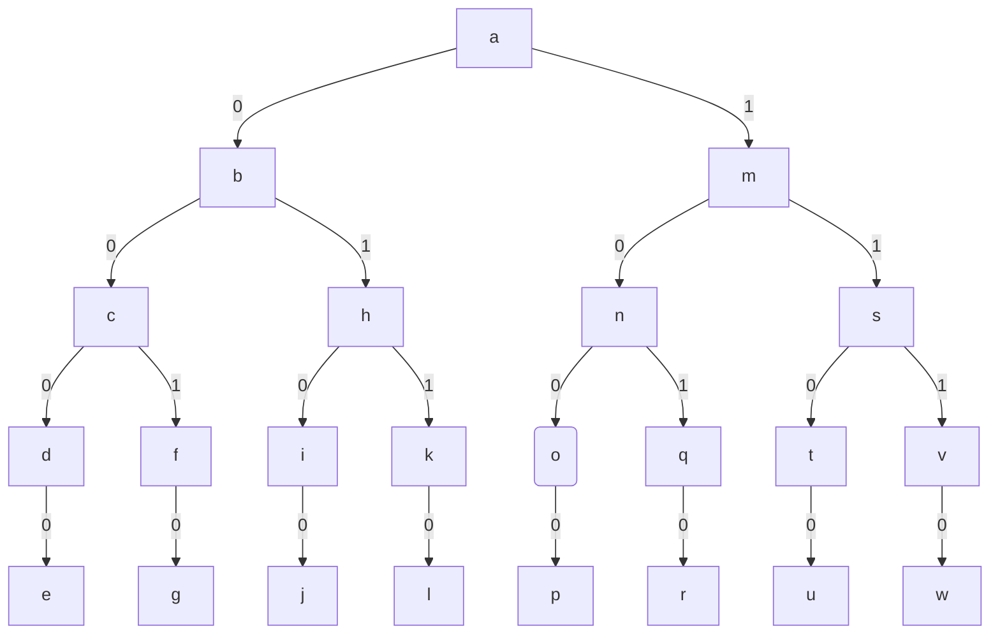

> The illustrations here use a perfectly balanced tree and place only a few nodes in each chunk, but in practice neither of these things need be the case. Most document trees that require use of a SPICE tree will be far larger, will not be balanced, and may put hundreds or thousands of nodes in each chunk (depending on the size of the content the nodes contain).

Now suppose a chunking algorithm examines the shape and contents of tree and chunks it like so:

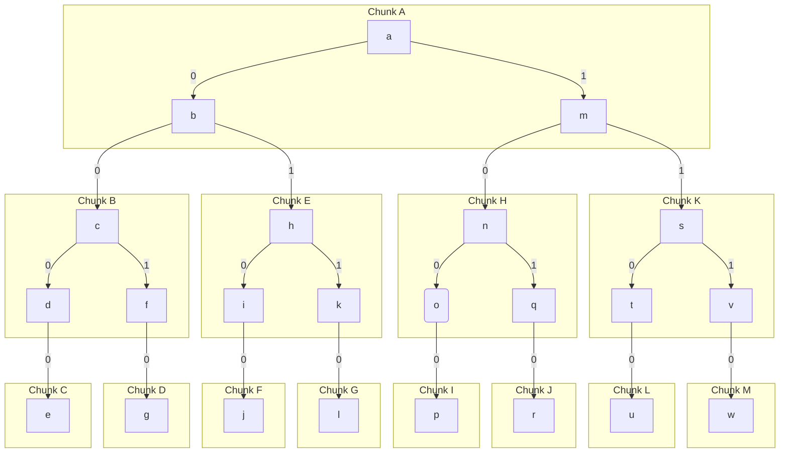

This yields the following chunk tree (this is the "simple chunk tree" described earlier):

```mermaid
graph TD;
    A--0/0-->B--0/0-->C
    B--0/1-->D
    A--0/1-->E--0/0-->F
    E--1/0-->G
    A--1/0-->H--0/0-->I
    H--1/0-->J
    A--1/1-->K--0/0-->L
    K--1/0-->M
```

| Chunk | Path to Chunk Root |
| ----- | ------------------ |
| A     | ""                 |
| B     | "0/0"              |
| C     | "0/0/0/0"          |
| D     | "0/0/1/0"          |
| E     | "0/1"              |
| F     | "0/1/0/0"          |
| G     | "0/1/1/0"          |
| H     | "1/0"              |
| I     | "1/0/0/0"          |
| J     | "1/0/1/0"          |
| K     | "1/1"              |
| L     | "1/1/0/0"          |
| M     | "1/1/1/0"          |

Next, the chunking algorithm runs again, but this time on the tree of chunks rather than a logical tree:

```mermaid
graph TD;
    A--0/0-->B--0/0-->C
    B--0/1-->D
    A--0/1-->E--0/0-->F
    E--1/0-->G
    A--1/0-->H--0/0-->I
    H--1/0-->J
    A--1/1-->K--0/0-->L
    K--1/0-->M
    subgraph Chunk N
        A
    end
    subgraph Chunk R
        K
        L
        M
    end
    subgraph Chunk Q
        H
        I
        J
    end
    subgraph Chunk P
        E
        F
        G
    end
    subgraph Chunk O
        B
        C
        D
    end

```

The new chunks are labelled with the label of their root chunk:

```mermaid
graph TD;
    N--0/0-->O;
    N--0/1-->P;
    N--1/0-->Q;
    N--1/1-->R;
```

| Chunk | Path  |
| ----- | ----- |
| N     | ""    |
| O     | "0/0" |
| P     | "0/1" |
| Q     | "1/0" |
| R     | "1/1" |

This chunking process repeats:

```mermaid
graph TD;
    subgraph Chunk S
        N--0/0-->O;
        N--0/1-->P;
        N--1/0-->Q;
        N--1/1-->R;
    end
```

Eventually, the result is just a single chunk:

```mermaid
graph TD;
    S
```

| Chunk | Path |
| ----- | ---- |
| S     | ""   |

In this way, the SPICE tree creates a ["level of detail"](<https://en.wikipedia.org/wiki/Level_of_detail_(computer_graphics)>) structure, which can be "zoomed into" selectively to find certain items, analogous to the way one finds data in something like a [quad tree](https://en.wikipedia.org/wiki/Quadtree). After this process, the only piece of state required for the tree to be fully queryable is the root chunk _S_ since all other chunks and nodes are contained "within" it.

The path labels on each chunk are important, because they represent a common prefix shared by the paths of all nodes contained in that chunk (or all nodes contained in chunks with that chunk, etc.). A lookup operation that starts at the root knows into which chunk to descend by examining the labels and traversing those which match the target path. For example, suppose a query is made for node _p_ via its path `1/0/0/0`. The query downloads _S_, as it is the only chunk, and discovers in its contents the root chunk of the next layer, _N_. _N_ has four children with labels `0/0`, `0/1`, `1/0` and `1/1`. The path to _p_, `1/0/0/0` begins with `1/0`, so the query follows that edge to get _Q_, which it then downloads. _Q_ contains as its root _H_, which has two children with labels `0/0` and `1/0`. The query follows the next part of the path, `0/0` (the first half of the path, `1/0`, was consumed when going from _N_ to _Q_) to arrive at _I_. It then downloads _I_ and inside finds _p_ as the root node. Since there is no more path to consume, the query has arrived at its target node.

A lookup of any node requires traversing through the "layers of chunks" in this way and will cause as many downloads as there are layers. Each layer differs in size from the previous layer by some (roughly) constant factor, and therefore the number of layers (and downloads) is logarithmic with respect to the size of the tree. So a SPICE tree's spines contain `O(log(N))` chunks, just like the path-based B-tree, and the implications for uploads and downloads is the same.

---

Advantages:

-   Has the performance of the path based B-tree (`O(log(N))` uploads/downloads for random writes/reads) and also the flexibility of the simple chunk tree (chunks can be chosen arbitrarily by a chunking algorithm and hinted at by schema).
-   Automatically handles the "many-children-under-one-node" scenario. There is no need for a Sequence Tree explicitly, because long sequences of nodes will be progressively chunked into a B-Tree like structure by the same algorithm that SPICE tree uses for the rest of the tree.

Drawbacks:

-   The implementation is more complicated than the Simple Chunk Tree.

## Glossary

-   Blob: binary data that is uploaded to and downloaded from a storage service. Blobs are content-addressable and therefore immutable.
-   Chunk: a contiguous region of the tree. Every node in the tree belongs to a chunk.
-   Chunking Algorithm: an algorithm which divides a tree into chunks.
-   Content-addressable: data which can be referred to by a key derived from the data itself. For example, data in a store which hashes each value to produce its key.
-   [Copy-on-write](https://en.wikipedia.org/wiki/Copy-on-write): a data structure which is immutable and therefore must be copied to produce modifications, but which does so efficiently by sharing unmodified state with previous versions.
-   Deepest Tree: a tree with N nodes and depth O(N), i.e. a tree with a branching factor of 1, essentially a linked list.
-   Edit: an atomic change or collection of changes applied to a tree. An edit always produces a new revision of the tree.
-   Flush: writing a batch of changes out to storage. Fluid Framework's summarization can be though of as one example of flushing: where all the changes from the ops are flushed into the summary storage.
-   Handle: a serializable reference to a blob. In the case of Fluid handles, currently cannot be created until a blob is uploaded.
-   History: the sequence of changes that have been made to a tree over time. A given document may or may not care about its tree's history. If it does desire the history, then the history must be recorded as part of its summary, since the Fluid service will only deliver ops that occur after the most recent summary.
-   Incrementality: the process of uploading or updating specific data in a larger collection without overwriting the entire collection.
-   Logical Tree: refers to the actual tree of nodes/data that make up the stored content of a DDS. This term is used to disambiguate when multiple kinds of trees are being discussed in the same context.
-   Partial Checkout: a region of a tree that a client is restricted to by the server.
-   Path: a sequence of child nodes (and/or edges) that are walked through from the root of the tree to find a specific node.
-   Random Read: a query which retrieves a node from the tree without necessarily having read the nodes (e.g. parents/siblings) around it.
-   Reference sequence number: the sequence number of the latest known Fluid op when an op is first sent by a client.
-   Revision: a specific moment in the history of the tree. Every permanent change to the tree creates a new revision with a new tree state.
-   Sequence number: the position of a Fluid op in the total ordering of all ops.
-   Snapshot Isolation: [A guarantee](https://en.wikipedia.org/wiki/Snapshot_isolation) that the view of some data won't change until the client is finished with its current edit.
-   Spine: a set of nodes in a tree that make up the shortest path from some node in the tree to the root node of the tree.
-   Virtualization: the process of downloading or paging in specific data in a larger collection without receiving the entire collection.
