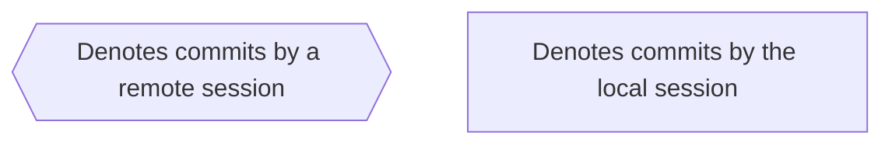
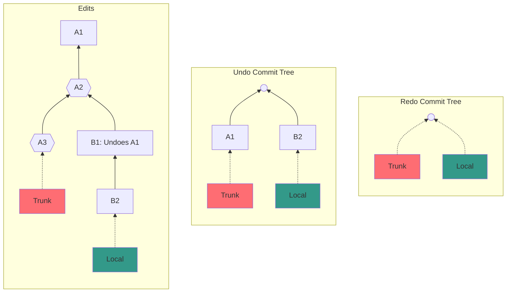
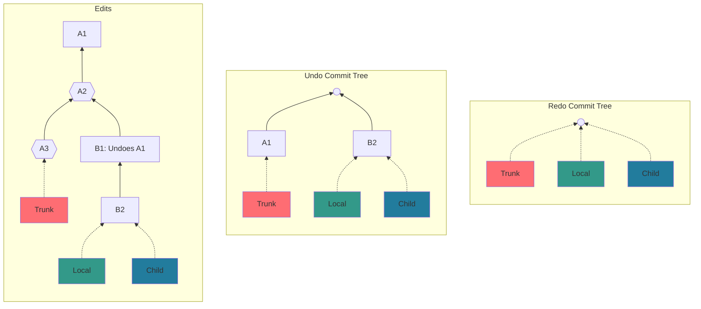
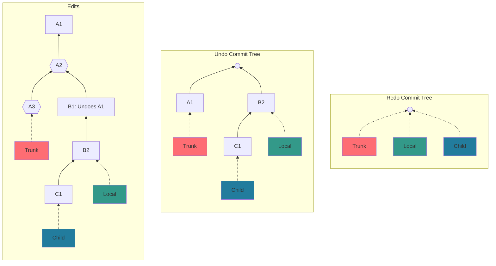
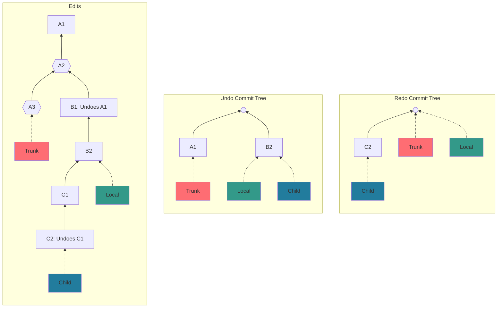
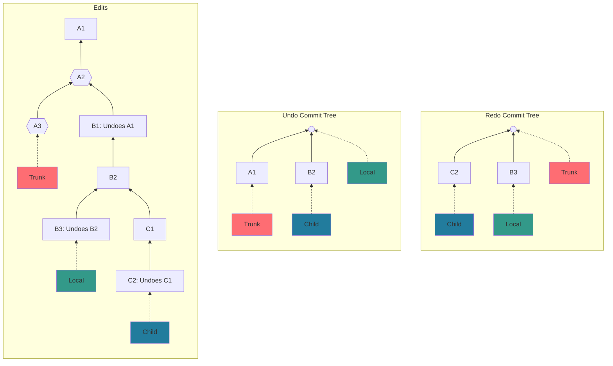
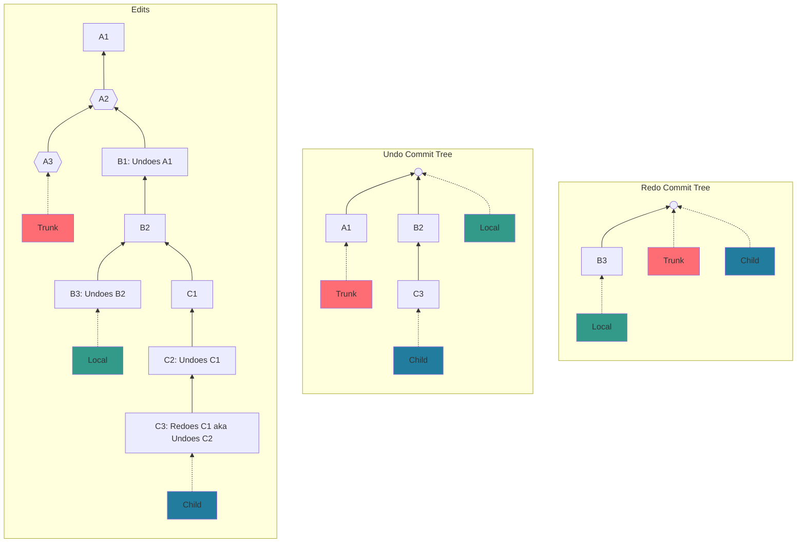
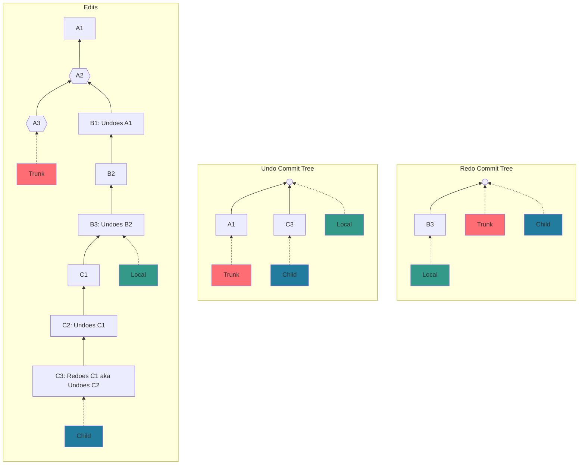

# V1 Undo Example Flow

**Legend**:

This example starts with a trunk and single local branch with a few normal commits and a single undo commit.
The [undo commit tree](./v1-undo.md#the-undo-commit-tree) contains `A1` and `B2`.
The head undo commit for the trunk branch is `A1` because it is the latest edit from the local session (and has not been undone).
`B2` is the head undo commit for the local branch.
There is nothing in the [redo commit tree](./v1-undo.md#the-redo-commit-tree) because a normal edit, `B2`, clears the redo-able edits.

[Forking a branch](./v1-undo.md#forking) from the local branch creates a child branch that is initialized with the same commit pointers.

Adding a normal (i.e., non-undo, non-redo) commit, `C1`, to the child branch also adds it to the [undo commit tree](./v1-undo.md#the-undo-commit-tree) and moves the child branch's head undo commit pointer to `C1`. See [reacting to local edits](./v1-undo.md#reacting-to-local-edits) for a description of how edits affect the separate trees.

Adding a commit that undoes `C1` to the child branch will remove `C1` from the [undo commit tree](./v1-undo.md#the-undo-commit-tree) and add the undo commit, `C2`, to the redo tree.

Adding a commit that undoes `B2` to the local branch will move the local branch's undo head pointer to the null pointer to indicate there is nothing to undo and add the undo commit, `B3`, to the redo tree.

Adding a commit that redoes `C1` (aka undoes `C2`) to the child branch will remove `C2` from the [redo commit tree](./v1-undo.md#the-redo-commit-tree) and add the redo commit, `C3`, to the redo tree.

[Pulling](./v1-undo.md#pulling) the local branch into the child branch removes `B2` from the [undo commit tree](./v1-undo.md#the-undo-commit-tree) since it gets undone by `B3`.

