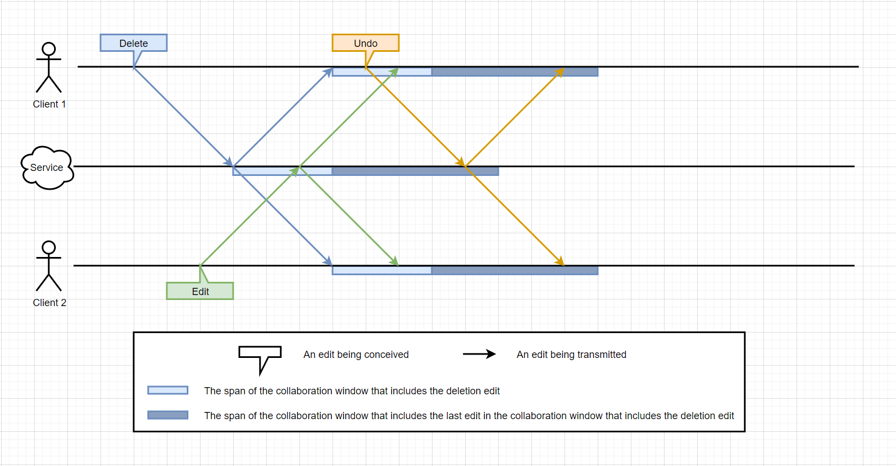

# V1 Undo

Here we detail the vision for the first implementation of undo/redo.
This implementation is meant to satisfy our needs for parity with experimental (AKA legacy) SharedTree.

Note that the system described here allows for changes to subtrees that were concurrently deleted to have an impact on that subtree,
even when the deletion is sequenced before the subtree-impacting change.
This system does not, however support editing of subtrees that were deleted prior,
though we discuss what this would require.

Related:

-   [V1 Undo Example Flow](./v1-undo-example-flow.md)

This first version aims to achieve some basic undo functionality with a minimum amount of code changes and complexity.
To that end, we mostly reuse the existing code paths for changesets by always sending
[concrete undos](./undo.md#abstract-vs-concrete-undo-messages) over the wire.
The undo edit is created by inverting the edit that needs to be undone,
and rebasing that inverse over all the changes that have been applied since.

Sending concrete undo edits alleviates the need to establish and maintain distributed consensus on an undo window.
It does however require sending rebased changes over the wire
(although that is also needed for resubmitting ops, so concrete undo does not make this a new requirement).
Rebased changes may contain lineage entries, which we haven't sent over the wire before.
We do not currently know of a reason why this would be problematic,
or of any other issue or special requirement associated with sending rebased changes over the wire.

Using concrete undos even when the change to be undone has not been sequenced is somewhat problematic
because we cannot know in advance the exact impact of the change to undo.
Despite that, we anticipate no data loss and no decoherence from it.

## Creating Concrete Redo Edits

Redo changesets should be created by inverting the corresponding undo changeset and rebasing that inverse over all the edits that were applied since the undo.
This is preferable to rebasing the original edit over all the edits that were applied since before the original edit:

-   It is better at mitigating data-loss caused by undo.
    For example, undoing an insert will delete any content that has since been added under the inserted node.
    Applying the inverse of the undo will restore that content while re-applying the original insert will not.
-   It is more efficient as it doesn't require rebasing over as many edits.

## Managing Commits

### The Undo Commit Tree

In order to perform an undo operation, it is necessary that we are able to determine which prior edit is to be undone.
To that end, we need to maintain a tree of undoable commits where each node may look like this:

```typescript
interface UndoableCommit<TChange> {
	/* The commit to undo */
	readonly commit: GraphCommit<TChange>;
	/* The next undoable commit. */
	readonly parent?: UndoableCommit<TChange>;
}
```

That tree is a sparse copy of the commit tree maintained by `EditManager` and each view for branch management.

The structure forms a tree as opposed to a linked-list because different local branches can share the same ancestor commits.
Each branch however only ever sees a single spine of this tree, which therefore looks like a linked-list to said branch.
The rest of the document uses the term "list" when describing operations performed at the scope of a single branch.

The tree is sparse because it does **_not_** contain the following kinds of edits:

-   Edits authored by other clients (this is only a concern for the part of the tree that represents the trunk).
-   Undo edits.

Note that some of these edits in the tree may be part of the trunk while others may be on a branch.
Each branch need only maintain a "head" pointer to the child-most commit on the branch.

### The Redo Commit Tree

The tree of redoable commits is maintained across branches in a similar fashion to the undoable commits tree.
Redoable commits are effectively undoable commits and can therefore use the same `UndoableCommit` structure described above.

### Reacting to Local Edits

The redo and undo commit lists for a branch are updated as follows in the face of new local edits:

-   If the edit is neither an undo nor a redo:
    -   A new undoable commit node is pushed onto the undoable commit list.
        The parent field of the new commit node should point to the previous head undoable commit.
    -   The head pointer for the redoable commits is cleared for that branch.
        This effectively drops all the redoable commits for the branch.
-   If the edit is an undo:
    -   The head undoable commit is popped.
        The parent of the undoable commit becomes the new head undoable commit.
    -   The concrete undo commit is pushed onto the tip of the redoable commit list.
        The parent field of the new redoable commit node should point to the previous head redoable commit.
-   If the edit is a redo:
    -   The head pointer for the redoable commits is popped.
        The parent of the redoable commit becomes the new head redoable commit.
    -   The concrete redo commit is pushed onto the undoable commit list.
        The parent field of the new commit node should point to the previous head undoable commit.

### Forking

When a branch is forked, the new branch can simply obtain the head undoable and redoable commit pointers from the parent branch.
This helps keep forking cheap.

### Rebasing

When a branch is rebased onto another branch, it must re-create whatever undoable and redoable commits it has to the head of the undo list maintained by the parent branch.
This can be done by finding the lowest common ancestor in between the two branches,
and attaching to the tip of the parent branch all of the commits on the child branch that lie under the common ancestor.

Note that all the commits from the rebased branch will undergo rebasing so the undoable/redoable commit nodes for them will need to be remade.
It would not be valid to simply update the rebased branch's existing undo commit node objects by updating the edits within.
That's because it's possible that the rebased branch may itself be the parent branch of some other child branch,
whose undo queue includes those commit nodes.
The child-most branch's commit nodes should not be affected by the fact that its parent branch was rebased.

One simple way to characterize what needs to happen
(and possibly to implement it)
is to replay (the rebased version of) the local branch edits onto a new fork of the parent branch.
This would however require knowing which of those local edits were undo, redos, or normal edits.

### Dropping Old Commits

As sequenced edits fall out of the collab window,
we have the option to either drop or retain the corresponding commit nodes in the undo tree.
We can let the application pick a maximum length for the undo queue of the user.

Retaining commits that fall out of the collab window muddies the statement that this commit tree is a sparse version of the normal commit tree.
It can be still be thought of as sparse if we ignore the fact that sequenced commits get dropped from it as the collab window advances.

## Repair Data

[Repair data](./repair-data.md) may be needed in the following cases:

-   Creating an undo (or redo) edit
-   Applying a (peer or local) undo (or redo) edit on a `SharedTreeView`
-   Applying the effect of a move (peer or local) that pulls content out from a previously deleted subtree and into the document tree
-   Applying the effect of an edit that targets already removed content
-   Applying the effect of rebasing local destructive changes
    (i.e., overwrites and deletions)
    that were predicated on a constraint that was violated as part of the rebase

Note that, while these are the only cases where a client needs to access the repair data for the subtree of interest,
it is necessary to keep the repair data be kept up to date until such a case arises.
This then forces us to consider cases where the repair data is not needed but is edited.
This can happen when a client edits a region of the document tree while that region is concurrently deleted by another client.

### Storing Repair Data in the Forest

The design presented here leverages the `Forest` owned by the `SharedTreeView` to house and maintain repair data.
This is made possible by the fact that all repair data comes in the shape of trees,
that are functionally equivalent to the tree content that makes up the document.

This approach is motivated by the following points:

-   Aside from a pair of performance-motivated exceptions (covered below) the repair data content is solely relevant to applying changes to the forest.
-   The needs of repair data storage, reading, and editing, are identical to that of in-document data, which the forest satisfies.
-   Storing both in the same forest makes it easy to efficiently remove/restore deleted content because it saves us from having to export/import it from and to the forest.

The alternative, coupling repair data with the changesets that birthed them, is undesirable for the following reasons:

-   While, once rebased, a changeset is fixed, the repair data that this changeset initially produced may change over time
    due to concurrent edits that affect the removed portion of the tree.
-   Several components/layers of the `SharedTree` system deal with changesets, not all of them need to care about repair data.
-   Decoupling repair data from changesets frees the rebasing system from having to plumb through a repair data querying interface,
    making it more self-contained and therefore easier to implement and test.
    This is made possible by the fact that repair data is **not** required for the purpose of rebasing changesets.

### The Repair Data `TreeIndex`

One challenge associated with storing repair data in the forest,
is that it requires us to establish a system for keeping track of which removed subtrees exist in the repair data,
and where they reside in the forest.
Specifically, we have to maintain a correspondence between the identification scheme used by changesets, and the one used by the forest.
Changesets identify removed trees using a `ChangeAtomId`
(which is made up of a `RevisionTag` and a `ChangesetLocalId`)
while the forest uses paths.

In order to meet this need, we introduce the `TreeIndex` class,
which maintains a mapping between the two identification systems,
and also serves as an inventory of the repair data that exists in the forest.

We also introduce the concept of `ForestRootId`,
which is a value type (likely a number) that uniquely identifies a removed subtree within the forest on a given `SharedTreeView`.

At a minimum, `TreeIndex`'s interface needs to offer the following methods:

-   Retrieve the matching `ForestRootId` for a given `ChangeAtomId` if any.
-   Add an entry in its records for a given `ChangeAtomId` to `ForestRootId` mapping.
-   Remove an entry from its records for a given `ChangeAtomId`.
-   Save to a summary format.
-   Load from the summary format.

For the sake of performance, it would likely make sense to also support the following methods:

-   Retrieve all the `ForestRootId`s for a given `RevisionTag`.
-   Add a range of entries in its records for a given `RevisionTag` and range of `ChangeAtomId` to `ForestRootId` pairs.
-   Remove all the entries from its records for a given `RevisionTag`.
-   Reassign all the entries for a given `RevisionTag` to a new `RevisionTag`.

The generation of new `ForestRootId`s and their conversion to forest paths is left as an implementation detail of the `SharedTreeView` or the `TreeIndex`.
In the future, it is likely that the `Forest` will take on these responsibilities.
For now, the `SharedTreeView` can use a monotonically increasing counter to generate `ForestRootId`s,
and can use `removed-${forestRootId}` as a way of generating unique paths.

### Creating Repair Data On Change Application

Repair data is typically created when document data would otherwise be erased.
There are two cases that can lead to the erasure of document data:

-   When a subtree is deleted
-   When the value on an node is overwritten

When a changeset is applied to the `SharedTreeView`,
for every change conveyed by the changeset that would erase document data,
the `SharedTreeView` must do the following:

-   Generate a new `ForestRootId`.
-   Translate that change into an equivalent delta that preserves the otherwise deleted subtree
    by moving that subtree to a part of the forest that lies outside the scope of the document.
-   Apply that delta to the forest.
-   Update the `TreeIndex` so it has an entry associating the removed subtree's `ChangeAtomId` and `ForestRootId`.

Another scenario where repair data is added to the `Forest`
arises when a peer sends a commit whose changes explicitly instructs the `SharedTreeView` to do so,
and provides a `ChangeAtomId` as well as the tree contents.
When that happens, `SharedTreeView` should consult its `TreeIndex` to check whether an entry already exists for the `ChangeAtomId`.
If it does, then it can safely keep the repair data that it has.
If it doesn't, then it should:

-   Generate a new `ForestRootId`.
-   Generate a delta that adds the content to the forest.
-   Apply that delta to the forest.
-   Update the `TreeIndex` so it has an entry associating the removed subtree's `ChangeAtomId` and `ForestRootId`.

(The need for this capability is covered in [Garbage-Collecting Repair Data](#garbage-collecting-repair-data).)

### Consuming Repair Data On Change Application

"Consuming" refers to the act of moving content out of the area of the forest where repair data is stored
and into the area of the forest where the document is stored.
Changesets themselves don't carry the repair data that is consumed,
they just describe a change
(such as the undo of a subtree deletion)
and it is the `SharedTreeView` that interprets the change as prompting the consumption of the relevant repair data stored in the forest.

There are three cases that can lead the consumption of repair data:

-   When a subtree's deletion is inverted
-   When the overwrite of a node's value is inverted
-   When a deleted node is resurrected by a move that was concurrent to, but sequenced after, the deletion,
    and that move's destination lies within the document tree.
    (This last scenario is not yet supported and is subject to debate.)

When a changeset is applied to the `SharedTreeView`,
for every change conveyed by the changeset that consumes repair data,
the `SharedTreeView` must do the following:

-   Look up the `ForestRootId` in the `TreeIndex` for the relevant subtree.
-   Translate the change into an equivalent delta that moves the repair data tree into the document tree.
-   Apply that delta to the forest.
-   Remove the entry in the `TreeIndex` for the relevant subtree.

### Editing Repair Data On Change Application

It is possible for repair data to be edited by edits that were authored concurrently to the edit that lead to the creation of that repair data.
Note that this includes cases where:

-   The edit is contained within a single deleted subtree
-   The edit spans a pair of deleted subtrees
-   The edit spans a deleted subtree and the document tree

When a changeset is applied to the `SharedTreeView`,
for every change conveyed by the changeset that edits repair data,
the `SharedTreeView` must do the following:

-   Look up the `ForestRootId` in the `TreeIndex` for the relevant subtree.
-   Translate the change into an equivalent delta that applies to the repair data tree in the forest.
-   Apply that delta to the forest.

### Patching Repair Data After Transactions

`SharedTreeView` supports transactions by following a two-stage process:

1. After a transaction is started, and for the duration of the transaction,
   all edits that make up the transaction are treated as individual commits.
2. When the transaction is terminated, the view's `SharedTreeBranch` and its other components (e.g., the forest)
   are updated to match the outcome of the transaction:
    - If the transaction was aborted, then the commits from the transaction are removed from the branch and the changes are reverted from the forest.
    - If the transaction was committed, then the commits from the transaction are composed into a single commit, and the forest is left untouched.

In the abort case, the `TreeIndex` will be correctly updated through the application of the inverses of the transaction's commits.
In the commit case however,
the `TreeIndex` needs to be patched to account for the following fact:
any repair data generated by the transaction's individual commits should now be attributed to the one composed commit that makes up the whole transaction.

We can address this by using the following implementation strategy:

-   As changes are being made during the transaction,
    assign each transaction change
    a changeset-local ID that is unique across the whole transaction.
    (At the time of writing, we already avoid recycling changeset-local ID among the changesets that make up a transaction,
    except when merging in changesets from other branches into the transaction.)
-   When the `SharedTreeView` is informed of such a change, it updates the `Forest` and `TreeIndex` as normal.
-   When the transaction is completed,
    for each changeset that makes up the transaction,
    reassign in the `TreeIndex` all the entries for the `RevisionTag` of the changeset to the `RevisionTag` of the transaction.

The above approach relies on the fact that composition can elide but not reassign changeset-local IDs.
This avoids the problem of having to reverse-engineer how the repair data produced by the individual changesets maps to the repair data produced by composed changeset.

Note that this requires reassigning new changeset-local IDs to any changesets that are merged from another branch into the branch whose transaction is open.

### Patching Repair Data After Rebasing

When a `SharedTreeBranch` is rebased,
any owning `SharedTreeView` may have to be updated to reflect the changes performed by the concurrent changes on which the branch was rebased,
as well as the knock-on effects of those changes on the changes that were on the rebased branch.
Updating the `SharedTreeView` includes updating the `Forest` and `TreeIndex` it carries with it.

Our existing approach to updating the forest is to produce an "update" changeset that is a composition of the following changesets:

1. The inverse of each changeset (in reverse order) on the branch that is being rebased
2. The concurrent changesets being rebased over
3. The rebased version each changeset on the branch that is being rebased

The benefit of composing these changesets together is that it may produce a small changeset, whose impact on the `SharedTreeView` is minimal.
This is in contrast to actually applying these changesets individually,
where the changesets from the third group may largely cancel-out with the changesets from the first group,
leading to unnecessary state churning and invalidation of downstream components.

Another approach that could be taken, would be to clone the `SharedTreeView` components
(such as the `Forest`, `TreeIndex`, and `AnchorSet`)
of the branch onto which the current `SharedTreeView` is being rebased,
and apply the rebased edits to that clone.
The drawback of that approach is that this not only may cause invalidation in parts of the documents that are not actually changed by the rebase,
but it also forces all consumers of these components to update/rebuild any references that might have had (such as anchors) to those components.

The upshot is that `SharedTreeView` must tolerate the kind of changesets that results from such rebase operations.
This includes paying attention to the `RevisionInfo.rollbackOf` field on changesets in order to correctly distinguish edits that should lead to the production of repair data from edits that should not.

### Garbage-Collecting Repair Data

The rules for the creation and consumption of repair data (see above) mean that,
while new content can be created,
no content is ever truly deleted.
This speaks to undo's role of preventing data loss, but leads to a problem of unbounded memory growth.

While we want to preserve the ability of a session to undo its past edits,
we also want to ensure that the associated memory needs can be constrained.

How we should go about evicting repair data from the forest is dependent on the set of merge semantics we support.
For this V1 of undo, we intend to allow editing of removed content,
meaning it can be edited after it is removed and before (as well as after) it is restored,
but solely in situations where the issuer of the edit was now aware of the item being removed.
In other words, we only allow new edits to be generated on in-document trees,
and we tolerate the fact that some of those edits will end up affecting removed trees due to concurrency.

In the future, we will also support editing already removed trees.

This gives applications more options for dealing with situations where a client has locally performed some amount of work
that involves editing a region of the document that was concurrently removed.
Indeed, without that capability, such work could not be reconciled with the rest of the document,
and would need to be detected and dropped.
This scenario is likely to occur if client applications use local branches to stage their work.

#### Proposed Scheme

Allowing the garbage-collection of repair data means that not all clients will have the repair data if it becomes necessary later.
When a client makes an edit that requires repair data which may have been evicted by peers,
that client must include a copy of the relevant repair data in the edit being sent.
This acts as a "refresher" for any peers that may have garbage collected that repair data.
(See [Creating Repair Data On Change Application](#creating-repair-data-on-change-application) for details on how that refresher is handled by the peers.)

There are two kinds of cases where a client would need to include such a refresher in the edit they send:

-   When reverting the edit that originally lead to the removal of the subtree.
-   When editing the removed subtree.

For a given `SharedTreeView`, the repair data associated with a given removed tree T must _not_ be garbage-collected if _either_ of the following criteria apply:

-   The local user may make an edit that requires T.
    -   This could be due to the revert of the edit that let to T being removed.
    -   This could be due to the revert of an edit that edits T.
    -   This could be due to a merge of a branch whose commits made an edit that requires T.
-   A peer edit P might be received such that P's ref sequence number might be lower than the sequence number of the edit that last removed or edited T.

In all other cases, the repair data associated with T can and should be garbage-collected.
This involves:

-   Destroying the tree T in the forest
-   Removing the entry for T in the `TreeIndex`

This approach ensures that a client,
no matter how long its history of undoable/redoable edits,
does not burden its peers by requiring them to store unbounded amounts of repair data,
and does not force summaries to include that repair data.

If this switch from not including the refresher with an edit to including it came any later,
meaning, if we did not include the refresher on relevant created beyond the point where the removal of T falls out of the collaboration window,
then we would run the risk of peers receiving an edit for which they have already discarded the repair data.

Note that, while the diagrams below use an undo edit as the edit which leads to the need for repair data,
any edit (undo, redo, or otherwise) targeting a removed tree may lead to such a need.


In the scenario pictured above, the undo edit must carry with it a refresher for the relevant repair data.

Note that the undo could also end up being sequenced before the point at which peers will garbage-collect the repair data:


In that scenario, both the peer and the undo edit have some repair data.
The peer can just [ignore the refresher](#ignoring-refreshers).

If this switch from not including the refresher along with the undo to including it came any earlier,
we would waste resources because the receiving peer is guaranteed to still have the removed tree T.
See more below in [ignoring the refresher](#ignoring-refreshers).
Also note that the refresher may carry stale data:



In the scenario pictured above, the client sending the undo does not have to include a refresher.
If it did, and the green edit affected the portion of the document removed by the deletion,
then the repair data refresher would not reflect the impact of that edit.

It is safe for the undo sent in the scenario pictured above not to include the refresher.
This is due to the following invariant of the collaboration window:
If an edit is sent before a given collaboration window span S,
then it will be sequenced either before or within S, but no later.
Graphically speaking, this means that if an edit is sent for sequencing within the span of one rectangle,
then it will be sequenced at the latest within the span of rectangle that follows.
Here we can apply that rule to see that the undo edit,
so long as it is conceived within or before the light blue collaboration window span,
will be sequenced within or before the dark blue collaboration window span,
during which peers will still be holding on to their copy of the repair data.

While the repair data being sent may be large,
and therefore costly to send over the wire,
this cost is only incurred when the removed tree is actually edited or restored.

Note that, contrary to cases where the repair data is consumed,
generating such an undo should not remove the repair data from the `TreeIndex`.
That data will however be consumed, and therefore removed, through the usual channels if and when the edit is applied.

#### Ignoring Refreshers

There are two situations where a peer should ignore the refresher:

-   The refresher is for a tree that is already tracked
    (i.e., the local client has not garbage-collected it).
    This can be detected by checking the `TreeIndex` before adding the refresher to it (and to the forest).
-   The refresher is for a tree that has already been restored.
    This can be detected during rebasing of the refresher.

Adopting the refresher in either of those cases could lead to a memory leak or could lead to the wrong tree being restored later on.

Note that for the sake of getting started on the implementation of refreshers,
it's fine to always send the refreshers so long as the receiving peers know when to ignore them.
Doing this might be easier as a first step since it means that the re-submit code path doesn't need to worry about converting an edit that doesn't include the refresher into an edit that does.

### Repair Data In Summaries

The `SharedTreeView` must contribute any relevant repair data to the summary.
By virtue of the fact that `SharedTreeView` maintains repair data within the forest,
the summary data from the forest will also include that repair data.
In addition to that, the `TreeIndex` must also contribute its data.

Because summaries are generated on clients that have no local edits,
there is no risk that the summary data contributed by the `SharedTreeView`
might include repair data that is only needed for the purpose of supporting undo/redo on that client
(and therefore does not belong in a summary),
as opposed to repair data that is needed by all peers.

Note that our system for dealing with repair data would make it easy to support preserving the undo/redo queue of a given session.
Summarizing from that client would simply include the adequate repair data in the summary,
and the new session would pick it up naturally.

### Future Work

#### Supporting Undo of Peer Edits

Users typically seek to undo their own edits only.
In fact, being forced to undo peers' edits before local edits (when those are older)
would likely result in user frustration because the local user may not want to undo the peer edits,
but also because the local user may not be aware of what those edits are,
or may not be aware of their very existence.

Despite all that, it can at times be desirable to undo of _a specific peer edit_.
For example, a peer may delete content that the local user would not want deleted.
The local user could verbally ask the peer to undo that change,
but that may be impractical, or it may simply be impossible if the peer has terminated their session.

In order to support the undo of peer edits, it would be necessary for all clients,
(or at least all clients wanting such undo powers)
to retain the repair data associated with the peer edit to be undone.
While this applies more memory pressure on the clients,
it seems like a natural evolution of the system described in this document.

This new capability would however make possible a new family of scenarios:
two clients may concurrently attempt to undo the same edit.

If the latter of the two such undos carries with it a refresher,
then the receiving peers (as well as the issuing client) will end up
creating the repair data as the refresher instructs, despite the same tree content having already been revived.
This could be addressed by rendering refreshers ineffective when they are rebased over a revival of the associated subtree.
For example, the `SharedTreeView` could keep a record of the repair data entries
(but not the repair data itself)
that have been revived by the edits that lie within the current collaboration window.

#### Supporting Edits To Deleted Content

Instead of prohibiting edits to content that has been deleted (and whose deletion is known as opposed to concurrent),
we may want to allow such edits.
This would give applications more options for dealing with situations where a client has locally performed some amount of work
that involves editing the deleted region of the document.
Indeed, under the current system, that work cannot be reconciled with the rest of the document, and must be abandoned.
This is likely to occur if client applications use local branches to stage their work.

This could be supported by requiring clients with such a need to do the following:

1.  Maintain repair data for the subtree in question.
2.  Send a repair data refresher alongside any edit that affects the subtree in question,
    similarly to how a refresher is sent in undo scenarios.

#1 is harder than it sounds because it requires determining which of possibly many deleted subtrees may be of interest to the local client.
In principle, any local branch that was forked from the trunk before the deletion of a subtree may include edits for that subtree,
or may in the future start including such edits.
This implies that none of the repair data for such edits could be collected.

In addition to branches, one must also consider any anchors (on any and all branches) that point to nodes within the deleted subtrees.
The local client may indeed dereference such an anchor and expect to be able to edit the content under it,
even after the branch on which that anchor resides has been made aware of the subtree's deletion.

It may be tempting to think that #2 is not necessary:
couldn't clients that have garbage-collected the repair data for the subtree of interest just ignore the edits made to the subtree?
The subtree's state may become relevant again due to its deletion being undone,
but the issuer of the undo will issue a refresher for it if needed.
Unfortunately, #2 is needed because any edit made to the deleted subtree may entail moving content out of that subtree and into the document tree.
If clients that have garbage-collected the repair data for the subtree of interest have not been provided with a refresher before that,
then they will be unable to show an updated document tree.

This approach leads to the same "concurrent refresh" problem that [supporting undo of peer edits does](#supporting-undo-of-peer-edits),
presumably with a similar solution:
refreshers must be rendered ineffective when they are rebased over a concurrent revival or refresh of the associated subtree.

#### Accommodating The Destructuring of Nodes

There may be times when a client needs to replace a node with another, but keep some of the child nodes of the original.
More generally, a client may want to create a node and populate its fields with children from some other node.
This is easy to accomplish using the move editing API when the source and destination fields of children being transplanted allow for the absence of said children.
When either or both of those fields require the presence of a child
(as is the case for a value field)
then it's either impossible to move the child out of the source field,
or impossible to create the destination field's parent without the field being populated,
or both.

Node destructuring is a feature that would allow a client to decompose a node by making it unreachable and uneditable,
while at the same time transforming all of the immediate children of that node into individual roots.
The children can then be consumed to create a new node, or moved.

This destructuring feature interacts with repair data because deleted nodes can be destructured.
When that happens, the `SharedTreeView` would need to update both the `Forest` and the `TreeIndex` to remove the entry for the destructured node if there is one,
and add entries for the new roots if the destructured node had any children.

#### Garbage-Collecting Repair Data of Expired Sessions

In our current system, only the session that produced a given edit is able to undo that edit.
This means that, once an edit is sequenced, the repair data associated with it will only become relevant if the session undoes that edit.

Each client could take notice of peer sessions ending and garbage-collect any repair data associated with the edits of the session,
so long as those edits were outside the collaboration window.

Note that this performance optimization will cause problems if _any_ of the following becomes true:

-   A client can edit deleted content even after witnessing the sequenced edit that performs the deletion.
-   Edits from one session can be undone by a different session. There are different ways this could become true:
    -   A client can undo edits that were generated by its peers.
    -   The ability to undo edits for a given can be preserved between sessions.

#### Further Delaying Garbage Collection of Repair Data

In the [Garbage-Collecting Repair Data](#garbage-collecting-repair-data) section,
we describe a tradeoff between the memory needs of storting repair data on one side,
and the network latency and server costs of having to resend it to peers on the other.
While we have established that the garbage collection can happen no earlier,
it is certainly possible to make it happen later,
thereby enabling us to avoid sending repair data for a greater number of undo edits.

This adjustable tradeoff could be left to the discretion of the applications collaborating on the document,
or even left to the users of said applications.
The only rule is that this when this tradeoff is changed,
the message indicating the change must fall out of the collaboration window before it takes effect.
