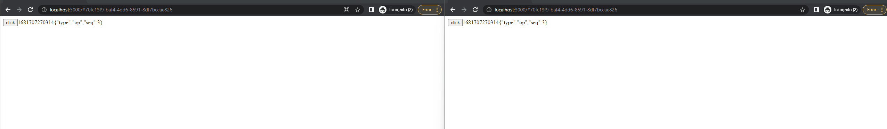

# @fluid-example/attributable-map-demo

In this simple multi-user app, you are going to build a button that, when pressed, shows the current timestamp. We will store that timestamp in Fluid so that each co-authors will automatically see the most recent timestamp at which any author pressed the button. In addition, the attribution key will be displayed by the side, it consists of the type of attribution and related sequence number/id. Please refer to [Attributor](../../../packages/framework/attributor/README.md) and [AttributableMap](../../dds/attributable-map/README.md) for more details

## Getting started

You can run this example using the following steps:

1. Run `pnpm install` and `pnpm run build:fast --nolint` from the FluidFramework root directory.

-   For an even faster build, you can add the package name to the build command, like this: `npm run build:fast --nolint @fluid-example/attributable-map-demo`

2. In a separate terminal, run the command `npm run start:server` to start a Tinylicious server. You can open http://localhost:7070 in a web browser to check if the server is started successfully.

3. Run `npm run start` from this directory and open http://localhost:3000 in a web browser to see the app running.

## Demo visualization

When the app loads it will update the URL. Copy that new URL into a second browser and note that if you click the button in one browser, the time value and attribution key in other browsers updates as well.

