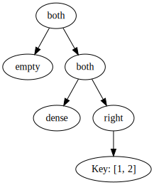

# BSP optimization

The BSP set represents its data as a tree. But crucially, it carries
no payload whatsoever. Instead, the whole information is encoded entirely
in the structure of the tree.

This allows us to potentially make the representation a lot more efficient.
Let's consider exactly what information is stored in the tree:

Each node can only have a few states. So we can give them a bit pattern:

```fsharp
type Node<'Key> =
| Empty                              // 00
| Dense                              // 01
| Left of Node<'Key>                 // 100
| Right of Node<'Key>                // 101
| Both of Node<'Key> * Node<'Key>    // 110
| Exact of 'Key                      // 111
```

But this lets us encode the BSP set very differently:

```fsharp
type BspSet<'Key> =
{
    Structure : BitVector
    Keys : 'Key list
}
```

## Example



Currently, we encode the tree directly as an in-memory tree on the heap, i.e.:

```fsharp
let tree =
    Both (
        Empty,
        Both (
            Dense,
            Right (
                Exact(1, 2))))
```

But the new encoding would be a bit different:

```fsharp
let newTree =
{
    Structure = BitVector("110|00|110|01|101|111")
    Keys = [1, 2]
}
```

This encoding has very different properties w.r.t. to memory footprint and layout. The structure
becomes a dense bit vector. In JavaScript, we would probably encode it as array of `number`s and
use double-words from it. This way we'd get very good CPU cache behavoir, because in the vast
majority of cases, the whole BSP set structure would fit into L1 cache and most likely be pre-loaded.

Even though, we lose the possibility to do reference sharing, it may well be more efficient. We still
can do reference sharing of the whole BSP set, because it remains immutable, but we can't share parts
of the BSP set anymore.

That said, the BSP set is only used to encode 1-dimensional sets in the product set, so you would expect
the BSP sets in general to be fairly simple.

Now the memory footprint of the BSP set is thus:

-   Some general overhead for the whole BSP set, i.e. object cost
-   Linear in the number of keys used for the exact representation.
    Usually tiny, because they replace whole subtrees and occur infrequently.
-   About 2.5 bits per node. I.e. **tiny**.

All the algorithms recurse over the structure of the tree, so they should be able to run over this
bit encoding as well. Chances are it would be a lot faster, but definitely consuming a lot less
memory than before.

## Application

If we did this change, we might be able to use raw product sets as messages inside say a shared dictionary
because the payload of the messages might be small enough for that.
