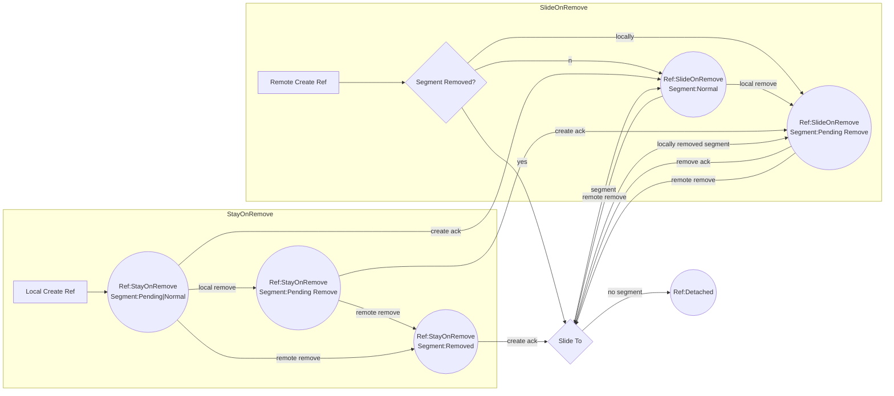

# ReferencePosition Documentation

ReferencePositions are used to indicates a MergeTree position which is stable as operations are performed. There are two
types:

1. LocalReferences refer to a segment and offset within that segment
2. Markers are actual segments in the Merge Tree

The function `Client.localReferencePositionToPosition` returns the numerical position of a reference in the client's
current view.

## LocalReference behavior on Remove

By default, LocalReferences become detached when the segment they reference is removed.
The ReferenceTypes SlideOnRemove, StayOnRemove, and Transient change this behavior.
They are only valid for LocalReferences.
They are exclusive - a reference may be at most one of these types.

### SlideOnRemove

The reference will slide to the next farthest segment when the segment is removed and the remove has been acknowledged.
Sliding will look for the next valid segment.
A valid segment is one whose creation has been acknowledged and either hasn't been removed
or the remove is pending (not acknowledged).
If a farther segment is found, then the LocalReference will be changed to refer to that segment and have offset 0.
In the event that the slide is happening on the acknowledgement of a remove, the slide to a farther segment will not
change the numerical position of the reference.
If there is no there is no valid segment farther in the tree, then the slide will place the reference on the last valid segment.
The offset will be set to the last position in that segment.
In the event that the slide is happening on the acknowledgement of a remove, the reference would have been on the removed
segment. This slide from the removed segment to a nearer segment does change the numerical position of the reference.
If there is no valid position (all segments removed and acknowledged) then the reference is detached.

### StayOnRemove

The reference will stay on removed segments.
This behavior is only defined until the removed segment is cleaned up by Zamboni.
This is intended to be used only while collaborating (see below) while waiting for an acknowledgement.

### Transient

The reference is not tracked by the MergeTree.
It will continue to reference removed segments.
This behavior is only defined until the removed segment is cleaned up by Zamboni.
This is intended to be used to create transient references which may be compared with other references.

### Detached LocalReferences

A detached LocalReference does not reference a segment in the MergeTree.
It's position is defined to be `LocalReference.DetachedPosition` (-1).

### LocalReferences on Removed Segments

LocalReferences may reference removed segments:

* SlideOnRemove references may reference a removed segment which is pending (not acknoweldged)
* StayOnRemove references may reference removed segments
* Transient references may reference removed segments

The numerical position of a reference which is on a removed segment will be one more than the previous (nearer) segment.
If there is a farther segment that is not removed, this will be the same as the position of the start of that segment.
If there is no farther segment, then the reference position will be the length of the tree (one more than the last valid
position in the tree).

## Eventually Consistent References

Markers are segments in the MergeTree and are eventually consistent.
LocalReferences may be used as part of an eventually consistent feature.
For example, SharedIntervals are built using LocalReferences.

### Implementing Eventually Consistent LocalReferences

To implement an operation which creates LocalReferences which will be have an eventually consistent position:

1. Locally create the reference as StayOnRemove
2. Send the reference numerical position in an op
3. On acknowledgement of the local create:
   1. set the `refType` of the reference to include `SlideOnRemove`
   2. call `Client.getSlideToSegment` with the references current segment and offset to get the proper new location
   3. Delete the old reference and create a new one with the returned values
4. Remote clients, on receiving the op, call `Client.getContainingSegment` followed by `Client.getSlideToSegment`
on the result. Call `Client.createLocalReferencePosition` with the result to create a `SlideOnRemove` reference.
5. If there is a dependency on the comparison of reference positions (such as the index in IntervalCollections)
must listen to the `beforeSlide` and `afterSlide` events on `IReferencePositionEvents`. When slide occurs the
relative position of references may have changed.

### Implementation Notes

This is the state diagram for the implementation of Eventually Consistent References.

This algorithm works because it ensures that slid reference slide to the same segment.
The slide only happens when both the creation of the reference and removal of the segment have been acknowledged.
When sliding we do not consider any local (unacknowledged) ops.

Keeping references on removed segments until they can be slid works well in most cases because of these properties:

1. Interval positions on removed segments appear as if they were on the following position in the string.
If the removed segment is between positions 5 and 6, the interval positions on the removed segment appear to be at
position 6. This matches where they will eventually slide, so slide will not cause a change in position as long as
segments are not slid over and it is not necessary to slide to the near end of the string.
2. Text inserted at the same location as the removed segment is inserted before the removed segment.
So if the removed segment is between 0 and 1 (“A[removed]B”), insertText(1, “X”) inserts before the removed segment
(“AX[removed]B”). This makes it hard to end up with local only segments to be slid over, which will mean it is rare
that slide visibly changes the interval position. It can still happen if there is a conflicting remove, but that is
much less likely.

#### Conflict Scenarios

Considering Create Interval / Remove Range conflicts, here are the scenarios
(before indicates the relative sequence order):

1. Local create before local remove. Interval position needs to slide on ack of the local remove.
2. Remote create before remote remove. Slide on receiving the remove.
3. Local remove before local create. This is impossible – once the segment is removed locally an
interval position can’t be created on it.
4. Remote remove before remote create. (Possible if ops are from different remote clients).
Slide on receiving the remote create.
5. Remote create before local remove. Slide on the ack of the local remove.
6. Local create before remote remove. Slide on receiving the remove.
7. Local remove before remote create. Slide on receiving the create.
8. Remote remove before local create. Slide on receiving the ack of the create.

### Why Eventually Consistent References Can Not Have Stable Order

In an ideal system reference positions would have stable order. Specifically:

1. If in any client state the position of a reference is less than the position of a specific item in the sequence,
then the position of that reference would always be less than or equal to the position of that item.
2. If in any client state the position of reference A is less than the position of reference B,
then the position of reference A would always be less than or equal to the position of reference B.

Neither of these properties is true for SlideOnRemove references. This is a result of them sliding over local
only segments. This could change the relative positions of the sliding reference at items that are slide over,
as well as any references on those items. Note that these properties do hold for items and references
once the creation has been acknowledged (sequenced by the server).

Supporting stable order is not possible in the current system because:

1. Removing a range may cause an multiple references that had been at different positions to all be at the same
position.
2. To preserve stable ordering, an insert that conflicts with that remove would need to be after some of those
references and before others.
3. Insertion position is specified as a numerical offset in the sequence, so can't specify where in the set
of references at a position to be inserted. (Technically there is enough information to do this within the
collab window. But that information is lost if reconnect/resubmit is required.)

Therefore implementing eventually consistent references with stable order would require adding additional
information to insert ops.

## Tests

* `packages\dds\merge-tree\src\test\client.localReference.spec.ts`
unit tests for LocalReferences
* `packages\dds\sequence\src\test\intervalCollection.spec.ts`
test LocalReferences as used in interval collections (including eventual consistency)
* `packages\test\test-end-to-end-tests\src\test\sharedInterval.spec.ts`
end-to-end tests using LocalReferences for interval collections.
These tests have only been minimally updated to reflect this implementation,
so they do not comprehensively test LocalReferences.
