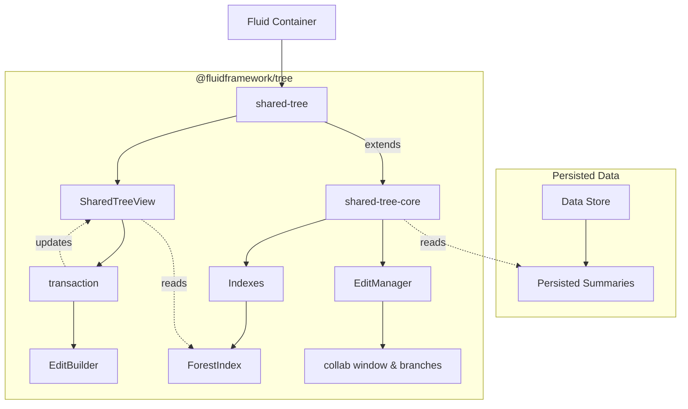
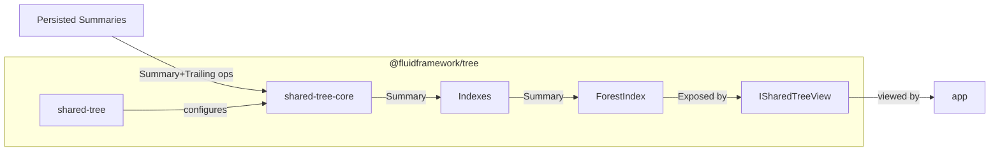
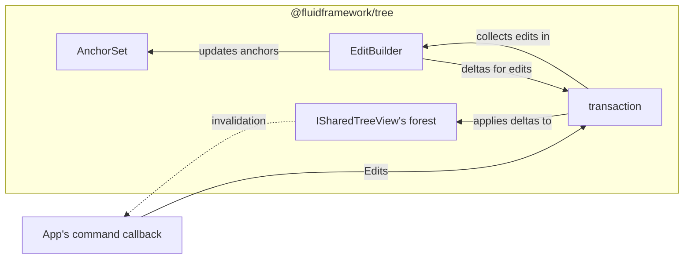
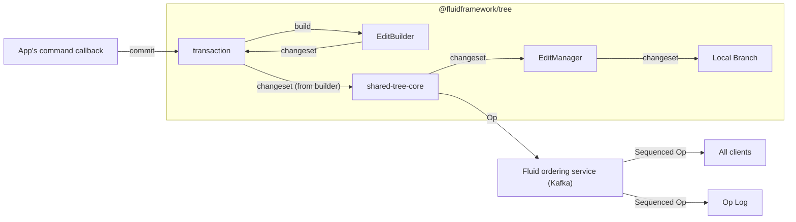
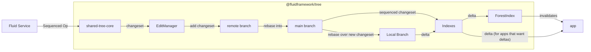
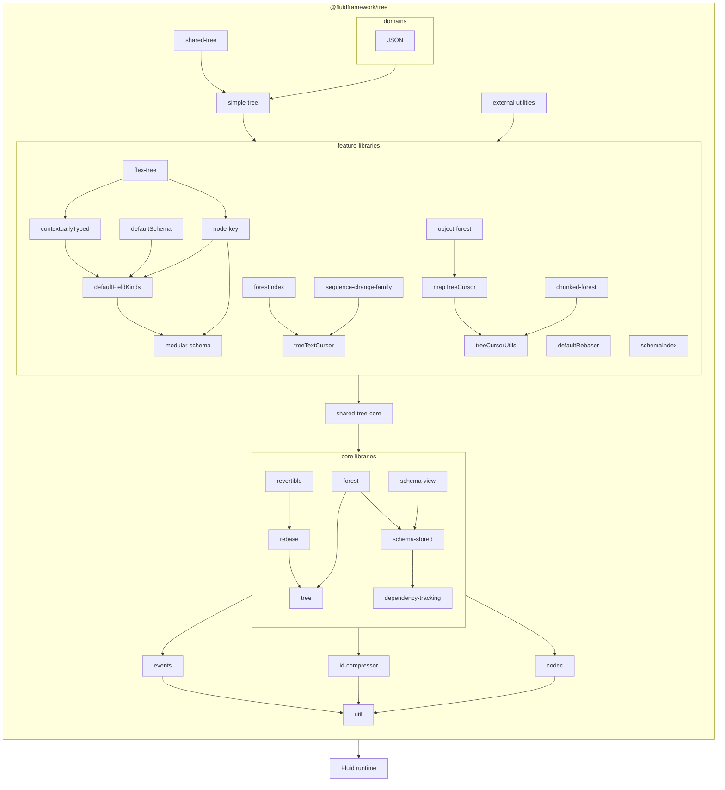

# @fluidframework/tree

A [tree](<https://en.wikipedia.org/wiki/Tree_(data_structure)>) data structure for the [Fluid Framework](https://fluidframework.com/).

To get started working with `SharedTree` in your application, read this [quick start guide](https://fluidframework.com/docs/start/tree-start/).

The contents of this package are also reported as part of the [`fluid-framework` package](https://www.npmjs.com/package/fluid-framework) which provides an alternative way to consume the functionality from this package.

[SharedTree Philosophy](./docs/SharedTree%20Philosophy.md) covers the goals of the SharedTree project,
and some of the implications of those goals for developers working on this package.

<!-- AUTO-GENERATED-CONTENT:START (LIBRARY_README_HEADER) -->

<!-- prettier-ignore-start -->
<!-- NOTE: This section is automatically generated using @fluid-tools/markdown-magic. Do not update these generated contents directly. -->

## Using Fluid Framework libraries

When taking a dependency on a Fluid Framework library's public APIs, we recommend using a `^` (caret) version range, such as `^1.3.4`.
While Fluid Framework libraries may use different ranges with interdependencies between other Fluid Framework libraries,
library consumers should always prefer `^`.

If using any of Fluid Framework's unstable APIs (for example, its `beta` APIs), we recommend using a more constrained version range, such as `~`.

## Installation

To get started, install the package by running the following command:

```bash
npm i @fluidframework/tree
```

## Importing from this package

This package leverages [package.json exports](https://nodejs.org/api/packages.html#exports) to separate its APIs by support level.
For more information on the related support guarantees, see [API Support Levels](https://fluidframework.com/docs/build/releases-and-apitags/#api-support-levels).

To access the `public` ([SemVer](https://semver.org/)) APIs, import via `@fluidframework/tree` like normal.

To access the `beta` APIs, import via `@fluidframework/tree/beta`.

To access the `alpha` APIs, import via `@fluidframework/tree/alpha`.

To access the `legacy` APIs, import via `@fluidframework/tree/legacy`.

## API Documentation

API documentation for **@fluidframework/tree** is available at <https://fluidframework.com/docs/apis/tree>.

<!-- prettier-ignore-end -->

<!-- AUTO-GENERATED-CONTENT:END -->

## Status

Notable consideration that early adopters should be wary of:

-   The persisted format is stable such that documents created with released versions 2.0.0 or greater of this package are fully supported long term.
-   In versions prior to 2.1.0, SharedTree had unbounded memory growth:
    -   Removed content was retained in memory and persisted in the document at rest ([fix](https://github.com/microsoft/FluidFramework/pull/21372)). This was fixed in version 2.1.0.
-   All range changes are atomized.
    This means that, when inserting/removing/moving multiple contiguous nodes the edit is split up into separate single node edits.
    This can impact the merge behavior of these edits, as well as the performance of large array edits.
-   Some documentation (such as this readme and [the roadmap](docs/roadmap.md)) are out of date.
    The [API documentation](https://fluidframework.com/docs/api/v2/tree) which is derived from the documentation comments in the source code should be more up to date.

More details on the development status of various features can be found in the [roadmap](docs/roadmap.md).

## Motivation

There are a lot of different factors motivating the creation of this Tree DDS.
A wide variety of possible consumers (across several companies) have overlapping feature requirements
which seem like they can best be met by collaborating on a single feature rich tree implementation powered by Fluid.
The current feature focus is on:

-   Semantics:
    -   High quality semantic merges, including moves of parts of sequences (called "slice moves").
    -   Transactionality.
    -   Support schema in a semantically robust way.
-   Scalability:
    -   Support for partial views: allow efficiently viewing and editing parts of larger datasets without downloading the whole thing.
    -   Ability to easily (sharing code with client) spin up optional services to improve scalability further (ex: server side summaries, indexing, permissions etc.)
    -   Efficient data encodings.
-   Expressiveness:
    -   Efficient support for moves, including moves of large sections of large sequences, and large subtrees.
    -   Support history operations (ex: undo and redo).
    -   Flexible schema system that has design patterns for making schema changes over time.
-   Workflows:
    -   Good support for offline.
    -   Optional support for branching and history.
-   Extensibility: It must be practical to accommodate future users with needs beyond what we can afford to support in the initial version. This includes needs like:
    -   New field kinds to allow data-modeling with more specific merge semantics (ex: adding support for special collections like sets, or sorted sequences)
    -   New services (ex: to support permissions, server side indexing etc.)

## What's missing from existing DDSes?

`directory` and `map` can not provide merge resolution that guarantees well-formedness of trees while supporting the desired editing APIs (like subsequence move),
and are missing (and cannot be practically extended to have) efficient ways to handle large data or schema.

`sequence` does not capture the hierarchy or schema, and also does not handle partial views.
Additionally its actual merge resolution leaves some things to be desired in some cases which `tree` aims to improve on.

`experimental/tree` does not have a built in schema system reducing the data available to make semantically high quality merges.
It also does merge resolution in a way that requires having the whole tree in memory due to it being based entirely on node identifiers
(including constraints within transactions that can't be verified without reading large parts of the tree).

`experimental/PropertyDDS` currently does not have as high quality merge logic as desired, currently not even supporting efficient moves.
Much of what is desired is theoretically possible as additional feature work on `PropertyDDS`,
but it was decided that it makes more sense to build up this more featureful DDS from scratch leveraging the learnings from `PropertyDDS` and `experimental/tree`.

## Why not a tree made out of existing DDS implementations and how this relates to the Fluid Framework itself?

Currently existing DDS implementations can not support cross DDS transactions.
For example, moving part of a sequence from one sequence DDS to another cannot be done transactionally, meaning if the source of the move conflicts, the destination half can't be updated or aborted if it's in a different DDS.
Cross DDS moves also currently can't be as efficient as moves within a single DDS, and there isn't a good way to do cross DDS history or branching without major framework changes.
There are also some significant per DDS performance and storage costs that make this approach much more costly than using a single DDS.

One way to think about this new tree DDS is to try and mix some of the Fluid-Framework features (like the ability to view a subset of the data) with features from DDSes (ex: lower overhead per item, efficient moves of sub-sequences, transactions).
If this effort is successful, it might reveal some improved abstractions for modularizing hierarchical collaborative data-structures (perhaps "field kinds"),
which could make their way back into the framework, enabling some features specific to this tree (ex: history, branching, transactional moves, reduced overhead) to be framework features instead.

From this perspective, this tree serves as a proof of concept for abstractions and features which could benefit the framework, but are easier to implement within a DDS initially.
This tree serves to get these feature into the hands of users much faster than could be done at the framework level.

## Recommended Developer Workflow

This package can be developed using any of the [regular workflows for working on Fluid Framework](../../../README.md) and/or its Client release group of packages, but for work only touching the tree package, there is an optional workflow that might be more ergonomic:

-   Follow the [Setup and Building](../../../README.md#setup-and-building) instructions.
-   Open the [.vscode/Tree.code-workspace](.vscode/Tree.code-workspace) in VS Code.
    This will recommend a test runner extension, which should be installed.
-   Build the the tree package as normal (for run example: `pnpm i && pnpm run build` in the `tree` directory).
-   After editing the tree project, run `pnpm run build` (still in the `tree`) directory.
-   Run and debug tests using the "Testing" side panel in VS Code, or using the inline `Run | Debug` buttons which should show up above tests in the source:
    both of these are provided by the mocha testing extension thats recommended by the workspace.
    Note that this does not build the tests, so always be sure to build first.

## Frequently asked questions

### Why can't I assign insertable content to a field?

``` typescript
import { SchemaFactory } from "@fluidframework/tree";

const factory = new SchemaFactory("com.fluidframework.faq");
class Empty extends factory.object("Empty", {}) {}
class Test extends factory.object("Test", { data: Empty }) {}
function set(node: Test) {
	node.data = {}; // Why does this not compile?
}
```

This is due to [a limitation of the TypeScript language](https://github.com/microsoft/TypeScript/issues/43826) which makes it impossible for tree to allow that to type-check while keeping the strong typing on the getters for reading data.

To workaround this, create an unhydrated node:

``` typescript
node.data = new Empty({}); // The unhydrated node's type matches the type returned by the getter, and thus is compatible with the setter
```

Insertable content can still be used in other places, like when nested in other insertable content, in ArrayNode editing methods, and when initializing views.

``` typescript
// The empty node can be implicitly constructed from `{}` here, since this context allows insertable content, not just nodes.
const node = new Test({ data: {} });
```

## Architecture

This section covers the internal structure of the Tree DDS.
In this section the user of this package is called "the application".
"The application" is full of "application code", meaning code which can be specific to particular schema and use-cases.
This typically means the client side "business logic" or "view" part of some graphical web application, but it could also mean something headless like a service.

### Ownership and Lifetimes

This diagram shows the ownership hierarchy during a transaction with solid arrows, and some important references with dashed arrows:



`tree` is a DDS, and therefore it stores its persisted data in a Fluid Container, and is also owned by that same container.
When nothing in that container references the DDS anymore, it may get garbage collected by the Fluid GC.

The tree DDS itself, or more specifically [`shared-tree-core`](./src/shared-tree-core/README.md) is composed of a collection of indexes (just like a database) which contribute data which get persisted as part of the summary in the container.
`shared-tree-core` owns these databases, and is responsible for populating them from summaries and updating them when summarizing.

See [indexes and branches](./docs/main/indexes-and-branches.md) for details on how this works with branches.

When applications want access to the `tree`'s data, they do so through an [`TreeView`](./src/simple-tree/tree.ts) which abstracts the indexes into nice application facing APIs based on the [`view-schema`](./src/core/schema-view/README.md).
Views may also have state from the application, including:

-   [`view-schema`](./src/core/schema-view/README.md)
-   adapters for out-of-schema data (TODO)
-   request or hints for what subsets of the tree to keep in memory (TODO)
-   pending transactions
-   registrations for application callbacks / events

Since views subscribe to events from `shared-tree`, explicitly disposing any created ones is required to avoid leaks.

Transactions are created by `Tree.runTransaction` and are currently synchronous.
Support for asynchronous transactions, with the application managing the lifetime and ensuring it does not exceed the lifetime of the view,
could be added in the future.

### Data Flow

#### Viewing



[`shared-tree`](./src/shared-tree/) configures [`shared-tree-core`](./src/shared-tree-core/README.md) with a set of indexes.
`shared-tree-core` downloads the summary data from the Fluid Container, feeding the summary data (and any future edits) into the indexes.
`shared-tree` then constructs the default view.
The application using the `shared-tree` can get the view from which it can read data (which the view internally gets from the indexes).
For any given part of the application this will typically follow one of two patterns:

-   read the tree data as needed to create the view.
    Register invalidation call backs for when the observed parts of the tree change.
    When invalidated, reconstruct the invalidated parts of the view by rereading the tree.
-   read the tree data as needed to create the view.
    Register delta callbacks for when the observed parts of the tree change.
    When a delta is received, update the view in place according to the delta.

TODO: Eventually these two approaches should be able to be mixed and matched for different parts of the application as desired, receiving scoped deltas.
For now deltas are global.

Note that the first pattern is implemented using the second.
It works by storing the tree data in a [`forest`](./src/core/forest/README.md) which updates itself using deltas.
When an application chooses to use the second pattern,
it can be thought of as opting into a specialized application (or domain) specific tree representation.
From that perspective the first pattern amounts to using the platform-provided general purpose tree representation:
this should usually be easier, but may incur some performance overhead in specific cases.

When views want to hold onto part of the tree (for the first pattern),
they do so with "anchors" which have well defined behavior across edits.

TODO: Note that as some point the application will want their [`view-schema`](./src/core/schema-view/README.md) applied to the tree from the view.
The system for doing this is called "schematize" and is currently not implemented.
When it is more designed, some details for how it works belong in this section (as well as the section below).

### Editing

Edit related data flow with solid arrows.
Key view related updates made in response with dotted arrows.

This shows editing during a transaction:



The application can use their view to locate places they want to edit.
The application passes a "command" to the view which create a transaction that runs the command.
This "command" can interactively edit the tree.
Internally the transaction implements these edits by creating changes.
Each change is processed in two ways:

-   the change is converted to a delta which is applied to the forest and any existing anchors allowing the application to read the updated tree afterwards.
-   the changes applied to the `EditBuilder` are accumulated and used to create/encode the actual edit to send to Fluid.

Once the command ends, the transaction is rolled back leaving the forest in a clean state.
Then if the command did not error, a `changeset` is created from the changes applied to the `EditBuilder`, which is encoded into a Fluid Op.
The view then rebases the op if any Ops came in while the transaction was pending (only possible for async transactions or if the view was behind due to it being async for some reason).
Finally the view sends the op to `shared-tree-core` which submits it to Fluid.
This submission results in the op becoming a local op, which `shared-tree-core` creates a delta for.
This delta goes to the indexes, resulting in the ForestIndex and thus views getting updated,
as well as anything else subscribing to deltas.

This shows completion of a transaction.
Not shown are the rollback or changes to forest (and the resulting invalidation) and AnchorSet,
then the updating of them with the final version of the edit.
In the common case this can be skipped (since they cancel out).
Also not shown is the (also usually unneeded) step of rebasing the changeset before storing it and sending it to the service.



When the op gets sequenced, `shared-tree-core` receives it back from the ordering service,
rebases it as needed, and sends another delta to the indexes.



### Schema Evolvability

Over time, application authors may want to change the schema for their documents.
For example, they might want to add support for a new application feature or represent existing content in some new way.

Before doing so, application authors must consider compatibility constraints within their ecosystem.
Most ecosystems don't have a way to ensure all documents an application may open are using the new schema or even that all users within a collaborative session are using the same code version.
This can be problematic when two clients using code versions with different document schema attempt to collaborate.

As a result, applications must be forward-thinking about policies around when their code supports working with some particular document.

See [Schema Evolution](./docs/user-facing/schema-evolution.md) for a comprehensive treatment of this problem.

### Dependencies

`@fluidframework/tree` depends on the Fluid runtime (various packages in `@fluidframework/*`)
and will be depended on directly by application using it (though at that time it will be moved out of `@fluid-experimental`).
`@fluidframework/tree` is also complex,
so its implementation is broken up into several parts which have carefully controlled dependencies to help ensure the codebase is maintainable.
The goal of this internal structuring is to make evolution and maintenance easy.
Some of the principles used to guide this are:

-   Avoid cyclic dependencies:

    Cyclic dependencies can make it hard to learn a codebase incrementally, as well as make it hard to update or replace parts of the codebase incrementally.
    Additionally they can cause runtime issues with initialization.

-   Minimize coupling:

    Reducing the number and complexity of edges in the dependency graph.
    This often involves approaches like making a component generic instead of depending on a concrete type directly,
    or combining related components that have a lot of coupling.

-   Reducing transitive dependencies:

    Try to keep the total number of dependencies of a given component small when possible.
    This applies both at the module level, but also for the actual object defined by those modules.
    One particular kind of dependency we make a particular effort to avoid are dependencies on stateful systems from code that has complex conditional logic.
    One example of this is in [rebase](./src/core/rebase/README.md) where we ensured that the stateful system, `Rebaser` is not depended on by the actual change specific rebase policy.
    Instead the actual replace policy logic for changes is behind the `ChangeRebaser` interface, which does not depend on `Rebaser` and exposes the policy as pure functions (and thus is stateless).
    This is important for testability, since complex conditional logic (like `ChangeRebaser` implementations) require extensive unit testing,
    which is very difficult (and often slow) for stateful systems and systems with lots of dependencies.
    If we instead took the pattern of putting the change rebasing policy in `Rebaser` subclasses,
    this would violate this guiding principle and result in much harder to isolate and test policy logic.

    Another aspect of reducing transitive dependencies is reducing the required dependencies for particular scenarios.
    This means factoring out code that is not always required (such as support for extra features and optimizations) such that they can be omitted when not needed.
    `shared-tree-core` is an excellent example of this: it can be run with no indexes, and trivial a change family allowing it to have very few required dependencies.
    This often takes the form of either depending on interfaces (which can have their implementation swapped out or mocked), like [`ChangeFamily`](./src/core/change-family/README.md), or collection functionality in a registry, like we do for `FieldKinds` and `shared-tree-core`'s indexes.
    Dependency injection is one example of a useful pattern for reducing transitive dependencies.
    In addition to simplifying reasoning about the system (less total to think about for a given scenario) and simplifying testing,
    this approach also makes the lifecycle for new features easier to manage, since they can be fully implemented and tested without having to modify code outside of themselves.
    This makes pre-releases, stabilization and eventual deprecation of these features much easier, and even makes publishing them from separate packages possible if it ends up needing an even more separated lifecycle.

    Additionally, this architectural approach can lead to smaller applications by not pulling in unneeded functionality.

These approaches have led to a dependency structure that looks roughly like the diagram below.
In this diagram, some dependency arrows for dependencies which are already included transitively are omitted.



## Open Design Questions

The design issues here all impact the architectural role of top-level modules in this package in a way that when fixed will likely require changes to the architectural details covered above.
Smaller scoped issues which will not impact the overall architecture should be documented in more localized locations.

### How should specialized sub-tree handling compose?

Applications should have a domain model that can mix tree nodes with custom implementations as needed.
Custom implementations should probably be able to be projections of flex trees, the forest content (via cursors), and updated via either regeneration from the input, or updated by a delta.
This is important for performance/scalability and might be how we do virtualization (maybe subtrees that aren't downloaded are just one custom representation?).

<!-- AUTO-GENERATED-CONTENT:START (README_FOOTER) -->

<!-- prettier-ignore-start -->
<!-- NOTE: This section is automatically generated using @fluid-tools/markdown-magic. Do not update these generated contents directly. -->

## Minimum Client Requirements

These are the platform requirements for the current version of Fluid Framework Client Packages.
These requirements err on the side of being too strict since within a major version they can be relaxed over time, but not made stricter.
For Long Term Support (LTS) versions this can require supporting these platforms for several years.

It is likely that other configurations will work, but they are not supported: if they stop working, we do not consider that a bug.
If you would benefit from support for something not listed here, file an issue and the product team will evaluate your request.
When making such a request please include if the configuration already works (and thus the request is just that it becomes officially supported), or if changes are required to get it working.

### Supported Runtimes

-   NodeJs ^20.10.0 except that we will drop support for it [when NodeJs 20 loses its upstream support on 2026-04-30](https://github.com/nodejs/release#release-schedule), and will support a newer LTS version of NodeJS (22) at least 1 year before 20 is end-of-life. This same policy applies to NodeJS 22 when it is end of life (2027-04-30).
-   Running Fluid in a Node.js environment with the `--no-experimental-fetch` flag is no longer supported.
-   Modern browsers supporting the es2022 standard library: in response to asks we can add explicit support for using babel to polyfill to target specific standards or runtimes (meaning we can avoid/remove use of things that don't polyfill robustly, but otherwise target modern standards).

### Supported Tools

-   TypeScript 5.4:
    -   All [`strict`](https://www.typescriptlang.org/tsconfig) options are supported.
    -   [`strictNullChecks`](https://www.typescriptlang.org/tsconfig) is required.
    -   [Configuration options deprecated in 5.0](https://github.com/microsoft/TypeScript/issues/51909) are not supported.
    -   `exactOptionalPropertyTypes` is currently not fully supported.
        If used, narrowing members of Fluid Framework types types using `in`, `Reflect.has`, `Object.hasOwn` or `Object.prototype.hasOwnProperty` should be avoided as they may incorrectly exclude `undefined` from the possible values in some cases.
-   [webpack](https://webpack.js.org/) 5
    -   We are not intending to be prescriptive about what bundler to use.
        Other bundlers which can handle ES Modules should work, but webpack is the only one we actively test.

### Module Resolution

[`Node16`, `NodeNext`, or `Bundler`](https://www.typescriptlang.org/tsconfig#moduleResolution) resolution should be used with TypeScript compilerOptions to follow the [Node.js v12+ ESM Resolution and Loading algorithm](https://nodejs.github.io/nodejs.dev/en/api/v20/esm/#resolution-and-loading-algorithm).
Node10 resolution is not supported as it does not support Fluid Framework's API structuring pattern that is used to distinguish stable APIs from those that are in development.

### Module Formats

-   ES Modules:
    ES Modules are the preferred way to consume our client packages (including in NodeJs) and consuming our client packages from ES Modules is fully supported.
-   CommonJs:
    Consuming our client packages as CommonJs is supported only in NodeJS and only for the cases listed below.
    This is done to accommodate some workflows without good ES Module support.
    If you have a workflow you would like included in this list, file an issue.
    Once this list of workflows motivating CommonJS support is empty, we may drop support for CommonJS one year after notice of the change is posted here.

    -   Testing with Jest (which lacks [stable ESM support](https://jestjs.io/docs/ecmascript-modules) due to [unstable APIs in NodeJs](https://github.com/nodejs/node/issues/37648))

## Contribution Guidelines

There are many ways to [contribute](https://github.com/microsoft/FluidFramework/blob/main/CONTRIBUTING.md) to Fluid.

-   Participate in Q&A in our [GitHub Discussions](https://github.com/microsoft/FluidFramework/discussions).
-   [Submit bugs](https://github.com/microsoft/FluidFramework/issues) and help us verify fixes as they are checked in.
-   Review the [source code changes](https://github.com/microsoft/FluidFramework/pulls).
-   [Contribute bug fixes](https://github.com/microsoft/FluidFramework/blob/main/CONTRIBUTING.md).

Detailed instructions for working in the repo can be found in the [Wiki](https://github.com/microsoft/FluidFramework/wiki).

This project has adopted the [Microsoft Open Source Code of Conduct](https://opensource.microsoft.com/codeofconduct/).
For more information see the [Code of Conduct FAQ](https://opensource.microsoft.com/codeofconduct/faq/) or contact [opencode@microsoft.com](mailto:opencode@microsoft.com) with any additional questions or comments.

This project may contain Microsoft trademarks or logos for Microsoft projects, products, or services.
Use of these trademarks or logos must follow Microsoft’s [Trademark & Brand Guidelines](https://www.microsoft.com/trademarks).
Use of Microsoft trademarks or logos in modified versions of this project must not cause confusion or imply Microsoft sponsorship.

## Help

Not finding what you're looking for in this README? Check out [fluidframework.com](https://fluidframework.com/docs/).

Still not finding what you're looking for? Please [file an issue](https://github.com/microsoft/FluidFramework/wiki/Submitting-Bugs-and-Feature-Requests).

Thank you!

## Trademark

This project may contain Microsoft trademarks or logos for Microsoft projects, products, or services.

Use of these trademarks or logos must follow Microsoft's [Trademark & Brand Guidelines](https://www.microsoft.com/en-us/legal/intellectualproperty/trademarks/usage/general).

Use of Microsoft trademarks or logos in modified versions of this project must not cause confusion or imply Microsoft sponsorship.

<!-- prettier-ignore-end -->

<!-- AUTO-GENERATED-CONTENT:END -->
