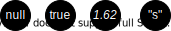
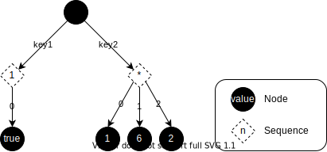
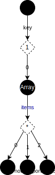
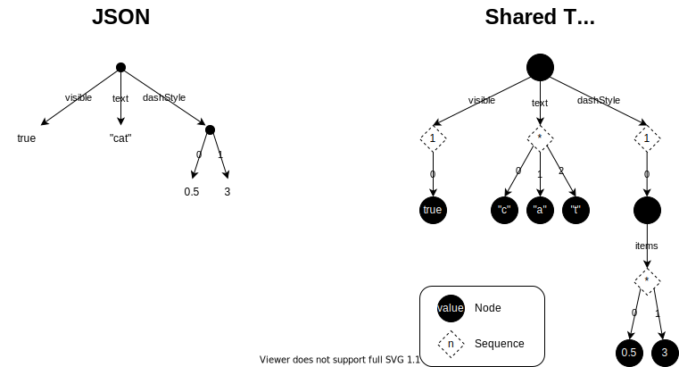

# Data Model

## Introduction

This document discusses how tree data is conceptually organized within the SharedTree DDS.
It is primarily of interest to Fluid developers working on SharedTree.
Most SharedTree users will interact with tree data through a pre-existing API layer.
However, the data model may be of interest to advanced users who are implementing a specialized API (see [#8989](https://github.com/microsoft/FluidFramework/issues/8989)).

The SharedTree data model is closely related to, but not precisely the same as:

- The internal in-memory representation of tree data
- The serialized tree data sent across the network
- The format used to persist tree data in storage

While each of the above involve specific encodings of the SharedTree data model, the SharedTree data model itself is not concerned with the byte-level representation (see [#10034](https://github.com/microsoft/FluidFramework/issues/10034)).

## Requirements

### JSON Interoperability

We take it as a given that the underlying data model for the SharedTree is tree-structured data.
We also agree that JSON is the modern lingua franca of the web and services.
We therefore begin with the following requirements:

1. JSON can efficiently and losslessly be encoded by the underlying SharedTree data model, with a small number of possible caveats (see below).
3. Deviations from JSON in the underlying SharedTree data model must be well justified.

Consequently, we require that the underlying SharedTree data model can express the following in a natural way:

- Object-like records of named properties
- Array-like sequences of consecutive items (non-sparse)
- null, true/false, finite numbers (f64), and strings

#### Potential JSON Caveats
We currently know of two potential caveats regarding JSON interoperability.

##### Arbitrary Precision Numbers
As defined, the JSON specification allows numbers to be of arbitrary precision.
Some systems honor this by parsing JSON into a representation that uses an alternative numeric encoding than IEEE 64b floating point format.
However, JavaScript's built-in `JSON.parse()` does not.
Therefore, we do not currently see a need to preserve arbitrary precision numbers in M1.

##### Reserved Keys
Projecting arbitrary SharedTree data to JSON requires tradeoffs due to the fact that the SharedTree data model is a superset of JSON.
Specifically, the SharedTree data model includes special fields for ids and types.
Preserving these special fields in the JSON encoding will require the use of reserved keys or a reserved key prefix.

##### Primitives with Ids and Augmentations
A second complication when projecting SharedTree data to JSON is that the JSON encoding does not support fields on primitive types, such as numbers and booleans.
In order to preserve ids and augmentations on primitives, we will need to wrap the primitives in objects using the reserved type field to identify which objects represent encoded primitives.

### Durable References

The data model must support creating inexpensive durable references to nodes within the tree.
This includes scenarios like creating "share link" URLs or building graph-like relationships within the tree.

### Schema

While the data model is schema agnostic, the data model must encode sufficient information that a system opting into a schema-on-write policy can efficiently implement schema validation on top of the underlying data model (see #9282).

### Augmentation

The data model must allow a subset of collaborators to unobtrusively attach extra-schema data to the tree in a way that is ignored (but preserved) by clients that are unaware of these augmentations.

## Model

### Node

In the SharedTree data model, each addressable piece of data is represented as a tree ***node***.
There is an implicit node at the root of the SharedTree that serves as the initial insertion point for trees constructed by the application..

<figure align="center">
  
  <figcaption>Figure: Implicit root node</figcaption>
</figure>

The root node may not be moved/removed and has a well-known identity, but otherwise is indistinguishable from other tree nodes.

### Value

Each tree node has an optional ***value***.
Values are used to store scalar data, such as numbers and booleans.

<figure align="center">
  
  <figcaption>Figure: Nodes with values</figcaption>
</figure>

From the perspective of the SharedTree data model, values are [***opaque***](https://en.wikipedia.org/wiki/Opaque_data_type) byte sequences.
The only tree operation that affects a node's value is 'setValue', which overwrites a node's value with a new immutable value.

In practice, node values are Fluid [***serializable***](https://github.com/microsoft/FluidFramework/blob/main/packages/runtime/datastore-definitions/src/serializable.ts) types and can be interpreted us such using schema information.

### Field

Each tree node has a set of zero or more fields.
Fields are used to model map-like composite types, where each  ***field*** represents one relationship between a parent node and an ordered ***sequence*** of one or more children.

<figure align="center">
  
  <figcaption>Figure: A parent node with two fields</figcaption>
</figure>

The fields of a node are distinguished by a field ***key***.
From the data model's perspective, field keys are opaque byte sequences.
In practice, dynamic keys are string literals and static keys are identifiers that correspond to a schema field declaration.

### Sequences

In the SharedTree data model abstraction, there is no distinction between a field that always contain a single child and a field that can contain multiple children.
Instead, SharedTree treats all fields as ordered collections and uses schema to restrict which fields are optional, must contain a single value, or may contain multiple values.

#### Implicit Sequences

When mapping the SharedTree data model to conventional programming languages, it is sometimes helpful to think of the sequence as being distinct from the field, as if each field points to an ***implicit sequence*** object.

<figure align="center">
  
  <figcaption>Figure: Visualizing implicit sequence of 'key' field</figcaption>
</figure>

However, it is important to remember that sequences are not tree nodes.
This means that sequences are not directly addressable.
The combination of the field + sequences is implicitly created when the first item is inserted, implicitly deleted when the last item is removed, and may only be referenced indirectly via the combination of parent node + field key.

#### Explicit Arrays

Most languages represent sequences with an explicit array object.  As opposed to an implicit sequence, these explicit array objects have identity, are directly addressable, and can be moved within the tree.  To model explicit array objects in the SharedTree data model, one introduces a node between the parent and items.

<figure align="center">
  
  <figcaption>Figure: 'key' field points to an explicit array node</figcaption>
</figure>

### Special Fields

This section covers fields that receive special treatment in the SharedTree data model.
These fields are special because:

- They have reserved keys
- They are universally available on all nodes (regardless of schema.)
- They can not be targeted by normal tree operations.

#### Type

The SharedTree data model optionally supports nominal typing via an optional special *type* field.
The value of the *type* field is the unique identifier of the corresponding schema type.

In the data model abstraction, the value of the type field is an opaque byte sequence.
However, there is a set of well-known types (*boolean*, *number*, etc.) that are transparent to the underlying implementation.

#### Id

The SharedTree data model optionally supports durable references to tree nodes via a special *id* field.
When present, the *id* field is used by SharedTree to provide a bidirectional *id* ⟷ *node* index that provides efficient lookup of nodes by their id.
This is the underlying building block for features like "share link" URLs and graph-like references within the tree.
Because there is a cost to maintaining with the *id* ⟷ *node* index, the application may choose which nodes are assigned ids.

## JSON Comparison

The below diagram highlights the differences between the JSON data model and the SharedTree data model using the following snippet:

```json
{
    "visible": true,
    "text": "cat",          // String uses an implicit sequence
    "dashStyle": [0.5, 3]   // Array uses an explicit tree node
}
```

<figure align="center">
  
  <figcaption>Figure: JSON and SharedTree</figcaption>
</figure>

Of note:

- Scalar values are represented by tree nodes and consequently have a durable identity.
- The 'visible' field is a sequence, even though it is constrained by schema to only contain a single value.
- The 'text' field leverages its implicit sequence to represent the letters of "cat" as individual nodes, allowing the text to be collaboratively edited in the same way as array.
- The 'dashStyle' field points to an extra node that represents the array object, which in turn contains the array items.

# Appendix A: Notes

- We chose the term 'field' in because it is convenient to have a term that is distinct from the 'properties' that result when the domain model is projected to an API.
('field' also happens to align with GraphQL.)
- We chose the term 'key' because it sounds more opaque than 'name' or 'label', both of which conjure the notion of something that is human readable.
