# Cell Ordering

This document's current purpose is to make it easier to refresh one's understanding of the cell ordering scheme currently used by arrays/sequence fields.
That doesn't make it a great document for readers who do not already have some familiarity of the topic and related topics such as rebasing.
This document may serve as the basis for a more approachable and higher-quality document in the future.

## Cells

The idea of cells is introduced in [cell-model-of-collaborative-editing.md](cell-model-of-collaborative-editing.md).
The core idea is that, in addition to requiring a way to refer to positions that nodes occupy
(which we accomplish using integer indices for nodes in a given sequence, at a given point in the commit graph)
we need a way to refer to the empty locations that nodes may occupy or have occupied in the past.
We call these "cells".

We accomplish this by assigning a unique ID to each such cell
and using that ID in commits that need to refer to the cell.

Being able to refer to empty cells makes it possible for commits to convey position information relative to such cells.
For example, if some commit `A` inserts content before some empty cell `c`
while some other commit `X` concurrently inserts content after that same cell `c`,
then we know that the content inserted by `A` should come before the content inserted by commit `X`
no matter the order in which the commits `A` and `X` end up sequenced in the commit history.
If these commits had not been able to refer to `c`, then they would not have been able to guarantee the relative ordering of their inserted contents.

## Cell References In Commits

There are some important properties when it comes to cell references in commits.

### All or Nothing

When a commit `C` includes a reference to a cell introduced in some commit `A`
(`A` is either `C` itself or one of its ancestors),
`C` will include references to all cells introduced by `A`.

### Ordering of References

For any pair of references `ra` and `rb` that commits `C` contains,
`C` also includes enough information to totally order `ra` relative to `rb`.

Note that the above two properties, when taken together, entail that we should never be tie-breaking pairs of cells introduced by the same commit.


## Cell IDs and Commits

Each cell ID includes the ID of the commit that introduced it,
which makes it easy to check if a given commit introduced a given cell ID.

There are two cases where a commit introduces a new cell ID:

1. Inserting a new node in a sequence typically introduces a cell ID to refer to the cell that will hold the node.
   In the input context of the commit, the cell is empty.
   In the output context of the commit the cell is populated with the inserted node.
2. Moving or removing a node from a sequence typically introduces a cell ID to refer to the cell that held the node.
   In the input context of the commit, the cell is populated with the node.
   In the output context of the commit, the cell is empty.

The qualifier "typically" is needed because rollback commits can reuse past cell IDs for that same cell. See below.

While a single cell ID can only refer to a single cell,
a single cell may be referred to by multiple IDs over time.
This is really relevant to cell ordering.

Commits can also refer to a cell using an ID that was introduced by a prior commit.
This occurs in two cases:

1. An inverse commit (whether a rollback or revert) refers to all cells that the commit it is the inverse of referred to and uses the same IDs to do so.
   For example, if commit `A` removes a node and therefore introduces cell ID `Id1` to refer to the cell it empties,
   then the inverse of `A` will restore that node to the same cell, referring to that cell using `Id1`.

2. Rebasing a commit `A` over a commit `X` leads to a commit `A'` that refers to all cells that either `A` or `X` referred to.
   For example, if `A` inserts a node next to a node `n`, and `X` removes `n` thereby introducing cell ID `Id1` to refer to the cell where `n` used to be,
   then `A'` will carry a mark that uses `Id1` in order to describe the location of the cell that used to contain `n`.

## The Cell Reference Accumulation Invariant

One can infer from the above that for a given commit `C`...
* `C` refers to all cells introduced by `C`.
* `C` refers to all cells introduced by ancestors of `C` up to some ancestor `A`.

The commits that introduce cells that `C` refers to therefore form a contiguous subsequence always including and ending in `C`.
In other words, when considering a single branch,
if a commit `C` has a reference to a cell introduced by commit `A`,
then it also has references to every cell introduced by `A`,
references to every cell introduced by commits sequenced between `A` and `C`,
as well as references to every cell introduced by `C`.

Note that rollback commits are excluded from this invariant because they are not truly considered to be part of any branch.
See the [Rollback commits](#rollback-commits) section for more details.

In commit graph diagrams, we can represent this contiguous subsequence visually with a segment that extends from `C` backwards under all the commits that introduced cells that `C` refers to:

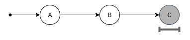<br />
_`C` refers to all cells introduced by `C` and all its ancestors up to and excluding `B`._


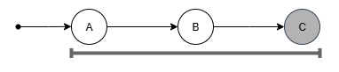<br />
_`C` refers to all cells introduced by `C` and all its ancestors up to and including `A`._

In this last example, the cell reference accumulation invariant means that since `C` refers to cells introduced by `A`,
it must also refer to cells introduced by `B`.

## Cell Reference Accumulation In Practice

The above invariant can be interpreted to mean that the following is true for any commit `C`:
* There is a commit `OldestRef(C)` that is the commit which introduces the oldest cell that `C` refers to.
* `OldestRef(C)` is either `C` itself or one of `C`'s ancestors.
* `C` contains references to all cells introduced by commits `OldestRef(C)`, `C`, and all commits in between.

Since this property stems from inverses and rebases,
it's tempting to think that the `OldestRef(C)` of any commit `C` is the earliest commit it rebased over if `C` has been rebased,
or that is otherwise is the commit `C` is the inverse of if `C` is the inverse of a commit and has not been rebased,
or that is otherwise is `C` itself.
This intuition is wrong.
In practice, the `OldestRef(C)` of any commit `C` can be an earlier commit.
This is due to the following:
1. When we invert `C`, the inverse will contain references to all cells that `C` referred to,
   not just the ones that `C` introduced.
2. When we rebase `C` over `X`, we don't just include in `C'` references to cell introduced by `X`,
   we also includes references to all cells that `X` has references to.
3. Rebasing `B` over a rollback commit `A⁻¹` adds to the rebased commit references to cells referenced by `A`.
   These references are not dropped when later rebasing that commit over `A'`.

This can lead to more cells references than strictly necessary.
We may attempt to reduce the number of unnecessary references in [the future](#future-work).

## Tie-Breaking: Cell Ordering From Commit Ordering

While cells help specify the relative order of content in sequences,
there are some situation where the information contained in commits only specifies a partial order.
Through a process known as "tie-breaking", the rebasing system is responsible for picking a total ordering that is consistent across peers.
It does this based on the relative sequencing order of the commits in the commit graph.
This happens in two cases:

1. When cells are being introduced by the same gap by concurrent commits.<br />
   <br />
   _`X` and `A` are concurrent so the relative order of cells they introduced by the same gap is unspecified.<br />
   The colors have no intrinsic meaning. Their purpose is to depict which commit refers to cells introduced by which commit._

2. When a commit `C` introduces cells in a gap where one of its ancestors (commit `A`) introduced cells that are empty in the input context of `C`,
   and `C` does not include references to the cells introduced by `A`.<br />
   <br />
   _`C` does not refer to cells introduced by its ancestor `A`,
   so the relative order of cells `C` and `A` introduce in the same gap is unspecified._

In both of these cases we order the cells introduced by the later commit left of the cells introduced by the earlier commit.
This leads to a system where,
in order to determine the relative order of two cells,
we sometimes need to know the relative order of the two commits that introduced the cells.

## Compose

In this section, we consider the cell-ordering scenarios (tie-breaking and otherwise) that compose operations face.

When composing `A ○ B`, we know the following about the commit graph:

* `A` comes before `B` in sequencing order.
* `A` and `B` are not concurrent.
* There are no commits between `A` and `B` in sequencing order.
* There may be commits before `A` that either `A` and/or `B` can refer to.

We can represent this situation with the following commit graph:<br />
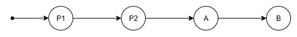<br />
`P1` and `P2` are prior commits (which are not being composed).
They are included here because `A` and/or `B` may refer to cells that `P1` and `P2` introduce.
While there may be any number of such prior commits that introduced cells that `A` and/or `B` may refer to,
using two commits is sufficient to fully consider the relevant cases.

For each pair of cells (`ca`, `cb`) referred to by `A` and `B` respectively,
we need to be able to determine the relative ordering of `ca` and `cb`.
The space of possible comparisons looks like this:
```
                        +---------------------+
                        |   cb introduced by  |
                        +----+----+-----+-----+
                        | P1 | P2 |  A  |  B  |
+------------------+----+----+----+-----+-----+
|                  | P1 |    |    |     |     |
|                  +----+----+----+-----+-----+
| ca introduced by | P2 |    |    |     |     |
|                  +----+----+----+-----+-----+
|                  | A  |    |    |     |     |
+------------------+----+----+----+-----+-----+
```

There are multiple ways the implementation of compose could be structured to deal with these cases.
For the purposes of this document, we are not interested in coming up with or describing a specific implementation.
We instead consider what information and techniques are available to possible implementations.

Reminder: given a commit `C` and a reference to a cell `c`,
we can use the cell ID used to reference `c` to check if `c` was introduced by `C`.

### Pairs of Cells Introduced by The Same Commit

If `ca` and `cb` both refer to cells introduced by the same commit
(whether or not they refer to the exact same cell), then,
because commits always contain ordered references to either none or all cells introduced by a commit,
`A` or `B` must both contain ordered references both `ca` and `cb`.
This ordering can be looked up in either commit.
This takes care of the following cases:
```
                        +---------------------+
                        |   cb introduced by  |
                        +----+----+-----+-----+
                        | P1 | P2 |  A  |  B  |
+------------------+----+----+----+-----+-----+
|                  | P1 | ## |    |     |     |
|                  +----+----+----+-----+-----+
| ca introduced by | P2 |    | ## |     |     |
|                  +----+----+----+-----+-----+
|                  | A  |    |    | ### |     |
+------------------+----+----+----+-----+-----+
```

### Pairs of Cells Introduced by Different Input Commits

The compose function can detect cases where `ca` refers to `A` and `cb` refers to `B`
because it has access to commits `A` and `B`.
These cases are trivially resolvable because we know `A` comes before `B` in sequencing order.
This takes care of the following cases:
```
                        +---------------------+
                        |   cb introduced by  |
                        +----+----+-----+-----+
                        | P1 | P2 |  A  |  B  |
+------------------+----+----+----+-----+-----+
|                  | P1 |    |    |     |     |
|                  +----+----+----+-----+-----+
| ca introduced by | P2 |    |    |     |     |
|                  +----+----+----+-----+-----+
|                  | A  |    |    |     | ### |
+------------------+----+----+----+-----+-----+
```

### Pairs of Cells With One Cell Introduced by Either Input Commit

Being able to detect whether `ca` and/or `cb` were introduced by `A` or `B` also allows us to handle cases where only one of `ca` and `cb` refers to a cell introduced by `A` or `B`.
This is because any commit other than `A` and `B` that introduced cells that `A` or `B` might refer to must be an ancestor of `A` and `B`,
thus making the corresponding cell older.
This takes care of the following cases:
```
                        +---------------------+
                        |   cb introduced by  |
                        +----+----+-----+-----+
                        | P1 | P2 |  A  |  B  |
+------------------+----+----+----+-----+-----+
|                  | P1 |    |    | ### | ### |
|                  +----+----+----+-----+-----+
| ca introduced by | P2 |    |    | ### | ### |
|                  +----+----+----+-----+-----+
|                  | A  | ## | ## |     |     |
+------------------+----+----+----+-----+-----+
```

### Pairs of Cells Both Referred to by Either Commit

If `A` refers to both `ca` and `cb`, then the relative order of `ca` and `cb` can be looked up in `A`.
Similarly, if `B` refers to both `ca` and `cb`, then the relative order of `ca` and `cb` can be looked up in `B`.

This insight requires taking into consideration how the set of commits that have introduced cells that `A` refers to relates to the set of commits that have introduced cells that `B` refers to.
Specifically, it requires taking into consideration where these sets intersect.

As an example, consider the following scenario:<br />
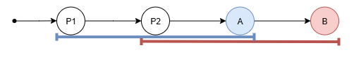<br />
_`A` refers to cells introduced by `P1`, `P2`, and `A`.
`B` refers to cells introduced by `P2`, `A`, and `B`._

Because `A` and `B` both refer to cells introduced by `P2` and `A`,
no matter which commit introduced the cell that `ca` refers to,
any time `cb` refers to a cell introduced by `P2` or by `A`,
the relative ordering of `ca` and `cb` can be found in `A`.
This allows us to handle the following cases:
```
                        +----------------+
                        |cb introduced by|
                        +----+-----+-----+
                        | P2 |  A  |  B  |
+------------------+----+----+-----+-----+
|                  | P1 | ## | ### |     |
|                  +----+----+-----+-----+
| ca introduced by | P2 | ## | ### |     |
|                  +----+----+-----+-----+
|                  | A  | ## | ### |     |
+------------------+----+----+-----+-----+
```

Similarly, no matter which commit introduced the cell that `cb` refers to,
any time `ca` refers to a cell introduced by `P2` or by `A`,
the relative ordering of `ca` and `cb` can be found in `B`.
This allows us to handle the following cases:
```
                        +----------------+
                        |cb introduced by|
                        +----+-----+-----+
                        | P2 |  A  |  B  |
+------------------+----+----+-----+-----+
|                  | P1 |    |     |     |
|                  +----+----+-----+-----+
| ca introduced by | P2 | ## | ### | ### |
|                  +----+----+-----+-----+
|                  | A  | ## | ### | ### |
+------------------+----+----+-----+-----+
```

While this is only applicable to that scenario,
and different scenarios would yield different ordering capabilities using this approach,
we can intuit that this approach can at least be leveraged whenever the inclusion in one of the input commits of references to cells introduced by some commit entail the inclusion of references cells introduced by other commits.
This is the case here because the inclusion of one reference to a cell introduced by `P2` entails the inclusion of references to all cells introduced by `P2` and `P1`.
Similarly, the inclusion of one reference to a cell introduced by `P1` entails the inclusion of references to all cells introduced by `P1` and `A`.
This means that this approach can tackle the following cases:
```
                        +---------------------+
                        |   cb introduced by  |
                        +----+----+-----+-----+
                        | P1 | P2 |  A  |  B  |
+------------------+----+----+----+-----+-----+
|                  | P1 | ## | ## | ### |     |
|                  +----+----+----+-----+-----+
| ca introduced by | P2 | ## | ## | ### |     |
|                  +----+----+----+-----+-----+
|                  | A  | ## | ## | ### |     |
+------------------+----+----+----+-----+-----+
```

Note that we don't need to know which scenario we find ourselves in to benefit from this approach.
We can just check whether `A` contains a reference to `cb` or `B` contains a reference to `ca` and leverage whichever is the case.

### Pairs of Cell Where `ca` Is Unknown to `B`

Whenever `ca` refers to a cell that `B` has no reference to,
we can be sure that `ca` was introduced by a commit that is older than whichever one introduced the cell that `cb` refers to.

To see this is true, consider all the possible scenarios where `A` could make a reference to a cell that `B` does not refer to:<br />
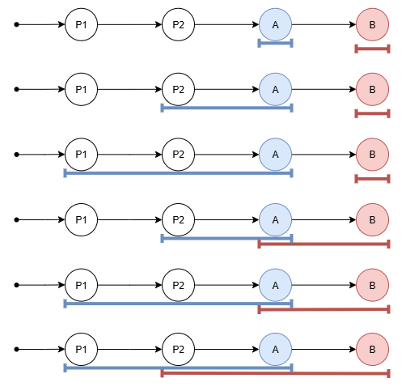

In all such scenarios, cells known to `A` and unknown to `B` are introduced by commits that have a blue underline but no red underline,
while `cb` must be introduced by a commit that has a red underline (whether or not it also has blue underline).
One can see from the diagrams that the former always precedes the latter in sequencing order.

### Pairs of Cell Where `cb` Is Unknown to `A` But Not Introduced by `B`

Whenever `cb` refers to a cell that `A` has no reference to,
and `cb` was not introduced by `B`,
then we know that `cb` must have been introduced by either `P1` or `P2`,
and that `A` has no reference to cells introduced that far back.
This means that `cb` refers to a cell introduced before `ca` was introduced.

### Putting it All Together

By looking at which cases each of these approaches can handle,
we can see that, when taken together, they are sufficient to address any cell ordering scenario in compositions.
This shows how implementations of compose need not rely on extra metadata in order to correctly order cells.*

*See the [Rollback commits](#rollback-commits) section to see how they fit into this.

## Rebase

In this section, we consider the cell-ordering scenarios (tie-breaking and otherwise) that rebase operations face.

When rebasing `B ↷ X`, we know the following about the commit graph:

* `X` and `B` are concurrent.
* `X` comes before `B` in sequencing order.

In the simplest case, it's also true that `X` and `B` have the same ancestry and therefore the same input context.
This is true when rebasing a branch that contains a single commit:<br />
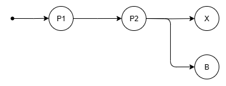<br />
with the goal to produce `B'`:<br />
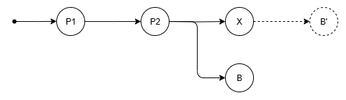<br />

In the more general case, there can be any number of commits between `P` and `B` on the branch to be rebased:<br />
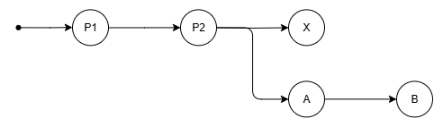<br />
with the goal to produce rebased versions of each before `B'`:<br />
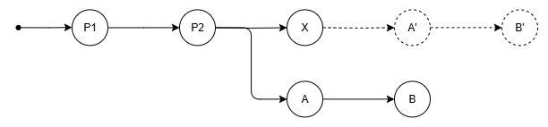<br />

This prevents us from directly rebasing `B` over `X` because they have different input context.
When confronted to this general case,
we first rebase `B` over the inverses of all the commits between `B` and its lowest common ancestor with `X` (`P2` here).
This maneuver produces to a commit `B2` whose input context is *compatible* with `X`'s:<br />
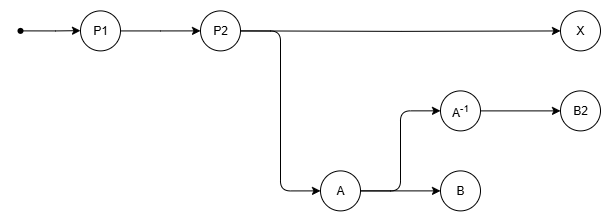

It is this `B2` commit that is passed to the rebase function when performing `B ↷ X`.
The graph of relevant commits in the general case therefore looks like this:<br />
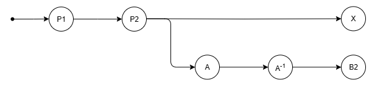

When we say that `B2`'s input context is compatible with `X`'s,
what we means is that they are only different in ways that rebase is equipped to handle.
Specifically, rebase can handle the fact that `B2` may refer to cells that were introduced by ancestors that it does not share with `X` (`A` in our example).

In the remainder of this section, we use `B` to refer to all variants of `B`,
and `B2` when statements more specifically apply to that particular variant of `B`.

For each pair of cells (`cb`, `cx`) referred to by `B2` and `X` respectively,
we need to be able to determine the relative ordering of `cb` and `cx`.
The space of possible comparisons looks like this:
```
                        +---------------------+
                        |  cb introduced by   |
                        +----+----+-----+-----+
                        | P1 | P2 |  A  |  B  |
+------------------+----+----+----+-----+-----+
|                  | P1 |    |    |     |     |
|                  +----+----+----+-----+-----+
| cx introduced by | P2 |    |    |     |     |
|                  +----+----+----+-----+-----+
|                  | X  |    |    |     |     |
+------------------+----+----+----+-----+-----+
```

While there may be any number of commits between `P2` and `B` on the rebased branch,
we only consider the case with a single commit (`A`) as opposed to, e.g., `A1` and `A2`.
This is sufficient because the set of cell ordering case involving such commits is the same:
they might need to be ordered relative to cells introduced by `P1`, `P2`, or `X`
and there's nothing that would make this process different for `A1` compared to `A2`.

As we did for compose, we consider what information and techniques are available to possible implementations.
We gloss over the explanation when it is the same as it was for compose.

### Pairs of Cells Introduced by The Same Commit

As for compose, this takes care of the following cases:
```
                        +---------------------+
                        |  cb introduced by   |
                        +----+----+-----+-----+
                        | P1 | P2 |  A  |  B  |
+------------------+----+----+----+-----+-----+
|                  | P1 | ## |    |     |     |
|                  +----+----+----+-----+-----+
| cx introduced by | P2 |    | ## |     |     |
|                  +----+----+----+-----+-----+
|                  | X  |    |    |     |     |
+------------------+----+----+----+-----+-----+
```

### Pairs of Cells Introduced by Different Input Commits

As for compose, this takes care of the following cases:
```
                        +---------------------+
                        |  cb introduced by   |
                        +----+----+-----+-----+
                        | P1 | P2 |  A  |  B  |
+------------------+----+----+----+-----+-----+
|                  | P1 |    |    |     |     |
|                  +----+----+----+-----+-----+
| cx introduced by | P2 |    |    |     |     |
|                  +----+----+----+-----+-----+
|                  | X  |    |    |     | ### |
+------------------+----+----+----+-----+-----+
```

### Pairs of Cells With One Cell Introduced by `B`

If `cb` refers to a cell introduced by `B`,
then we know that `cx` is older that `cb` because any commit that introduced a cell that `cx` might refer to is older than `B`.
This takes care of the following cases:
```
                        +---------------------+
                        |  cb introduced by   |
                        +----+----+-----+-----+
                        | P1 | P2 |  A  |  B  |
+------------------+----+----+----+-----+-----+
|                  | P1 |    |    |     | ### |
|                  +----+----+----+-----+-----+
| cx introduced by | P2 |    |    |     | ### |
|                  +----+----+----+-----+-----+
|                  | X  |    |    |     | ### |
+------------------+----+----+----+-----+-----+
```

Note that we cannot handle cases where `cx` refers to a cell introduced by `X` and `cb` does not refer to a cell introduced by `B`
because `cb` might refer either to a cell introduced by `P1`, `P2` or `A`,
which have different implications for cell ordering relative to cells introduced by `X`.

### Pairs of Cells Both Referred to by Either Commit

This works the same as in compose,
though it only applies to cells introduced by `P1` or `P2`:
```
                        +---------------------+
                        |   cb introduced by  |
                        +----+----+-----+-----+
                        | P1 | P2 |  A  |  B  |
+------------------+----+----+----+-----+-----+
|                  | P1 | ## | ## |     |     |
|                  +----+----+----+-----+-----+
| cx introduced by | P2 | ## | ## |     |     |
|                  +----+----+----+-----+-----+
|                  | X  |    |    |     |     |
+------------------+----+----+----+-----+-----+
```

### Pairs of Cell Where `cx` Is Unknown to `B`

This works the same as in compose.

### Pairs of Cell Where `cb` Is Unknown to `X` But Not Introduced by `B`

We cannot leverage this situation for ordering cells because `cb` could be introduced in either `A`, `P1`, or `P2`,
which have different ordering implication with respect to `cx`.

### Putting it All Together

By looking at which cases each of these approaches can handle,
we can see that they are enough to collectively address the following cases:
```
                        +---------------------+
                        |   cb introduced by  |
                        +----+----+-----+-----+
                        | P1 | P2 |  A  |  B  |
+------------------+----+----+----+-----+-----+
|                  | P1 | ## | ## |     | ### |
|                  +----+----+----+-----+-----+
| cx introduced by | P2 | ## | ## |     | ### |
|                  +----+----+----+-----+-----+
|                  | X  |    |    |     | ### |
+------------------+----+----+----+-----+-----+
```

The three cases where `cb` is a cell introduced by `A` seem like they ought to be straightforward:
`A` comes after `P1`, `P2`, and `X`, so `cx` is older than `cb`.
The problem is that we don't know how to differentiate these cases from the ones were `cb` was introduced by by `P1` or `P2`.
This is because the rebase implementation has no way of determining if `cb` was introduced by `A`.

### Providing Metadata

In order to be able to tackle the remaining cases,
rebase needs to be able to detect references to cells that were introduced by any commit between `B` and the lowest common ancestor of `X` and `B`.
In other words, rebase needs to be able to check if a cell was introduced by a commit on the branch that is being rebased.

### A Different Way?

It's interesting to note that rebase's need for metadata only comes from our choice of scheme for handling branch rebasing.
We can imagine a different approach where all commits on the branch are composed together into a single commit that is then rebased as a unit.
Such an approach would ensure that the rebased commit and the commit that it is rebased over truly have the same ancestry and the same input context,
and it would remove the need for the extra metadata.

## Rollback Commits

Rollback commits are a tool that the high-level rebasing algorithm uses in order to leverage low-level rebasing operations for the purpose of performing branch rebases and for computing the net change on a tree whose local edits have been rebased.

Rollback commits are not real commits:
* They don't represent a user edit.
* They don't define a valid revision in the document history.
* They are not rebasable.

Rollback commits do not abide by the cell reference accumulation invariant.
Consider the scenario where a branch with commits `A` and `B` is being rebased over `X`:
producing the net change requires composing `B⁻¹ ○ A⁻¹ ○ X ○ A' ○ B'`.
The rollback commits `B⁻¹` and `A⁻¹` may refer to cells that are introduced by commits `B'` and `A'`,
which come later in the composition order.
Also, composing `B⁻¹` with `A⁻¹` might require tie-breaking cells introduced by `A` and `B`.
This would normally be done based on the ordering of the commit passed to the compose operation,
but using such an order would yield the wrong tie-break behavior since `B⁻¹` and `A⁻¹` are passed to compose in the order that is the reverse of the actual sequencing order.
The same is true for compositions that involve rollback commits and normal commits, such as `A⁻¹ ○ X`.

### In Compose

Each rollback commit contains information about which commit it is a rollback of.
You could say each rollback comes with its own metadata.
The compose implementation can leverage this metadata to infer the sequencing order of commits from the order of the commits it is given.

Compose having to know about the existence of rollback commits is a downward leak from the high-level rebasing algorithm.

### In Rebase

Rollback commits do not cause additional cell-ordering challenges during rebasing.
The rollback commits themselves are never rebased.
When rebasing over a rollback commit,
the commit being rebased is always a commit that was sequenced after the commit being rolled back.
This is in line with rebase's expectations when it comes to the relative sequence ordering of the commits it is passed as input.

### Tiding Up

We could avoid ever passing rollback commits to compose
(and therefore not require logic in the compose implementation to watch out for rollback commits).

For rebasing commit `C` when rebasing branch `[A, B, C]` over commit `X`,
we currently do `C ↷ (B⁻¹ ○ A⁻¹ ○ X ○ A' ○ B')`.
Instead, we could do `(C ↷ (A ○ B)⁻¹) ↷ (X ○ A' ○ B')`.

We could define an `unbase` operation that performs `C ↷ (A ○ B)⁻¹` as an implementation detail.
The advantage of that is that the changeset produced by `(A ○ B)⁻¹` wouldn't exist outside the scope of this `unbase` operation.

For updating the tree state when rebasing branch `[A, B]` over commit `X`,
we currently apply a single delta that is generated by computing `Δ(B⁻¹ ○ A⁻¹ ○ X ○ A' ○ B')`.
Instead, we could apply `Δ((A ○ B)⁻¹)` then apply `Δ(X ○ A' ○ B')`.
The trouble with that, is that it will feed a lot of change notifications to delta visitors (and ultimately the app)
even when the net change is minimal.

Instead we could try to implement composition for delta and apply the composition of these two deltas
(which should largely cancel out).

## Commit With Constraint Violations

Commits with constraint violations may introduce cells that downstream commits depend on for ordering.
(See the test "Rebase over a commit that depends on a commit that has become conflicted" for an example.)
We currently handle this by ensuring that rebasing over a commit with constraint violations does add the necessary references.

[Longer term](#future-work), we would rather change the system so that such rebases are not needed.

## Future Work

At a high level, cell ordering is defined by a combination of two things:
* The partial order that stems from edit operations that impose a relative order between nodes and their corresponding cells.
* The tie-breaking behavior.

Commits must include enough information to convey the partial order (at least when it goes against the ordering that tie-breaking would yield).
Tie-breaking requires information about the relative ordering of commits on the relevant branch.

Our current scheme for cell ordering tries to minimize the amount of metadata that needs to be passed to operations like rebase and compose.
It does so by relying on the commit order that is implicitly conveyed when passing commits to these operations,
and by adding cell references during rebases even when such references are not truly needed to convey the partial order.
This last part is noticeable in the "Rebase over a commit that depends on a commit that has become conflicted" test:
A commit that rebases over a conflicted commit needs to acquire new cell references for the sole purpose of making later rebase operations work without knowledge of the relative ordering of the commits that introduced the cells.

Our current scheme therefore has the following smells:
1. It tries to minimize the use of metadata, but never fully succeeds in making it unnecessary.
1. It relies on the commit order that is implicitly conveyed when passing commits to rebase and compose,
   but that order doesn't always match the true sequencing order.
1. Storing extra cell references inside commits in order to make up of a lack of commit ordering information later on
   is inefficient and makes it harder to keep track of what references are needed and why.
   It also leads to situations where we rebase over conflicted commits which goes against the reasonable intuition that such commits make no changes and therefore shouldn't need to be rebased over.

The current scheme is designed around the flawed assumption that the commits passed to rebase and compose operations contain all the information that these operations requires
or that such information can be inferred from the call (e.g., `A ○ B` implies `A` was sequenced before `B`).
We then make up for this flaw in convoluted ways.
We should instead move to a system where we fully embrace the fact that commit ordering information about some commits might be needed in operations that don't directly involve these commits.

Such as system would be more in tune with how we would like to think of cells being introduced:
merely as being a declaration that such a cell exists, has existed for all time, and will continue to exist for all time.
Such a declaration should not constitute a change (and therefore does not need to be rebased over).
In fact, under this model, it would be wrong for the rebase logic to take such a declaration into account.

We want to make metadata about commit sequencing fully available to rebase and compose operations.
This will allow us to only use cell references where they are truly needed for the purpose of capturing information about the partial ordering of empty cells.
It will also make the scenarios where the true commit ordering doesn't match the implicit order of commits less special since the ordering metadata will provide the source of truth for these cases just as it does for more normal cases.
This effectively reduces the amount of leakage from the high-level rebase logic to the low-level rebase and compose operations.
