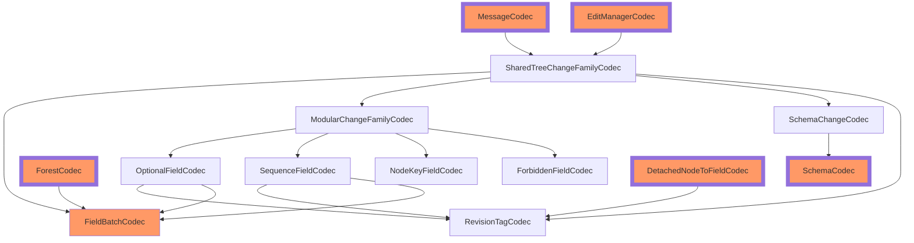

# Compatibility

This document provides concrete guidelines and strategies for organizing code that impacts SharedTree's persisted format.

## Prerequisites

[This document](../../../../../packages/dds/SchemaVersioning.md) provides general "best practices" for working with persisted data within the Fluid Framework.
It's strongly recommended to read through and understand its rationale before continuing with this document,
as most of the concrete recommendations presented henceforth fall out of those best practices.

## What State is Persisted?

A DDS's persisted format encompasses the format it uses for its summaries as well as its ops (due to [trailing ops](../../../README.md))
including transitively referenced structured blob data.

Since documents are stored outside of Fluid control (i.e. no type of central data migration is possible),
DDSes necessarily commit to backwards compatibility of their format for all time.

## Format Management

The persisted format version should be a configuration option an application author can specify using `SharedTreeFactory`:
this ensures applications can control rollout of configuration changes which require code saturation of some prior version.
It also empowers the container author (rather than the host--if they differ) to control their data model.

In the SharedTree MVP, there is currently no mechanism for safely changing the persisted format version.
However, it is feasible to add such a mechanism in the future, and specifying the persisted format explicity in configuration sets us up to easily do so.
One example of prior art in the space is `@fluid-experimental/tree`'s [format-breaking migration strategy](../../../../../experimental/dds/tree/docs/Breaking-Change-Migration.md),
though we would likely want to make the mechanism usable across the Fluid Framework.

## Code Organization

Each part of SharedTree which contributes to the persisted format should define:

1. Types defining the _in-memory format_ needed to load or work with its data
1. A set of versioned _persisted formats_ which encompass all supported formats in the current and past.
1. EITHER An `IJsonCodec` capable of transcoding between the in-memory format and a particular persisted format, OR an `ICodecFamily` of such `IJsonCodec`s (for different persisted format versions)

Split the above components into files as is reasonable.
Current organizational standards put:

-   The in-memory format into a file ending in `Types.ts`
-   The persisted format into a file ending in `Format.ts`
-   Codecs into a file ending in `Codec.ts` / `Codecs.ts`

Having consistent conventions for these files helps to make changes to persisted formats obvious at review time.
Schemas for primitive types which are used in persisted formats but don't intrinsically define formats (such as branded strings) can be defined where convenient.
Codec logic should generally be self-contained: all imports should either be of the form `import type`, or should import from another persisted format file.
Importing Fluid Framework libraries that have the same guarantees (e.g. `SummaryTreeBuilder`) is also acceptable.
Codecs should expose the minimal necessary set of types.
Encoding should take care to only include necessary object properties. **In particular, avoid constructs like object spread**.
Decoding should validate that the data is not malformed: see [encoding validation](#encoding-validation) for more details.

With the exception of primitives, storage format types should never be exposed in the public API.

> Note: due to API-extractor implementation details, the typebox schemas for primitive types _cannot_ share a name with the primitive type,
> as it exposes _both_ the value and the type exported under the same name, even if the export is specified via `export type`.
> For example, the typebox schema for `ChangesetLocalId` is named `ChangesetLocalIdSchema`.

Using this structure, SharedTree will have access to a library of codecs capable of encoding/decoding between
the in-memory format and some persisted format.

## Encoding Validation

Validating that an encoded format thoroughly matches what the code expects and failing fast otherwise is valuable to reduce the risk of data corruption:
it's a lot easier to investigate and deploy fixes for documents when incompatible clients haven't also changed the contents of a file.

For this reason, encoded data formats should declare JSON schema for the purpose of runtime validation.

> In the near term, we're using [typebox](https://github.com/sinclairzx81/typebox) to declare these schemas.
> This choice is a matter of convenience: its API naturally matches the expressiveness of typescript types.

Since format validation does incur runtime and bundle-size cost to obtain additional safety,
whether or not to perform it should ultimately be left as a policy choice to the user of shared-tree.
This choice will probably also be made in the shared-tree factory by providing a `JsonValidator`,
but it doesn't need to be persisted and can be changed at will
(there's no issue with collaboration between clients that have different policies around how much
of the persisted data should be validated).

An out-of-the-box implementation of `JsonValidator` based on Typebox's JSON validator is provided,
but application authors may feel free to implement their own.

## Test Strategy

This section covers types of tests to include when adding new persisted configuration.

There are a couple different dimensions to consider with respect to testing:

1. SharedTree works correctly for all configurations it can be initialized in when collaborating with SharedTrees with similar configuration
1. SharedTree is compatible with clients using different source code versions of SharedTree (and the documents those clients may create)
1. Once supported, SharedTree can correctly execute document upgrade processes (changes to persisted configuration such as write format)

### Configuration Unit Tests

Each codec family should contain a suite of unit tests which verify the in-memory representation can be round-tripped through encoding and decoding.
When adding a new codec version, the test data for this suite should be augmented if existing data doesn't yield 100% code coverage on the new
codec version.

If the persisted configuration impacts more than just the data encoding step,
appropriate unit tests should be added for whatever components that configuration impacts.
As a simple example, a persisted configuration flag which controls whether SharedTree stores attribution information
should have unit tests which verify processing ops of various sorts yield reasonable attribution on the parts of the tree they affect.

Example: [experimental/dds/tree2/src/test/feature-libraries/editManagerCodecs.spec.ts](../../src/test/feature-libraries/editManagerCodecs.spec.ts)

### Multiple-configuration Functional Tests

Once SharedTree supports multiple persisted formats, we should modify a small set of functional acceptance tests
(e.g. `sharedTree.spec.ts`) to run for larger sets of configurations.
Using `generatePairwiseOptions` will help mitigate the combinatorial explosion concern.

These tests in aggregate will verify that SharedTree works when initialized with some particular configuration
and collaborates with other SharedTree instances initialized with the same configuration.
They would reasonably detect basic defects in codecs or problems unrelated to backwards compatibility or any upgrade process.

In the same vein, fuzz tests should cover a variety of valid configurations.

### Snapshot Tests

The last dimension of compatibility concerns direct or indirect collaboration between clients using different versions of SharedTree source code.
This is a vast area that could use more well-established framework testing support, but snapshot testing is a relatively effective category for
catching regressions.

The idea behind snapshot testing is to verify a document produced using one version of the code is still usable using another version of the code.
It's typically implemented by writing some code to generate a set of fixed documents "from scratch," then source-controlling the serialized form
of those documents after summarization.
Since the serialized form of the documents correspond to documents produced by an older version of the code, this enables writing a test suite that verifies:

1. The current version of the code serializes each document to exactly match how the older version of the code serialized each document.
1. The current version of the code is capable of loading documents written using older versions of the code.

A few examples (which may not be exhaustive) of snapshot tests are:

-   [Legacy SharedTree](../../../../../experimental/dds/tree/src/test/Summary.tests.ts)
-   [Sequence / SharedString](../../../sequence/src/test/snapshotVersion.spec.ts)
-   [e2e Snapshot tests](../../../../test/snapshots/README.md)

The first two examples generate their "from scratch" documents by directly calling DDS APIs on a newly created document.
The e2e snapshot tests accomplish "from scratch" generation by serializing the op stream alongside the snapshots and replaying it.
In addition to verifying serialized states line up between old and current version of the code, it can also be helpful to
verify equivalence at runtime, which typically gives more friendly error messages.

> Aside: this approach is also a bit more flexible: it's possible that different snapshots can load to produce logically equivalent DDSes.
> Matrix is an example of this: it uses a pair of permutation vectors mapping logical indices (i.e. "row 5, column 3") to in-memory indices for the contents of cells.
> Thus, permuting both the permutation vectors and the cell data contained within a snapshot would not logically change its data.

Snapshot tests are effective at catching changes which inadvertently modify the document format over time.

Tree2's full-scale snapshot tests can be found at [experimental/dds/tree2/src/test/snapshots/summary.spec.ts](../../src/test/snapshots/summary.spec.ts),
with smaller-scale snapshot tests (e.g. snapshot testing just the SchemaIndex format) nearby.

# Implementation Specifics

SharedTree's codecs are frequently composed over each other in a manner consistent with SharedTree's layering.
This conveniently allows unit testing only portions of the persisted data.
As a downside, it makes maintaining backwards compatibility with the format somewhat more complex, because not all codecs in this composition provide explicit versions for the portion of data they encode.
The following diagram shows _runtime dependencies_ of the codec hierarchy for SharedTree's original persisted format.

In this diagram, large borders represent 'top-level codecs', i.e. codecs which directly define the data format for a summary blob or op.
Orange codecs provide explicit versions to the data they encode.

> Field kind codecs are actually corecursive with ModularChangeset's codec with respect to the encoded data. That doesn't significantly affect guidance around updating the persisted format.

Entries in this diagram align with the following in code:

| Codec (chart entry)                                                                           | In-memory type                  |
| --------------------------------------------------------------------------------------------- | ------------------------------- |
| [RevisionTagCodec](../../src/core/rebase/revisionTagCodec.ts)                                 | RevisionTag                     |
| [SchemaCodec](../../src/feature-libraries/schema-index/codec.ts)                              | TreeStoredSchema                |
| [SchemaChangeCodec](../../src/feature-libraries/schema-edits/schemaChangeCodecs.ts)           | SchemaChange                    |
| [FieldBatchCodec](../../src/feature-libraries/chunked-forest/codec/codecs.ts)                 | FieldBatch                      |
| [ForestCodec](../../src/feature-libraries/forest-summary/codec.ts)                            | FieldSet                        |
| [MessageCodec](../../src/shared-tree-core/messageCodecs.ts)                                   | DecodedMessage<TChangeset>      |
| [SharedTreeChangeFamilyCodec](../../src/shared-tree/sharedTreeChangeCodecs.ts)                | SharedTreeChange                |
| [EditManagerCodec](../../src/shared-tree-core/editManagerCodecs.ts)                           | SummaryData<TChangeset>         |
| [ModularChangeFamilyCodec](../../src/feature-libraries/modular-schema/modularChangeCodecs.ts) | ModularChange                   |
| [OptionalFieldCodec](../../src/feature-libraries/optional-field/optionalFieldCodecs.ts)       | OptionalChangeset<TChildChange> |
| [SequenceFieldCodec](../../src/feature-libraries/sequence-field/sequenceFieldCodecs.ts)       | Changeset<TChildChange>         |
| [NodeKeyFieldCodec](../../src/feature-libraries/default-schema/noChangeCodecs.ts)             | N/A                             |
| [ForbiddenFieldCodec](../../src/feature-libraries/default-schema/noChangeCodecs.ts)           | N/A                             |
| [DetachedNodeToFieldCodec](../../src/core/tree/detachedFieldIndexCodec.ts)                    | DetachedFieldSummaryData        |

Because all data is versioned at the top level, we can conceptually extend that version to include all other non-explicitly versioned containing data, even if that data isn't explicitly written by the same codec.
For example, a format change in `SchemaChangeCodec` could be implemented by adding support for a new version on each of its nearest explicitly versioned consumers, i.e. `MessageCodec` and `EditManagerCodec`.
This new version would use the same code for all bits of `MessageCodec`, `EditManagerCodec`, and `SharedTreeChangeFamilyCodec`, but pass enough context down to `SchemaChangeCodec` to resolve to the newer format.
In this manner, the mapping between explicitly versioned data and implicitly versioned data for composed codecs is managed in code.

## Current code guidelines

Codecs which explicitly version their data should export a codec which takes in a write version and supports reading all supported versions.
The write version will ultimately come from the user of SharedTree

Codecs which do not explicitly version their data should export a codec family.
This ensures that the consumer of the codec can use their versioning information to resolve the appropriate implicit version.

Using the same example as above, under these guidelines `SharedTreeChangeFamilyCodec` and `SchemaChangeCodec` should export codec families for composition purposes.
To make a breaking change in `SchemaChangeCodec`,

-   Add support for the new version in `SchemaChangeCodec`, adding it to the exposed codec family
-   Add a new version for `SharedTreeChangeFamilyCodec` which leverages the new `SchemaChangeCodec`
-   Add a new version for `EditManagerCodec` which leverages the new `SharedTreeChangeFamilyCodec`
-   Add a new version for `MessageCodec` which leverages the new `SharedTreeChangeFamilyCodec`
-   Add an option to `SharedTreeFormatVersion` as a new write version
    -   Make this write version create edit manager & message codecs of the appropriate versions
    -   Be sure to document code saturation requirements which must be met before the new version can be used

## Example

A new format was introduced for optional-field in [this PR](https://github.com/microsoft/FluidFramework/pull/20341).

> This PR should have also included code changes which began writing this format in messages! That was instead made shortly after in [this commit](https://github.com/microsoft/FluidFramework/commit/0fafbebcd3324fc481bd8464f09ab15d595b4a57).

That format was added as an option for `SharedTree` users in [this PR](https://github.com/microsoft/FluidFramework/pull/20615).

Waiting to expose the new format in `SharedTreeFormatVersion` has the benefit of allowing iteration on the new format without preserving compatibility.
Once the format is exposed & released to users, it must be supported indefinitely.

## Possible Improvements

As can be seen by the example above, under current guidelines, the size of the code change for a new format will vary depending on how deeply nested the implicitly versioned codec is (through codec composition layers).
We could restructure the general approach taken to 'resolve all implicitly versioned codecs' immediately and pass this information through to all codecs.
This would remove the need for intermediate map entries, but it would make re-layering the way codecs compose more difficult.

Another improvement we may want to consider is lazily creating codecs for a given version.
This should be relatively straightforward by tweaking `makeCodecFamily`'s API.
