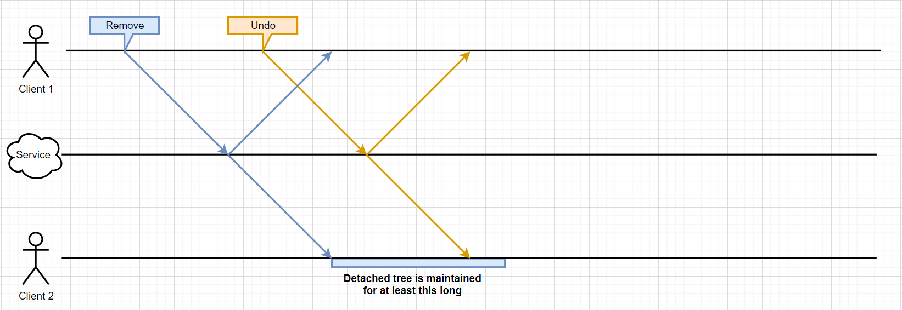

# Detached Trees

> Note: in the past, the term "repair data" has been used to refer to detached trees because of the role they play in undo/redo.
> The more general term "detached trees" is preferred because said trees are sometimes needed outside of undo/redo scenarios.

## What are Detached Trees?

SharedTree allows users to generate edits that remove or overwrite nodes (and by extension their descendants) from the document.
While these edits seem destructive, they do not actually erase the node and the data associated with it and its descendants.
Instead, the node is moved out of the document tree, and treated as a new root that stands apart - detached - from the document.
This keeps the contents of the removed subtree in the forest instead of erasing them.

## Does This Lead to Unbounded Memory Growth?

Keeping all detached trees forever would lead to unbounded memory growth in clients,
and would run the risk of seriously bloating the document's snapshot size.
In order to avoid that, detached trees are garbage collected.
How this happens is covered further down,
but the key idea is that most of our systems are allowed to ignore the existence of this garbage collection scheme,
thereby making those systems' contracts and implementations simpler.

## When Are Detached Trees Relevant?

Detached trees are needed when a removed tree's contents
(i.e., the contents of the now detached tree)
become relevant again.
There are four scenarios where this can happen:

-   Updating the `TreeCheckout` after reverting a commit
-   Updating the `TreeCheckout` after aborting a transaction
-   Updating the `TreeCheckout` after rebasing a local branch
-   Updating the `TreeCheckout` after merging in a rebased commit

### After Reverting a Commit

This is the more obvious use case:
reverting a remove or set operation requires the corresponding tree that was removed or overwritten.
See the [V1 Undo](./v1-undo.md) for more details.

### After Aborting a Transaction

When a client needs to edit the document, it can do so in a transaction.
Transactions are allowed to return a special value to communicate that the transaction should be aborted.
When that happens, any edits that the transaction had already applied to the document state need to be rolled back.
If some of those edits happened to remove some nodes, then those nodes need to be reintroduced into the document tree.

### After Rebasing a Local Branch

When a client performs a local edit,
it updates the local document state to reflect the impact of this edit,
and it sends the edit to the service for sequencing.
Under ideal circumstances, the next edit that the client receives from the service is that same edit that it had applied locally and sent for sequencing.
If that's the case, the client does not need to update the document state.
However, it's possible for an edit from a peer to be sequenced before the edit that was applied locally and sent out.
When that happens,
the local client needs to update the document state to reflect not only the impact of the edit from the peer,
but also the impact that the peer edit has on the local edit.

Consider the following example:

-   Local edit: Remove node B iff node A exist.
-   Peer edit: Remove node A.

If the peer edit is sequenced before the local edit,
the rebased version of the local edit will have its constraint violated.
This ought to leave the document in a state where A was removed but B was not removed.
In order to arrive at such a state from the local tip state
(where both A and B were removed)
it is necessary to restore node B.

### After Merging In a Rebased Commit

Another case where the contents of a removed tree can be relevant is when we need to apply a commit
that either edits or restores part or all of those contents.
While we don't currently support the creation of edits to already removed trees,
any edit to an in-document tree may be rebased over the removal of that tree or one of its ancestors,
thereby making the edit target a removed tree.
In order to apply such an edit, we need access to the contents of the removed tree.\*

\* Strictly speaking, this is only true for edits that would move contents out of the removed tree and into the document tree.
All other edits could theoretically be ignored since the user has no way of seeing their impact.
We (conservatively) ignore this aspect in our implementation because attempting to capitalize on it introduces too much complexity.

## Why Design It This Way?

### Merge Semantics

We have adopted merge semantics and features (undo/redo) that allow edits to affect removed trees.
This means removed trees are still part of the shared content that is being edited,
even if these trees are not part of the document tree at all times.
Assuming removed trees continue to exist at all layers of the system is in tune with that.

### Performance

One alternative,
(i.e., eagerly erasing the contents of subtrees that are removed)
would force us to have ways of recovering this data when needed.
One such approach would be to require that removal operations include a copy of the contents they remove/overwrite.
For example, every time a client sets a required field,
that client would include a copy the replaced subtree as part of the edit sent over the wire.
This seems bad from a performance point of view because it adds a cost common operations even though that cost my never be recouped.

Another alternative would be to keep all detached trees forever
(i.e., without garbage-collecting them).
As mentioned above, this would be bad for memory usage.
This memory concern could be alleviated for clients by allowing them to use local disk storage,
but it would still affect the size of snapshots.

Our current approach seems like a decent tradeoff between these two.
More importantly, it paves the way to allowing us to more precisely control that tradeoff though the concept of [undo window](undo.md).

See also [Collecting Usage Data](#collecting-usage-data).

### Simplicity

The fact that most of our system gets to assume all trees exist forever makes the system simpler.
There is a non-negligible complexity cost associated with the GC scheme,
but this complexity is contained in a relatively small body of code that exists only for this purpose.

This approach allows us to think of SharedTree as a composite DDS made up of two sub-DDSes:

-   One that is concerned with the existence of nodes:
    -   New nodes can be created
    -   Nodes are never deleted, but clients are allowed to forget their existence/contents
    -   Clients can refresh one-another on the existence of detached nodes and their descendants
-   One that is concerned with the location of nodes with respect to one-another:
    -   Nodes can be moved (which includes removal and restoration)

One does not need to adopt this view in order to use SharedTree or even understand its internals,
but it can help structure one's reasoning about SharedTree.

### Evolvability

This design, because of the refresher system it introduces,
seems well positioned to accommodate future evolutions
like the concept of [undo window](undo.md) and partial checkouts.

The undo window simply requires that we further delay the garbage collection of detached trees.

Partial checkouts have to contend with scenarios where
a client needs to apply a peer edit that moves a subtree that used to reside outside the partial checkout of the client
(and whose contents would therefore not be know to that client)
to a location inside of the partial checkout.
The refreshers system could be used to enrich the changeset for such an edit with a copy of the unknown tree.
In other words, we may be able to have partial checkouts deal with "out of checkout" trees similarly to how they treat detached trees.

## How it Works

### Identifying Detached Trees

Whenever we need to edit or restore a detached tree,
we need to be able to describe which specific detached tree is impacted.
This is true in three different layers of our system:

-   Changesets
-   Deltas
-   Calls to `Forest` and `AnchorSet`'s `DeltaVisitor`s.

Trees that are in the document (i.e., not detached) are identified by their path from the document root.
Detached trees however are not reachable from the document root,
so they need to be identified though a different scheme.
What scheme we use varies depending on the layer.

#### In Changesets

One key requirement for identifying detached trees in changesets
is that peers need to use a globally consistent identification scheme:
if there are multiple detached trees,
we need to ensure that one peer can communicate to the other peers precisely which of the detached trees it intends to edit.
Additionally, if multiple peers attempt to concurrently detach the same tree,
then we need to ensure that all peers eventually end up with a consistent way of referring to the tree.

In changesets
(which are sent over the wire and rebased)
we use `ChangeAtomId`s to identify each detached tree that is relevant to the change.
In a given context, there is only one `ChangeAtomId` associated with a given detached tree,
and no other detached tree is associated with that `ChangeAtomId`.
The specific `ChangeAtomId` that is associated with a given detached tree is dictated by the changeset that last detached the tree.
Since (thanks to rebasing) all clients share a consistent view of changesets,
they therefore derive a consistent view of the detached trees' associated `ChangeAtomId`s.

#### In Deltas

Deltas use `DetachedNodeId`s to identify detached trees.
These are simply a copy of the `ChangeAtomId`s used the changesets.

Deltas do not have the same global consistency requirement as changesets:
If some client A uses `DetachedNodeId` X to refer to tree Foo,
some other client B could refer to the same tree Foo using some different `DetachedNodeId` Y,
and could use the same `DetachedNodeId` to refer to a different tree Bar.

A single client does however need to be internally consistent:
There must be a 1:1 correspondence between a detached tree and a `DetachedNodeId`,
and that correspondence must be consistent over time.
For example, if a newly detached tree is associated with a given `DetachedNodeId`,
then the next operation that affects the tree will refer to it using the same `DetachedNodeId`.
That said, a detached tree that is associated with some `DetachedNodeId` X,
then reattached, then re-detached, can safely be associated with some new `DetachedNodeId` Y.

The consistency guarantees offered by the `ChangeAtomId`s used to identify detached trees in changesets are sufficient for the purpose of Deltas,
which is why `DetachedNodeId`s are a straightforward copy of `ChangeAtomId`s.

#### In `DeltaVisitor` Calls

The `Forest`, `AnchorSet`, and `DeltaVisitor` abstractions do not feature the concept of detached tree.
At this layer, we identify detached trees using a path that starts in a detached field.
(The same kind of field as the one that contains the root of the document.)
We may decide to force these abstractions to adopt the concept of a detached tree in the future if we see a benefit.

The current approach has the following consequences:

-   The contracts and implementations for these abstractions remains smaller/simpler.
-   Some translation layer is needed between `DetachedNodeId`s and these paths.

The translation from a `DetachedNodeId` to path in a detached field is handled by the `DetachedFieldIndex`.

### The `DetachedFieldIndex`

The `DetachedFieldIndex` is used primarily by the `visitDelta` function to translate `DetachedNodeId`s to paths.
Its core responsibilities are as follows:

-   Picking a path where a newly detached tree (associated with a specific `DetachedNodeId`) should be stored
-   Checking if a specific detached tree (`DetachedNodeId`) has an assigned path,
    and if so, recalling what that path is.

#### A Naive Scheme

In theory, the conversion from `DetachedNodeId`s to paths could be a trivial one:

```typescript
function detachedNodeIdToPath(id: DetachedNodeId): UpPath {
	const parentField = `detached-${id.major}-${id.minor}`;
	return { parent: undefined, parentIndex: 0, parentField };
}
```

While this would work, it has the following drawbacks:

1. The overhead per detached tree may be prohibitive in scenarios (like text editing)
   that lead to a large number of small detached trees,
   because the `Forest` would have to store a string of the form `detached-<major>-<minor>` for each detached tree.
2. It assumes we are able to dictate to `DeltaVisitor`s (specifically, to `Forest`s) how they should identify detached trees.
   This is not currently an issue because we do have that ability,
   but it is possible we will want to allow `Forest`s to have their own (more efficient) scheme for identifying them.
   This point is weak on its own, but it provides an incentive to pick an approach that,
   on top of addressing point 1, also addresses this concern.

#### The Current Scheme

The scheme used by our actual `DetachedFieldIndex` implementation involves the introduction of a new kind of identifier: `ForestRootId`.
`ForestRootId`s act as a indirection layer between (and have 1:1 relationship with) detached tree's `DetachedNodeId`s and their corresponding paths in the `Forest`:
for a specific detached tree, one can map its `DetachedNodeId` to a `ForestRootId`, and map that `ForestRootId` to the detached tree's path in the `Forest`.

`ForestRootId`s are incrementing consecutive integers that are picked by the `DetachedFieldIndex` when it is made aware of new detached trees.
The actual detached tree path for a given `ForestRootId` is derivable from that `ForestRootId` alone.

The fact that `ForestRootId`s are (typically) small integers makes them cheap to store.
The fact that `ForestRootId`s are consecutive makes them well suited to run-length encoding.
Finally, the fact that `ForestRootId`s are otherwise arbitrary prepares us for the possibility that `Forest` could be picking them in the future.
It also entails that the arbitrary mapping from each `DetachedNodeId` to their corresponding `ForestRootId`
must be maintained in the `DetachedFieldIndex` and included in summaries.

The indirection layer that `ForestRootId`s provide affords `DetachedFieldIndex` some freedom in how to organize the mapping between `DetachedNodeId`s and `ForestRootId`s.
This allows `DetachedFieldIndex` to pack more than one detached tree in the same detached field.
This makes representing detached trees in the forest more efficient because the cost of storing the detached field's key is amortized over all the detached trees stored under it.
In principle, `DetachedFieldIndex` could store all detached nodes under a single detached field,
but doing so would make the mapping from `DetachedNodeId` to `ForestRootId` very complex,
and likely less compact to represent in memory and in summaries.
Where the sweet spot lies depends on editing patterns and we will do our best to approximate according to usage data.
The crucial point is that we have encapsulated that concern in the `DetachedFieldIndex` and are able to revisit its implementation details at will.

### GC and Refreshers

Retaining detached trees forever would have two negative consequences:

1. It would cause unbounded bloat in the memory of clients that do not need these trees.
   Currently those are maintained in main memory.
   They could be offloaded to disk, but the unbounded bloat on disk is still bad.
2. They would cause unbounded bloat in the size of the document snapshot.
   This has a negative impact on service costs and on document load times,
   both of which are crucial metrics to optimize.

Because of this, we want to be able to GC _some_ of the detached trees.

#### Which Detached Trees to GC?

It's helpful to reiterate the cases for which detached tree may be relevant
(see [above](#when-are-detached-trees-relevant) for details on each one):

-   (a) Updating the view after reverting a commit
-   (b) Updating the view after aborting a transaction
-   (c) Updating the view after rebasing a local branch
-   (d) Updating the view after merging in a rebased commit

This last case can be further broken down as follows:

-   Updating the view after merging in a rebased commit...
    -   (d1) that originated on a local branch that was concurrent to the tree's detach
    -   (d2) that originated from a peer and the commit's reference sequence number
        is lower than the sequence number of the commit that detached the tree
    -   (d3) that originated from a peer and the commit's reference sequence number
        is greater than or equal to the sequence number of the commit that detached the tree

For each such case, we can infer how long detached trees may need to be kept (i.e., not GC-ed)
if we wanted to ensure their availability for that use case.

-   (a) As long as the host application holds a `Revertible` for an edit that detached or edited the detached tree
-   (b) As long as the transaction that detached or edited the detached tree is open
-   (c) As long as the edits that detached or edited the detached tree remain on the branch
-   (d1) As long as the edit that detached the tree remains on the branch
-   (d2) As long as the minimum reference sequence number is less than the sequence number of the edit that detached the tree
-   (d3) Forever

This last case is noteworthy:
for any detached tree, it's always possible, at some point in the future, for a peer to send a commit that corresponds to case (d3).
This makes it clear that, if we want to GC _any_ detached trees,
we should at least GC those that would only be relevant to this last case.
We can ensure a client can recover such a GC-ed tree when relevant,
by forcing peers to include a copy of the relevant detached trees in the commits they send out.
This is covered in [Detached Tree Refreshers](#detached-tree-refreshers).

This still leaves a lot of options with respects to the other cases (2 options for 5 cases = 32 possible policies).
To help narrow this down, it's helpful to consider what we would do for cases (a) through (d2) if we were to need a detached three that had been GC-ed.
In some of those cases (a, b, c, d1) we would actually have no way of recovering the tree,
because it may not be known to other peers or be recoverable from a snapshot.
In the case (d2), the peer couldn't include a copy of the relevant detached tree
because it didn't know about it at the time it sent the commit for sequencing and broadcast.
This doesn't mean the detached tree is unrecoverable,
but recovering it would entail re-fetching the last snapshot and replaying prior edits over it,
which would be slow, introduce an async boundary in the processing of peer changes,
and add load to the service that hosts summaries.
This leads us to adopt the following policy:
do not GC trees so long a they fall under these other (i.e., non-(d3)) cases.

This might seem like a complex policy at first because cases (a) through (d2) entail different detached tree lifetimes.
Fortunately, we only need to worry about satisfying the union of these cases,
and that union can be satisfied by abiding to the following simple rules for any given detached tree:

-   Keep track of the most recent commit for which that tree was relevant
    (where relevant is defined as "the commit either detached or edited that detached tree").
-   When that commit is trimmed from the trunk branch by the `EditManager`,
    then the detached tree can be GC-ed.

To see why that is, it's helpful to be mindful of the following facts:

-   The `EditManager` doesn't trim off commits that may need to be rebased over in the future.
-   All commits that are on a branch may be rebased over in the future, so long as the branch exists.
-   All commits that are in-flight
    (i.e., commits that future peer edits may not have been aware of)
    are preserved in a branch.
-   Each Revertible is backed by a branch that contains (at its head) the commit to be reverted.

Taken together,
these facts mean that we have mapped the challenge of knowing whether a detached tree may be relevant for the cases we care about,
to the the much simpler challenge of knowing whether the last commit to which it was relevant has been trimmed from the trunk.
This approach means that we will sometimes delay the garbage collection of a detached tree longer that strictly necessary.
This is likely to be tolerable, but further effort could be made to carve out a stricter policy if we felt the memory gains outweighed the additional complexity.

#### Detached Tree Refreshers

In the context of detached trees,
a refresher is a copy of a detached tree that is included by a peer on a commit as part of its submission (or resubmission)
to the sequencing service.
Note that this excludes commits that are internal to the peer, i.e., commits on its branches.
This means the inclusion of refresher can be confined to the logic that (re)submits commits to the sequencing service.
(See `SharedTeeCore`'s usage of its `BranchCommitEnricher`.)

##### Including Refreshers

Because of the GC policy described above,
for a given commit being sent,
refreshers are needed for each detached tree whose contents are needed to apply the commit,
and whose detach operation was known to the peer\*.
We make this happen by adding refreshers to commits as needed immediately before they are submitted to the sequencing service.
Note that commits sometimes need to go through a resubmission phase,
so we need to ensure that the set of refreshers on such commits is updated before these commits are resubmitted.
(See the logic in `SharedTeeCore` and `ResubmitMachine`).

\* Strictly speaking,
a client could omit the refresher for trees for which _both_ of the following are true:

-   That client has already sent a commit that would lead its peers to have a refresher in memory for that tree.
    This is true of commits that detach the tree or edit the detached tree.
-   That client has not yet received that commit back from the sequencing service.

This is illustrated by the following scenario:

This diagram shows two peers collaborating on a tree.
Client 1 removes the tree.
Before client 1 receives that edit back from the service,
client 1 restores the detached tree by undoing their first edit.
Client 1 does not technically need to include a refresher with the undo
because all peers are guaranteed to still have that detached tree in memory by the time they apply the undo.
This is because, by virtue of our GC policy,
they will keep the detached tree so long as the removal edit is not out of the collaboration window
(represented by the light blue box).

##### Applying Refreshers

When a commit with refreshers is applied,
we need to check the following for each refresher:

1. Is the detached tree that the refresher would have us re-create in memory actually needed to apply the commit?
2. Does such a detached tree already exist in memory?

The answer to (1) can be "no" because the detached tree of interest may have been concurrently restored
(i.e., re-attached to the document tree)
since the commit was initially sent.
When that's the case, the refresher must\* be ignored.

Consider the following scenario:

This diagram shows two peers collaborating on a tree.
Client 2 edits the tree.
Some time later, client 1 removes the tree edited by client 2.
Some time later, client 1 reverts the removal, thereby restoring the detached tree.
This revert must carry a refresher because it restores a detached tree.
Concurrently to that, client 2 reverts their edit.
This revert must carry a refresher because it edits a detached tree.
The restoring of the detached tree is sequenced first.
By the time the revert sent by client 2 is applied by client 1,
the tree it targets is no longer detached, so the refresher can be ignored.

\* Aside from the time and memory overhead of needlessly creating a and retaining the detached tree,
ignoring such a refresher is a requirement because creating the detached tree would claim a `ChangeAtomId` and `DetachedNodeId`
that may need to be used later if the now attached tree is detached again.
In such a scenario, having an already existing detached tree with the same `ChangeAtomId`/`DetachedNodeId` would violate the 1:1 relationship between those IDs and trees,
which could lead to bugs.

The answer to (2) can be "yes" because the local client may not have GC-ed this tree yet.
For example, the local client may have a branch where that tree is being edited.
When that's the case, the refresher must\* be ignored.

\* Ignoring this refresher is a requirement for the same reasons as in (1):
we don't want to create a separate copy of a tree we already have.
It's also important that we don't overwrite the detached tree we already have with the one from the refresher,
because the refresher may be stale.

To see why consider the following scenario:

This diagram shows two peers collaborating on a tree.
Client 1 removes the tree.
Concurrently to that, client 2 edits that same tree.
Concurrently to that, client 1 edits the detached tree.
This edit must carry a refresher because it touches a detached tree.
This edit is created on client 1 before client 1 receives client 2's edit to the detached tree.
This means that the refresher that client 1 had included no longer represents the current state of the detached tree.
If client 2 still has a copy of the detached tree in memory,
it must take care not to overwrite it with the stale copy from the refresher.

## Future Work

### Collecting Usage Data

While we expect that the refresher system provides a valuable tradeoff,
we can only make a cost/benefit analysis once we have actual telemetry about its usage.

Specifically, we want to know:

1. The peak on client memory overhead in bytes
   (forest + detached field index + untrimmed commits)
2. The peak snapshot size overhead in bytes
   (forest + detached field index + refreshers/detached tree copies in recent messages and tail messages)
3. The total message size overhead in bytes for all messages
   (refreshers/detached tree copies)

For each of these, it may also be interesting to know the percentage of the overall memory cost this overhead accounts for.
A 10MB overhead may be fine on top of a 1GB baseline, but wouldn't be fine on top of a 1KB baseline.

We can then use those metrics to compare them against the following hypothetical alternatives approaches:

-   Storing all detached trees forever.
-   Storing none of the detached trees, but including a copy of the detached tree in any commit that detaches a tree.
-   Storing detached trees for the minimum amount of time +K sequenced edits?

This last option should enable us to assess the value of implementing the undo window system,
and if so, what might be a good K value for it.

We should also measure how those costs would change
if we omitted the refreshers in the scenario described at the bottom of the [Including Refreshers](#including-refreshers) section.
