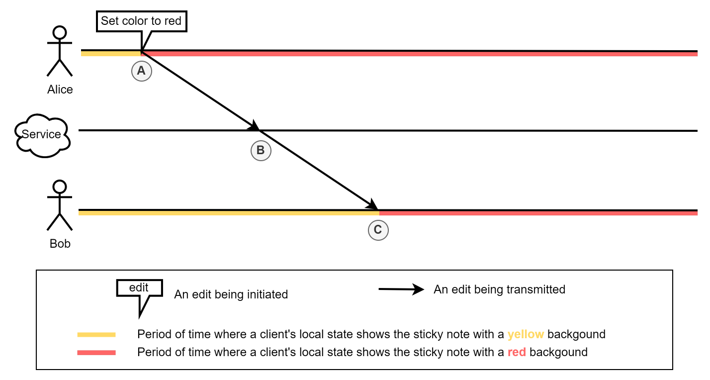
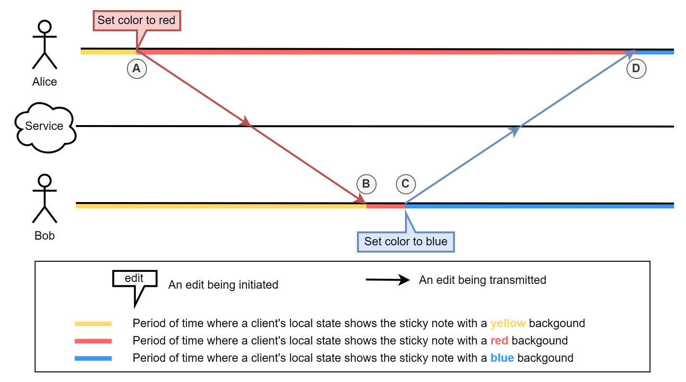
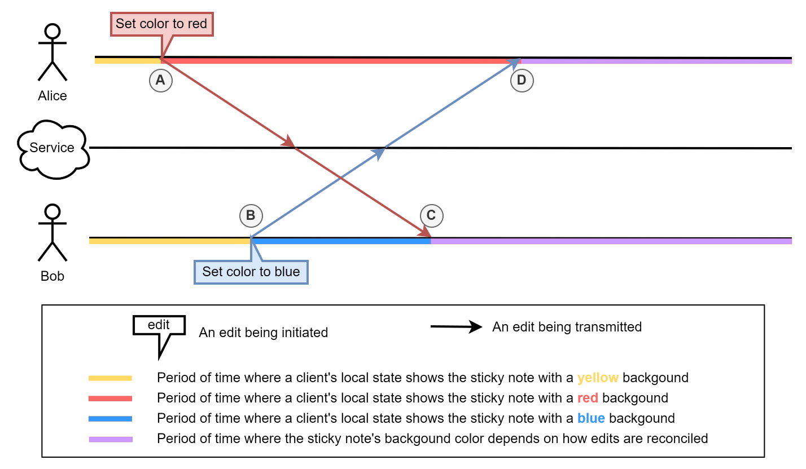

# SharedTree Merge Semantics

This document offers a high-level description of `SharedTree`'s merge semantics.

Target audience: `SharedTree` users and maintainers.

## What Are Merge Semantics?

Merge semantics define how `SharedTree` reconciles concurrent edits.

### Concurrent Edits

When several users edit the same document, it's possible for some of the edits to be concurrent.
One user's edit `X` is said to be concurrent to another user's edit `Y` if the first user initiated `X` before receiving `Y`.
This property is always mutual: if `X` is concurrent to `Y` then `Y` is also concurrent to `X`.

Let's first look at some examples where the edits are _not_ concurrent.

Imagine Alice and Bob are editing a document that contains sticky notes whose background color can be changed.
If Alice changes the background color of one sticky note from yellow to red,
that edit will be sent to the server which will forward it to Bob.

 
_A: Alice initiates the edit that changes the sticky note's color from yellow to red.
The color of the note on Alice's device changes from yellow to red. 
B: The service receives Alice's edit and forwards it to other users.\*
(Not explicitly called out in future diagrams) 
C: Bob receives Alice's edit.
The color of the note on Bob's device changes from yellow to red._

\* The service actually broadcasts the edit to all users, including Alice.
The corresponding arrow is omitted from this and future diagrams for simplicity.

Now imagine Bob wants to change the background of that same sticky note to the color blue.
If Bob makes this change _after_ receiving the edit from Alice, then he will be changing the color from red to blue.
This is not a case of concurrent editing because Bob had received Alice's edit before changing the color.

 
_A: Alice initiates the edit that changes the sticky note's color from yellow to red.
The color of the note on Alice's device changes from yellow to red. 
B: Bob receives Alice's edit.
The color of the note on Bob's device changes from yellow to red. 
C: Bob initiates the edit that changes the sticky note's color from red to blue.
The color of the note on Bob's device changes from red to blue. 
D: Alice receives Bob's edit.
The color of the note on Alice's device changes from red to blue._

On the other hand, if Bob makes this change _before_ receiving the edit from Alice,
then his edit will be concurrent to Alice's edit, and he will be changing the color from yellow to blue.

 
_A: Alice initiates the edit that changes the sticky note's color from yellow to red.
The color of the note on Alice's device changes from yellow to red. 
B: Bob initiates the edit that changes the sticky note's color from yellow to blue.
The color of the note on Bob's device changes from yellow to blue. 
C: Bob receives Alice's edit.
The two edits must be reconciled on Bob's device. 
D: Alice receives Bob's edit.
The two edits must be reconciled on Alice's device._

What it means to reconcile edits is covered in the next section.

Note that Fluid's distributed data structures only perform reconciliation on users' devices,
so the server does not need to reconcile the edits.

### Reconciling Concurrent Edits

Reconciling concurrent edits is trivial when they affect independent parts of the tree.

For example, if Alice and Bob concurrently change the background color of _different_ sticky notes,
then there would only be one reasonable outcome:
the sticky notes would be assigned the new chosen colors respectively.

However, it's possible for some concurrent edits to affect overlapping parts of the tree,
such as in the third example above with Alice and Bob.
This leads to a situation where there may be multiple reasonable outcomes
(and possibly some unreasonable ones).

So if Alice and Bob concurrently change the background color of _the same_ sticky note
such that Alice would change it from yellow to red and Bob would change it from yellow to blue,
then one could imagine multiple possible outcomes:

-   change the color to red
-   change the color to blue
-   keep the color yellow
-   change the color to purple

`SharedTree`'s merge semantics define which outcome will be picked
and ensure that Alice and Bob get the same outcome.

## When Should You Care?

Developers should be able to use `SharedTree` productively without constantly worrying about merge semantics.
There are, however, situations that warrant an awareness and understanding of merge semantics.

### Defining The End User Experience

Application authors sometimes need to understand the relationship between their application's usage of `SharedTree`
and the resulting end user experience when those end users make concurrent changes.
This enables them to determine how to use `SharedTree`'s editing capabilities to achieve a desired end user experience
and whether that experience is achievable in the first place.

### Maintaining Application Invariants

An application author may wish to ensure that some invariants are upheld in the application's document.
While most of those invariants are typically ensured by the document's schema,
some of them may depend on `SharedTree`'s merge semantics.

For example, consider an application whose data model includes two arrays,
with the invariant that the length of one array is expected to always be the same as the length of the other array.
The application's editing code may attempt to keep the two arrays' lengths in sync by always adding to and removing from both arrays in equal measure.
Despite that, `SharedTree`'s merge semantics are such that a scenario involving concurrent edits may still lead to a state where the arrays end up with different lengths.
Understanding `SharedTree`'s merge semantics can help the application author anticipate this invariant violation or diagnose it after the fact.
Understanding `SharedTree`'s merge semantics will also enable the application author to understand how to remedy this danger,
either by adopting a data model that prevents the issue (e.g., using a single array of pairs)
or by changing the application's editing code to circumvent it.

## How We Describe Merge Semantics

The merge semantics of a given kind of edit (e.g., moving a node) define what the impact of the edit will be
depending on what concurrent edits were sequenced before it.
We describe the merge semantics of each kind of edit by describing its preconditions and postconditions.
It is these preconditions and postconditions that determine whether an edit is suitable for a given scenario.

### Preconditions

Preconditions characterize what must be true for an edit to be considered valid.
Each kind of edit operation comes with a set of preconditions.
If those preconditions are not met, then the edit and the whole transaction it is part of are dropped,
i.e., the edit and transaction have no effect.

For example, consider a document with a schema that allows instances of `Foo` to be inserted in an array.
Insert operations on arrays come with preconditions such that by the time the insert is finally applied,
the receiving array must allow instances of the inserted type, (`Foo` in this case).
Now imagine Alice inserts a node of type `Foo` in the array.
Concurrently to that, Bob edits the document schema such that the array no longer allows instances of type `Foo`.
Schema changes come with preconditions such that by the time the schema change is finally applied,
the new schema must be compatible with the state of the document (no instances of type `Foo` may exist in the array).
If Alice's edit is sequenced first, then the node will be inserted, and Bob's edit will be dropped.
If Bob's edit is sequenced first, then the schema will be changed, and Alice's edit will be dropped.

When considering whether a given edit is suitable for a given scenario,
the edit's preconditions help answer the following questions:

1.  Will this edit apply in all scenarios where I would want it to apply?
2.  Will this edit be dropped in all scenarios where I would want it to be dropped?

The answer to the first question will be negative if the edit has a precondition that is undesirable or undesirably broad for a given scenario.
This cannot be remedied but is not necessarily a deal-breaker on its own, because allowing the right edit to happen some of the time may still be preferable to not allowing anything at all.
For example, consider the scenario above where preconditions ensure that a node of type `Foo` cannot be inserted in an array whose schema does not allow it.
The current implementation of `SharedTree`'s insert edit actually comes with the precondition that no part of the document schema has been concurrently changed.
While this precondition is sufficient to prevent a node of type `Foo` from being inserted in an array whose schema does not allow it,
it is much broader than strictly necessary and will also prevent edits that would not violate the schema.
While we plan to offer a narrower precondition in the future, the current one is tolerable because schema changes are rare.

The answer to the second question will be negative if the edit does not have a precondition that would be desirable for a given scenario or has a precondition that is too permissive.
This can often be remedied by using constraints\*.
For example, in the scenario where Alice and Bob both want to change the color of the sticky note,
it may be desirable to ensure that the color that is retained is always the one chosen by Alice.
This could be achieved if Bob's edit had a precondition that the note's color must not have been concurrently changed
(and if Alice's edit didn't have that precondition).
`SharedTree`'s current set of edits does not include an edit with such a precondition,
but using a constraint that ensures the original color has not been removed would likely be an acceptable alternative.

\*[Constraints](#constraints) is a feature that allows transaction authors to add additional preconditions to a transaction.
This makes understanding preconditions a prerequisite for using constraints,
but constraints can be ignored when it comes to understanding how preconditions affect merge semantics in general.

Note that the preconditions of a transaction are the union of the preconditions of its edits.

### Postconditions

The postconditions characterize what is guaranteed to be true about the effect of the edit provided the preconditions were satisfied.
This is often expressed in terms of the resulting state after the edit is applied.
For example, move edits guarantee that the targeted nodes end up at the specified destination.

When expressed in terms of the document state,
these postconditions typically only hold immediately after the edit as opposed to holding indefinitely.
In our move example, edits that come after the move
(whether they were made concurrently or not)
may very well cause those nodes to end up in a different location.

When considering whether a given edit is suitable for a given scenario,
the postconditions help answer the following questions:

1.  Will this edit, in scenarios where it applies, have all the effects I want it to have?
2.  Will this edit, in scenarios where it applies, have none of the effects I do not want it to have?

The answer to the first question will be negative if some desirable postcondition is missing or an existing one is too narrow.
For example, `SharedTree`'s remove operation on arrays does not guarantee that the array which contains the nodes at the time the edit is initiated
will have fewer nodes immediately after the edit is applied compared to immediately before the edit is applied.
This is because `SharedTree`'s remove operation applies even when the nodes have been concurrently moved to a different array.

The answer to the second question will be negative if a postcondition is undesirable or too broad.
For example, `SharedTree`'s delete operation on map nodes comes with the guarantee that,
immediately after the edit is applied, the map will have no node associated with the key.
This would be too broad of a postcondition in scenarios where one wouldn't want to risk removing a node that was concurrently set for that key.
This is also an area where [constraints](#constraints) can help by ensuring that the edit is treated as invalid in such a situation.
Note, however, that making the edit invalid would render the whole transaction invalid,
while a narrower postcondition would simply not perform the deletion but allow the rest of transaction to apply.

In a transaction, each edit's postconditions are added to the postconditions of the transaction,
with the postconditions of later edits overriding that of earlier ones whenever they are incompatible.
For example, if a transaction moves a node from location A to location B and then moves that same node from location B to location C,
the postcondition of the second move (that the node will be at location C) wins.

## High-Level Design Choices

`SharedTree` allows developers to describe the data model for their application in terms of a set of elementary building blocks,
like object nodes, map nodes, and array nodes.
Each of these building blocks comes with its own editing API and associated merge semantics,
so fully understanding the merge semantics of `SharedTree` entails understanding the individual merge semantics of each of these building blocks.
That said, those merge semantics are largely underpinned by a set of design choices that apply to `SharedTree` as a whole.
Understanding those design choices and their ramifications is the most crucial part of understanding `SharedTree`'s merge semantics,
and it often alleviates the need to remember the details of any building blocks's specific merge semantics.

### A Conflict-Free Model

`SharedTree`

### Movement Is Not Copy

`SharedTree` allows subtrees to be moved from one location to another.
Edits made to a subtree before it is moved will still apply even if they end up (because of concurrency) being applied after the subtree moves.
This is different from inserting a new copy of the moved subtree at the destination
(and deleting the original at the source).

Consider the following scenario:
Alice moves a sticky note from one page to another,
while Bob concurrently edits the text of the note.
If the move were just a copy, then, if Alice's edit were to be sequenced first,
Bob's edit would not apply to the copy at the destination.
By contrast, `SharedTree`'s move semantics ensure that Bob's edit will be visible on the note at the destination no matter the sequencing order.

### Minimal Preconditions

In choosing the merge semantics of the set of edits initially supported by `SharedTree`,
we have strived to keep the preconditions of those edits minimal.
At this time, with the exception of [schema changes](#schema-changes), which have more preconditions,
all supported edits have the same single precondition:
the document schema must not have been concurrently changed.

As illustrated [above](#preconditions),
there are many other variations in merge semantics we could support for our initial set of edits.
Many of those are likely desirable and may be supported in the future,
so our preference for minimal sets of preconditions is merely a question of prioritization.

The motivation for this prioritization is that more permissive edits offer support not only for scenarios where the resulting merge outcome is desirable
but also for scenarios where dropping the whole transaction would be acceptable.
`SharedTree` makes the latter possible by using opt-in [constraints](#constraints).

On the other hand, if `SharedTree`'s edits had more preconditions by default,
then there would be no way for users to opt-out of these preconditions,
thereby limiting their ability to express a more permissive edit.

In the rest of this section, we call out some interesting implications that follow from our choice of giving our edits minimal preconditions.

#### Removal Is Movement

`SharedTree` allows subtrees to be removed from the document.
This occurs when an element is removed from an array node,
when a key is deleted from a map node,
or when the field on an object is overwritten or cleared.

Consider the following scenario:
Alice removes a whole page of sticky notes, while Bob concurrently moves a sticky note out of that page and into another (non-removed) page.
`SharedTree`'s removal semantics ensure that Bob will still get his sticky note
whether or not it ends up being sequenced before or after Alice removed the page where it came from.  
If that weren't the case, then there would be a race between Alice and Bob's edits,
where Bob's edit would not apply if Alice's edit were sequenced first, and Bob would lose the sticky note.

In the case where the subtree is modified in some way as it is removed,
those modifications will be preserved, albeit moot unless the removal is undone.
This matters because if the removal is undone, the subtree that is reintroduced will carry those modifications.

These merge semantics effectively make removal akin to a move whose destination is an abstract "removed" or "recycling bin" location.
This is in tune with the return value of the `treeStatus()` API which will return `TreeStatus.Removed` in that situation.

#### Last Write Wins

It's possible for concurrent edits to represent fundamentally incompatible user intentions.
Whenever that happens, the edit that is sequenced last will win.

Example 1:
Alice and Bob concurrently change the background color of the same sticky note
such that Alice changes it from yellow to red, and Bob changes it from yellow to blue.
If the edits are sequenced such that Alice's edit is applied first and Bob's edit is applied second,
then the background color of the note will change from yellow to red and then from red to blue.
If the edits are sequenced in the opposite order,
then the background color of the note will change from yellow to blue and then from blue to red.

Example 2:
Alice and Bob concurrently move the same sticky note
such that Alice moves it from location X to location A, and Bob moves it from location X to location B.
If the edits are sequenced such that Alice's edit is applied first and Bob's edit is applied second,
then the note will first be moved from X to A and then from A to B.
If the edits are sequenced in the opposite order,
then the note will first be moved from X to B and then from B to A.
Note that, because we treat [removal as movement](#removal-is-movement),
this is true even when removals are involved:
if the removal is sequenced last, then the node will be moved and then removed.
If the move is sequenced last, then the node will be removed and then moved.

### Simple Postconditions

Similar to our choice regarding preconditions,
we have chosen to prioritize edits whose postconditions are simple.
"Simple" here refers to the property of having a single possible effect.
This is in contrast to preconditions that are predicated on the existence or absence of concurrent edits
or predicated on some properties of the document state by the time the edit is applied.

For example, the postcondition for our implementation of move
(that the moved node will reside at the chosen destination)
is not predicated on the node not having been concurrently removed or moved.
This means that when it comes to the final location of the node that is targeted by the move,
there is only one possible outcome
(the node being at the chosen destination)
so long as the preconditions of the move were met.

Note that such conditional postconditions would be different from additional preconditions.
For example, adding a precondition that the moved node must not have been concurrently removed would,
in a situation where that did occur,
render such a move _and the whole transactions it figures in_ invalid.
By contrast, making the postcondition conditional on the node not having been concurrently removed would simply render the move ineffective
but not adversely affect the rest of the transaction.

As with minimal preconditions, we may support more variations of our current set of edits in the future.

This prioritization is partially guided by the same motivation that guided our choice with minimal preconditions:
it makes for a greater set of possible edits when combined with [constraints](#constraints).

The other motivation is that simpler postconditions make authoring transactions much more approachable.
This is because they reduce the number of possible states the document could be in after each edit that makes up the transaction.

For example, consider an application that allows the end user to select a set of sticky notes across several pages,
and group all of the selected notes under a new page, assigning to each one an ordinal number based on the selection order.
This functionality effectively allows a user to make a numbered list out of a set of N sticky nodes.

This can be achieved by writing a transaction that loops through the N selected sticky notes in the order they were selected,
assigning ordinals incrementally and moving each one to the end of the new page.

By the time this transaction is sequenced and applied,
concurrent edits may have affected the relevant sticky notes in different ways:
some of them may have been assigned different ordinals,
some of them may have been moved/removed,
and some of their parent pages may have been moved/removed.
Despite that, `SharedTree`'s current merge semantics guarantee that by the end of the transaction,
all of the relevant sticky notes will reside in the new page and that their ordinals will be assigned in order from 1 to N.
If any of the concurrent changes had the power to prevent the relevant notes from being moved by the transaction or from being annotated with the ordinals,
then the transaction may lead to a state where the new page only contains a subset of the selected notes, and their ordinals may have gaps, may not be unique, or may be out of order.
In other words, it would be very difficult to make any kind of valuable claim about the effect of the transaction,
and end users would experience some very confusing outcomes.

To get a more general sense of the positive effect of simpler postconditions,
we can model transactions as being composed of `N` edits (`e1` through `eN`),
where the effect of each edit `ei` is one out of a set whose size is `ki`.
The particular effect that is applied (out of the `ki` possibilities) for a given `ei` depends on what concurrent edits were sequenced before the transaction.
Under this model, the number of possible effects for a transaction of `N` edits is `k1 * k2 * ... * kN`.
`SharedTree`'s supported set of edits all have exactly one possible effect, so any transaction is guaranteed to have `1 * 1 * ... * 1 = 1` effect.
If `SharedTree`'s supported set of edits had not one but two possible effects,
then a transaction of `N` edits would have `2``N` possible effects,
which would make using those edits in transactions less practical.

## Constraints

`SharedTree` allows transaction authors to add additional preconditions to a transaction,
thereby ensuring that its effect will only apply if some specific conditions are met.
These are called constraints.
This is useful when the transaction's effect may be rendered undesirable by the effects of concurrent edits that are sequenced before the transaction.

Consider an application whose data model includes two arrays,
with the invariant that the length of one array is expected to always be the same as the length of the other array.
The application allows users to perform the following operations as transactions:

-   Add a new element in each array
-   Remove a single existing element from each array.

There's no way for the adding of elements to violate the invariant that the lengths of the two arrays ought to remain the same.
It's possible however for the removal of existing elements to violate this invariant:
consider the starting state `{ arrayA: [a1, a2], arrayB: [b1, b2] }`.
Suppose Alice tries to remove `a1` and `b1`.
Concurrently to that, Bob tries to remove `a1` and `b2`.
No matter the sequencing order between Alice and Bob's transactions,
the resulting state once both are applied will be `{ arrayA: [a2], arrayB: [] }`,
which violates the application invariant regarding the lengths of the arrays.

This issue can be addressed by adding a constraint to the transactions that remove elements:
each such transaction can establish a precondition that the nodes to be removed are not already removed.

With such a constraint, the resulting state in the scenario above will depend on the sequencing order:
It will be `{ arrayA: [a2], arrayB: [b2] }` if Alice's transaction was sequence before Bob's
and `{ arrayA: [a2], arrayB: [b1] }` otherwise.

### Schema Changes

As of 2024-04-25,
all edits/transactions have the implicit constraint that the schema is not changed concurrently to them.
Similarly, all schema changes have the implicit constraint that neither the schema nor the document data is changed concurrently to them.

This is tolerable because schema changes are rare.
The merge semantics will be improved in the future to be less conservative.

## Merge Semantics by Node Kind

TODO: add a separate document for each node kind and link to them from here.
