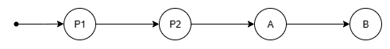

# Revision Metadata

Rebase operations need metadata to provided by the caller (e.g., the high-level rebasing algorithm) about the overall branching structure that the rebase takes place in.
For example, if commit `B` from a branch `[A, B]` is being rebased over some commit `X` as part of rebasing `[A, B]` over `X`,
then that rebase operation needs to be informed about `A`'s relative position in the commit graph w.r.t. to `X`.

This page aims to explain why this is the case and precisely define the characteristics of this scheme.
While the scheme for revision metadata is not specific to sequence fields, sequence fields are currently the only motivator for it.
This document therefore focuses on them.

## Commits and Cell IDs

The idea of cells is introduced in [cell-model-of-collaborative-editing.md](cell-model-of-collaborative-editing.md).
The core idea is that, in addition to requiring a way to refer to positions that nodes occupy
(which we accomplish using integer indices for nodes in a given sequence, at a given point in the commit graph)
we need a way to refer to the positions that nodes will occupy or have occupied in the past.

Being able to refer to empty cells makes it possible for commits to convey position information relative to such cells.
For example, if some commit `A` inserts content before some empty cell `c`
while some other commit `X` concurrently inserts content after that same cell `c`,
then we know that, the content inserted by `A` should come before the content inserted by commit `X`
no matter the order in which the commits `A` and `X` end up sequenced in the commit history.
If these commits had not been able to refer to `c`, then there would not have been a way to guarantee the relative ordering of their inserted contents.

There are two cases where a commit introduces new cell ID:

1. Inserting a new node in a sequence introduces a cell ID to refer to the cell that will hold the node.
   In the input context of the commit, the cell is empty.
   In the output context of the commit the cell is populated with the inserted node.
2. Moving or removing a node from a sequence introduces a cell ID to refer to the cell that held the node.
   In the input context of the commit, the cell is populated with the node.
   In the output context of the commit, the cell is empty.

Commits can also refer to a cell using an ID that was introduced in a prior commit.
This occurs in two cases:

1. An inverse commit (whether a rollback or revert) refers to cells that the commit it is the inverse of referred to and uses the same IDs to do so.
   For example, if commit `A` removes a node and therefore introduces cell ID `Id1` to refer to the cell it empties,
   then the inverse of `A` will restore that node to the same cell, referring to that cell using `Id1`.

2. Rebasing a commit `A` over a commit `X` leads to a commit `A'` that refers to all that either `A` or `X` referred to.
   For example, if `A` inserts a node next to a node `n`, and `X` removes `n` thereby introducing cell ID `Id1` to refer to the cell where `n` used to be,
   then `A'` will carry a mark that uses `Id1` in order to describe the location of the cell that used to contain `n`.

One can infer from the above that for a given commit `C`...
* `C` refers to all cells introduced in `C`.
* `C` refers to all cells introduced in ancestors of `C` up to some ancestor.

The commits that introduce cells that `C` refers to therefore from a contiguous subsequence always including and ending in `C`.

In commit graph diagrams, we can represent this contiguous subsequence visually with a segment that extends from `C` backwards under all the commits that introduced cells that `C` refers to:

 
_`C` refers to all cells introduced in `C` and all its ancestors up to and excluding `B`._

 
_`C` refers to all cells introduced in `C` and all its ancestors up to and including `A`._

## Cell Ordering From Commit Ordering

While cells help specify the relative order of content in sequences,
there are some situation where the information contained in commits only specify a partial order.
The rebasing system is responsible for picking a total ordering that is consistent across peers.
It does this based on the relative sequencing order of the commits in the commit graph.
This happens in two cases:

1. When cells are being introduced in the same gap by concurrent commits. 
    
   _`X` and `A` are concurrent so the relative order of cells they introduced in the same gap is unspecified. 
   The colors have no intrinsic meaning. Their purpose is to depict which commit refers to cell introduced by which commit._

2. When a commit `C` introduces cells in a gap where one of its ancestors (commit `A`) introduced cells that are empty in the input context of `C`,
   and `C` does not include references to the cells introduced by `A`. 
    
   _`C` does not refer to cells introduced by its ancestor `A`,
   so the relative order of cells `C` and `A` introduce in the same gap is unspecified._

In both of this cases we order the cells introduced by the later commit left of the cells introduced by the earlier commit.
This leads to a system where,
in order to determine the relative order of two cells,
we sometimes need to know the relative order of the two commits that introduced the cells.

In the remainder of this section, we consider the cell-ordering scenarios that compose and rebase operation face.

### Compose

When composing `A ○ B`, we know that commit `A` is a direct ancestor of commit `B`.
This tell us the following:

* `A` comes before `B` in sequencing order.
* `A` and `B` are not concurrent.
* There are no commits between `A` and `B` in sequencing order.

We can represent this situation with the following commit graph:
 
The commit `P` represents another prior commit (which is not being composed).
It is included here because `A` and/or `B` may refer to cells that `P` introduces.
While there may be any number of such prior commits that introduced cells that `A` and/or `B` may refer to,
using a single commit is sufficient to fully consider the relevant cases.

For each pair of cells (`ca`, `cb`) referred to by `A` and `B` respectively,
we need to be able to determine the relative ordering of `ca` and `cb`.
Its helpful to visualize the possible scenarios and group them in the following groups:

1. `B` refers to cells introduced further back than `A` does: 
 
1. `B` refers to cells introduced as far back as `A` does: 
 
 
1. `B` does not refer to cells introduced as far back as `A` does: 
 
 

In the first and second groups of scenarios,
`B` must include references to both `ca` and `cb`,
so their relative ordering is already fully defined in `B`.
This does not require consider the sequencing order of commits.

In the third group of scenarios,
`ca` must be referring cell introduced by either `P` or `A`,
while `cb` must be referring cell introduced by `B`.
We can order the two cells by relying on the fact that commits `P` and `A` both come before `B` in sequencing order.
While this does require that we consider the sequencing order of commits,
the relevant ordering information
(i.e., that `B` comes after any other commit that might have introduced cells that `A` and `B` might refer to)
is implicitly derivable from the fact that we're composing `A ○ B` as opposed to `B ○ A`.

### Rebase

When rebasing commit B over commit X, we know that X comes before B in sequencing order, and we know that X and B are concurrent.
As with compose, their lineage should be consistent where they overlap.
Unlike with compose, however, there may be some commits that, in sequencing order, occur between X and B. This is the case when rebasing dependent commits on a branch. This can lead to a situation where X (in a scenario where it has longer lineage) refers to a cell that B has no lineage for, and B refers to a cell to a cell that X has no lineage for.

The information we store in changesets is not always enough to determine the relative ordering of commits.
If you have a branch with commits [A, B, C, D] where C references a cell created by B, and D references a cell created by A, when we do rebase(D, C⁻¹) we have to determine the relative order of the cells created in A and B, but neither D nor C⁻¹ carries ordering information about A and B.
This means we have to pass to that rebase operation some metadata about the ordering of commits A and B.

How can we tell what ordering metadata may be needed for a given scenario?
Changesets may refer to cells introduced in the following commits:

Their own commit
The commit they are the rollback or undo of
Commits they have rebased over
Invert
The metadata is made in MCF, passed to fields which do not use it.
Compose
The metadata is made in MCF (leveraging rollback info), passed into fields, used by sequence field.
A: remove [0] (Introduces cell X)
B: insert @[0] (Does not carry information about cell X. Introduces cell Y)
compose(B⁻¹, A⁻¹) requires ordering the cell Y (emptied by B⁻¹) and cell X but neither change has information about the other cell. This is a consequence of a shortcut we take when we generate rollbacks: we assume that it's OK to tack on A⁻¹ after B⁻¹ without first rebasing A⁻¹ over [B, B⁻¹]. If we performed this rebase, then the resulting changeset (A⁻¹') would have ordering information about cell Y because it would gain that information when rebasing over B.
We get away with this by inferring the order of A and B from the fact that we're composing [B⁻¹, A⁻¹]: rollbacks are always ordered in reverse from their original changeset.
Rebase
The metadata is passed to MCF (leveraging sandwich knowledge), used by sequence field.
